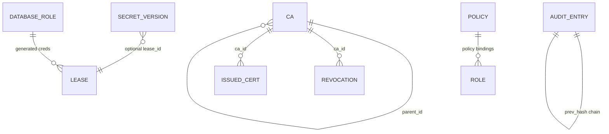

<!--
Copyright The KNXVault Authors.
SPDX-License-Identifier: CC-BY-4.0
-->

# Data Models

Domain entities and how they persist in the Dragonboat Raft state machine. Go structs live under `internal/domain/`; Raft commands are documented in [Dragonboat storage](../storage/dragonboat.md).

## Entity relationship overview

## PKI

### CA (`internal/domain/pki/ca.go`)

| Field | Type | Notes |
|-------|------|-------|
| `ID` | UUID | Primary key |
| `ParentID` | UUID? | Set for intermediate CAs |
| `Name` | string | Unique human name |
| `Type` | `root` \| `intermediate` | Hierarchy level |
| `Subject` | DistinguishedName | CN, O, OU, C |
| `Serial` | string | CA certificate serial |
| `CertPEM` | string | Public certificate |
| `PrivateKeyEnc` | bytes | Envelope-encrypted private key |
| `DEKEnc` | bytes | Master-key-wrapped DEK |
| `Status` | `active` \| `revoked` | Lifecycle |
| `ExpiresAt` | time | Not-after |
| `CRLNextUpdate` | time? | CRL scheduling hint |

**Raft ops:** `ca.save`, `ca.get_by_id`, `ca.get_by_name`, `ca.list`

### Issued certificate (`internal/domain/pki/issued_cert.go`)

Tracks leaf certificates for auto-renewal. Stores metadata only — private keys are returned to the caller at issuance time unless stored in a secret path separately.

| Field | Notes |
|-------|-------|
| `CAID`, `Serial` | Lookup keys |
| `CommonName`, `SANs` | Identity |
| `AutoRenew` | Enables background renewal job |
| `ExpiresAt` | Renewal window trigger |

**Raft ops:** `issued.save`, `issued.get_by_serial`, `issued.list`, `issued.list_expiring`

### PKI role (`internal/domain/pki/role.go`)

Persisted issuance policy binding a role name to a CA and domain constraints.

| Field | Notes |
|-------|-------|
| `Name` | Unique role identifier |
| `CAName` | Target CA by name |
| `AllowedDomains` | DNS SAN allow-list |
| `MaxTTLSeconds` | Upper bound on certificate TTL |
| `KeyUsage` | `server`, `client`, or `code_signing` |

**Raft ops:** `pki_role.save`, `pki_role.get`, `pki_role.list`

### Revocation

| Field | Notes |
|-------|-------|
| `CAID`, `Serial` | Revoked certificate |
| `RevokedAt` | Timestamp |
| `Reason` | CRL reason code |

**Raft ops:** `revoke.save`, `revoke.is`, `revoke.list_by_ca`

### Role resolution for issue / sign

| Input `role` | Behavior |
|--------------|----------|
| Matches a **PKI role** record | Use that role’s `CAName` and domain constraints |
| No PKI role, but CA **name** exists | Treat `role` as CA name (common Vault/cert-manager pattern) |
| Neither | Validation / not-found error |

CSR sign (`POST /pki/sign` and Vault profile `POST /v1/<mount>/sign/<role>`) uses the same resolution. Issue returns `ca_id` so the operator can renew via `POST /pki/renew`.

### Operator CRD status fields (Kubernetes, not Raft)

| CRD field | Meaning |
|-----------|---------|
| `status.caId` | Vault CA UUID used for renew |
| `status.serial` | Leaf serial |
| `status.conditions` | Ready / Issuing / failures |
| Secret annotations | serial, not-after, ca-id, revision (when delivery=Secret) |

## Secrets

### Secret version (`internal/domain/secrets/version.go`)

| Field | Type | Notes |
|-------|------|-------|
| `Path` | string | Hierarchical path (e.g. `app/db`) |
| `Version` | int | Monotonic per path |
| `DataEnc` | bytes | AES-256-GCM ciphertext (`nonce ‖ ciphertext ‖ tag`) |
| `DEKEnc` | bytes | Master-wrapped DEK (optional 1-byte key version prefix) |
| `TTLSeconds` | int? | Optional expiration |
| `Destroyed` | bool | Soft-delete marker |

**Raft ops:** `secret.put` (atomic allocate + CAS + save), `secret.save_version`, `secret.get_latest`, `secret.get_version`, `secret.list_by_path`, `secret.next_version`, `secret.destroy_version`

Prefer `secret.put` for concurrent writes; it allocates the next version and saves in a single replicated command.

### Lease (`internal/domain/secrets/lease.go`)

Dynamic credential leases (database, SSH, unified M-LEASE-1).

| Field | Notes |
|-------|-------|
| `ID` | Opaque lease identifier |
| `TokenID` | Issuing client token hash (cascade revoke) |
| `Metadata` | Optional engine string map |
| `RoleName` | Database role config reference |
| `ExpiresAt` | TTL boundary |
| `Revoked` | Early termination |

**Raft ops:** `lease.save`, `lease.get`, `lease.list`, `lease.list_expired`, `lease.count_active`, `lease.revoke`

### Database role (`internal/domain/secrets/database_role.go`)

Connection and credential generation configuration for dynamic DB secrets.

**Raft ops:** `db_role.save`, `db_role.get`, `db_role.list`, `db_role.delete`

## Auth & RBAC

### Policy (`internal/domain/auth/policy.go`)

HCL-like policy documents with path capabilities and optional conditions (`ip_cidr`, `time_after`, `time_before`, `path_prefix`, `namespace`).

**Raft ops:** `policy.save`, `policy.get_by_name`, `policy.list`, `policy.delete`

### Role

Maps token identities (or K8s SA bindings) to policy sets.

**Raft ops:** `role.save`, `role.get`, `role.list`, `role.delete`

## Audit

### Audit entry (`internal/domain/audit/entry.go`)

| Field | Notes |
|-------|-------|
| `Actor` | Authenticated subject |
| `Action` | Operation name |
| `Resource` | Target path or ID |
| `PrevHash` | SHA-256 chain link |
| `Hash` | Entry digest |

**Raft ops:** `audit.append`, `audit.list`, `audit.latest_hash`

Export API adds HMAC signatures when `KNXVAULT_AUDIT_SIGNING_KEY` is configured.

## Snapshot and backup format

Raft snapshots and `POST /sys/backup` share the JSON format in `internal/backup.Snapshot`:

- `format`: `knxvault-backup`
- `version`: `1`
- Entity arrays: `cas`, `secrets`, `pki_roles`, `policies`, `roles`, `database_roles`, `leases`, `issued_certificates`, optional `audit`
- Encrypted payload (`ciphertext`, `dek_enc`) sealed with the master key
- `snapshot.export` (read-only Raft op) provides atomic export when Raft is enabled
- `snapshot.import` replaces full state on restore; `ValidateSnapshot` runs before import

