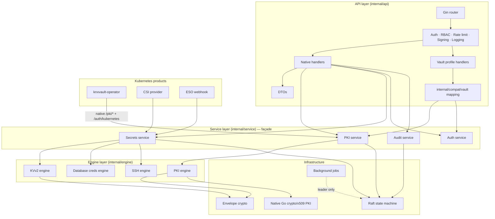
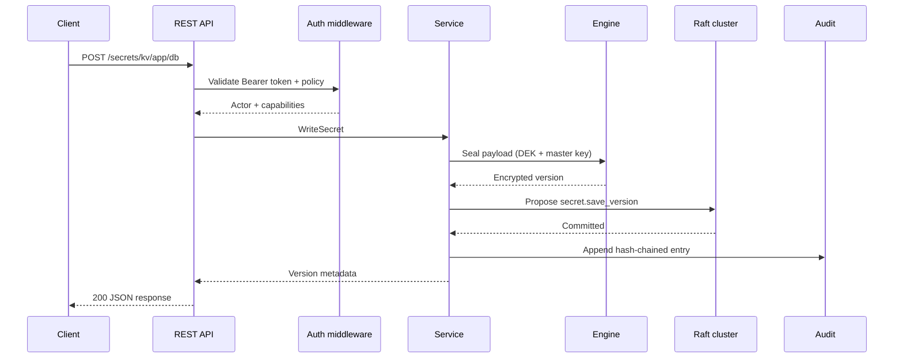
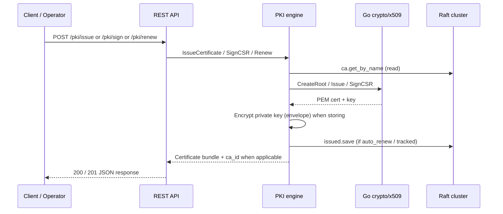
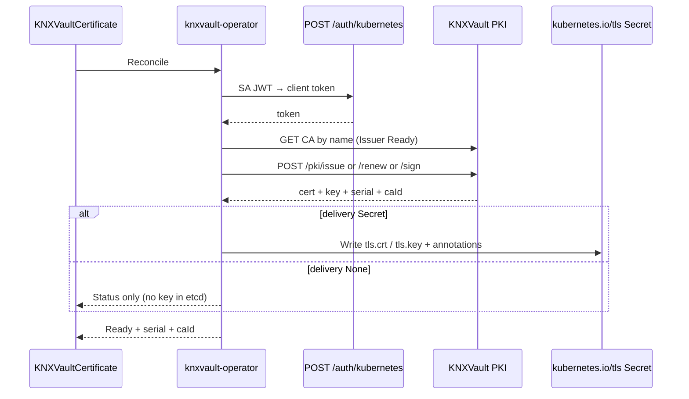
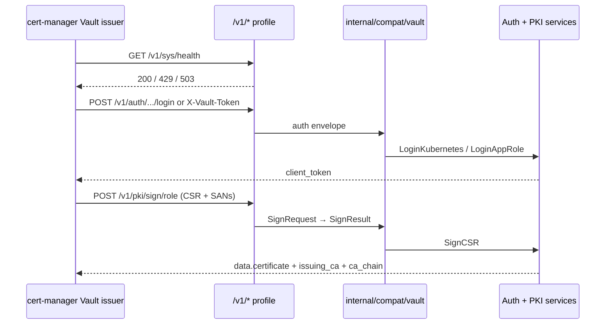
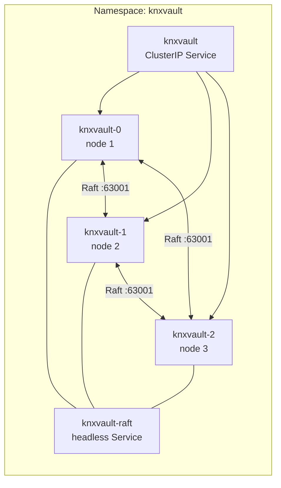
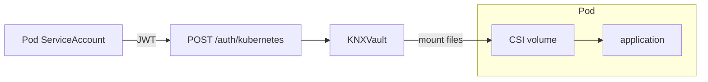
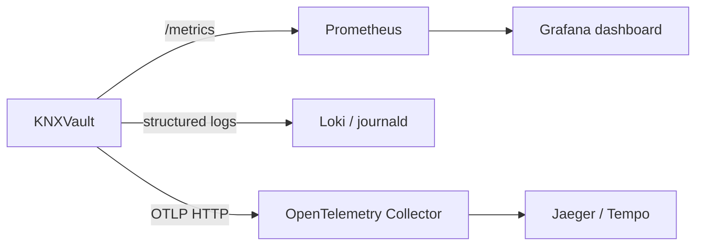

<!--
Copyright The KNXVault Authors.
SPDX-License-Identifier: CC-BY-4.0
-->

# System Architecture Diagrams

Visual reference for KNXVault components and data flows. Diagrams use [Mermaid](https://mermaid.js.org/) syntax.

## Layered architecture

## Request path (authenticated write)

## PKI certificate issuance (native)

## Operator TLS path (preferred — no cert-manager)

## cert-manager Vault profile (optional legacy)

## 3-node Raft topology (Kubernetes)

Only the **Raft leader** runs background jobs (lease cleanup, CRL refresh, cert renewal). Any replica can serve linearizable reads and propose writes.

## Secrets injection

**Primary:** Secrets Store CSI provider (`knxvault-csi`). Sidecar/init remain fallbacks.

See [Secrets injection](../deploy/secrets-injection.md) and [CSI install](../deploy/csi-install.md).

## Observability path

Dashboard JSON: [`deployments/grafana/knxvault-overview.json`](../../deployments/grafana/knxvault-overview.json).