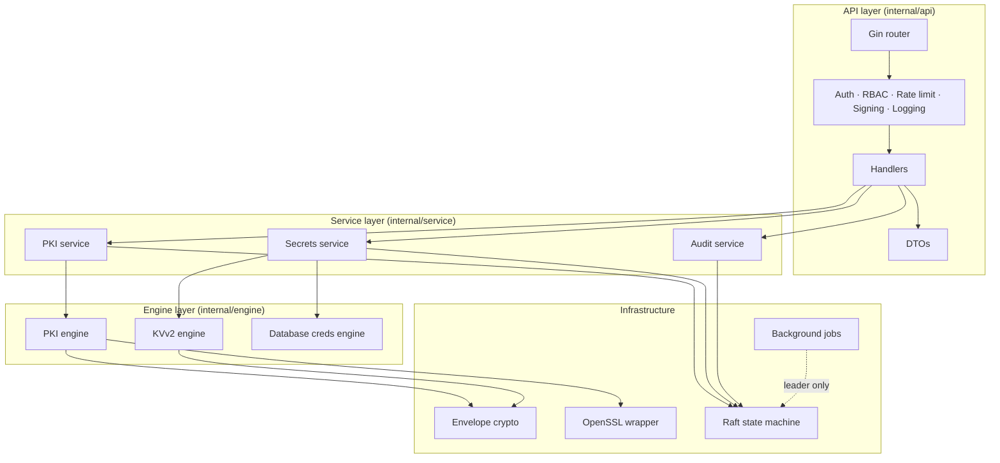
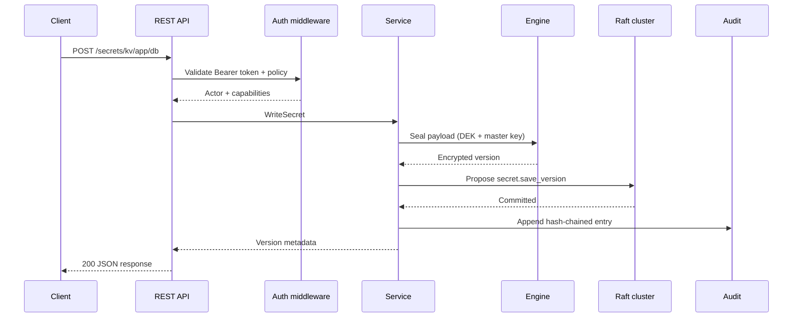
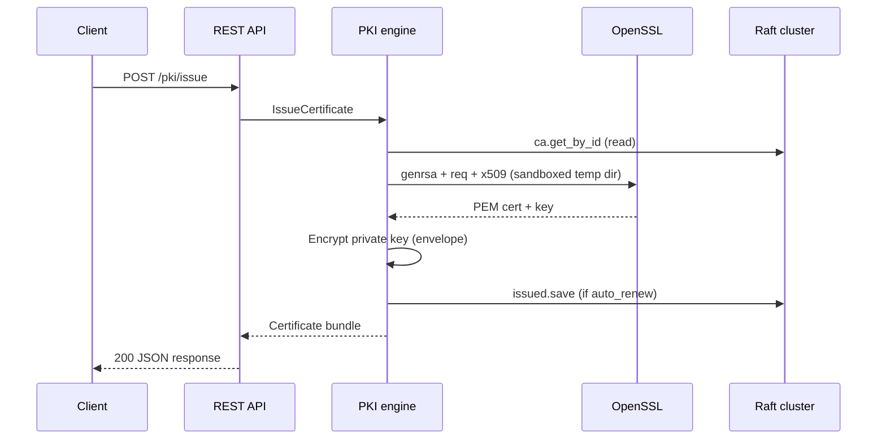
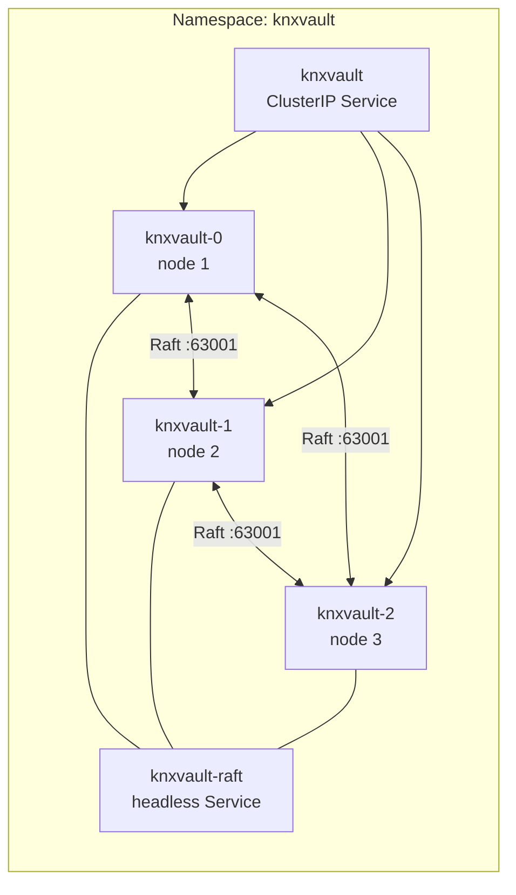
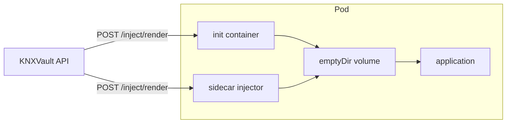
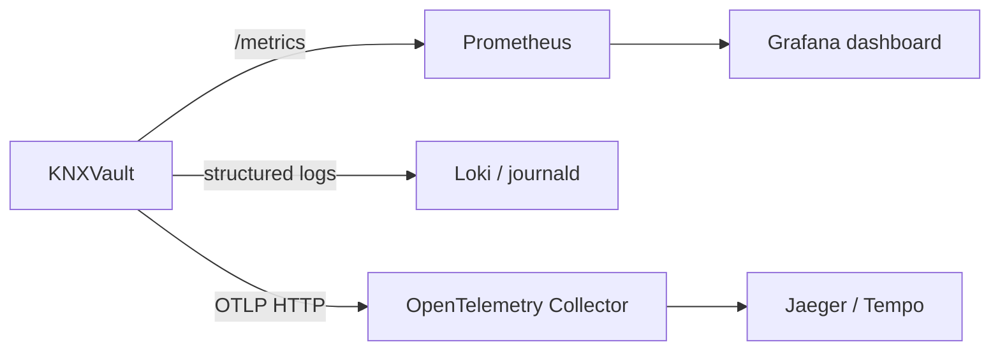

# System Architecture Diagrams

Visual reference for KNXVault components and data flows. Diagrams use [Mermaid](https://mermaid.js.org/) syntax.

## Layered architecture

## Request path (authenticated write)

## PKI certificate issuance

## 3-node Raft topology (Kubernetes)

Only the **Raft leader** runs background jobs (lease cleanup, CRL refresh, cert renewal). Any replica can serve linearizable reads and propose writes.

## Secrets injection (sidecar)

See [Secrets injection](../deploy/secrets-injection.md) for manifest examples.

## Observability path

Dashboard JSON: [`deployments/grafana/knxvault-overview.json`](../../deployments/grafana/knxvault-overview.json).