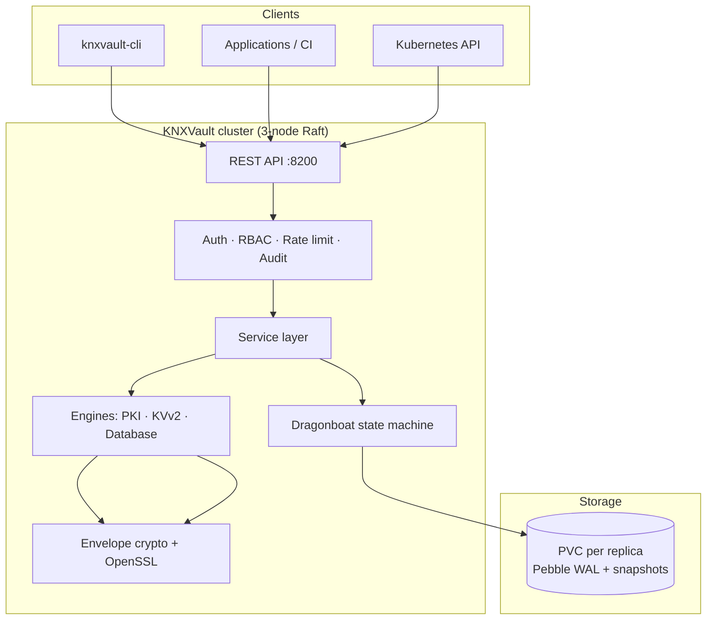

# High-Level Design (HLD)

KNXVault is a lightweight, self-hosted secrets management and PKI system written in Go. It targets teams that want Vault-class capabilities with a smaller operational footprint and strong Kubernetes integration.

## Design goals

| Goal | Implementation |
|------|----------------|
| **Security-first** | Envelope encryption, opaque tokens, hash-chained audit logs, OpenSSL sandboxing |
| **Simplicity** | Thin service layers, explicit configuration, minimal runtime dependencies |
| **Kubernetes-native** | ServiceAccount JWT auth, sidecar injection, Raft StatefulSet HA |
| **Observability** | Prometheus metrics, structured logging, optional OpenTelemetry tracing |
| **Permissive licensing** | Apache-2.0 project; SPDX allow-list enforced in CI |

## Scope

### In scope (current release)

- **Secrets:** KVv2 with versioning, TTL, and check-and-set; dynamic database credentials with leases
- **PKI:** Root and intermediate CAs, leaf issuance, revocation (CRL), renewal, basic OCSP
- **Auth:** Bootstrap root token, opaque client tokens, Kubernetes ServiceAccount JWT login
- **Authorization:** RBAC policies with path, IP, time, and namespace conditions
- **Storage:** Dragonboat Raft cluster with Pebble WAL (production); in-memory (dev/tests)
- **Operations:** Encrypted backup/restore, audit export with HMAC signatures, CLI tooling
- **Deployment:** Docker image, raw Kubernetes manifests (StatefulSet + headless Service)

### Out of scope (deferred)

- Full HashiCorp Vault feature parity (plugins, complex secret engines)
- Helm chart and Terraform provider (long-term future)
- HSM integration, multi-tenancy, Redis cache, full mTLS (Phase 4)
- GUI

## Logical architecture

## Major components

| Component | Responsibility |
|-----------|----------------|
| **REST API** (`internal/api`) | Gin router, DTOs, middleware, OpenAPI |
| **Service layer** (`internal/service`) | Orchestration, audit hooks, transactions |
| **Engines** (`internal/engine`) | PKI, KVv2, database credential generation |
| **Crypto** (`internal/crypto`) | Master key, AES-256-GCM envelope, OpenSSL wrapper |
| **Raft** (`internal/raft`) | Replicated state machine, leader election |
| **Repositories** (`internal/repository`) | Dragonboat adapters; memory for tests |
| **Background jobs** | Lease cleanup, CRL refresh, cert renewal (Raft leader only) |

## Storage

KNXVault persists vault state in an embedded Dragonboat Raft cluster. Development and CI use in-memory repositories when Raft is disabled.

See [Dragonboat storage](../storage/dragonboat.md) and [ADR-0001](../adr/0001-dragonboat-storage-backend.md).

## Deployment topologies

| Topology | Nodes | Storage | Use case |
|----------|-------|---------|----------|
| Dev / CI | 1 | In-memory or single-node Raft | Local development, unit tests |
| Production HA | 3 | 3-node Raft StatefulSet | Quorum-backed consistency |

## Related documents

- [System diagrams](diagrams.md) — detailed data flows
- [Low-Level Design](../lld.md) — full specification
- [Security model](security-model.md) — threat model and controls
- [Installation guide](../installation/install.md) — getting a cluster running