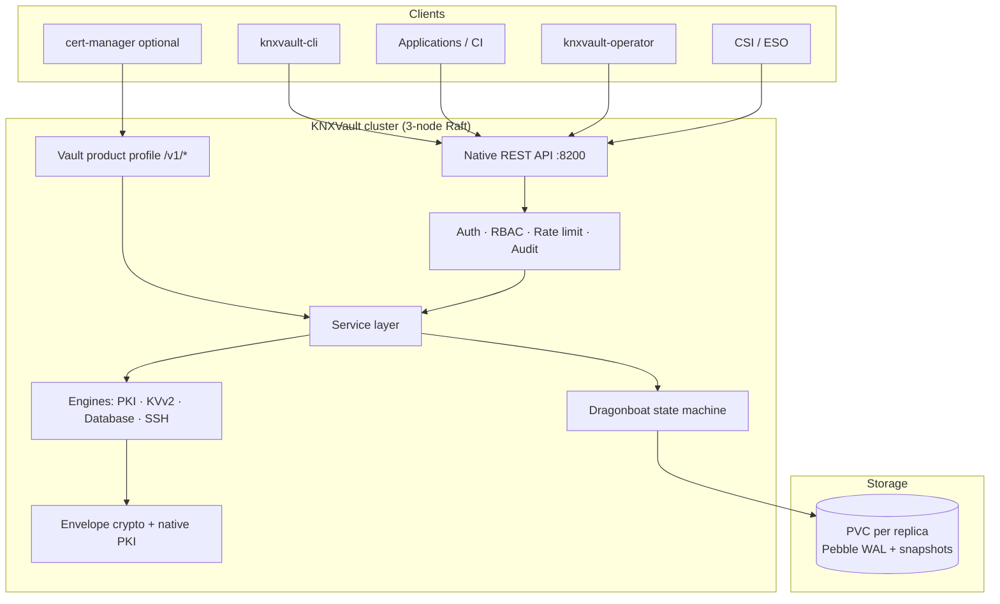

<!--
Copyright The KNXVault Authors.
SPDX-License-Identifier: CC-BY-4.0
-->

# High-Level Design (HLD)

KNXVault is a lightweight, self-hosted secrets management and PKI system written in Go. It targets teams that want Vault-class capabilities with a smaller operational footprint and strong Kubernetes integration.

## Design goals

| Goal | Implementation |
|------|----------------|
| **Security-first** | Envelope encryption, opaque tokens, hash-chained audit logs, in-process PKI |
| **Simplicity** | Thin service layers, explicit configuration, minimal runtime dependencies |
| **Kubernetes-native** | SA JWT auth, CSI, ESO, **knxvault-operator CRDs**, Raft StatefulSet HA |
| **Product-profile adapters** | Native services are authoritative; thin `/v1/*` profiles (e.g. Vault for cert-manager) map foreign wire formats only |
| **Observability** | Prometheus metrics, structured logging, optional OpenTelemetry tracing |
| **Permissive licensing** | Apache-2.0 project; SPDX allow-list enforced in CI |

## Scope

### In scope (current release)

- **Secrets:** KVv2 with versioning, TTL, and check-and-set; dynamic database / SSH credentials with leases; **cubbyhole**; **Transit EaaS**
- **Leases:** Unified renew/revoke/tidy + cascade on token revoke (M-LEASE-1)
- **Wrapping:** Single-use response wrapping tokens (M-WRAP-1)
- **Identity:** Entity / alias / group layer (M-IDENT-1)
- **PKI:** Root and intermediate CAs, leaf issue/renew, **CSR sign** (`POST /pki/sign`), revocation (CRL), basic OCSP
- **Auth:** Bootstrap root token, opaque client tokens, Kubernetes ServiceAccount JWT, **AppRole**, OIDC, optional **LDAP** (W70)
- **Authorization:** RBAC policies with path, IP, time, and namespace conditions
- **TLS automation (K8s):** **knxvault-operator** multi-issuer CRDs (Vault PKI, **ACME**, **SelfSigned**) replace cert-manager for private and public TLS
- **Vault product profile:** optional dual-run with cert-manager (`/v1/*`); prefer operator
- **Storage:** Dragonboat Raft + Pebble (production); in-memory (dev/tests); optional Valkey read cache
- **Operations:** Encrypted backup/restore, seal/unseal, audit export, CLI (`doctor`, KV redaction)
- **Deployment:** Docker image, raw Kubernetes manifests (StatefulSet + headless Service), CSI / ESO / operator / webhook

### Out of scope (deferred)

- Full HashiCorp Vault feature parity (plugins, arbitrary secret engines under `/v1`)
- Helm chart and Terraform provider (long-term)
- PKCS#11 HSM-backed CA keys (stub / design only)
- Third-party enterprise CAs (Venafi, AWS PCA, …) — future external issuer plugin
- GUI
- **Cloud IAM secret engines** (AWS / Azure / GCP dynamic credentials) — **not required near-term** (backlog **LT-02**)
- **Cloud auth methods** (AWS IAM, Azure MSI, GCP) — **not required near-term** (backlog **LT-15**); use K8s SA, AppRole, OIDC/JWT

How the project **is** extended today (in-tree engines, product profiles, DNS-01 HTTP webhooks — not loadable `.so` plugins): [Extensibility guide](../engineering/extensibility.md).

Production posture (set-and-forget profile, custody roadmap, safer operator defaults): [Security posture assessment](security-posture-assessment.md) · [Production security posture design](../design/production-security-posture.md).

Vault-class capability roadmap (transit, wrapping, leases, identity, DR; no plugins; cloud IAM/auth deferred): [Vault-class capability plan](../design/vault-class-capability-plan.md).

## Logical architecture

## Major components

| Component | Responsibility |
|-----------|----------------|
| **REST API** (`internal/api`) | Gin router, DTOs, middleware, OpenAPI, native paths |
| **Vault product profile** (`internal/compat/vault` + handlers) | cert-manager Vault issuer wire format only |
| **Service layer** (`internal/service`) | Orchestration, audit hooks (sole business façade) |
| **Engines** (`internal/engine`) | PKI, KVv2, database, SSH credential generation |
| **Auth** (`internal/auth`) | Tokens, K8s, OIDC, AppRole, RBAC, lockout |
| **Operator** (`internal/operator`) | CRDs → issue/renew/sign → TLS Secret or status-only |
| **Crypto** (`internal/crypto`) | Master key, AES-256-GCM envelope, native Go PKI (`x509native`) |
| **Raft** (`internal/raft`) | Replicated state machine, leader election |
| **Repositories** (`internal/repository`) | Dragonboat adapters; memory for tests |
| **Background jobs** | Lease cleanup, CRL refresh, cert renewal (Raft leader only) |

### Product profiles (compatibility adapters)

Foreign products (cert-manager’s Vault issuer today; others later) must **not** fork core engines. Pattern:

1. **Native services** implement the real operations (PKI sign, auth login, seal state).
2. **`internal/compat/<product>`** maps request/response shapes and status codes.
3. **HTTP handlers** stay thin adapters over services.

Full Vault clone is explicitly **not** a goal. See [cert-manager recipe](../recipes/cert-manager-integration.md) and [Replace cert-manager](../operations/pki-replace-cert-manager.md).

## Storage

KNXVault persists vault state in an embedded Dragonboat Raft cluster. Development and CI use in-memory repositories when Raft is disabled.

See [Dragonboat storage](../storage/dragonboat.md) and [ADR-0001](../adr/0001-dragonboat-storage-backend.md).

## Deployment topologies

| Topology | Nodes | Storage | Use case |
|----------|-------|---------|----------|
| Dev / CI | 1 | In-memory or single-node Raft | Local development, unit tests |
| Production HA | 3 | 3-node Raft StatefulSet | Quorum-backed consistency |

## TLS automation decision

| Need | Recommended path |
|------|------------------|
| Private CA TLS | Operator **Vault** issuer mode |
| Public TLS (Let's Encrypt) | Operator **ACME** issuer mode (HTTP-01 / DNS-01); standalone/host **`knxvault-cli acme`** ([unified design](../design/acme-letsencrypt-unified.md)) |
| Lab / no external CA | Operator **SelfSigned** mode |
| Existing cert-manager GitOps | Migrate with `cmcompat` or temporary Vault `/v1/*` profile |
| Support matrix | [Certificate support matrix](../operations/certificate-support-matrix.md) |

## Related documents

- [System diagrams](diagrams.md) — detailed data flows
- [Low-Level Design](../lld.md) — full specification
- [Security model](security-model.md) — threat model and controls
- [Phase 4–5 design](../design/phase4-ecosystem.md) — operator + ecosystem roadmap status
- [Installation guide](../installation/install.md) — getting a cluster running