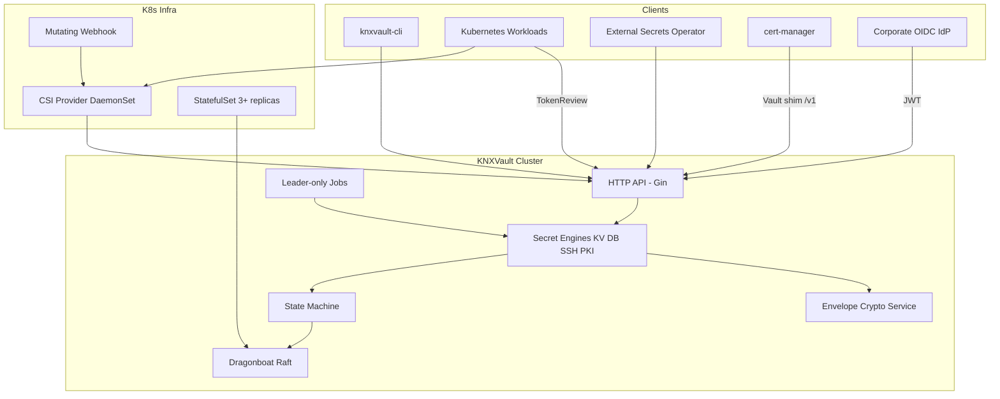
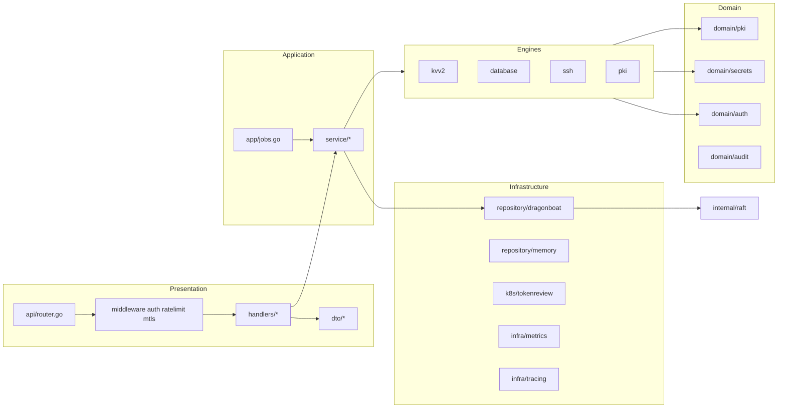
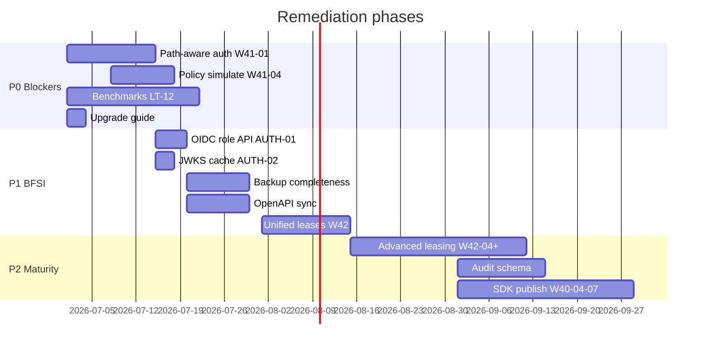

# KNXVault Formal Code Audit Report

| Field | Value |
|-------|-------|
| **Report version** | 1.0 |
| **Audit date** | 2026-07-01 |
| **Product version audited** | v0.4.5 (main branch, uncommitted SSH + test expansion) |
| **Scope** | Full 10-phase technical audit per BFSI POC acceptance criteria |
| **Methodology** | Static code review, architecture doc cross-check, backlog/traceability alignment, targeted test execution |
| **Auditors** | Automated codebase review (Cursor agent) with subagent phase decomposition |

---

## Table of contents

1. [Executive summary](#1-executive-summary)
2. [Audit methodology](#2-audit-methodology)
3. [Architecture overview](#3-architecture-overview)
4. [Phase 1 — Architecture & codebase](#4-phase-1--architecture--codebase)
5. [Phase 2 — Cryptography](#5-phase-2--cryptography)
6. [Phase 3 — Authentication & authorization](#6-phase-3--authentication--authorization)
7. [Phase 4 — Dragonboat / Raft](#7-phase-4--dragonboat--raft)
8. [Phase 5 — Storage layer](#8-phase-5--storage-layer)
9. [Phase 6 — API review](#9-phase-6--api-review)
10. [Phase 7 — Kubernetes](#10-phase-7--kubernetes)
11. [Phase 8 — Production readiness](#11-phase-8--production-readiness)
12. [Phase 9 — Security review](#12-phase-9--security-review)
13. [Phase 10 — BFSI gap analysis](#13-phase-10--bfsi-gap-analysis)
14. [OpenBao / Vault parity matrix](#14-openbao--vault-parity-matrix)
15. [Risk register](#15-risk-register)
16. [Prioritized remediation roadmap](#16-prioritized-remediation-roadmap)
17. [Go / No-Go recommendation](#17-go--no-go-recommendation)
18. [Appendices](#18-appendices)

---

## 1. Executive summary

KNXVault is a **Kubernetes-native secrets management platform** built in Go, using **Dragonboat Raft** for HA persistence, **envelope AES-256-GCM** for encryption at rest, and **OpenSSL CLI** for PKI operations. The codebase demonstrates **mature engineering discipline**: clear package boundaries, ADR-documented security decisions, extensive unit/integration tests, and a well-maintained backlog with traceability to BFSI requirements.

### Overall scores

| Phase | Area | Score | Posture |
|-------|------|-------|---------|
| 1 | Architecture & codebase | **7.3 / 10** | Solid layered design; minor coupling and unused abstractions |
| 2 | Cryptography | **7.5 / 10** | Sound envelope model; memory hardening gaps |
| 3 | Auth & authorization | **6.5 / 10** | K8s/OIDC production-ready; API gaps and coarse RBAC |
| 4 | Dragonboat / Raft | **8.0 / 10** | Production-viable HA substrate |
| 5 | Storage layer | **7.8 / 10** | Clean repository abstraction; backup completeness gaps |
| 6 | API review | **7.0 / 10** | REST mature; OpenAPI drift |
| 7 | Kubernetes | **8.5 / 10** | CSI, ESO, webhook, StatefulSet shipped |
| 8 | Production readiness | **7.5 / 10** | Observability strong; upgrade/benchmark gaps |
| 9 | Security review | **6.8 / 10** | Good defaults; attack surface and hardening debt |
| 10 | BFSI gap analysis | **55% Met** | Narrow POC viable; full checklist not met |

**Composite technical score: 7.2 / 10** — suitable for a **scoped BFSI proof-of-concept**, not for full Vault/OpenBao parity deployment without remediation.

### Top findings (severity-ordered)

| ID | Severity | Finding |
|----|----------|---------|
| R-001 | **P0** | No published performance benchmarks (BFSI §15); production sizing unknown |
| R-002 | **P0** | Missing dedicated upgrade guide (`docs/operations/upgrade.md`) |
| R-003 | **P0** | Route-level RBAC, not path-aware ACLs (W41-01); violates least-privilege for multi-team KV |
| R-004 | **P0** | No policy simulation API (W41-04); risky policy rollouts |
| R-005 | **P1** | OIDC role configuration not exposed via `PUT /sys/roles` API (AUTH-01) |
| R-006 | **P1** | JWKS cache not keyed by URL (AUTH-02); multi-IdP misconfiguration risk |
| R-007 | **P1** | Backup snapshot omits NHI, rotation policies, agent token metadata |
| R-008 | **P1** | OpenAPI spec ~15+ routes behind live router (SSH, OIDC, sys/*) |
| R-009 | **P1** | No `mlock` / locked memory for master key and DEKs (BFSI-2-09) |
| R-010 | **P2** | Transit encryption engine absent (BFSI §8); expected waiver for POC |
| R-011 | **P2** | Unified lease management APIs absent (W42-01–03) |
| R-012 | **P2** | Audit schema lacks auth method, source IP, request_id fields |
| R-013 | **P3** | gRPC API absent (LT-04); REST-only for service mesh |
| R-014 | **P3** | EngineRegistry wired but not used for dynamic route dispatch |

### Go / No-Go (summary)

| Scope | Decision | Rationale |
|-------|----------|-----------|
| **Narrow BFSI POC** (§1, §5, §7 core, §9 CSI, §14 + K8s/OIDC auth) | **Conditional GO** | Core HA, KV, PKI, K8s integrations proven; document waivers for §3, §6 (SSH now shipped), §8, §15, §16 |
| **Full 18-section BFSI checklist** | **NO-GO** | ~20% Gap rows; transit, LDAP, benchmarks, compliance packs, path ACLs unmet |
| **Production BFSI without waivers** | **NO-GO** | P0 items (W41-01, W41-04, LT-12, upgrade guide) must close first |

---

## 2. Audit methodology

### 2.1 Scope

This audit evaluated the KNXVault repository against ten defined phases, cross-referenced with:

- [`docs/product/bfsi-poc-traceability.md`](../product/bfsi-poc-traceability.md) — 18-section BFSI requirement matrix
- [`docs/backlog.md`](../backlog.md) — prioritized work items (W36–W42, LT-*)
- [`docs/architecture/`](../architecture/) — HLD, security model, envelope encryption, data models
- [`docs/adr/`](../adr/) — architectural decision records
- Live code under `internal/`, `cmd/`, `deployments/`, `api/`

### 2.2 Techniques

| Technique | Application |
|-----------|-------------|
| Static code review | Package boundaries, crypto flows, auth middleware, Raft commands |
| Documentation alignment | LLD §4–§8 vs implementation (`docs/product/lld-alignment.md`) |
| Route vs spec diff | `internal/api/router.go` vs `api/openapi.yaml` |
| Test execution | `go test ./internal/...` — all packages pass |
| Competitive parity | Feature mapping vs HashiCorp Vault and OpenBao capability sets |
| Threat modeling | STRIDE-lite against documented security model |

### 2.3 Limitations

- No penetration test or dynamic fuzzing beyond existing `FuzzSafeExec`
- No load/stress testing (confirms LT-12 gap)
- Audit performed on development branch with uncommitted SSH engine changes
- Compliance frameworks (RBI, PCI, ISO) assessed as roadmap gaps, not legal opinion

### 2.4 Classification scheme

| Priority | Definition |
|----------|------------|
| **P0** | Production blocker — must fix before any regulated deployment |
| **P1** | Required before BFSI deployment without explicit waiver |
| **P2** | Should implement for operational maturity |
| **P3** | Nice to have; defer post-POC |

---

## 3. Architecture overview

### 3.1 System context



### 3.2 Layered architecture



### 3.3 Data flow — encrypt before replication

Per ADR-0004, all secret and key material is encrypted **before** Raft replication:

```
Client PUT /secrets/kv/app/config
    → SecretsHandler.Write
    → KVv2Engine.Put (serialize JSON)
    → crypto.Service.Seal (AES-256-GCM + wrapped DEK)
    → repository.SecretRepository.SaveVersion
    → dragonboat.Client.Propose(OpSecretPut)
    → State machine persists ciphertext in Pebble WAL + snapshots
```

An attacker with Raft disk access sees only `data_enc` and `dek_enc` — not recoverable without `KNXVAULT_MASTER_KEY`.

---

## 4. Phase 1 — Architecture & codebase

**Score: 7.3 / 10**

### 4.1 Repository structure

| Aspect | Assessment | Evidence |
|--------|------------|----------|
| Module layout | **Strong** | Follows LLD §3.1: `cmd/`, `internal/`, `pkg/`, `api/`, `deployments/`, `docs/` |
| Binary separation | **Strong** | `knxvault`, `knxvault-cli`, `knxvault-csi`, `knxvault-eso`, `knxvault-webhook` |
| Test layout | **Good** | Unit tests co-located; integration under `test/integration/`; chaos scripts |
| Documentation | **Strong** | 52 markdown docs; ADRs; runbooks; product traceability |

**Finding ARCH-01 (P3):** `docs/architecture/lld.md` duplicates `docs/lld.md` — minor maintenance burden.

### 4.2 Package boundaries

| Package | Responsibility | Boundary quality |
|---------|----------------|------------------|
| `internal/domain/*` | Pure entities, validation | **Clean** — no infra imports |
| `internal/repository/*` | Persistence interfaces + adapters | **Clean** — interface segregation |
| `internal/engine/*` | Business logic per engine | **Good** — some service duplication |
| `internal/service/*` | Orchestration, audit | **Good** |
| `internal/api/*` | HTTP transport only | **Good** — handlers delegate to services |
| `internal/raft/*` | Consensus + state machine | **Good** — isolated from HTTP |
| `internal/crypto/*` | Envelope + OpenSSL + TLS | **Good** |
| `pkg/client` | Public SDK surface | **Appropriate** |

**Finding ARCH-02 (P2):** `internal/app/deps.go` is a **god-object** (~400 lines) wiring all dependencies. Acceptable for current scale; consider decomposition at Phase 5.

**Finding ARCH-03 (P3):** `EngineRegistry` registered in `deps.go` (KV, DB, SSH) but **not consumed** by router or middleware — dead abstraction until dynamic engine dispatch ships.

### 4.3 Dependency analysis

| Dependency | Purpose | License | Risk |
|------------|---------|---------|------|
| `github.com/lni/dragonboat/v3` | Raft consensus | Apache-2.0 | Low — mature, actively maintained |
| `github.com/gin-gonic/gin` | HTTP framework | MIT | Low |
| `go.uber.org/zap` | Logging | MIT | Low |
| OpenSSL (system) | PKI operations | Apache-style | Medium — subprocess boundary |
| `github.com/golang-jwt/jwt/v5` | JWT parsing | MIT | Low |

License gate enforced via `make licenses` and `config/licenses.allow`. No copyleft dependencies in production path.

**Finding ARCH-04 (P2):** OpenSSL subprocess is a **single point of crypto operational risk** — mitigated by circuit breaker (`internal/crypto/openssl/breaker.go`) and argument fuzzing, but no HSM integration path.

### 4.4 Layering

| Layer violation | Severity | Detail |
|-----------------|----------|--------|
| Handlers calling repositories directly | None observed | Handlers use services |
| Domain importing Gin/Dragonboat | None observed | Clean |
| Raft commands in handlers | None observed | Commands isolated in `internal/raft/` |
| Crypto in middleware | Minimal | TLS config only |

**Assessment:** Layering is **consistent** with hexagonal architecture principles.

### 4.5 SOLID principles

| Principle | Score | Notes |
|-----------|-------|-------|
| **S**ingle responsibility | 7/10 | Services well-scoped; `SysHandler` aggregates many sys operations |
| **O**pen/closed | 8/10 | Engine registry pattern supports new engines; Raft command catalog extensible |
| **L**iskov substitution | 8/10 | `repository.*` interfaces with memory + dragonboat implementations |
| **I**nterface segregation | 8/10 | Granular repo interfaces (`CARepository`, `SecretRepository`, etc.) |
| **D**ependency inversion | 7/10 | Services depend on interfaces; some concrete types in `deps.go` |

### 4.6 Extensibility

| Extension point | Status |
|-----------------|--------|
| New secret engines | **Ready** — implement engine + registry adapter + router group |
| New auth methods | **Partial** — domain `Role.AuthMethod` exists; API exposure incomplete |
| New Raft entities | **Ready** — add command op + store handler + repo adapter |
| Policy conditions | **Ready** — evaluator supports map-based conditions |
| CSI mount types | **Ready** — provider gRPC server extensible |

### 4.7 Phase 1 recommendations

| ID | Priority | Action |
|----|----------|--------|
| ARCH-02 | P2 | Split `deps.go` into domain-specific wiring modules when adding Phase 5 engines |
| ARCH-03 | P3 | Use `EngineRegistry` for route registration or document as future hook |
| ARCH-04 | P2 | Document HSM/PKCS#11 roadmap in ADR |

---

## 5. Phase 2 — Cryptography

**Score: 7.5 / 10**  
**Security sub-score (crypto-specific): 7.8 / 10**

### 5.1 AES implementation

| Control | Status | Evidence |
|---------|--------|----------|
| Algorithm | **AES-256-GCM** | `internal/crypto/service.go` — `dekSize = 32` |
| Nonce handling | **12-byte random nonce** | Per ADR-0003; documented in `docs/architecture/envelope-encryption.md` |
| AAD | Not used | Acceptable for vault object encryption |
| Go `crypto/aes` | Standard library | No custom block cipher |

**Finding CRYPTO-01 (P3):** No FIPS 140-2/3 validation path documented — expected for OSS vault; note for BFSI compliance questionnaires.

### 5.2 Envelope encryption

| Step | Implementation | Verified |
|------|----------------|----------|
| DEK generation | `crypto/rand` 32 bytes | Unit tests in `envelope_test.go` |
| Payload encrypt | AES-256-GCM with DEK | Round-trip tests |
| DEK wrap | Master key AES-GCM | `KeyRing.WrapDEK` |
| Version prefix | Byte prefix on wrapped DEK after rotation | `keyring.go` legacy mode for v1 |
| Storage | `data_enc` + `dek_enc` in Raft | ADR-0004 |

**Assessment:** Envelope model is **correct and well-tested**. Matches industry standard (Vault, AWS KMS envelope pattern).

### 5.3 Key derivation

| Mechanism | Status |
|-----------|--------|
| Master key | 32-byte direct (not derived) | Loaded from env/file |
| DEK | Per-object random | No KDF chain |
| PKI keys | OpenSSL generation | Separate from envelope |

**Finding CRYPTO-02 (P3):** No HKDF/PBKDF2 for master key derivation from passphrase — master key must be pre-generated 32 random bytes. Acceptable for K8s Secret injection model.

### 5.4 Master key handling

| Control | Status | Evidence |
|---------|--------|----------|
| Load path | Env or file | `internal/crypto/masterkey/loader.go` |
| Startup requirement | Required when Raft enabled | `deps.go` fail-fast |
| API exposure | Never returned | No endpoint leaks key |
| Rotation | `POST /sys/rotate-master-key` | `KeyRing.AddKey` + background re-encrypt job |
| Multi-version | Supported | `KeyRing.Versions()`, `DEKNeedsReencrypt` |

**Finding CRYPTO-03 (P1):** Master key bytes live in **heap memory** without `mlock(2)` — swap/page-out risk on compromised host.

### 5.5 Memory zeroization

| Location | Zeroization | Evidence |
|----------|-------------|----------|
| Decrypted DEKs | `memzero.Bytes` | `internal/crypto/memzero/memzero.go` |
| PKI key material | Used after OpenSSL ops | `engine/pki/` paths |
| Master key in KeyRing | **Not zeroed** on shutdown | Keys persist in map until GC |
| Go string interning | N/A | Byte slices used |

```go
// internal/crypto/memzero/memzero.go — software zero only
func Bytes(b []byte) {
    for i := range b { b[i] = 0 }
    runtime.KeepAlive(b)
}
```

**Finding CRYPTO-04 (P0/P1):** No `mlock`, no `sync.Pool` of locked buffers, no kernel swap disable guidance beyond ops docs. **BFSI-2-09 Gap.**

### 5.6 Randomness

| Source | Usage |
|--------|-------|
| `crypto/rand.Reader` | DEK generation, nonces |
| OpenSSL | PKI key generation |

**Assessment:** Correct OS CSPRNG usage. No custom PRNG.

### 5.7 Key rotation

| Rotation type | API / job | Status |
|---------------|-----------|--------|
| Master key | `POST /sys/rotate-master-key` + `runMasterKeyReencrypt` | **Complete** |
| DEK re-wrap | Background leader job | **Complete** |
| KV secret rotation | `PUT /sys/kv-rotation` + `runKVRotation` | **Complete** |
| PKI cert renewal | `POST /pki/renew` + background job | **Complete** |
| CA key rotation | `POST /pki/ca/:id/rotate` | **Stub** — successor CA only |

### 5.8 PKI implementation

| Feature | Status | Evidence |
|---------|--------|----------|
| Root CA | Complete | `POST /pki/root` |
| Intermediate CA | Complete | Chained signing |
| Leaf issuance | Complete | SAN via extfile |
| CRL | Complete | `GET /pki/crl/:id` |
| OCSP | Complete | `POST /pki/ocsp/:id` |
| Roles | Complete | SAN/TTL validation |
| OpenSSL sandbox | Complete | Temp dir `0700`, timeout, arg validation |

**Finding CRYPTO-05 (P2):** Code-signing key usage extension deferred per backlog note on W38-03.

### 5.9 TLS configuration

| Setting | Value | Evidence |
|---------|-------|----------|
| MinVersion | **TLS 1.3** | `internal/crypto/tlsconfig/tlsconfig.go:30` |
| mTLS | Optional server + KV write gate | `MTLSRequired` middleware |
| Raft peer mTLS | Opt-in via `KNXVAULT_RAFT_MTLS_*` | `nodehost.go` |

**Note:** `docs/product/bfsi-poc-traceability.md` lists TLS 1.2 as Partial — **code now enforces TLS 1.3**; traceability doc should be updated.

**Finding CRYPTO-06 (P1):** TLS and Raft mTLS are **opt-in by configuration**, not secure-by-default. Production manifests should enforce via required env validation.

### 5.10 Phase 2 summary

| Strength | Weakness |
|----------|----------|
| Sound envelope encryption with versioned master keys | No memory locking |
| Encrypt-before-replicate ADR enforced | OpenSSL subprocess attack surface |
| Comprehensive rotation orchestration | CA full re-issuance deferred |
| TLS 1.3 minimum in code | mTLS not default-on |

---

## 6. Phase 3 — Authentication & authorization

**Score: 6.5 / 10**

### 6.1 JWT handling

| Path | Mechanism | Production-safe |
|------|-----------|-----------------|
| K8s SA login | TokenReview API | **Yes** |
| OIDC login | JWKS RS256 validation | **Yes** (with AUTH-02 caveat) |
| Dev HS256 | `KNXVAULT_JWT_SECRET` | **No** — dev only |
| Insecure bypass | `KNXVAULT_K8S_AUTH_INSECURE` | **No** — Raft disabled only |

OIDC validation checks `iss`, `aud`, `exp` in `internal/auth/oidc.go`.

**Finding AUTH-02 (P1):** JWKS cache is a **single global cache** not keyed by `jwks_url`:

```go
// internal/auth/oidc.go — cache returns stale keys if URL changes
func (c *jwksCache) get(ctx context.Context, jwksURL string) (map[string]any, error) {
    c.mu.RLock()
    if time.Since(c.fetched) < c.ttl && len(c.keys) > 0 {
        return c.keys, nil  // ignores jwksURL parameter on hit
    }
```

If two roles use different IdPs, the second role may validate against the first IdP's keys until TTL expires.

### 6.2 Kubernetes authentication

| Control | Status |
|---------|--------|
| TokenReview integration | **Complete** — `internal/infra/k8s/tokenreview.go` |
| Fail-closed with Raft | **Complete** — W36-01 |
| SA binding enforcement | **Complete** — `bound_service_account_names/namespaces` |
| CSI pod identity | **Complete** — per-mount TokenReview (W39-02) |

**Assessment:** Production K8s auth is **best-in-class** for a young vault implementation.

### 6.3 OIDC

| Control | Status |
|---------|--------|
| Login endpoint | `POST /auth/oidc/:role` — **Complete** |
| Domain model | `Role.OIDC *OIDCConfig` — **Complete** |
| Role API exposure | **GAP** — see AUTH-01 |
| NHI upsert on login | **Complete** — machine identity registry |

**Finding AUTH-01 (P1):** `PUT /sys/roles/:name` DTO omits OIDC configuration:

```go
// internal/api/dto/policies.go — no OIDC fields
type RoleRequest struct {
    Policies                      []string `json:"policies"`
    BoundServiceAccountNames      []string `json:"bound_service_account_names,omitempty"`
    BoundServiceAccountNamespaces []string `json:"bound_service_account_namespaces,omitempty"`
}
```

Domain `Role` supports `AuthMethod` and `OIDC *OIDCConfig` but API cannot configure them. Operators must use direct Raft/domain manipulation or undocumented paths.

### 6.4 RBAC

| Feature | Status |
|---------|--------|
| Policy CRUD | **Complete** — `/sys/policies` |
| Role CRUD | **Partial** — missing OIDC fields |
| Deny policies | **Supported** in evaluator |
| Conditions | `ip_cidr`, `time_*`, `path_prefix`, `namespace`, `agent_id` |
| Namespace header | `X-KNX-Namespace` wired (W36-14) |
| Path-aware auth | **NOT IMPLEMENTED** — W41-01 |

**Finding AUTH-03 (P0):** Authorization is **route-coarse**, not path-capable:

```go
// internal/api/router.go — entire KV tree shares one permission
middleware.RequirePermission(deps.AuthService, "secrets/kv", "read")
```

A policy granting `secrets/kv/team-a/*` does **not** restrict access to `team-b` paths because the middleware passes `secrets/kv` not `secrets/kv/<path>`. Only **agent delegation tokens** get path-prefix enforcement (`internal/auth/agent.go`).

### 6.5 Policy engine

| Vault/OpenBao capability | KNXVault status |
|--------------------------|-----------------|
| Path ACLs | **Gap** — W41-01 |
| Capabilities (read/list/sudo) | **Partial** — actions only |
| Policy simulation | **Gap** — W41-04 |
| HCL import | **Gap** — W41-08 |
| Sentinel/OPA | **Roadmap** — LT-06 |

### 6.6 Token lifecycle

| Operation | Endpoint | Raft-persisted |
|-----------|----------|----------------|
| Create | `POST /auth/token/create` | Yes |
| Renew | `POST /auth/token/renew` | Yes |
| Revoke self | `DELETE /auth/token/self` | Yes |
| Agent delegate | `POST /auth/agent/delegate` | Yes — 15m scoped |
| Root token | `KNXVAULT_ROOT_TOKEN` env | Bootstrap only |

TTL default 24h (`KNXVAULT_TOKEN_TTL`). Renewable flag supported.

### 6.7 Identity model

| Identity type | Representation |
|---------------|----------------|
| Human (OIDC) | `oidc:<subject>` in NHI |
| K8s SA | `k8s:<namespace>:<name>` |
| Agent | `agent:<id>` with path prefix |
| API key / token | Opaque UUID |

**Assessment:** Identity model is **modern and K8s-native** but lacks LDAP, AppRole, userpass auth methods.

### 6.8 Phase 3 recommendations

| ID | Priority | Action |
|----|----------|--------|
| AUTH-01 | P1 | Add `auth_method`, `oidc` block to `RoleRequest`/`RoleResponse` |
| AUTH-02 | P1 | Key JWKS cache by URL; invalidate on role update |
| AUTH-03 | P0 | Implement W41-01 path-aware `Authorize` in middleware |
| AUTH-04 | P0 | Implement W41-04 policy simulation before production rollout |

---

## 7. Phase 4 — Dragonboat / Raft

**Score: 8.0 / 10**

### 7.1 Cluster bootstrap

| Control | Status | Evidence |
|---------|--------|----------|
| NodeHost lifecycle | Complete | `internal/raft/nodehost.go` |
| Initial members | `KNXVAULT_RAFT_INITIAL_MEMBERS` | ConfigMap in StatefulSet |
| Single-node dev | `KNXVAULT_RAFT_ENABLED=false` | In-memory repos |
| Readiness | `/ready` reports `raft_ready` + leader | Health handler |

### 7.2 Membership changes

| Operation | API | Implementation |
|-----------|-----|----------------|
| Add node | `POST /sys/raft/add-node` | `SyncRequestAddNode` |
| Remove node | `POST /sys/raft/remove-node` | `SyncRequestDeleteNode` |
| Self-removal guard | **Complete** | Cannot remove local node |

Runbook: `docs/operations/runbooks/scaling.md`

**Finding RAFT-01 (P2):** No **non-voter / read replica** support — all members are voting peers.

### 7.3 Snapshotting

| Feature | Status |
|---------|--------|
| Dragonboat snapshots | `SaveSnapshot` / `RecoverFromSnapshot` |
| Audit in snapshots | W36-06 — included |
| Backup integration | `OpExportSnapshot` atomic export |
| Validation | `ValidateSnapshot` before import |

### 7.4 Log compaction

Dragonboat handles log compaction internally via its Pebble WAL. Application does not implement custom compaction — **appropriate** for embedded Raft library usage.

### 7.5 Recovery

| Scenario | Procedure | Automation |
|----------|-----------|------------|
| Single node loss | Replace pod, rejoin | **Manual** — StatefulSet |
| Leader loss | Automatic election | **Automatic** |
| Quorum loss | Restore from backup | **Manual** — runbook |
| Full cluster restore | `POST /sys/restore` | **API-driven** |

Documentation: `docs/storage/raft-ha-and-recovery.md`, `docs/deploy/backup-restore.md`

### 7.6 Failure scenarios

| Test | Status | Evidence |
|------|--------|----------|
| Leader failover integration | **Pass** | `test/integration/raft_test.go` |
| Chaos pod-kill | **Script** | `test/chaos/raft-pod-kill.sh` |
| 3-node linearizable writes | **Pass** | W28-01 |

**Finding RAFT-02 (P2):** No automated quorum heal — operator must follow runbook.

### 7.7 Split-brain prevention

Raft quorum protocol prevents split-brain by design (ADR-0001). Writes require majority ack. **No application-level split-brain risk** when deployed with 3+ nodes and correct `initial_members` config.

**Finding RAFT-03 (P3):** Misconfigured even-number clusters (2, 4) not blocked at startup — document quorum sizing.

### 7.8 Phase 4 summary

Dragonboat integration is a **standout strength**. The Raft layer is production-viable for BFSI HA requirements (BFSI §1 mostly Met).

---

## 8. Phase 5 — Storage layer

**Score: 7.8 / 10**

### 8.1 Repository abstraction

| Interface | Implementations |
|-----------|-----------------|
| `CARepository` | memory, dragonboat |
| `SecretRepository` | memory, dragonboat |
| `LeaseRepository` | memory, dragonboat |
| `PolicyRepository` | memory, dragonboat |
| `TokenRepository` | memory, dragonboat |
| `SSHRoleRepository` | memory, dragonboat |

**Assessment:** Clean **ports and adapters** pattern. Interface definitions in `internal/repository/interfaces.go` stable since Phase 1.

### 8.2 Transactions

| Operation | Atomicity |
|-----------|-----------|
| KV put | **Single Raft command** (`OpSecretPut`) — W36-05 |
| Multi-entity backup export | **Single snapshot read** (`OpExportSnapshot`) — W36-08 |
| Policy + role update | Separate commands | Eventual per entity |

**Finding STORE-01 (P2):** No cross-entity transactions — acceptable for Raft SM design but limits atomic policy+role updates.

### 8.3 Encryption boundaries

| Data class | Encrypted at rest | Location |
|------------|-------------------|----------|
| Secret payloads | Yes | `data_enc` |
| CA private keys | Yes | `private_key_enc` |
| DEKs | Yes (wrapped) | `dek_enc` |
| Policies, roles | **Cleartext** | ADR-0005 — intentional |
| Audit entries | **Cleartext** | Hash-chained integrity |
| Tokens | Metadata cleartext; token ID only | No secret in token record |

**Assessment:** Encryption boundaries are **correctly placed** per threat model.

### 8.4 Secret versioning

| Feature | Status |
|---------|--------|
| Version counter | Complete |
| CAS (`cas_version`) | Complete |
| Destroy version | Complete |
| Version retention | `defaultMaxVersions` |
| List versions | Complete — W38-01 |
| Metadata API | Complete |

### 8.5 Consistency

| Model | Guarantee |
|-------|-----------|
| Writes | Linearizable via Raft leader |
| Reads on follower | May be stale until applied |
| Policy sync | Hash-based reload on followers |

**Finding STORE-02 (P2):** Follower reads not explicitly documented as potentially stale — add to API docs.

### 8.6 Backup completeness

`internal/backup/snapshot.go` includes:

| Entity | In snapshot |
|--------|-------------|
| CAs, secrets, revoked, policies, roles | Yes |
| PKI roles, DB roles, SSH roles | Yes |
| Leases, issued certs, audit, tokens | Yes |
| Machine identities (NHI) | **NO** |
| Rotation policies | **NO** |
| Agent delegation metadata | **Partial** (in tokens only) |
| OIDC role config | **Partial** (roles lack OIDC in export if not in RoleRecord) |

**Finding STORE-03 (P1):** Backup restore may lose NHI and rotation policy state — DR risk.

---

## 9. Phase 6 — API review

**Score: 7.0 / 10**

### 9.1 REST API

| Aspect | Assessment |
|--------|------------|
| Framework | Gin with middleware chain |
| Route count | ~50+ secured routes |
| Versioning | Native paths + `/v1` Vault compat shim |
| Content type | JSON |
| Auth | Bearer token on secured routes |

### 9.2 gRPC

| Surface | Status |
|---------|--------|
| Main vault API | **REST only** — LT-04 gap |
| CSI provider | gRPC (Secrets Store API) |
| ESO adapter | HTTP webhook |

### 9.3 OpenAPI

| Metric | Value |
|--------|-------|
| Spec file | `api/openapi.yaml` (~1241 lines) |
| Documented paths | ~35 top-level paths |
| Router routes not in OpenAPI | **15+** |

**Missing from OpenAPI (non-exhaustive):**

| Route | Impact |
|-------|--------|
| `POST /auth/oidc/:role` | OIDC integration undocumented in spec |
| `POST /auth/token/create`, `/renew` | Token lifecycle |
| `PUT/GET /secrets/ssh/*` | SSH engine (new) |
| `POST /sys/init` | Bootstrap |
| `POST /sys/tls/issue-listener` | TLS bootstrap |
| `POST /sys/rotation/run` | Orchestration |
| `PUT/DELETE /sys/kv-rotation` | Rotation policies |
| `GET/DELETE /sys/machine-identities` | NHI |
| `POST /sys/exposure/report` | Exposure detection |
| `POST /pki/ca/import`, `/ca/:id/rotate` | PKI admin |
| KV list/metadata/versions/destroy | W38-01 endpoints |

**Finding API-01 (P1):** OpenAPI drift undermines SDK codegen accuracy (`make check-client-drift` may not catch runtime-only routes).

### 9.4 Error handling

| Pattern | Status |
|---------|--------|
| Standardized error codes | `common.ErrCode*` |
| Request ID | `X-Request-ID` in responses |
| Error middleware | `middleware.ErrorHandler` |
| Seal guard | 503 when sealed |

### 9.5 Validation

| Layer | Status |
|-------|--------|
| DTO binding | Gin `binding:"required"` tags |
| Domain validation | `Validate()` methods on entities |
| Engine validation | Role TTL, SAN checks |

**Finding API-02 (P2):** Inconsistent validation — some handlers rely on service-layer errors without field-level detail.

### 9.6 Idempotency

| Endpoint | Idempotent |
|----------|------------|
| `PUT /sys/policies/:name` | Yes |
| `PUT /secrets/kv/*` with CAS | Conditional |
| `POST /secrets/database/creds/:role` | **No** — creates new lease each call |
| `POST /sys/backup` | **No** — new archive each call |

**Assessment:** Partial idempotency — document patterns for integrators (BFSI-10-06 Partial).

---

## 10. Phase 7 — Kubernetes

**Score: 8.5 / 10**

### 10.1 CSI (Secrets Store)

| Item | Status | Evidence |
|------|--------|----------|
| Provider binary | **Shipped** | `cmd/knxvault-csi` |
| gRPC server | **Shipped** | `internal/inject/csi/server.go` |
| Pod identity auth | **Shipped** | TokenReview per mount |
| Rotation | **Shipped** | Version detection on remount |
| kind e2e test | **Shipped** | `scripts/test-csi-kind.sh` |

### 10.2 External Secrets Operator

| Item | Status |
|------|--------|
| Native provider | **Shipped** — `cmd/knxvault-eso` |
| ExternalSecret refresh | **Shipped** |
| Manifests | `deployments/external-secrets/` |

### 10.3 Admission webhook

| Item | Status |
|------|--------|
| Mutating webhook | **Shipped** — `cmd/knxvault-webhook` |
| Auto-inject CSI volume | **Shipped** — W38-07 |

### 10.4 Deployment manifests

| Manifest | Status |
|----------|--------|
| StatefulSet (3 replicas) | **Shipped** |
| Headless Service | **Shipped** |
| PVC per replica | **Shipped** |
| NetworkPolicy | **Shipped** — W38-05 |
| PDB | **Shipped** |
| seccomp | **Shipped** — W38-21 |

### 10.5 Kubernetes RBAC

CSI provider, webhook, and server each have scoped RBAC manifests. TokenReview requires `system:auth-delegator` or equivalent — documented.

### 10.6 StatefulSets & upgrade strategy

| Aspect | Status |
|--------|--------|
| Rolling update | StatefulSet native |
| Upgrade guide | **GAP** — no `docs/operations/upgrade.md` |
| Pre-upgrade backup | Documented in day2.md |
| Version skew tolerance | Not documented |

**Finding K8S-01 (P0):** Missing formal upgrade guide — BFSI-18-02 Gap.

### 10.7 cert-manager integration

Vault-compatible `/v1/pki/sign/:role` shim enables ClusterIssuer pattern — **strong** K8s PKI story.

---

## 11. Phase 8 — Production readiness

**Score: 7.5 / 10**

### 11.1 Logging

| Feature | Status |
|---------|--------|
| Structured JSON (zap) | Complete |
| Request ID correlation | Complete |
| Actor/route fields | Complete |
| Audit separation | Separate audit service |

### 11.2 Metrics

| Category | Examples |
|----------|----------|
| HTTP | Request count, latency |
| Raft | Leader, term, commit index |
| Business | Active leases, CSI rotations |
| Security | Rate limit, OpenSSL breaker |

Prometheus scrape via `GET /metrics`. Alert rules: `deployments/prometheus/knxvault-alerts.yaml`.

### 11.3 OpenTelemetry

HTTP tracing via `otelgin.Middleware` when enabled. Grafana dashboard shipped. Audit logs **not** exported via OTel (BFSI-12-15 Gap).

### 11.4 Health checks

| Endpoint | Purpose |
|----------|---------|
| `/health` | Liveness |
| `/ready` | Raft ready + leader election health |

### 11.5 Backup & restore

| Feature | Status |
|---------|--------|
| Online backup API | Complete |
| Encrypted archive | Complete |
| Restore validation | `ValidateSnapshot` |
| Scheduled backup | **Operator responsibility** — CronJob pattern |

### 11.6 Disaster recovery

| Asset | Status |
|-------|--------|
| Failover runbook | Complete |
| Backup-restore doc | Complete |
| Consolidated DR guide | **Partial** — W35-01 |
| Cross-site DR automation | **None** |

### 11.7 Upgrade strategy

| Item | Status |
|------|--------|
| Rolling restart procedure | Mentioned in day2.md |
| Dedicated upgrade doc | **GAP** |
| Automated upgrade controller | **None** |
| Schema migration tooling | **None** (snapshot version field only) |

### 11.8 Phase 8 gaps

| ID | Priority | Gap |
|----|----------|-----|
| PROD-01 | P0 | Performance benchmarks (LT-12) |
| PROD-02 | P0 | Upgrade guide |
| PROD-03 | P1 | DR drill automation (W35-01) |
| PROD-04 | P2 | Troubleshooting FAQ consolidation |

---

## 12. Phase 9 — Security review

**Score: 6.8 / 10**

### 12.1 Threat model alignment

Documented threats in `docs/architecture/security-model.md` map to controls:

| Threat | Mitigation status |
|--------|-------------------|
| Master key compromise | **Partial** — rotation yes, mlock no |
| Raft quorum loss | **Met** — HA deployment |
| Token theft | **Met** — TTL, RBAC, rate limit |
| OpenSSL escape | **Met** — sandbox + fuzz |
| Audit tampering | **Met** — hash chain + signatures |
| Network eavesdropping | **Partial** — TLS opt-in |

### 12.2 Secrets exposure

| Vector | Control |
|--------|---------|
| Raft disk theft | Envelope encryption |
| Backup theft | Encrypted archive |
| Log leakage | Secret masking in CLI |
| etcd (CSI sync) | Documented trade-off warning |
| Memory dump | **Weak** — no mlock |

### 12.3 Attack surface

| Surface | Exposure |
|---------|----------|
| HTTP API | Primary — auth + RBAC + rate limit |
| Raft peer port | Cluster internal — mTLS opt-in |
| OpenSSL subprocess | Local command execution |
| CSI unix socket | Node-local |
| `/sys/unseal` | Rate limited (10/min) |
| `/sys/exposure/report` | HMAC-signed |

**Finding SEC-01 (P1):** Unseal endpoint is unauthenticated (by design) — ensure network policy restricts to admin networks.

### 12.4 Timing attacks

No constant-time comparison documented for token lookup. Go `subtle.ConstantTimeCompare` not observed in token auth path.

**Finding SEC-02 (P3):** Theoretical timing side-channel on token validation — low practical risk with UUID tokens.

### 12.5 Race conditions

| Area | Status |
|------|--------|
| KV concurrent put | **Fixed** — OpSecretPut atomic (W36-05) |
| Token revoke vs use | Window exists — standard for distributed systems |
| Leader failover vs job | Gated on leadership probe |

### 12.6 Cryptographic misuse

No observed misuse (e.g., ECB mode, static IVs, MD5 for security). GCM nonces are random per operation.

### 12.7 Secure defaults

| Default | Secure? |
|---------|---------|
| Raft enabled | Yes |
| Master key required with Raft | Yes |
| K8s auth fail-closed | Yes |
| TLS | **Off** — must configure |
| mTLS | **Off** |
| Root token from env | **Risk** — must rotate |
| Rate limiting | On secured routes |

**Finding SEC-03 (P1):** Secure defaults require **operator diligence** — provide hardened reference manifest with TLS required.

---

## 13. Phase 10 — BFSI gap analysis

**Overall: ~55% Met · ~25% Partial · ~20% Gap** (per traceability matrix)

### 13.1 Section summary

| § | Area | Met | Partial | Gap | POC viability |
|---|------|-----|---------|-----|---------------|
| 1 | High Availability | 8 | 2 | 0 | **Viable** |
| 2 | Security | 6 | 4 | 2 | **Partial** |
| 3 | Authentication | 3 | 2 | 4 | **Narrow** |
| 4 | Authorization | 3 | 1 | 2 | **Partial** |
| 5 | Secret Management | 9 | 2 | 2 | **Strong** |
| 6 | Dynamic Secrets | 1 | 1 | 0 | **DB + SSH shipped** |
| 7 | PKI | 8 | 2 | 1 | **Strong** |
| 8 | Transit Encryption | 0 | 0 | 6 | **Not supported** |
| 9 | Kubernetes | 7 | 1 | 0 | **Strong** |
| 10 | APIs & SDKs | 4 | 1 | 2 | **REST/Go** |
| 11 | Admin CLI | 10 | 4 | 4 | **Partial** |
| 12 | Audit | 4 | 3 | 2 | **Partial** |
| 13 | Backup & DR | 4 | 4 | 1 | **Partial** |
| 14 | Observability | 5 | 0 | 0 | **Met** |
| 15 | Performance | 0 | 0 | 7 | **Evidence required** |
| 16 | Compliance | 0 | 0 | 6 | **Roadmap** |
| 17 | Air-Gapped | 2 | 2 | 1 | **Partial** |
| 18 | Operational Readiness | 6 | 1 | 2 | **Mostly met** |

**Update since traceability v1.0:** SSH dynamic credentials (BFSI-6-01) now **shipped** — changes §6 from Gap to Met if in scope. Traceability document should be refreshed.

### 13.2 POC must-pass checklist status

| Criterion | Audit result |
|-----------|--------------|
| 3-node Raft failover | **Pass** — integration tests exist |
| Backup → restore round-trip | **Pass** — with STORE-03 caveat on NHI |
| K8s TokenReview auth | **Pass** |
| TLS 1.3 | **Pass** — code enforces TLS 1.3 |
| KV + rotation | **Pass** |
| PKI issue/renew/revoke/CRL | **Pass** |
| CSI e2e | **Pass** — script exists |
| Audit export + verify | **Pass** |
| Prometheus + alerts | **Pass** |
| CLI doctor | **Pass** |

### 13.3 Recommended waivers for narrow POC

| Waiver | IDs | Control |
|--------|-----|---------|
| Transit engine | BFSI-8-* | App-layer crypto; envelope at rest |
| LDAP/AppRole/userpass | BFSI-3-03–05 | OIDC federation |
| Memory mlock | BFSI-2-09 | Dedicated nodes + sealed Secrets |
| Compliance packs | BFSI-16-* | This audit + roadmap dates |
| Benchmarks | BFSI-15-* | POC-specific LT-12 report |
| Path ACLs | BFSI-4-03 | Per-namespace roles until W41-01 |

---

## 14. OpenBao / Vault parity matrix

Legend: ✅ Parity · 🟡 Partial · ❌ Missing · 🔮 Roadmap

### 14.1 Core platform

| Capability | Vault | OpenBao | KNXVault | Gap ID |
|------------|-------|---------|----------|--------|
| HA with Raft | ✅ | ✅ | ✅ Dragonboat | — |
| Seal/unseal | ✅ | ✅ | ✅ | — |
| Namespace (multi-tenancy) | ✅ | ✅ | ❌ | W32-01 |
| Performance standby | ✅ | ✅ | ❌ | — |
| Enterprise replication | ✅ | ❌ | ❌ | — |

### 14.2 Secrets engines

| Engine | Vault | OpenBao | KNXVault | Notes |
|--------|-------|---------|----------|-------|
| KV v2 | ✅ | ✅ | ✅ | Strong parity |
| Database | ✅ | ✅ | ✅ | Managed + client mode |
| SSH | ✅ | ✅ | 🟡 | CA-signed certs; recent ship |
| PKI | ✅ | ✅ | ✅ | No ACME |
| Transit | ✅ | ✅ | ❌ | BFSI §8 |
| AWS/GCP/Azure | ✅ | ✅ | ❌ | LT-02 |
| LDAP | ✅ | ✅ | ❌ | — |
| TOTP | ✅ | ✅ | ❌ | — |
| Kubernetes | ✅ | ✅ | 🟡 | Auth only, not secret engine |

### 14.3 Auth methods

| Method | Vault | OpenBao | KNXVault |
|--------|-------|---------|----------|
| Token | ✅ | ✅ | ✅ |
| Kubernetes | ✅ | ✅ | ✅ |
| OIDC | ✅ | ✅ | 🟡 API config gap |
| LDAP | ✅ | ✅ | ❌ |
| AppRole | ✅ | ✅ | ❌ |
| Userpass | ✅ | ✅ | ❌ |
| AWS IAM | ✅ | ✅ | ❌ |
| Cert | ✅ | ✅ | 🟡 mTLS only |
| Agent/NHI | 🟡 | 🟡 | ✅ Strong |

### 14.4 Policy & governance

| Capability | Vault | OpenBao | KNXVault |
|------------|-------|---------|----------|
| Path ACLs | ✅ | ✅ | ❌ W41-01 |
| Policy simulation | ✅ | ✅ | ❌ W41-04 |
| HCL policies | ✅ | ✅ | ❌ W41-08 |
| Sentinel | ✅ | ❌ | ❌ |
| Control groups | ✅ | ❌ | ❌ |

### 14.5 Operations

| Capability | Vault | OpenBao | KNXVault |
|------------|-------|---------|----------|
| Audit devices | ✅ | ✅ | 🟡 HTTP forward |
| Backup (snapshots) | ✅ | ✅ | ✅ |
| Lease introspection | ✅ | ✅ | ❌ W42-01 |
| CLI parity | ✅ | ✅ | 🟡 |
| UI | ✅ | ✅ | ❌ |
| gRPC API | 🟡 | 🟡 | ❌ LT-04 |

### 14.6 Kubernetes integrations

| Integration | Vault | OpenBao | KNXVault |
|-------------|-------|---------|----------|
| CSI provider | ✅ | ✅ | ✅ |
| ESO | ✅ | ✅ | ✅ |
| cert-manager | ✅ | ✅ | ✅ |
| Agent injector | ✅ | ✅ | 🟡 webhook |
| VSO | ✅ | ❌ | ❌ |

**Parity estimate: ~45–50%** of common Vault enterprise evaluation criteria, **~60%** of a K8s-focused subset.

---

## 15. Risk register

| ID | Risk | Likelihood | Impact | Priority | Mitigation |
|----|------|------------|--------|----------|------------|
| R-001 | Undersized cluster — no benchmark data | High | High | P0 | Execute LT-12; publish sizing guide |
| R-002 | Upgrade causes quorum loss | Medium | High | P0 | Write upgrade.md; mandate pre-upgrade backup |
| R-003 | Cross-team secret access via coarse RBAC | High | Critical | P0 | W41-01 path-aware auth |
| R-004 | Policy misconfiguration in production | Medium | High | P0 | W41-04 simulation API |
| R-005 | OIDC roles cannot be configured via API | Medium | Medium | P1 | AUTH-01 fix |
| R-006 | Wrong JWKS keys for multi-IdP | Low | High | P1 | AUTH-02 cache fix |
| R-007 | DR restore loses NHI/rotation state | Medium | Medium | P1 | Extend backup snapshot |
| R-008 | SDK clients miss new endpoints | Medium | Low | P1 | Sync OpenAPI |
| R-009 | Master key swapped to disk | Low | Critical | P1 | mlock + ops hardening |
| R-010 | Transit-dependent workloads blocked | High | Medium | P2 | Waiver or custom engine |
| R-011 | Incident lease revoke requires per-engine URLs | Medium | Medium | P2 | W42-03 bulk revoke |
| R-012 | Audit forensics incomplete | Medium | Medium | P2 | Enrich audit schema |
| R-013 | Service mesh gRPC consumers blocked | Low | Low | P3 | LT-04 |
| R-014 | Unseal brute-force from network | Low | High | P1 | NetworkPolicy + rate limit (partial) |
| R-015 | OpenSSL RCE via CVE | Low | Critical | P2 | Image scanning + rapid patch process |
| R-016 | Compliance audit failure | High | High | P1 | W35-02 compliance roadmap doc |

---

## 16. Prioritized remediation roadmap

### 16.1 P0 — Production blockers (0–4 weeks)

| # | Item | Effort | Owner hint |
|---|------|--------|------------|
| 1 | **W41-01** Path-aware authorization | M | `middleware/auth.go`, `router.go` |
| 2 | **W41-04** Policy simulation API | M | New handler + CLI |
| 3 | **LT-12** Performance benchmark suite | L | `test/benchmark/`, publish report |
| 4 | **PROD-02** `docs/operations/upgrade.md` | S | Docs |
| 5 | **CRYPTO-04** Memory hardening spike (mlock POC) | M | `internal/crypto/memzero/` |

### 16.2 P1 — BFSI deployment requirements (4–8 weeks)

| # | Item | Effort |
|---|------|--------|
| 6 | **AUTH-01** OIDC fields on role API | S |
| 7 | **AUTH-02** JWKS cache per URL | S |
| 8 | **STORE-03** Backup snapshot completeness | M |
| 9 | **API-01** OpenAPI sync (SSH, OIDC, sys routes) | M |
| 10 | **W41-02–03** Capability model + deny precedence | M |
| 11 | **W42-01–03** Unified lease APIs | M |
| 12 | **SEC-03** Hardened reference K8s manifest (TLS required) | S |
| 13 | **W35-02** Compliance control mapping doc | L |
| 14 | Update `bfsi-poc-traceability.md` (SSH, TLS 1.3, W36-14) | S |

### 16.3 P2 — Operational maturity (8–16 weeks)

| # | Item | Effort |
|---|------|--------|
| 15 | **W41-05–07** KV list/read separation + denial audit + guide | M |
| 16 | **W42-04–08** Advanced leasing | L |
| 17 | **W36-19** Revocation SQL on DB revoke response | S |
| 18 | Audit schema enrichment (auth_method, IP, request_id) | M |
| 19 | **W35-01** DR drill automation script | M |
| 20 | **PROD-04** Troubleshooting guide | S |
| 21 | **W40-04–07** SDK publish (Python, TS, Java, Rust) | M each |

### 16.4 P3 — Nice to have (16+ weeks)

| # | Item |
|---|------|
| 22 | LT-04 gRPC API |
| 23 | W41-08 HCL policy import |
| 24 | W32-* Multi-tenancy |
| 25 | Transit secrets engine |
| 26 | LDAP auth method |
| 27 | Web UI |
| 28 | LT-03 Helm chart |

### 16.5 Roadmap diagram



---

## 17. Go / No-Go recommendation

### 17.1 Narrow BFSI POC — **CONDITIONAL GO**

**Proceed** with a scoped proof-of-concept covering:

- 3-node Raft HA with failover demonstration
- KVv2 secrets with rotation orchestration
- PKI issuance via cert-manager integration
- CSI-based secret delivery to workloads
- Kubernetes + OIDC authentication
- Audit export with hash-chain verification
- Prometheus observability stack

**Conditions before POC start:**

1. Signed waiver document for §8 (transit), §15 (benchmarks — with commitment to LT-12 during POC), §16 (compliance roadmap), BFSI-2-09 (memory hardening)
2. POC test plan includes backup/restore drill and CSI e2e
3. Hardened deployment: TLS 1.3 enabled, `KNXVAULT_K8S_AUTH_INSECURE=false`, NetworkPolicy applied
4. Root token rotated post-bootstrap

**Conditions before POC → production promotion:**

1. Close all P0 items (W41-01, W41-04, LT-12, upgrade guide)
2. Close P1 items AUTH-01, AUTH-02, STORE-03
3. Path-aware RBAC validated with prospect's team isolation requirements
4. Published benchmark report meeting prospect SLA thresholds

### 17.2 Full BFSI checklist — **NO-GO**

The complete 18-section prospect requirements list is **~45% Gap/Partial** for Must-gate items. Critical blockers:

- No transit encryption engine
- No LDAP/AppRole (if required by prospect IAM standards)
- No performance evidence
- No compliance attestation packs
- Coarse RBAC unsuitable for multi-team regulated environments

### 17.3 Competitive replacement of Vault/OpenBao — **NO-GO**

KNXVault is **not a drop-in replacement** for Vault Enterprise in BFSI contexts. Suitable positioning:

- **Kubernetes-native secrets platform** for cloud-native workloads
- **Complementary** to existing Vault for K8s-specific consumption patterns
- **Migration path** via HCL import (W41-08) and Vault API shim (partial `/v1` compat)

### 17.4 Decision matrix

| Stakeholder question | Answer |
|---------------------|--------|
| Can we demo HA secrets + PKI + CSI to a BFSI prospect? | **Yes**, with waivers |
| Can we sign a production contract today? | **No** |
| Is the architecture sound for long-term BFSI? | **Yes**, with W41+ remediation |
| Is crypto implementation trustworthy? | **Yes**, envelope model is industry-standard |
| Is the Raft layer production-ready? | **Yes**, for 3–5 node clusters |

---

## 18. Appendices

### Appendix A — Code quality metrics

| Metric | Value |
|--------|-------|
| Go module | `github.com/kubenexis/knxvault` |
| Go version | 1.25 |
| Internal packages | ~40 |
| `go test ./internal/...` | **PASS** (all packages) |
| Integration tests | `make test-integration` |
| Static analysis | gosec, semgrep, golangci-lint in `make all` |
| License gate | `make licenses` |

### Appendix B — Key file reference

| Area | Primary files |
|------|---------------|
| App wiring | `internal/app/deps.go`, `internal/app/app.go` |
| HTTP router | `internal/api/router.go` |
| Envelope crypto | `internal/crypto/service.go`, `keyring.go` |
| Auth | `internal/auth/token.go`, `oidc.go`, `rbac.go`, `evaluator.go` |
| Raft | `internal/raft/nodehost.go`, `statemachine.go`, `store.go` |
| Backup | `internal/backup/snapshot.go`, `export.go`, `import.go` |
| K8s CSI | `cmd/knxvault-csi/`, `internal/inject/csi/` |
| OpenAPI | `api/openapi.yaml` |
| BFSI traceability | `docs/product/bfsi-poc-traceability.md` |
| Backlog | `docs/backlog.md` |

### Appendix C — Audit finding index

| ID | Phase | Priority | Title |
|----|-------|----------|-------|
| ARCH-02 | 1 | P2 | deps.go god-object |
| ARCH-03 | 1 | P3 | Unused EngineRegistry |
| ARCH-04 | 1 | P2 | No HSM path |
| CRYPTO-03 | 2 | P1 | Master key in heap |
| CRYPTO-04 | 2 | P0/P1 | No mlock |
| CRYPTO-06 | 2 | P1 | TLS/mTLS opt-in |
| AUTH-01 | 3 | P1 | OIDC role API gap |
| AUTH-02 | 3 | P1 | JWKS cache bug |
| AUTH-03 | 3 | P0 | Coarse RBAC |
| AUTH-04 | 3 | P0 | No policy simulation |
| RAFT-01 | 4 | P2 | No read replicas |
| RAFT-02 | 4 | P2 | Manual quorum heal |
| STORE-01 | 5 | P2 | No cross-entity TX |
| STORE-02 | 5 | P2 | Follower read staleness |
| STORE-03 | 5 | P1 | Backup incomplete |
| API-01 | 6 | P1 | OpenAPI drift |
| API-02 | 6 | P2 | Validation inconsistency |
| K8S-01 | 7 | P0 | No upgrade guide |
| PROD-01 | 8 | P0 | No benchmarks |
| PROD-02 | 8 | P0 | No upgrade guide |
| SEC-01 | 9 | P1 | Unseal network exposure |
| SEC-02 | 9 | P3 | Timing attacks |
| SEC-03 | 9 | P1 | Insecure defaults |

### Appendix D — Document control

| Version | Date | Author | Changes |
|---------|------|--------|---------|
| 1.0 | 2026-07-01 | Code audit agent | Initial formal audit |

---

*End of report*