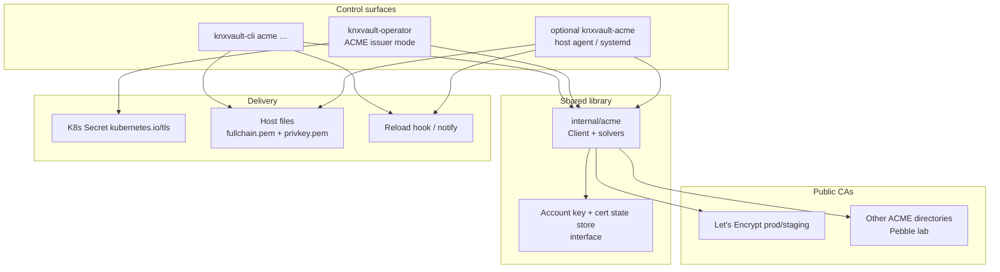
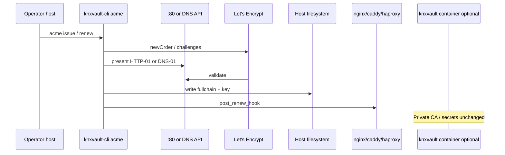

<!--
Copyright The KNXVault Authors.
SPDX-License-Identifier: CC-BY-4.0
-->

# Design: Unified Let's Encrypt / ACME automation (Kubernetes + standalone + CLI)

| Field | Value |
|-------|-------|
| **Status** | Implemented (M-ACME-1 core A–C; Phase D stubs ADR + vaultstore) |
| **Date** | 2026-07-17 |
| **Authors** | knxvault engineering |
| **Milestone** | **M-ACME-1** — Unified ACME / Let's Encrypt (see backlog **W60-***) |
| **Follow-on** | **M-DNS01-1** — DNS-01 providers + webhooks (cert-manager parity) — [dns01-providers-and-webhooks.md](dns01-providers-and-webhooks.md) · backlog **W61-*** |
| **Related** | [multi-issuer-acme.md](multi-issuer-acme.md) (K8s operator ACME — implemented) · [certificate-support-matrix.md](../operations/certificate-support-matrix.md) · [standalone Day-0/Day-2](../operations/standalone-distroless-day0-day2.md) · [K8s CLI Day-0/Day-2](../operations/kubernetes-cli-day0-day2.md) · [build-and-deploy-images.md](../operations/build-and-deploy-images.md) |

---

## 1. Goal

Provide **first-class Let's Encrypt (and generic ACME RFC 8555) automation** for:

1. **Kubernetes** — already largely delivered via **knxvault-operator** multi-issuer ACME mode.  
2. **Standalone** — containerd/nerdctl (or host) distroless knxvault **without** Kubernetes CRDs.  
3. **knxvault-cli** — same operator-grade ACME operations from the **admin host** for both topologies.

Product claim after M-ACME-1:

> **KNXVault automates public ACME certificates (including Let's Encrypt) for Kubernetes and standalone deployments, using a shared ACME engine and a single CLI surface — without requiring cert-manager.**

Private platform PKI (`POST /pki/*`, `knxvault-cli pki`) remains a **separate plane** (private trust). ACME does **not** replace private CA; both coexist.

---

## 2. Problem statement

| Topology | Today | Gap |
|----------|--------|-----|
| K8s + operator | ACME HTTP-01 / DNS-01 (Cloudflare, webhook); LE staging sample | CLI does not issue/renew ACME; docs split; some HA solver ops polish |
| Standalone distroless + CLI | Private CA only via `pki` | **No ACME / LE automation** |
| knxvault server image | Distroless, no shell | Correctly **no** LE client in-image — must not regress |

Operators currently cannot run a single mental model: “request public cert, renew, store, reload edge” on bare containerd the same way they do on K8s.

---

## 3. Non-goals

- Running ACME **inside** the distroless `knxvault serve` process (enlarges attack surface; couples sealed vault lifecycle to public LE).  
- Dual-serving cert-manager `cert-manager.io` CRDs.  
- Every DNS provider in-tree (webhook remains the extensibility point).  
- Post-quantum public CAs / composite LE certs (tracked under `docs/pq/`).  
- Replacing private CA issuance with LE for in-cluster trust roots.

---

## 4. Architecture

### 4.1 Shared ACME core (single engine)

All surfaces call **`internal/acme`** (existing package used by the operator):



| Component | Responsibility |
|-----------|----------------|
| **`internal/acme`** | Account register, order, HTTP-01/DNS-01, issue, (new) renew helpers, SSRF guards |
| **Account key store** | Pluggable: K8s Secret, file path, optional future knxvault KV (encrypted) |
| **Cert state store** | Track domains, notAfter, serial, paths/Secret names for renew |
| **Operator** | Watch CRDs; deliver Secrets; leader-elected renew |
| **CLI** | Imperative issue/renew/status; file delivery; hooks; optional daemon mode later |
| **knxvault server** | Unchanged for ACME; may optionally **store** account/cert material via API if we add an ACME state engine (phase 2) |

### 4.2 Topology mapping

| Topology | Control plane | Challenge presentation | Delivery |
|----------|---------------|------------------------|----------|
| **Kubernetes** | Operator (+ optional CLI against API) | HTTP-01: operator listener / ingress; DNS-01: CF/webhook | `kubernetes.io/tls` Secret |
| **Standalone** | **CLI** (primary); optional long-running agent | HTTP-01: host `:80` or webroot; DNS-01: CF/webhook | Files under configurable directory |
| **Both** | Same `acme` config schema (YAML) where possible | Same solver types | Topology-specific backend |

### 4.3 Config schema (shared YAML)

Unify operator CRD fields and CLI config under a portable ACME profile (names illustrative):

```yaml
# ~/.knxvault/acme.yaml  or  /etc/knxvault/acme.d/edge.yaml
profile: edge-public
directory_url: https://acme-v02.api.letsencrypt.org/directory   # or staging
email: ops@example.com
accept_tos: true
# account_key_file: /var/lib/knxvault/acme/account.key
challenges:
  - http-01
  # - dns-01
http01:
  # mode: listen | webroot
  listen_addr: ":80"
  # webroot: /var/www/acme
dns01:
  provider: cloudflare   # or webhook
  # api_token_file: …
  # webhook_url: …
domains:
  - name: app.example.com
    sans: [app.example.com, www.example.com]
delivery:
  type: files              # files | kubernetes-secret (CLI may invoke kubectl) | stdout
  cert_path: /etc/ssl/knxvault/app.fullchain.pem
  key_path: /etc/ssl/knxvault/app.key.pem
  # mode 0600 keys, 0644 certs
renew_before: 720h
post_renew_hook: /usr/local/bin/reload-nginx.sh
```

K8s CRDs remain the source of truth in-cluster; a **convert** path (`acme.yaml` ↔ `KNXVaultClusterIssuer` + `KNXVaultCertificate` fields) is a docs + optional CLI helper (W60-08).

### 4.4 CLI surface (enhancement)

New command group under `knxvault-cli`:

| Command | Behavior |
|---------|----------|
| `acme register` | Ensure ACME account + persist account key |
| `acme issue --profile …` / `--domains …` | New order; write delivery target |
| `acme renew [--all] [--profile …]` | Renew if within `renew_before` |
| `acme status` | Show notAfter, path, directory URL (no private key) |
| `acme revoke` | Optional ACME revoke (later phase if needed) |
| `acme doctor` | Check TOS, directory reachability, solver readiness, account key perms |

**Not** mixed into `pki root/issue` (private CA). Clear separation:

```text
knxvault-cli pki  …   → private trust (native Go CA in knxvault server)
knxvault-cli acme …   → public ACME (LE / staging / Pebble)
```

Flags (aligned with existing CLI patterns):

- Global: `--addr` remains for vault API if ACME state is stored server-side (phase 2); pure file-mode ACME may not need vault.  
- ACME-specific: `--config`, `--directory-url`, `--staging` (shortcut to LE staging), `--accept-tos`, `--email`, `--http01-addr`, `--dns-provider`, `--out-cert`, `--out-key`, `--hook`.

### 4.5 Standalone runtime model (containerd)



- **Distroless knxvault** continues to serve private PKI and secrets only.  
- **Host** runs CLI (cron/`systemd` timer for renew).  
- Optional later: `knxvault-acme.service` long-running agent wrapping the same library (W60-12).

### 4.6 Kubernetes model (retain + align)

Unchanged happy path from [multi-issuer-acme.md](multi-issuer-acme.md):

- `KNXVaultClusterIssuer` `spec.acme`  
- `KNXVaultCertificate` → Secret  
- HTTP-01 / DNS-01 solvers  

Enhancements under this design:

| Item | Intent |
|------|--------|
| CLI parity | `knxvault-cli acme issue` can target in-cluster via kubeconfig **or** only manage host files; prefer **not** requiring kubeconfig for pure ACME files |
| Operator renew robustness | Shared renew policy with CLI (`renew_before`) |
| Staging-first docs | Day-0 always staging, then prod directory |
| HA HTTP-01 | Document single presenter / shared load balancer requirements |

### 4.7 Security requirements

| Control | Requirement |
|---------|-------------|
| TOS | Explicit `accept_tos` / flag; no silent register |
| Account key | `0600` file or K8s Secret; never log PEM |
| Leaf key | `0600`; prefer tmpfs where possible |
| SSRF | Keep `ValidateOutboundURL` on directory and DNS webhook |
| SkipTLSVerify | Lab/Pebble only; **reject** when directory host is public LE |
| Rate limits | Default docs use **staging**; prod issuance gated by profile name |
| Separation | ACME material **not** mixed into private CA storage without encryption |

### 4.8 Trust planes (product language)

| Plane | Trust | Tooling |
|-------|-------|---------|
| **Private / platform** | Org-managed CA | `pki/*`, operator Vault issuer, `knxvault-cli pki` |
| **Public / edge** | Let's Encrypt (or other ACME) | Operator ACME issuer, `knxvault-cli acme` |

Harbor, internal mesh, and private Ingress → private plane.  
Public internet hostnames → public plane (LE).

---

## 5. Phased delivery (Milestone M-ACME-1)

Milestone **M-ACME-1** delivers unified ACME/LE automation. Work items **W60-01…** are defined in [`docs/backlog.md`](../backlog.md) (section *Milestone M-ACME-1*).

### Phase A — Foundation (shared engine + CLI MVP)

**Outcome:** Host can obtain LE **staging** certs via CLI; library APIs stable for operator reuse.

| Phase | Focus |
|-------|--------|
| A1 | Account key file store + cert state file store |
| A2 | CLI `acme register|issue|status|doctor` |
| A3 | HTTP-01 listen + webroot |
| A4 | DNS-01 Cloudflare + webhook (wire existing solvers) |
| A5 | LE staging E2E doc + optional CI with Pebble |
| A6 | Renew command (`renew_before`) + hook |

### Phase B — Standalone productization

**Outcome:** Standalone Day-0/Day-2 documents ACME; systemd timer example; containerd-friendly.

| Phase | Focus |
|-------|--------|
| B1 | Standalone + build-and-deploy docs for public TLS |
| B2 | Example `acme.yaml` + `systemd` unit/timer |
| B3 | Air-gap note: LE requires egress; offline = private CA only |
| B4 | Hardening: permissions, staging defaults, doctor checks |

### Phase C — Kubernetes alignment + CLI convenience

**Outcome:** One story for K8s and standalone; operator remains CRD source of truth.

| Phase | Focus |
|-------|--------|
| C1 | Doc matrix update (standalone ACME = Yes via CLI) |
| C2 | Optional: generate CRD YAML from `acme.yaml` |
| C3 | Operator uses shared renew helpers from library (dedupe) |
| C4 | Lab E2E: Pebble or staging path in `lab-full-e2e` optional job |

### Phase D — Optional server-side ACME state (stretch)

**Outcome:** Optional persistence of ACME account/certs in knxvault (encrypted) for multi-admin fleets.

| Phase | Focus |
|-------|--------|
| D1 | Design Raft-safe ACME state schema (or reject and stay file-only) |
| D2 | If accepted: `POST /acme/...` admin API + CLI `--store=vault` |
| D3 | RBAC for ACME admin paths |

Phase D is **not** required to close M-ACME-1 core claim; mark as stretch / M-ACME-2.

---

## 6. Milestone definition

### M-ACME-1 — Unified ACME / Let's Encrypt

| Field | Value |
|-------|-------|
| **Name** | Unified ACME / Let's Encrypt automation |
| **Scope** | Phases A–C (foundation CLI + standalone docs + K8s alignment) |
| **Out of scope** | Phase D vault-stored ACME state; cert-manager CRD dual-serve |
| **Exit criteria** | See §7 |
| **Backlog IDs** | **W60-01 … W60-14** (and W60-15+ for stretch) |

### M-ACME-2 (follow-on, optional)

- Vault-backed ACME state (Phase D)  
- Long-running `knxvault-acme` agent  
- Additional DNS providers if product prioritizes (else webhook only)  
- ACME External Account Binding (EAB) for enterprise CAs  

---

## 7. Acceptance criteria (M-ACME-1 complete)

- [ ] **CLI:** `knxvault-cli acme issue` obtains a cert from **LE staging** or **Pebble** with HTTP-01 or DNS-01.  
- [ ] **CLI:** `acme renew` re-issues when within `renew_before`; no-ops when not due.  
- [ ] **Standalone:** Documented path on containerd host: issue → files → hook; no pod/container exec.  
- [ ] **K8s:** Existing operator ACME path still works; docs describe both CLI (host edge) and operator (in-cluster Secrets).  
- [ ] **Security:** Public LE rejects `SkipTLSVerify`; account/leaf keys mode-restricted; doctor surfaces misconfig.  
- [ ] **Separation:** `pki` commands unchanged (private CA only).  
- [ ] **Tests:** Unit tests for file stores + CLI wiring; integration with Pebble preferred over flaky public LE in CI.  
- [ ] **Docs:** Support matrix, standalone guide, K8s CLI guide, build-and-deploy updated.  
- [ ] **License:** No new non-permissive direct deps (stay on `x/crypto/acme`).  

---

## 8. Risks and mitigations

| Risk | Mitigation |
|------|------------|
| LE rate limits in CI/lab | Staging default; Pebble for automated tests |
| HTTP-01 port 80 conflict on host | Webroot mode + document reverse-proxy challenge path |
| Operators confuse `pki` vs `acme` | Separate CLI groups; docs trust-plane table |
| Account key loss | Document backup of account key file/Secret; LE recovery constraints |
| Multi-node K8s HTTP-01 | Single presenter or shared LB; prefer DNS-01 for HA edge |
| Scope creep (vault ACME state) | Phase D optional; M-ACME-1 file+CRD only |

---

## 9. Documentation deliverables

| Doc | Change |
|-----|--------|
| This design | Source of truth for M-ACME-1 |
| `docs/backlog.md` | W60 + milestone table |
| `docs/design/multi-issuer-acme.md` | Link “standalone + CLI extension” → this doc |
| `certificate-support-matrix.md` | Standalone ACME row → Yes (CLI) when shipped |
| `standalone-distroless-day0-day2.md` | Public TLS section |
| `kubernetes-cli-day0-day2.md` | ACME CLI + operator split |
| `cli/reference.md` | `acme` commands |
| `build-and-deploy-images.md` | Note: no LE in server image; CLI on host |

---

## 10. Implementation sketch (for implementers)

### Packages

| Path | Role |
|------|------|
| `internal/acme/` | Existing client; add `RenewIfNeeded`, file `AccountKeyProvider`, `FileCertStore` |
| `internal/acme/filestore/` | Account + cert metadata JSON (optional subpackage) |
| `cmd/knxvault-cli/cmd/acme.go` | Cobra commands |
| `internal/operator/…` | Prefer calling shared renew helpers (C3) — avoid behavior drift |

### Suggested CLI flow (`issue`)

1. Load profile YAML / flags.  
2. Require `accept_tos`.  
3. Load or create account key → register if needed.  
4. Build `acme.Client` with solvers.  
5. `Issue(OrderRequest)`.  
6. Write cert/key paths atomically (`rename`).  
7. Run hook; print status JSON (`not_after`, paths).  

### Suggested renew flow

1. Load state (metadata next to cert or sidecar JSON).  
2. If `now + renew_before < not_after` → exit 0.  
3. Else issue → replace files → hook.  

---

## 11. Summary

| Question | Answer |
|----------|--------|
| LE on K8s? | **Yes today** (operator); strengthen with shared renew + docs |
| LE on standalone? | **Design: yes** via **host CLI** + `internal/acme`, not distroless server |
| Same CLI? | **`knxvault-cli acme`** for both; private CA stays `pki` |
| Milestone? | **M-ACME-1** / backlog **W60-*** Phases A–C |
| Server image change? | **None required** for M-ACME-1 core |

**Decision:** Implement unified ACME/Let's Encrypt automation with a **shared library**, **CLI-first standalone**, and **operator-first Kubernetes**, delivered as milestone **M-ACME-1**.
