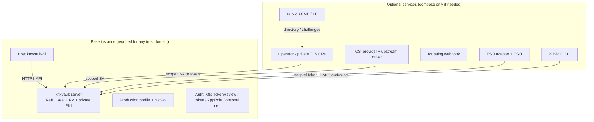
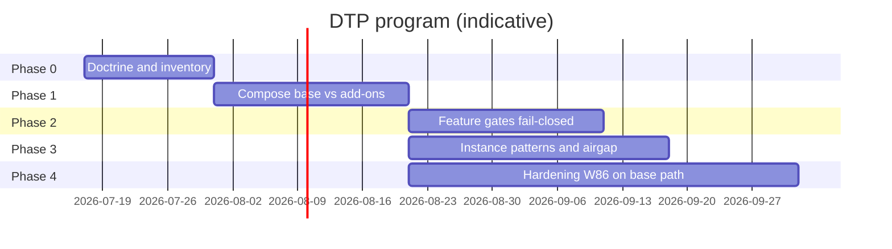

<!--
Copyright Kubenexis Systems Private Limited.
SPDX-License-Identifier: CC-BY-4.0
-->

# Design: KNXVault Distributed Trust Platform (DTP)

| Field | Value |
|-------|-------|
| **Status** | **Accepted** (implemented on branch) |
| **Date** | 2026-07-17 |
| **Branch** | `knxvault-distributed-trust-platform` |
| **Milestone family** | **M-DTP-1 … M-DTP-4** (backlog **W90-***) |
| **Related** | [Production security posture](production-security-posture.md) · [Security model](../architecture/security-model.md) · [W86 audit backlog](../audit/security-audit-w86-backlog-2026-07-17.md) · [ADR-0011 multi-tenant stance](../adr/0011-multi-tenant-stance.md) · [Build and deploy images](../operations/build-and-deploy-images.md) · [Phase 4 ecosystem](phase4-ecosystem.md) |

---

## 1. Problem statement

KNXVault has grown from a **core secrets + private CA** platform into a **platform + ecosystem** surface:

| Surface | Examples |
|---------|----------|
| **Core** | Raft, seal/unseal, envelope crypto, KV, private PKI, policies, audit |
| **K8s base** | StatefulSet, production profile, TokenReview, NetPol, host `knxvault-cli` |
| **Add-ons** | Operator, CSI provider, mutating webhook, ESO adapter, public ACME/LE, public OIDC, optional cloud-shaped integrations |

Security audits (W78–W85 closed **engine** findings; **W86** open residuals) show that **Critical/High residual risk concentrates on add-on deploy edges** (operator Secret custody, ESO TLS/auth, lab NetPol, optional root token)—not on reopened core crypto.

**Product constraint:** We cannot afford a large open security-observation backlog on the plane that holds **master/unseal keys**.

**Product decision (this design):**

> **Base = Core + Kubernetes.**  
> **Everything that extends identity, node injection, secret sync, or public internet ACME is an extra service.**  
> **Deploy only what the use case needs; high-assurance and airgap instances deploy base only.**

This document turns that decision into **phases, milestones, and backlog items**, tracked on branch **`knxvault-distributed-trust-platform`**.

---

## 2. Goals and non-goals

### 2.1 Goals

| ID | Goal |
|----|------|
| G1 | **Default install = base only** — small TCB, production profile, no LE/OIDC/CSI/ESO/webhook unless explicitly composed |
| G2 | **Named add-on modules** — each with its own manifests, docs, and threat notes |
| G3 | **Instance roles** — recommended patterns for high-assurance vs platform/edge instances |
| G4 | **Fail-closed feature gates** — ConfigMap/env can hard-disable OIDC/ACME/etc. on base (not only “don’t configure”) |
| G5 | **Airgap-first base path** — export/load images + host CLI; no required outbound network for base |
| G6 | **Clear audit scope** — base vs add-on findings tracked separately so observations don’t inflate “core” risk |

### 2.2 Non-goals (this program)

| Non-goal | Rationale |
|----------|-----------|
| Multi-tenant SaaS isolation inside one process | ADR-0011; use **instances** instead |
| Vault Enterprise plugin parity | Product stance |
| Merging all add-ons into one image “for convenience” | Increases TCB (CLI already host-only) |
| Removing add-on *code* from the monorepo | Code may stay; **default deploy** and **product base** shrink |

---

## 3. Architecture: base vs add-ons

### 3.1 Base (always)

| Component | Packaging | Notes |
|-----------|-----------|--------|
| `knxvault` server | Distroless image | `serve` only as default entrypoint |
| Production kustomize | `deployments/k8s/production/` | Profile, metrics plane, unseal CIDRs |
| K8s auth | TokenReview RBAC | No public IdP required |
| Private PKI | API + optional operator **without** public LE | Intermediate online; root policy offline-eligible |
| Admin CLI | **Host binary only** | CI artifact / `make build-cli` — never in server image |

### 3.2 Add-on services (opt-in)

| Add-on | Deploy unit | Depends on | Network / trust notes |
|--------|-------------|------------|------------------------|
| **Operator** (private CRs) | `deployments/operator/` | Base API | Isolate Secrets RBAC from custody Secret (**W86-01**) |
| **CSI provider** | `deployments/csi/` + upstream CSI Driver | Base + driver images | Node hostPath; mirror drivers for airgap |
| **Mutating webhook** | `deployments/k8s/webhook/` | Base optional | TLS + caBundle required |
| **ESO adapter** | `deployments/external-secrets/` + ESO | Base | TLS + caller auth (**W86-04/05**) |
| **Public OIDC** | Config + IdP | Outbound JWKS | Not for airgap base |
| **Public ACME/LE** | Operator ACME issuer / CLI acme | Outbound + challenges | Not for airgap base |
| **Audit forward** | Config URL | Outbound SIEM | Optional |

### 3.3 Recommended instance roles (distributed trust)

| Role | Deploy | Purpose |
|------|--------|---------|
| **HA / core** | Base only (+ private operator if needed, custody-isolated) | Master/unseal, critical secrets, private CA |
| **Platform / edge** | Base + CSI/ESO/webhook/OIDC as required | App injection and federation; **client** of core with scoped policies |
| **Public TLS edge** | Operator ACME only where network allows | LE; no co-location of core custody with LE challenge plane if policy requires |

Multiple instances increase ops cost; they **reduce** custody blast radius and audit surface per instance—aligned with “we can’t afford security observations” on the critical plane.

---

## 4. Phases and milestones

| Phase | Milestone | Name | Outcome |
|-------|-----------|------|---------|
| **0** | **M-DTP-0** | Doctrine | This design accepted; product language updated |
| **1** | **M-DTP-1** | Compose | Kustomize **base** vs **components**; default install = base only |
| **2** | **M-DTP-2** | Gates | Server/operator flags hard-disable non-base features when off |
| **3** | **M-DTP-3** | Instances + airgap | Instance-role runbook + airgap checklist + export matrix |
| **4** | **M-DTP-4** | Base hardening | Close **W86 P0** items that protect base custody (parallel OK) |

**Dependency note:** M-DTP-1 can land without code feature gates. M-DTP-2 prevents “accidentally enabled” OIDC/ACME on base. M-DTP-4 reuses **W86-*** backlog (custody, NetPol, Raft mTLS overlay).

---

## 5. Phase detail

### Phase 0 — Doctrine (M-DTP-0)

| Work | Deliverable |
|------|-------------|
| Accept DTP design | This doc **Status → Accepted** |
| Align security-model + README product blurb | Base vs add-ons language |
| Map W86 items to base vs add-on | Audit scope split |

**Exit:** Stakeholders agree base definition; planning branch merged or kept as tracking.

### Phase 1 — Compose (M-DTP-1)

| Work | Deliverable |
|------|-------------|
| Restructure kustomize | `deployments/k8s/base/`, `components/{operator,csi,webhook,eso,acme-egress}/` |
| Default path | `kubectl apply -k …/base` or `…/production` = **no** CSI/ESO/webhook/ACME |
| Overlay examples | `overlays/airgap-core`, `overlays/platform-edge` |
| Docs | Install matrix: base vs each add-on |
| CI | Optional: lint that production base does not reference ACME/CSI |

**Exit:** New cluster Day-0 using **base only** is documented and tested; add-ons are explicit second steps.

### Phase 2 — Feature gates (M-DTP-2)

| Flag (proposed) | Default (production / airgap base) | Effect when false |
|------------------|------------------------------------|-------------------|
| `KNXVAULT_AUTH_OIDC_ENABLED` | `false` in airgap overlay | No `/auth/oidc/*` registration; reject OIDC role config |
| `KNXVAULT_AUTH_LDAP_ENABLED` | `false` unless set | No LDAP login route |
| `KNXVAULT_ACME_RELATED_ENABLED` | `false` on server if any server-side ACME | Refuse related config (operator uses own flag) |
| `KNXVAULT_AUDIT_FORWARD_ENABLED` | `false` unless URL set intentionally | Ignore forward URL |
| Operator: `KNXVAULT_OPERATOR_ACME_ENABLED` | `false` in private-only | Reject ACME issuer types |

**Exit:** Airgap/production base ConfigMap sets gates off; tests prove routes absent / config rejected.

### Phase 3 — Instances + airgap (M-DTP-3)

| Work | Deliverable |
|------|-------------|
| Instance role guide | Core vs platform vs public-TLS-edge |
| Airgap checklist | Transfer list, load, base-only apply, feature gates |
| Image matrix | What tarballs per topology (server, operator, upstream CSI/ESO) |
| CLI | Host/CI artifact only (already true) |

**Exit:** Operator can stand up **core airgap** from checklist without LE/OIDC/CSI.

### Phase 4 — Base hardening (M-DTP-4)

Execute **W86 P0** items that protect base custody and network plane (see backlog). Priority:

1. W86-01 custody Secret isolation  
2. W86-02 no root on operator sample  
3. W86-06 Raft mTLS overlay  
4. W86-07 metrics-only NetPol  
5. W86-03 OwnerRef-only Secret ownership  

Add-on-specific W86 (ESO TLS/auth) land with **add-on enablement**, not as blockers for base GA.

**Exit:** Base install has no open **Critical** custody issues from W86-01 class.

---

## 6. Backlog ID scheme

| Range | Meaning |
|-------|---------|
| **W90-0x** | M-DTP-0 doctrine / docs |
| **W90-1x** | M-DTP-1 compose |
| **W90-2x** | M-DTP-2 feature gates |
| **W90-3x** | M-DTP-3 instances / airgap |
| **W90-4x** | Cross-cutting DTP (CI, doctor, versioning) |
| **W86-*** | Security residuals (parallel; base subset in M-DTP-4) |

Canonical table: [`docs/backlog.md`](../backlog.md) § **Milestone M-DTP / W90**.

---

## 7. Success metrics

| Metric | Target |
|--------|--------|
| Default kustomize surface | No CSI/ESO/webhook/ACME resources |
| Airgap core Day-0 | Offline images + CLI; no required outbound |
| Open Critical on base custody | 0 after M-DTP-4 / W86-01 |
| Audit reporting | Findings tagged `base` vs `addon:<name>` |
| Image TCB | Server image without admin CLI (done) |

---

## 8. Risks

| Risk | Mitigation |
|------|------------|
| Ops overhead of multiple instances | Document **when** one instance is enough vs split |
| Developers enable all components “for demos” | Demo overlay separate from production base |
| Feature flags incomplete | Phase 1 compose still reduces risk before gates |
| Code still linked in monorepo | Accept; gates + compose control runtime surface |

---

## 9. Decision log

| Decision | Choice |
|----------|--------|
| Isolation model | **Multiple instances** for use cases, not multi-tenant SaaS in one process |
| Base definition | **Core + K8s** (+ optional private operator with isolated RBAC) |
| LE / public OIDC / CSI / ESO / webhook | **Add-on services** |
| knxvault-cli | **Host/CI artifact only** — never server image |
| Tracking branch | `knxvault-distributed-trust-platform` |

---

## 10. Implementation status (M-DTP-0…4)

| Milestone | Status | Notes |
|-----------|--------|-------|
| **M-DTP-0** | **Complete** | Design Accepted; security-model + README base vs add-ons; W86 base/addon tags |
| **M-DTP-1** | **Complete** | `deployments/k8s/base`, `components/*`, overlays `airgap-core` / `platform-edge`; CI `make dtp-surface` |
| **M-DTP-2** | **Complete** | Auth OIDC/LDAP, audit forward, ACME related + operator ACME gates; doctor posture |
| **M-DTP-3** | **Complete** | Instance roles, airgap checklist, image matrix, cross-instance trust |
| **M-DTP-4** | **Complete** | W86-01/02/06/07 base custody path |

Canonical backlog: [`docs/backlog.md`](../backlog.md) § M-DTP / W90.
