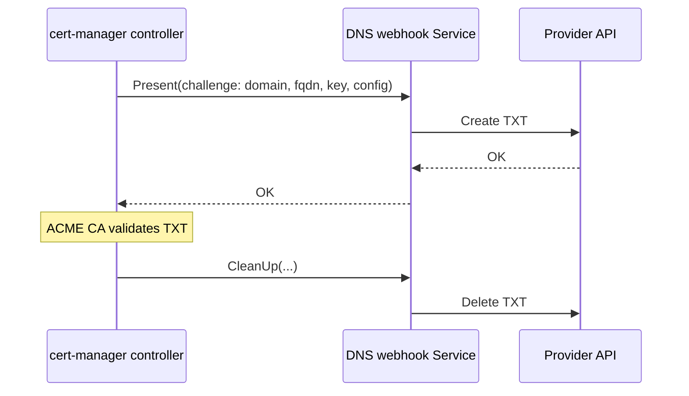

<!--
Copyright The KNXVault Authors.
SPDX-License-Identifier: CC-BY-4.0
-->

# Design: ACME DNS-01 providers and webhooks (learn from cert-manager)

| Field | Value |
|-------|-------|
| **Status** | Proposed |
| **Date** | 2026-07-17 |
| **Milestone** | **M-DNS01-1** — DNS-01 provider framework + webhook parity (backlog **W61-***) |
| **Depends on** | M-ACME-1 (`internal/acme`, operator ACME, CLI `acme`) — [acme-letsencrypt-unified.md](acme-letsencrypt-unified.md) |
| **Related** | [multi-issuer-acme.md](multi-issuer-acme.md) · [certificate-support-matrix.md](../operations/certificate-support-matrix.md) · [extensibility.md](../engineering/extensibility.md) (how to write DNS webhooks / engines) · cert-manager [DNS01](https://cert-manager.io/docs/configuration/acme/dns01/) · [webhook](https://cert-manager.io/docs/configuration/acme/dns01/webhook/) |

---

## 1. Goal

Learn from **cert-manager’s DNS-01 model** and evolve knxvault so that:

1. **In-tree DNS providers** are a small, curated set (maintainable, Apache-2.0-safe).  
2. **Out-of-tree DNS providers** use a **stable webhook contract** (K8s service or host HTTP), same idea as cert-manager’s webhook solver.  
3. **Operator CRDs** and **`knxvault-cli acme`** share one provider registry / config schema.  
4. Operators can add Route53, Azure DNS, Google Cloud DNS, PowerDNS, etc. **without forking knxvault**—by deploying a webhook binary/sidecar.

**Claim when M-DNS01-1 is done:**

> knxvault ACME DNS-01 is **cert-manager-class for extension**: first-party Cloudflare + well-specified webhooks; documented path to add providers without core releases.

---

## 2. What cert-manager does (lessons)

### 2.1 Two layers

| Layer | cert-manager | Lesson for knxvault |
|-------|--------------|---------------------|
| **In-tree solvers** | Cloudflare, Route53, Google, Azure, Akamai, RFC2136, … | Keep **few** first-party providers; each is a maintenance cost |
| **Webhook solver** | Generic: call an external APIService/webhook implementing Present/CleanUp | **Primary extensibility** — ecosystem owns provider code |
| **Config** | Per-Issuer `solvers[]` with `dns01.cloudflare` / `dns01.webhook` / `selector` | Support **multiple solvers** + **domain selectors** (not only one DNS block) |
| **Secrets** | API tokens via Secret refs | Keep SecretKeyRef; never inline long-lived secrets in CR YAML in Git |
| **Webhook protocol** | gRPC/HTTP challenge payload: Action, DNSName, ResolvedFQDN, Key, Config (JSON) | Define a **versioned JSON contract**; prefer HTTP first (already have POST webhook) |
| **Out-of-tree install** | Separate Deployment + RBAC + GroupName | Document **webhook chart/manifest template** for third parties |

### 2.2 cert-manager webhook flow (simplified)



### 2.3 What knxvault has today

| Piece | Status |
|-------|--------|
| `DNS01Presenter` interface (`Present` / `CleanUp`) | Yes |
| Cloudflare (HTTPS API, no extra deps) | Yes |
| Generic HTTP webhook (`action`, `domain`, `fqdn`, `value`) | Yes (simple) |
| Memory (tests) | Yes |
| Multiple solvers / DNS01 selectors | **No** (single `dns01` block) |
| Webhook **config blob** (provider-specific JSON) | **No** |
| Webhook auth (mTLS / bearer / SA token) | **No** |
| K8s webhook Service discovery / groupName | **No** |
| In-tree Route53 / Azure / GCP / RFC2136 | **No** |
| CLI profile = same providers as operator | Partial (shared `BuildSolvers`) |
| Provider registry / plugin package layout | **No** |

---

## 3. Non-goals (M-DNS01-1)

- Porting **every** cert-manager in-tree provider in one release.  
- Binary plugins (`.so`) — licensing and load complexity; use **webhooks** instead.  
- Full gRPC cert-manager webhook API compatibility (optional later if ecosystem demands).  
- HTTP-01 solver expansion (separate work if needed).  
- Venafi / enterprise public CAs.

---

## 4. Target architecture

### 4.1 Provider registry

```text
internal/acme/
  dns01.go              # DNS01Presenter, FQDN helpers, memory
  cloudflare.go         # in-tree
  webhook.go            # enhanced HTTP webhook client
  providers/
    registry.go         # name → factory(Config) (DNS01Presenter, error)
    route53/            # optional in-tree phase B
    rfc2136/            # optional in-tree phase B
  ...
```

| Provider name | Type | Delivery phase |
|---------------|------|----------------|
| `memory` | in-tree | already |
| `cloudflare` | in-tree | already (harden) |
| `webhook` | in-tree **client** + out-of-tree server | **phase A** |
| `route53` | in-tree (optional) | phase B |
| `rfc2136` | in-tree (optional) | phase B |
| `azure-dns`, `google-clouddns`, … | **webhook-only** (document) | phase C docs + examples |

### 4.2 Enhanced webhook contract (v1)

Compatible extension of today’s body (additive fields):

```json
{
  "apiVersion": "acme.knxvault.io/v1",
  "action": "present|cleanup",
  "domain": "app.example.com",
  "fqdn": "_acme-challenge.app.example.com.",
  "value": "<TXT payload>",
  "key": "<same as value; cert-manager naming alias>",
  "uid": "<optional challenge id>",
  "config": { }
}
```

**Response:** HTTP 2xx = success; 4xx/5xx = failure with body text for logs.

**Config:** opaque JSON from Issuer CR / CLI profile, forwarded as `config` so out-of-tree webhooks receive provider-specific settings (API zone, assume-role ARN, etc.) without knxvault understanding them.

**Auth (optional, progressive):**

| Mode | Header / TLS |
|------|----------------|
| none | lab only |
| bearer | `Authorization: Bearer <token from Secret>` |
| basic | Secret user/pass |
| mTLS | client cert files / K8s projected (later) |

**SSRF:** keep `ValidateOutboundURL` for production; allowlist optional `webhookURLAllowlist` on Issuer for enterprise.

### 4.3 CRD shape (learn from cert-manager solvers list)

Today:

```yaml
spec:
  acme:
    dns01:
      provider: cloudflare | webhook | memory
      webhookURL: ...
      apiTokenSecretRef: ...
```

**Target (phase A+):**

```yaml
spec:
  acme:
    # Keep simple dns01 for backward compatibility
    dns01:
      provider: webhook
      webhookURL: https://dns-webhook.knxvault.svc/v1/challenge
      webhookConfig:
        # opaque JSON for the webhook
        hostedZoneId: Z123
      webhookAuthSecretRef:
        name: dns-webhook-token
        key: token
      apiTokenSecretRef: ...   # cloudflare etc.
      zoneID: ...
    # Preferred multi-solver (cert-manager-like)
    solvers:
      - selector:
          dnsZones: ["example.com"]
        dns01:
          provider: cloudflare
          apiTokenSecretRef: { name: cf-token, key: api-token }
      - selector:
          dnsZones: ["other.io"]
        dns01:
          provider: webhook
          webhookURL: http://route53-webhook.knxvault.svc/present
          webhookConfig:
            roleArn: arn:aws:iam::...
```

**Selector rules (minimal v1):**

- If no `solvers`, use legacy single `dns01` / `http01`.  
- If `solvers` present, pick first matching `dnsZones` suffix / `dnsNames` exact; else default solver.  
- HTTP-01 remains a solver kind alongside DNS-01.

### 4.4 CLI profile alignment

```yaml
# examples/acme/edge-dns-webhook.yaml
dns01:
  provider: webhook
  webhook_url: https://dns-webhook.example.svc/v1/challenge
  webhook_config_file: /etc/knxvault/dns-webhook-config.json
  auth_token_file: /etc/knxvault/dns-webhook.token
```

Same registry as operator (`BuildSolvers` / `BuildSolversFromProfile`).

### 4.5 Out-of-tree webhook packaging (template)

Deliver under `deployments/acme-dns-webhook-template/` (phase C):

- Deployment + Service  
- Optional NetworkPolicy  
- README: implement `POST /v1/challenge` with v1 JSON  
- Example webhook for **RFC2136** or **PowerDNS** as reference implementation (or document community list)

Do **not** require webhooks to be written in Go; any language OK.

### 4.6 Observability

| Metric / log | Purpose |
|--------------|---------|
| `knxvault_acme_dns01_present_total{provider=}` | Success/fail |
| `knxvault_acme_dns01_cleanup_total{provider=}` | Cleanup |
| Structured log fields | `provider`, `fqdn`, `action`, `duration_ms` (no secrets) |

---

## 5. Security requirements

| Control | Requirement |
|---------|-------------|
| Secrets | Only via SecretKeyRef / files; never log tokens |
| Webhook SSRF | Default validate URL; optional allowlist |
| Webhook auth | Document production = bearer or mTLS |
| Provider blast radius | Webhook SA: least privilege to one DNS zone |
| LE rate limits | Staging first; multi-solver misconfig must not thrash LE |
| License | In-tree providers: no GPL; prefer AWS SDK-free REST if possible (same as Cloudflare) |

---

## 6. Milestone M-DNS01-1

| Field | Value |
|-------|-------|
| **Name** | ACME DNS-01 providers and webhooks (cert-manager parity for extension) |
| **Priority** | **P1** (after M-ACME-1 core) |
| **Exit** | §8 acceptance criteria |
| **Backlog** | **W61-01 … W61-18** |

### Phase A — Webhook v1 + registry foundation

**Outcome:** Stable multi-field webhook client + provider registry; backward compatible with current Cloudflare/webhook.

| ID | Effort | Title | Acceptance |
|----|--------|-------|------------|
| **W61-01** | M | Provider registry (`providers.Register` / `New`) | Unit tests; cloudflare/memory/webhook registered by name |
| **W61-02** | M | Webhook protocol v1 (`apiVersion`, `config`, `key`) | Backward compatible with old body; tests for both |
| **W61-03** | M | Webhook auth: bearer from Secret/file | 401 from webhook fails Present with clear error |
| **W61-04** | S | Webhook URL allowlist config | SSRF still default-on |
| **W61-05** | M | CLI profile: `webhook_config`, auth token file | `knxvault-cli acme` docs + example YAML |
| **W61-06** | S | Metrics + structured DNS-01 logs | Prometheus counters exist |

### Phase B — CRD multi-solver + Cloudflare harden

**Outcome:** cert-manager-like `solvers[]` + selectors; Cloudflare production polish.

| ID | Effort | Title | Acceptance |
|----|--------|-------|------------|
| **W61-07** | L | CRD: `spec.acme.solvers[]` + selector (`dnsZones`, `dnsNames`) | DeepCopy; conversion from legacy `dns01` |
| **W61-08** | M | Operator: pick solver by domain | Unit tests for selector matching |
| **W61-09** | M | Cloudflare: TTL, multi-TXT, better zone match, rate-limit backoff | Lab issue against real/staging CF optional |
| **W61-10** | S | cmcompat: map cert-manager DNS01 webhook fields | Document mapping table |
| **W61-11** | M | Docs: DNS-01 operator guide (solvers, secrets, staging) | Runbook section + matrix update |

### Phase C — In-tree optional providers + webhook template

**Outcome:** 1–2 high-value in-tree providers **or** excellent webhook templates so community fills the gap without core bloat.

| ID | Effort | Title | Acceptance |
|----|--------|-------|------------|
| **W61-12** | L | In-tree **RFC2136** (TSIG) DNS-01 | Unit tests with mock DNS; no new non-permissive deps |
| **W61-13** | L | In-tree **Route53** (SigV4 raw or minimal AWS API) | Token/role via Secret; license check |
| **W61-14** | M | Webhook Deployment template + reference webhook (PowerDNS or mock) | `deployments/acme-dns-webhook-template/` |
| **W61-15** | S | Provider catalog doc (in-tree vs webhook-only list) | Links to community webhooks |

*If Route53/RFC2136 slip, M-DNS01-1 can still exit on A+B+W61-14/15 (webhook-first strategy).*

### Phase D — Hardening and ecosystem

| ID | Effort | Title | Acceptance |
|----|--------|-------|------------|
| **W61-16** | M | Integration test: mock webhook + Pebble/memory ACME path | CI-safe |
| **W61-17** | S | Propagation wait / TTL knobs (shared) | Configurable wait before Accept |
| **W61-18** | S | Security review checklist for out-of-tree webhooks | Doc in operations/ |

---

## 7. Sequencing

```text
M-ACME-1 (done/in progress)
    └── M-DNS01-1
            Phase A: registry + webhook v1 + CLI   (W61-01–06)
            Phase B: solvers[] CRD + CF + docs       (W61-07–11)
            Phase C: RFC2136/Route53 and/or templates (W61-12–15)
            Phase D: CI + propagation + security      (W61-16–18)
```

Do **not** start large in-tree provider ports before **W61-02** (contract) is stable.

---

## 8. Acceptance criteria (milestone complete)

- [ ] Provider registry used by operator + CLI.  
- [ ] Webhook v1 with `config` + optional bearer auth; old webhook body still works.  
- [ ] Legacy single `dns01` still works.  
- [ ] `solvers[]` with `dnsZones` selector works in operator.  
- [ ] Cloudflare remains supported and documented.  
- [ ] At least one path for “unsupported provider”: **webhook template** + catalog doc.  
- [ ] Optional: RFC2136 and/or Route53 in-tree.  
- [ ] Unit tests for registry, webhook client, selector; CI mock webhook.  
- [ ] Support matrix + Day-0/Day-2 ACME DNS sections updated.  
- [ ] No GPL/new non-permissive direct deps.

---

## 9. Comparison snapshot (after M-DNS01-1)

| Concern | cert-manager | knxvault after M-DNS01-1 |
|---------|--------------|---------------------------|
| Extensibility | Webhook ecosystem | **Same strategy** (webhook v1 + template) |
| In-tree providers | Many | Curated: CF + optional RFC2136/Route53 |
| Multi-solver / zone select | Yes | **Yes** (`solvers[]`) |
| Secrets handling | Secret refs | Secret refs + CLI files |
| Standalone | Limited | **CLI** same providers |
| Secrets platform | No | Yes (orthogonal) |

---

## 10. Risks

| Risk | Mitigation |
|------|------------|
| Scope creep (too many in-tree providers) | Webhook-first; phase C optional |
| Weak webhook security | Auth + SSRF + checklist (W61-03,04,18) |
| Breaking existing webhook users | Additive JSON; dual-read body |
| AWS SDK license/size | Prefer raw SigV4 or webhook for Route53 |
| Propagation races | W61-17 wait/TTL knobs |

---

## 11. Documentation deliverables

| Doc | Action |
|-----|--------|
| This design | Source of truth for M-DNS01-1 |
| `docs/backlog.md` | W61 tables + milestone header |
| `certificate-support-matrix.md` | DNS provider rows |
| Operator / ACME runbooks | solvers[] + webhook install |
| `examples/acme/` | webhook + multi-zone profiles |
| `deployments/acme-dns-webhook-template/` | Out-of-tree starter |

---

## 12. Summary

| Question | Answer |
|----------|--------|
| Learn from cert-manager? | **Yes** — curated in-tree + **webhook extensibility** + multi-solver selectors |
| Single milestone? | **M-DNS01-1** (W61-01–18) |
| Phases? | A contract/registry · B CRD solvers · C providers/templates · D harden |
| Relationship to M-ACME-1? | Builds on shared ACME/CLI; focuses on **DNS-01 scale-out** |

**Decision:** Implement a **provider registry** and **webhook v1** (cert-manager-class extension model), then **solvers[]** on CRDs, then optional in-tree RFC2136/Route53 and a **webhook template** so the ecosystem can match cert-manager’s DNS coverage without bloating knxvault core.
