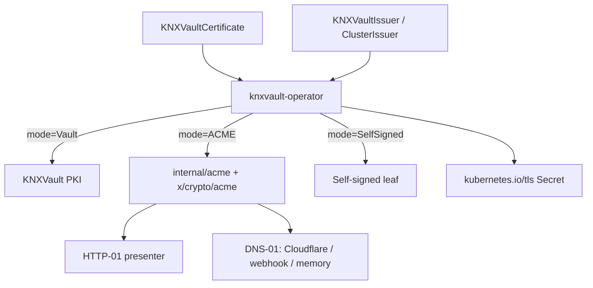

<!--
Copyright The KNXVault Authors.
SPDX-License-Identifier: CC-BY-4.0
-->

# Design: Multi-issuer ACME & full cert-manager replacement scope

| Field | Value |
|-------|-------|
| **Status** | Implemented for **Kubernetes operator** (W50 foundation); extended by **[acme-letsencrypt-unified.md](acme-letsencrypt-unified.md)** (standalone + CLI — milestone M-ACME-1) |
| **Date** | 2026-07-16 (operator); 2026-07-17 (unified design) |
| **Code** | `internal/acme`, operator multi-issuer CRDs, `cmcompat` |

## Goal

Enable the product claim:

> **KNXVault can replace cert-manager for Kubernetes certificate automation** across private CA, self-signed, and ACME (public) issuers — without installing cert-manager.

## Architecture

### Issuer modes (exactly one)

| Mode | Spec | Issue path |
|------|------|------------|
| **Vault** | `spec.vault` or legacy `vaultCAName` | `POST /pki/issue` / renew |
| **ACME** | `spec.acme` | RFC 8555 via `golang.org/x/crypto/acme` |
| **SelfSigned** | `spec.selfSigned` | Local x509 self-signed leaf |

### Challenge solvers (ACME)

| Solver | Implementation | Notes |
|--------|----------------|-------|
| HTTP-01 | `MemoryHTTP01` + optional listen `KNXVAULT_ACME_HTTP01_ADDR` | Must be reachable from ACME CA |
| DNS-01 Cloudflare | HTTPS API v4 | Token from Secret ref |
| DNS-01 webhook | POST JSON present/cleanup | Custom DNS systems; expand under [M-DNS01-1](dns01-providers-and-webhooks.md) |
| DNS-01 memory | Unit/lab only | Not for public CA |

### cert-manager migration

`internal/operator/cmcompat` converts cert-manager-shaped Certificate/Issuer fields to KNXVault CRs (kind mapping `ClusterIssuer` → `KNXVaultClusterIssuer`).

## Support matrix (claim gate)

| Use case | Status |
|----------|--------|
| Private CA / intermediate TLS Secrets | **Supported** (Vault mode) |
| Self-signed lab/dev certs | **Supported** |
| ACME Let's Encrypt HTTP-01 | **Supported** (needs public reachability) |
| ACME DNS-01 Cloudflare | **Supported** |
| ACME DNS-01 webhook | **Supported** |
| Ingress annotation → Certificate | **Supported** (`KNXVAULT_OPERATOR_INGRESS_SHIM`) |
| Gateway API annotation → Certificate | **Supported** (`KNXVAULT_OPERATOR_GATEWAY_SHIM`) |
| Drop-in cert-manager.io CRD controller | **Migration convert only** (not dual-serve CM CRDs) |
| Venafi / AWS PCA / Google CAS | **Not yet** (external issuer plugin future) |
| cert-manager CSI driver parity | **N/A** — use knxvault secrets CSI |

## Dependencies / licenses

- Direct ACME: `golang.org/x/crypto` (already required, BSD-3-Clause)
- No lego/MPL

## E2E

- Lab: vault path + **self-signed multi-issuer** on 192.168.137.131 (`scripts/lab-full-e2e.sh`)
- Public LE: staging issuer sample `deployments/operator/samples/acme-clusterissuer-example.yaml`

## Non-goals (this wave)

- Full dual implementation of `cert-manager.io/v1` CRDs
- Every DNS provider under the sun (use webhook)
- ACME External Account Binding enterprise portals
