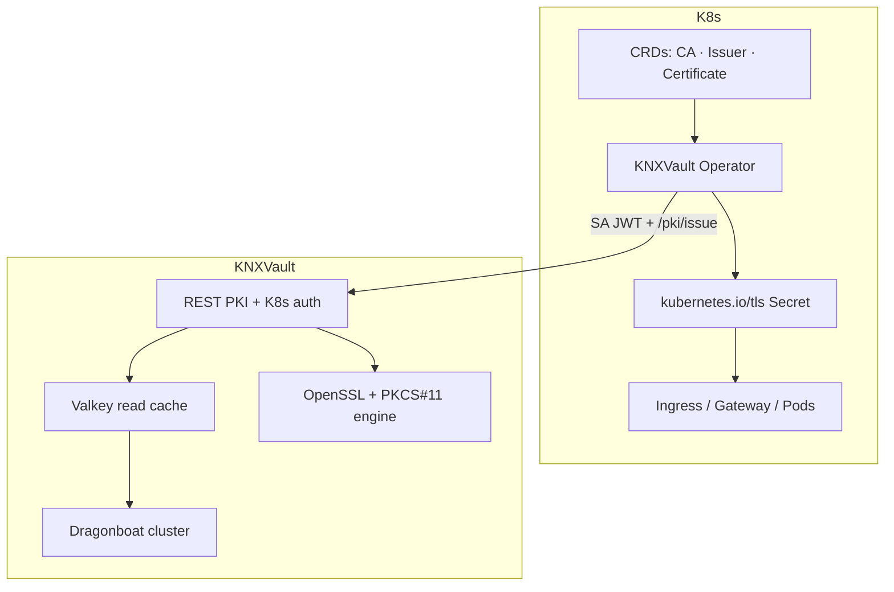

# Phase 4–5 — Ecosystem Design

Design outline for ecosystem integration, hardware security, and operational maturity. Phase 3 (Dragonboat) is complete; Phase 4 hardening is largely shipped. **Current product priority (2026-07):** native **CRD automation** so clusters use **KNXVault instead of cert-manager** for all vault-issued TLS.

Authoritative work items: [`docs/backlog.md`](../backlog.md) **P0 — W30-01…W30-10**.

## Goals

| Goal | Success criteria |
|------|------------------|
| **Avoid cert-manager for KNXVault PKI** | Operator reconciles CA + Certificate CRs → `kubernetes.io/tls` Secrets; kind e2e without cert-manager |
| Kubernetes-native management | Operator reconciles CA, Issuer, Certificate (and optional Ingress shim) |
| Hardware security | HSM-backed CA key operations via OpenSSL engine |
| Multi-workload isolation | Namespace-scoped tenancy with policy boundaries |
| Performance at scale | Valkey read cache for hot paths (Apache 2.0) |
| Transport security | Full mTLS for API and client certificates |
| Disaster recovery | Automated DR failover and runbooks |

## P0 wave — Operator / cert-manager replacement

| ID | Title | Area | Effort | Depends on | Description |
|----|-------|------|--------|------------|-------------|
| **W30-01** | Operator controller-runtime scaffold | k8s | L | W29 | Real manager + Go API types (not sleep stub) |
| **W30-02** | Reconcile `KNXVaultCA` | k8s | L | W30-01 | Root/intermediate → PKI API + Ready status |
| **W30-03** | `KNXVaultCertificate` + TLS Secret | k8s | L | W30-02 | **Primary cert-manager replacement** |
| **W30-04** | Renew lifecycle + metrics | k8s | M | W30-03 | `renewBefore`, revision, Prometheus |
| **W30-05** | Issuer / ClusterIssuer multi-ns | k8s | M | W30-03 | Cross-namespace issue |
| **W30-06** | Ingress/Gateway annotation shim | k8s | M | W30-05 | Optional auto Certificate CRs |
| **W30-07** | kind e2e without cert-manager | ci | M | W30-04 | Gate product claim |
| **W30-08** | Operator-first docs | docs | S | W30-03 | cert-manager = optional legacy |
| **W30-09** | Migration guide from cert-manager | docs | M | W30-05 | CR mapping + dual-run |
| **W30-10** | Optional CertificateRequest (CSR) | k8s | M | W30-03 | CSR sign parity |

### Other Phase 5 waves

| ID | Title | Area | Effort | Depends on | Description |
|----|-------|------|--------|------------|-------------|
| **W31-01** | OpenSSL engine abstraction | crypto | M | W3-03 | Pluggable engine interface (Complete) |
| **W31-02** | PKCS#11 HSM integration | crypto | L | W31-01 | Engine config via env; CA key generation on HSM |
| **W32-01** | Multi-tenancy policy model | auth | M | W13-01 | Namespace-scoped policy isolation and admin boundaries |
| **W32-02** | Tenant-aware API paths | api | M | W32-01 | Optional `X-KNX-Namespace` header enforcement (Complete) |
| **W33-01** | Valkey read cache | storage | M | W26 | Cache public CA certs, CRLs, policy documents |
| **W33-02** | Cache invalidation on write | storage | S | W33-01 | Raft commit hooks invalidate cache entries |
| **W34-01** | Server mTLS | security | M | W5-03 | Require client certificates on secured routes |
| **W34-02** | Client cert issuance API | security | M | W34-01 | PKI role for API consumer certificates |
| **W35-01** | DR automation | ops | L | W27 | Cross-cluster backup replication and failover playbook |
| **W35-02** | Compliance audit packs | docs | M | W14 | Exportable audit bundles for SOC2/PCI evidence |

## Architecture (target state)

**cert-manager:** optional legacy consumer via Vault API shim (W40-02). Not required once W30-03+ ship.

## Non-goals (remain long-term future)

- Terraform provider
- Helm chart (may move earlier if Operator depends on it)
- Full Vault plugin system
- ACME / Let’s Encrypt / DNS-01 (not part of cert-manager replacement)

## Dependencies and risks

| Risk | Mitigation |
|------|------------|
| HSM vendor lock-in | Abstract engine interface; test with SoftHSM |
| Valkey availability | Cache miss falls through to Raft; not required for correctness |
| Operator complexity | Ship CA + Certificate first (W30-02/03); Issuer/Ingress later |
| Secret sprawl in etcd | Document rotation; prefer short TTL + renewBefore |
| mTLS rollout | Opt-in flag before `KNXVAULT_MTLS_REQUIRED=true` default |

## Open questions

1. Should the Operator manage Raft cluster sizing or only application config?
2. Is Valkey a hard dependency or optional sidecar? (Optional — `KNXVAULT_VALKEY_CACHE_URL`; in-memory fallback per node.)
3. Which HSM vendors to certify first (YubiHSM, AWS CloudHSM, Thales)?

## Related documents

- [Backlog](../backlog.md) — authoritative work item tracking
- [HLD](../architecture/hld.md)
- [ADR index](../adr/README.md)