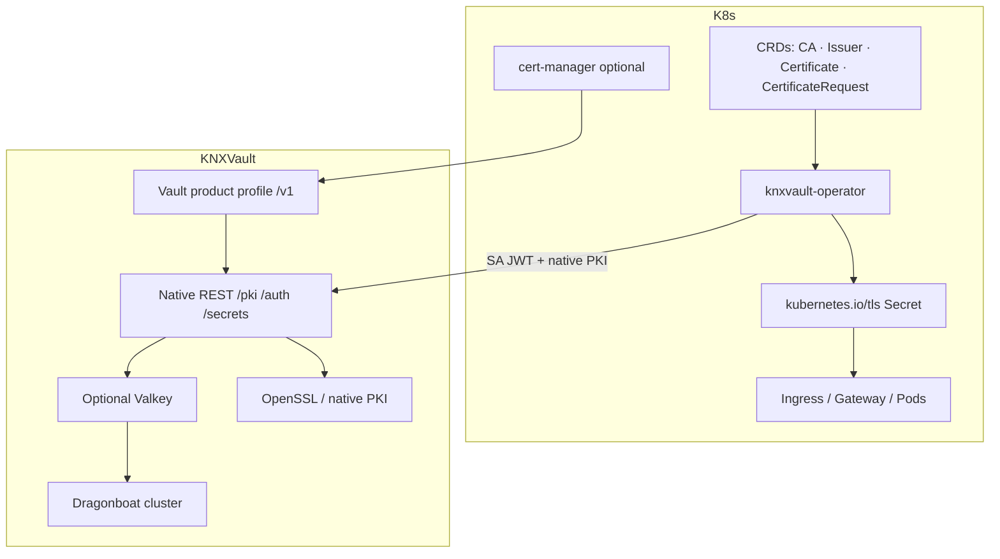

# Phase 4–5 — Ecosystem Design

Design outline for ecosystem integration, hardware security, and operational maturity.

| Field | Value |
|-------|-------|
| **Phase 3 (Dragonboat)** | Complete |
| **Phase 4 hardening** | Largely shipped |
| **P0 W30 operator / cert-manager replacement** | **Complete** (including P0–P2 hardening) |
| **Vault product profile (cert-manager)** | **Shipped** — full issuer profile via façade |
| **Authoritative backlog** | [`docs/backlog.md`](../backlog.md) |

## Goals

| Goal | Status | Success criteria |
|------|--------|------------------|
| **Avoid cert-manager for KNXVault PKI** | **Met** | Operator reconciles CA + Certificate CRs → TLS Secrets; lab e2e without cert-manager |
| Kubernetes-native management | **Met** | Operator + CRDs + optional Ingress shim |
| Product-profile adapters | **Met (Vault)** | `internal/compat/vault` + thin handlers; native services unchanged |
| Hardware security | Open | HSM-backed CA keys via PKCS#11 |
| Multi-workload isolation | Partial | Namespace header / tenant mode shipped; deeper tenancy later |
| Performance at scale | Partial | Optional Valkey read cache |
| Transport security | Partial | Server TLS + Raft mTLS shipped; full client mTLS routes later |
| Disaster recovery | Partial | Backup/restore + runbooks; cross-cluster automation later |

## P0 wave — Operator / cert-manager replacement (**Complete**)

| ID | Title | Status |
|----|-------|--------|
| **W30-01** | Operator controller-runtime scaffold | Done |
| **W30-02** | Reconcile `KNXVaultCA` (root/intermediate) | Done |
| **W30-03** | `KNXVaultCertificate` + TLS Secret | Done |
| **W30-04** | Renew lifecycle + metrics | Done |
| **W30-05** | Issuer / ClusterIssuer multi-ns | Done |
| **W30-06** | Ingress annotation shim | Done (flag) |
| **W30-07** | e2e without cert-manager | Done (lab + kind scripts) |
| **W30-08** | Operator-first docs | Done |
| **W30-09** | Migration guide from cert-manager | Done (`deployments/operator/migration/`) |
| **W30-10** | CertificateRequest / CSR sign | Done (`POST /pki/sign`) |

### Operator hardening (post-W30)

Shipped with product quality bar:

- SA auth preferred (`KNXVAULT_K8S_ROLE`); token bootstrap for lab
- Issuer Ready only when vault CA exists by name
- Certificate status: `caId`, serial; renew prefers `/pki/renew`
- Secret annotations (serial, not-after, ca-id, revision)
- Leader election; reconcile backoff; delivery `Secret` \| `None`
- Package hygiene: `certlogic`, `vaultiface`, CRD validation

Docs: [Replace cert-manager](../operations/pki-replace-cert-manager.md).

## Vault product profile (cert-manager optional path)

**Design principle:** multi-product compatibility uses **internal façades + thin adapters**, not a second PKI stack.

```
Foreign client (cert-manager Vault issuer)
        │
        ▼
  HTTP /v1/*  (handlers/vaultcompat.go)
        │
        ▼
  internal/compat/vault  (pure mapping)
        │
        ▼
  auth.Service + PKIService  (authoritative)
```

| Capability | Path | Status |
|------------|------|--------|
| Health | `GET /v1/sys/health` | Shipped |
| K8s auth | `POST /v1/auth/kubernetes/login` (+ custom mounts) | Shipped |
| AppRole | `POST /v1/auth/approle/login` + `POST /sys/auth/approle` | Shipped |
| Token | `X-Vault-Token` | Shipped |
| Sign | `POST /v1/<mount>/sign/<role>` full body/response | Shipped |
| AWS / cert auth | — | Not planned for this profile |

Recipe: [cert-manager integration](../recipes/cert-manager-integration.md).

## Remaining Phase 5 waves

| ID | Title | Area | Status |
|----|-------|------|--------|
| **W31-01** | OpenSSL engine abstraction | crypto | Complete |
| **W31-02** | PKCS#11 HSM integration | crypto | Not started (stub) |
| **W32-01** | Multi-tenancy policy model | auth | Partial |
| **W32-02** | Tenant-aware API paths | api | Complete |
| **W33-01** | Valkey read cache | storage | Complete (optional) |
| **W33-02** | Cache invalidation on write | storage | Complete |
| **W34-01** | Server / route mTLS | security | Partial |
| **W34-02** | Client cert issuance API | security | Partial (`issue-client-cert`) |
| **W35-01** | DR automation | ops | Partial (backup/restore) |
| **W35-02** | Compliance audit packs | docs | Open |

## Architecture (current product state)



## Non-goals (remain long-term)

- Terraform provider
- Helm chart (may move earlier if packaging demand)
- Full Vault plugin system / complete `/v1` secrets engines
- ACME / Let’s Encrypt / DNS-01 as part of “replace cert-manager”

## Risks

| Risk | Mitigation |
|------|------------|
| HSM vendor lock-in | Abstract engine interface; SoftHSM first |
| Valkey availability | Cache miss falls through to Raft |
| Secret sprawl in etcd | Prefer short TTL + renewBefore; delivery `None` |
| AppRole not Raft-replicated | Re-register after restart; prefer K8s auth for HA |
| mTLS rollout | Opt-in before hard require |

## Open questions

1. Should the Operator manage Raft cluster sizing or only application config?
2. Raft-replicate AppRole definitions?
3. Which HSM vendors to certify first (YubiHSM, AWS CloudHSM, Thales)?

## See also

- [HLD](../architecture/hld.md)
- [System diagrams](../architecture/diagrams.md)
- [Lab full E2E](../engineering/lab-full-e2e.md)
- [Backlog](../backlog.md)
