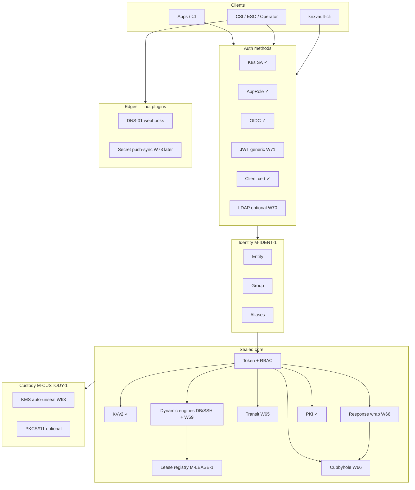
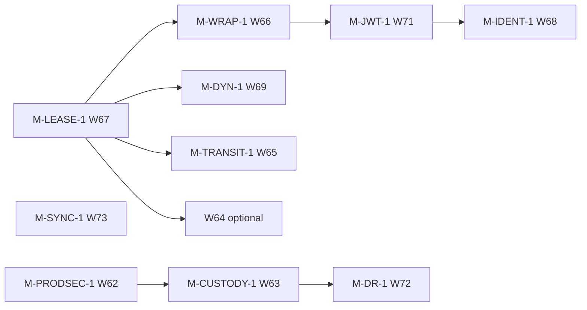

<!--
Copyright Kubenexis Systems Private Limited.
SPDX-License-Identifier: CC-BY-4.0
-->

# Design & plan: Vault-class capability roadmap

| Field | Value |
|-------|-------|
| **Status** | **Partial implementation (2026-07-17):** M-LEASE-1, M-WRAP-1, M-TRANSIT-1, M-IDENT-1, M-SYNC-1 (docs), W70 shipped in code |
| **Date** | 2026-07-17 |
| **Audience** | Architects, engineers, product |
| **Related** | [HLD](../architecture/hld.md) · [Extensibility](../engineering/extensibility.md) · [Production security posture](production-security-posture.md) · [Security posture assessment](../architecture/security-posture-assessment.md) · [Phase 4–5](phase4-ecosystem.md) · [Backlog](../backlog.md) |

---

## 1. Purpose

Define **how knxvault achieves** (or deliberately **substitutes**) a set of HashiCorp Vault–class capabilities, without cloning Vault’s plugin TCB or Enterprise SKU surface.

This document is the **master plan**: goals, non-goals, target architecture, per-capability design, phased milestones, dependencies, and backlog IDs (**W65+** / existing **W63/W64** / **LT-***).

It is **not** a claim that knxvault is or will be “Vault feature-complete.”

---

## 2. Guiding principles

| Principle | Implication |
|-----------|-------------|
| **Small TCB** | No loadable binary plugins; master key stays in sealed core |
| **Outcomes over wire parity** | Prefer native APIs; optional `/v1` façades only where dual-run needs them |
| **Curated engines** | Dynamic secrets grow in-tree on a shared lease framework |
| **Federation first for identity** | SAML/LDAP often via IdP → OIDC, not reimplemented in-core |
| **On-demand cloud** | AWS/Azure/GCP IAM engines & cloud auth are **LT / not near-term** (2026-07-17) |
| **HA ≠ Vault PR** | Raft quorum for CP; DR via backup ship/promote; multi-cluster only if needed |

---

## 3. Capability summary (authoritative)

| Capability | Strategy | Near-term? | Milestone / backlog |
|------------|----------|------------|---------------------|
| **Transit EaaS** | Build transit engine | **Yes** | **M-TRANSIT-1** / **W65** |
| **Response wrapping** | Wrap tokens + unwrap API | **Yes** | **M-WRAP-1** / **W66** |
| **Cubbyhole** | Per-token private KV | **Yes** | **M-WRAP-1** / **W66** (with wrapping) |
| **Identity entity/group** | Identity layer on NHI/roles | **Yes** (after auth harden) | **M-IDENT-1** / **W68** |
| **Lease renew/revoke framework** | Harden/extend existing leases | **Yes** (foundation) | **M-LEASE-1** / **W67** |
| **Broad dynamic engines** | Curated in-tree on lease framework | **Yes** (after leases) | **M-DYN-1** / **W69** |
| **Cloud IAM engines** | Build per cloud on demand | **No** | **LT-02** |
| **Cloud auth methods** | JWT/OIDC federation or build later | **No** | **LT-15** |
| **LDAP** | Build **or** IdP → OIDC | Optional | **W70** or external IdP |
| **SAML** | IdP → OIDC (native only if forced) | Prefer IdP | **LT-13** native / docs for IdP |
| **AppRole** | Already have | **Done** | Maintain / polish |
| **GitHub auth** | OIDC/JWT or small GitHub method | Optional | **W71** (prefer OIDC) |
| **JWT variants** | Generalize OIDC/JWT validator | **Yes** | **M-JWT-1** / **W71** |
| **KMIP** | External KMIP / later façade | **No** | **LT-16** |
| **Transform/tokenization** | Narrow transit or external | Later | **W65** phase B or external |
| **HSM** | PKCS#11 custody | After KMS | **M-CUSTODY-1** / **W63-04** |
| **Auto-unseal cloud KMS** | Build W63-01 | **Yes** (custody track) | **M-CUSTODY-1** / **W63** |
| **Plugin framework** | **Don’t** — webhooks + in-tree | N/A | Extensibility doc |
| **Namespaces multi-tenancy** | Soft tenant + W64 or separate clusters | Product decision | **W64** / ops pattern |
| **Performance replication** | Not Vault PR — Raft scale / multi-cluster | Ops design | **LT-17** |
| **DR replication** | Backup ship + promote (+ optional async) | **Yes** (ops) | **M-DR-1** / **W72** |
| **Sentinel** | OPA / native policy, not Sentinel | Optional | **LT-06** / policy engine |
| **Secret sync** | CSI/ESO today; push-sync later | Partial now | **M-SYNC-1** / **W73** |

---

## 4. Target architecture



**Data path rules**

1. Dynamic credentials always create a **lease**; renew/revoke go through the lease registry.  
2. Wrap stores payload in **cubbyhole** (or one-shot storage) under a single-use token.  
3. Transit keys are envelope-encrypted like CA private keys; never leave the process plaintext except in memory for the op.  
4. Identity is optional for early milestones but login should start emitting `entity_id` when M-IDENT-1 lands.

---

## 5. Dependency graph (milestones)



**Recommended build order (near-term):**

1. **M-LEASE-1** — foundation for everything dynamic + tidy/revoke-on-token-revoke  
2. **M-WRAP-1** — cubbyhole + response wrapping (bootstrap UX)  
3. **M-TRANSIT-1** — Encryption-as-a-Service  
4. **M-JWT-1** — generic JWT (+ GitHub OIDC path)  
5. **M-IDENT-1** — entities/groups  
6. **M-DYN-1** — next curated engines (non-cloud)  
7. **M-CUSTODY-1** — KMS auto-unseal → master wrap → optional HSM (parallel with above after W62)  
8. **M-DR-1** — backup ship/promote automation  
9. **M-SYNC-1** — push sync (after CSI/ESO remain primary)  

**Deferred until demand:** LT-02 cloud IAM engines, LT-15 cloud auth, LT-13 native SAML, LT-16 KMIP, LT-17 performance replication, full Enterprise namespaces.

---

## 6. Per-capability design

### 6.1 Lease renew/revoke framework — **M-LEASE-1 (W67)**

**Today:** DB/SSH leases; Raft ops `lease.*`; leader cleanup; partial sys APIs.

**Target**

| API / behavior | Description |
|----------------|-------------|
| `GET /sys/leases` | List (admin; filter by prefix/type) |
| `GET /sys/leases/:id` | Lookup |
| `POST /sys/leases/renew` | Renew by id + increment |
| `POST /sys/leases/revoke` | Revoke one |
| `POST /sys/leases/revoke-prefix` | Prefix revoke |
| `POST /sys/leases/tidy` | Force expired cleanup |
| Token revoke | Cascade revoke leases owned by token |
| Tenant mode | Lease IDs / metadata scoped (align W64-01) |

**Internal**

```text
LeaseService
  Register(engine, meta, ttl) → lease_id
  Renew / Revoke / ListExpired
  OnTokenRevoke(token_id)
  Engine hooks: OnRevoke(ctx, lease)  // drop DB user, etc.
```

**Acceptance:** All dynamic engines use only this registry; unit + integration tests for renew, expire, cascade revoke; metrics `knxvault_active_leases` accurate after failover.

**Effort:** M–L · **Priority:** P0 foundation

---

### 6.2 Cubbyhole + response wrapping — **M-WRAP-1 (W66)**

**Cubbyhole**

- Paths: `cubbyhole/*` (native); optional Vault façade later.  
- Storage key: `cubbyhole/{token_id}/{path}` envelope-encrypted.  
- ACL: only owning token; no cross-token read.  
- On token revoke: delete all cubbyhole entries for token_id.

**Response wrapping**

| Step | Behavior |
|------|----------|
| Request | Client sends `X-KNX-Wrap-TTL: 60s` (or body flag) on sensitive create/read |
| Server | Writes payload to cubbyhole under **wrapping token**; returns wrap info only |
| Unwrap | `POST /sys/wrapping/unwrap` with wrapping token → single use → delete |
| Lookup | Optional `POST /sys/wrapping/lookup` (metadata, no payload) |

**Security:** wrapping tokens non-renewable; short max TTL (e.g. 1h hard cap); audit `wrapping.wrap` / `wrapping.unwrap`.

**Depends on:** stable token IDs; ideally M-LEASE-1 if wrap uses lease-shaped TTL (can implement wrap without full lease refactor).

**Acceptance:** wrap → unwrap once succeeds; second unwrap fails; TTL expiry; token revoke drops cubbyhole.

**Effort:** M · **Priority:** P0

---

### 6.3 Transit EaaS — **M-TRANSIT-1 (W65)**

**Engine:** `internal/engine/transit`

| Operation | Path (native) |
|-----------|----------------|
| Create/update key | `POST /transit/keys/:name` |
| Read key metadata | `GET /transit/keys/:name` (no raw key) |
| Encrypt | `POST /transit/encrypt/:name` |
| Decrypt | `POST /transit/decrypt/:name` |
| Rewrap | `POST /transit/rewrap/:name` |
| Sign / verify | `POST /transit/sign|verify/:name` |
| HMAC | `POST /transit/hmac/:name` |
| Rotate key | `POST /transit/keys/:name/rotate` |
| Trim versions | admin |

**Crypto:** AES-256-GCM for encrypt; keys as envelope-encrypted blobs in Raft; versioned keys; ciphertext format `v{n}:{base64}`.

**Policy paths:** `transit/encrypt/*`, `transit/decrypt/*`, `transit/keys/*` (sudo for manage).

**Phase B (optional):** transform/tokenization — format-preserving encrypt for limited alphabets **or** document external tokenizer. Do not block Transit v1 on transform.

**Acceptance:** encrypt/decrypt round-trip; rotate + decrypt old versions; RBAC deny decrypt without capability; no plaintext key in API/audit.

**Effort:** L · **Priority:** P0/P1  
**Depends on:** crypto service (exists); policy paths; not blocked on leases (stateless ops) but share engine registry patterns.

---

### 6.4 Identity entity/group — **M-IDENT-1 (W68)**

**Model**

```text
Entity { id, name, metadata, disabled }
Alias  { mount/method, name, entity_id }  // k8s:ns:sa, oidc:sub, approle:role_id
Group  { id, name, member_entity_ids[], policies[] }
```

**Login flow:** resolve alias → entity → merge group policies + role policies → mint token with `entity_id` claim in token metadata.

**APIs:** CRUD entities/groups/aliases under `identity/*` (sudo); list aliases by method.

**Migration:** existing MachineIdentity (NHI) becomes or links to Entity; agent parent_identity_id maps to entity.

**Acceptance:** two auth methods same entity get same policy set via group; disable entity blocks login; audit includes entity_id.

**Depends on:** M-JWT-1 helpful; AppRole/K8s/OIDC already ship.  
**Effort:** L · **Priority:** P1

---

### 6.5 Broad dynamic engines — **M-DYN-1 (W69)**

**Prerequisite:** M-LEASE-1.

**Near-term candidates (non-cloud, Apache-2.0-safe):**

| Engine | Notes |
|--------|-------|
| Redis / Valkey ACL user | Generate user+pass; revoke delete user |
| RabbitMQ | User + vhost perms |
| MongoDB | User + roles |
| Kafka (optional) | If license/API fit |

**Pattern (each engine):**

1. Role CRUD (config without secrets; admin creds in KV path).  
2. `POST .../creds/:role` → generate + **LeaseService.Register**.  
3. `OnRevoke` drops remote principal.  
4. Unit tests with fake client; one integration optional.

**Cloud IAM engines (AWS/Azure/GCP):** **out of near-term scope** — see §6.6 / **LT-02**.

**Acceptance:** at least **one** new engine beyond DB/SSH on shared lease path; docs recipe; license gate.

**Effort:** M per engine · **Priority:** P1 after W67

---

### 6.6 Cloud IAM engines — **LT-02 (not near-term)**

**Decision (2026-07-17):** not required now.

**When revived:** STS AssumeRole / Azure federated creds / GCP SA keys or short-lived tokens; lease revoke deletes access keys; prefer workload OIDC over static cloud keys in knxvault.

**Substitute now:** KV for long-lived cloud keys (discouraged) or external cloud IAM + OIDC from platform.

---

### 6.7 Cloud auth methods — **LT-15 (not near-term)**

**Decision (2026-07-17):** not required now.

**When revived:** AWS IAM signed request auth, Azure MSI token validation, GCP instance identity — map principal → policies.

**Substitute now:** Kubernetes SA, AppRole, OIDC/JWT (including cloud IdP OIDC).

---

### 6.8 LDAP — **W70 optional**

| Option | When |
|--------|------|
| **A. IdP → OIDC** | Preferred — Keycloak/Authentik/AD FS federates LDAP/AD |
| **B. Native LDAP** | Air-gapped directory bind only |

Native design: StartTLS, bind DN, user/group search, group → policy map; no password storage; lockout shared with other auth methods.

**Effort:** L if native · **Priority:** P2

---

### 6.9 SAML — **IdP → OIDC first; LT-13 if forced**

**Default:** document SAML at IdP, OIDC to knxvault (already shipped).

**Native SAML SP (LT-13):** only if customer forbids broker — XL effort; metadata, assertion validate, clock skew, encryption.

---

### 6.10 AppRole — **Done**

Maintain: secret_id TTL, CIDR binds, rotation runbooks. No milestone required unless gaps appear in dual-run cert-manager.

---

### 6.11 GitHub auth + JWT variants — **M-JWT-1 (W71)**

**JWT generic method**

- Role: `bound_issuer`, `bound_audiences`, `jwks_url` or static keys, `claim_mappings`, `bound_claims`, `policies`, `ttl`.  
- `POST /auth/jwt/login` with `role` + `jwt`.  
- Reuse OIDC validation code paths (exp, JWKS refresh, lockout).

**GitHub**

| Path | Preference |
|------|------------|
| GitHub Actions OIDC → JWT role | **Preferred** |
| GitHub personal/org token API | Optional small method |

**Acceptance:** JWT role with bound claims; Actions OIDC recipe; no `skip` verify in production profile.

**Effort:** M · **Priority:** P1

---

### 6.12 KMIP — **LT-16 external / later façade**

**Near-term:** do not implement KMIP server.

**Options later:** external KMIP appliance; or thin façade over Transit for encrypt/decrypt only (still XL + compliance).

**Substitute:** Transit API for app-level EaaS.

---

### 6.13 Transform / tokenization — **Transit phase B or external**

| Path | Notes |
|------|-------|
| Narrow | FPE subset under `transit/transform` after Transit v1 stable |
| External | Dedicated tokenization service; knxvault holds only mapping secrets in KV |

**Do not** block M-TRANSIT-1.

---

### 6.14 HSM + auto-unseal cloud KMS — **M-CUSTODY-1 (W63)**

See [production-security-posture.md](production-security-posture.md) §6 / §8 Phase 1.

| ID | Work |
|----|------|
| **W63-01** | KMS auto-unseal (one cloud first) |
| **W63-02** | KMS-wrapped master key |
| **W63-03** | Custody + break-glass runbook |
| **W63-04** | PKCS#11 CA keys (optional) |
| **W63-05** | Production profile + KMS rules |

**Order:** auto-unseal → master wrap → PKCS#11 offline root.

**HSM use:** root of trust / unwrap; not every Transit op on day one.

---

### 6.15 Plugin framework — **Do not build**

| Instead | Reference |
|---------|-----------|
| In-tree engines | This plan W65–W69 |
| HTTP webhooks | DNS-01 M-DNS01-1; future external issuer |
| Edge binaries | CSI, ESO, operator |

See [extensibility.md](../engineering/extensibility.md) §9.

---

### 6.16 Namespaces / multi-tenancy — **W64 or separate clusters**

| Mode | Description |
|------|-------------|
| **Single trust domain** | Default; one vault per classification (ADR-0005) |
| **Soft multi-tenant** | `TENANT_MODE` + W64 (lease IDs, quotas, audit filter) |
| **Hard isolation** | Separate Raft clusters / installs per tenant |

**Not near-term:** full Vault Enterprise namespace hierarchy (isolated mounts tree, ns admin).

**Product decision:** record via **W64-00** before deep W64 work.

---

### 6.17 Performance replication — **LT-17 not Vault PR**

**Do not** implement Vault Performance Replication semantics.

| Need | Approach |
|------|----------|
| More read capacity | Larger nodes; optional future Raft learners if Dragonboat supports |
| Multi-region active-active | Separate product/design — multi-cluster + app routing |
| Locality | Deploy vault in-region; CSI/ESO local |

Document explicitly in HLD when LT-17 is written.

---

### 6.18 DR replication — **M-DR-1 (W72)**

**Today:** encrypted backup/restore APIs; runbooks; Raft HA (RPO≈0 within quorum).

**Target**

| Piece | Description |
|-------|-------------|
| Scheduled export | Leader job or CronJob → object storage (S3-compatible) |
| Checksums + audit | Signed inventory of backup artifacts |
| Promote runbook | Restore to new/empty cluster; unseal; verify doctor |
| Optional async | Continuous snapshot ship (interval) — not streaming Raft log |

**Acceptance:** documented RPO/RTO for “loss of region”; lab test restore from object storage.

**Effort:** M–L · **Priority:** P1  
**Depends on:** backup API (exists); custody for keys at DR site

---

### 6.19 Sentinel — **OPA / native policy (LT-06)**

**Do not** reimplement Sentinel.

| Path | When |
|------|------|
| Extend native conditions | Most cases (path, IP, time, ns, ABAC attrs) |
| Policy simulate | Already useful for review |
| OPA/Rego sidecar | LT-06 if enterprise policy-as-code required |

---

### 6.20 Secret sync — **M-SYNC-1 (W73)**

| Phase | Work |
|-------|------|
| **Today** | CSI + ESO webhook + inject — **pull** into K8s |
| **W73-A** | Docs/matrix: when to use CSI vs ESO vs wrap |
| **W73-B** | Optional **push** controller: sync KV → AWS SM / Azure KV / GCP SM (on demand; license) |

Push is lower priority than Transit/leases/wrapping; cloud push overlaps LT-02 universe — only if customers need multi-runtime secret fan-out.

---

## 7. Phased plan (calendar-agnostic)

### Phase 0 — Foundations (parallel with M-PRODSEC-1)

| Work | ID | Outcome |
|------|-----|---------|
| Unified lease registry + cascade revoke | W67 | Dynamic engines safe |
| Cubbyhole + wrapping | W66 | Secure bootstrap |
| Production profile (A1 done) | W62 | Fail-closed deploy |

### Phase 1 — Crypto services & auth generalization

| Work | ID | Outcome |
|------|-----|---------|
| Transit v1 | W65 | EaaS |
| Generic JWT + GitHub OIDC recipe | W71 | CI/federation |
| KMS auto-unseal | W63-01 | Custody |

### Phase 2 — Identity & more secrets

| Work | ID | Outcome |
|------|-----|---------|
| Entity/group/alias | W68 | Multi-auth identity |
| First curated dyn engine (non-cloud) | W69 | Prove lease framework |
| Master wrap / HSM path | W63-02–04 | Enterprise custody |
| DR ship/promote | W72 | Cross-site recovery |

### Phase 3 — Optional / on demand

| Work | ID |
|------|-----|
| LDAP native or IdP docs | W70 |
| Soft multi-tenant finish | W64 |
| Secret push-sync | W73-B |
| Transform under transit | W65-B |
| Cloud IAM / cloud auth | LT-02, LT-15 |
| OPA | LT-06 |
| KMIP façade | LT-16 |

---

## 8. Backlog epics (W65–W73)

### M-LEASE-1 — Unified leases (**W67**)

| ID | Pri | Effort | Title | Acceptance |
|----|-----|--------|-------|------------|
| **W67-01** | P0 | M | LeaseService + engine OnRevoke hooks | DB/SSH migrate to hooks |
| **W67-02** | P0 | M | Sys lease list/lookup/renew/revoke/tidy APIs | OpenAPI + tests |
| **W67-03** | P0 | M | Cascade revoke on token revoke | Integration test |
| **W67-04** | P1 | S | Lease metrics + audit actions | Metrics registered |
| **W67-05** | P1 | M | Tenant-safe lease IDs (align W64) | Cross-tenant renew denied when tenant mode |

### M-WRAP-1 — Cubbyhole + wrapping (**W66**)

| ID | Pri | Effort | Title | Acceptance |
|----|-----|--------|-------|------------|
| **W66-01** | P0 | M | Cubbyhole engine + token-scoped storage | Unit tests |
| **W66-02** | P0 | M | Response wrap header/flag + wrapping token mint | Single-use unwrap |
| **W66-03** | P0 | S | `POST /sys/wrapping/unwrap` (+ optional lookup) | OpenAPI |
| **W66-04** | P1 | S | Docs recipe: wrap bootstrap secret | Recipe md |

### M-TRANSIT-1 — Transit (**W65**)

| ID | Pri | Effort | Title | Acceptance |
|----|-----|--------|-------|------------|
| **W65-01** | P0 | L | Transit key store + encrypt/decrypt/rotate | Round-trip tests |
| **W65-02** | P1 | M | Sign/verify/HMAC | Unit tests |
| **W65-03** | P1 | M | API handlers + RBAC paths + OpenAPI | Handlers tested |
| **W65-04** | P1 | S | Docs + recipe | User guide |
| **W65-05** | P2 | L | Transform/tokenization subset **or** external note | Decision in ADR |

### M-JWT-1 — JWT / GitHub (**W71**)

| ID | Pri | Effort | Title | Acceptance |
|----|-----|--------|-------|------------|
| **W71-01** | P1 | M | Generic JWT auth roles + login | Bound claims tests |
| **W71-02** | P1 | S | GitHub Actions OIDC recipe | Docs |
| **W71-03** | P2 | M | Optional GitHub token method | Only if OIDC insufficient |

### M-IDENT-1 — Identity (**W68**)

| ID | Pri | Effort | Title | Acceptance |
|----|-----|--------|-------|------------|
| **W68-01** | P1 | L | Entity/alias/group domain + Raft | CRUD tests |
| **W68-02** | P1 | M | Login attaches entity_id + group policies | Multi-auth test |
| **W68-03** | P1 | M | Wire NHI / agent to entities | Migration note |
| **W68-04** | P1 | S | API + docs | OpenAPI |

### M-DYN-1 — Curated dynamic engines (**W69**)

| ID | Pri | Effort | Title | Acceptance |
|----|-----|--------|-------|------------|
| **W69-01** | P1 | S | Engine contribution checklist (leases, licenses, tests) | Doc in engineering/ |
| **W69-02** | P1 | L | First new engine (e.g. Redis/Valkey) | Creds + revoke + lease |
| **W69-03** | P2 | L | Second engine (optional) | Same bar |

### M-DR-1 — DR (**W72**)

| ID | Pri | Effort | Title | Acceptance |
|----|-----|--------|-------|------------|
| **W72-01** | P1 | M | Backup ship to object storage (CronJob/script) | Lab restore |
| **W72-02** | P1 | M | Promote/restore runbook + RPO/RTO table | Ops doc |
| **W72-03** | P2 | L | Optional continuous async ship | Design + flag |

### M-SYNC-1 — Secret sync (**W73**)

| ID | Pri | Effort | Title | Acceptance |
|----|-----|--------|-------|------------|
| **W73-01** | P1 | S | CSI vs ESO vs wrap decision matrix | Docs |
| **W73-02** | P2 | L | Push-sync controller (optional, multi-cloud later) | One target store PoC |

### Optional LDAP (**W70**)

| ID | Pri | Effort | Title | Acceptance |
|----|-----|--------|-------|------------|
| **W70-01** | P2 | S | IdP → OIDC LDAP/AD guide | Docs |
| **W70-02** | P2 | L | Native LDAP auth (if required) | Bind + group map tests |

### Existing (referenced)

| Milestone | IDs | Role in this plan |
|-----------|-----|-------------------|
| M-PRODSEC-1 | W62 | Safe production defaults |
| M-CUSTODY-1 | W63 | KMS unseal, wrap, HSM |
| Multi-tenant optional | W64 | Soft namespaces |
| M-DNS01-1 | W61 | Webhook extensibility (not plugins) |
| Cloud IAM | LT-02 | Deferred |
| Cloud auth | LT-15 | Deferred |
| Native SAML | LT-13 | Only if forced |
| OPA | LT-06 | Sentinel substitute |
| KMIP | LT-16 | External |
| Perf replication | LT-17 | Not Vault PR |

---

## 9. Security notes (cross-cutting)

| Topic | Rule |
|-------|------|
| Transit keys | Same custody as CA keys; no export of raw key material by default |
| Wrapping | Single-use; short TTL; audit |
| Cubbyhole | Token-bound; wipe on revoke |
| Leases | Fail closed on unknown engine revoke hook |
| JWT | Production profile: no insecure skip; JWKS TLS |
| Plugins | Forbidden as `.so`; webhooks SSRF-validated |
| Multi-tenant | Soft mode incomplete until W64; don’t claim SaaS isolation early |
| Cloud creds | When LT-02 exists: never log secrets; short TTL |

---

## 10. Documentation deliverables per milestone

| Milestone | Docs |
|-----------|------|
| W67 | API reference leases; day-2 lease management |
| W66 | Recipe: response wrapping bootstrap |
| W65 | Transit user guide + threat notes |
| W71 | JWT roles + GitHub Actions |
| W68 | Identity model + admin API |
| W69 | Engine recipes |
| W63 | Custody runbook (existing design) |
| W72 | DR runbook RPO/RTO |
| W73 | Sync matrix |

---

## 11. Success criteria (program level)

Near-term program (**Phases 0–1**) is successful when:

1. Leases are unified with cascade revoke.  
2. Cubbyhole + wrapping work end-to-end.  
3. Transit encrypt/decrypt/rotate is production-usable under RBAC.  
4. JWT generic auth covers CI OIDC (e.g. GitHub Actions).  
5. KMS auto-unseal is available on at least one provider (W63-01).  
6. Cloud IAM/auth remain **explicitly deferred** without blocking the above.  
7. Plugin framework remains **rejected**; extensibility via webhooks/in-tree.

Full table in §3 is **not** a single release commitment.

---

## 12. Related documents

| Doc | Role |
|-----|------|
| [Extensibility](../engineering/extensibility.md) | No plugins; webhooks |
| [Production security posture](production-security-posture.md) | W62/W63/W64 |
| [Policy engine](../architecture/policy-engine.md) | Native policy (Sentinel substitute) |
| [Data models](../architecture/data-models.md) | Lease entity today |
| [Secrets manager checklist](../product/secrets-manager-checklist.md) | Production secrets readiness |
| [Backlog](../backlog.md) | Executable W* / LT* items |

---

## 13. Revision history

| Date | Change |
|------|--------|
| 2026-07-17 | Initial plan/design for Vault-class capability set; cloud IAM/auth deferred |
