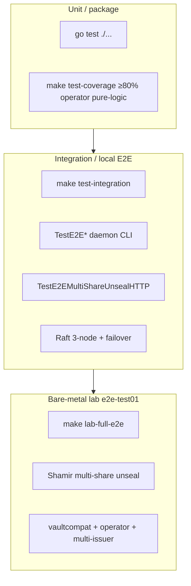

# E2E and lab test map

Canonical map of automated and lab end-to-end coverage for KNXVault (as of **2026-07-16**). Use this when adding features, running pre-release gates, or explaining what “E2E green” means.

## Layers



| Layer | Command | Where | Last known result |
|-------|---------|-------|-------------------|
| Unit | `make test` / `go test ./...` | Build host | PASS (full tree) |
| Coverage gate | `make test-coverage` | Build host | ≥80% operator pure-logic |
| Integration + local E2E | `make test-integration` | Build host | PASS |
| Lab full E2E | `make lab-full-e2e` | `192.168.137.131` via SSH | **53/53 PASS** |

Detailed lab record: [lab-full-e2e.md](lab-full-e2e.md).  
Unit/integration guide: [testing.md](testing.md).

---

## Integration suite (`test/integration/`)

Run: `make test-integration` (builds `bin/knxvault` + `bin/knxvault-cli` first).

| File | Focus |
|------|--------|
| `api_test.go` | HTTP API, in-memory backend |
| `api_raft_test.go` | Single-node Raft API (+ unseal when key set) |
| `raft_test.go` | 3-node linearizable writes |
| `raft_failover_test.go` | Leader stop / survivor writes |
| `seal_test.go` | Seal blocks KV write; full-key unseal |
| `tenant_test.go` | `KNXVAULT_TENANT_MODE` matrix |
| `e2e_daemon_test.go` | Real `serve` + CLI: health, doctor, PKI, KV redaction |
| `e2e_harness_test.go` | Binary build, ephemeral port, **auto-unseal** after `/ready` |
| `w53_e2e_test.go` | W53: multi-share unseal HTTP, tenant PKI, cert login, shamir smoke |

### Local daemon E2E behavior (`TestE2E*`)

1. Build/reuse `bin/knxvault` and `bin/knxvault-cli`.
2. Start `knxvault serve` with master key, root token, Raft off (unless test overrides).
3. Wait for `/health`.
4. **Unseal** with master-key fallback (`unsealDaemon`) — crypto always installs a seal.
5. Drive CLI: health, doctor, PKI root/issue, KV put/get redaction.

OpenSSL must be on `PATH` for PKI steps.

### Multi-share integration (`TestE2EMultiShareUnsealHTTP`)

1. `KNXVAULT_UNSEAL_KEY` + `KNXVAULT_UNSEAL_THRESHOLD=2` → start sealed.
2. Offline `shamir.Split` (admin generate API is seal-guarded).
3. `POST /sys/unseal` `{"share":…}` once → still sealed, progress/threshold.
4. Second share → unsealed.

Also covered: `TestE2ETenantPKIScopesCANames`, `TestE2ECertLoginHTTP`, `TestE2EShamirPackageRoundTrip`.

---

## Lab full E2E (`scripts/lab-full-e2e.sh`)

| | |
|--|--|
| **Host** | `e2e-test01` / `192.168.137.131` (SSH as `root`) |
| **Invoke** | `make lab-full-e2e` or `bash scripts/lab-full-e2e.sh [host]` |
| **Mode** | Single-node Raft host process + `knxvault-operator` against local API |
| **Unseal** | **Shamir multi-share only** on the open path (not full-key) |
| **Result** | **PASS 53/53** (2026-07-16) |

### Bootstrap multi-share sequence

```text
Generate master + unseal keys on lab
  → offline split on build host: go run ./scripts/shamir-split -key $UNSEAL -n 3 -t 2
  → install /opt/knxvault/e2e-share-{1,2,3}.b64
  → serve with KNXVAULT_UNSEAL_THRESHOLD=2  → START_SEALED_OK
  → POST /sys/unseal share1 → progress=1 still sealed  → SHARE1_PROGRESS_OK
  → POST /sys/unseal share2 → unsealed
  → KV write e2e/multishare-open  → MULTISHARE_UNSEAL_OK
  → start operator
  → check sections (core, multishare, vaultcompat, operator, multi-issuer)
```

### Check sections (53)

| Section | Count | Highlights |
|---------|------:|------------|
| **core** | 20 | health/doctor, auth, PKI, KV redaction, metrics/openapi, env CLI |
| **multishare** | 12 | Bootstrap KV after multi-share; re-seal; share1 alone; shares **1+3**; generate-unseal-shares |
| **vaultcompat** | 14 | `/v1/sys/health`, AppRole, PKI sign/CSR, custom mount |
| **operator** | 4 | ClusterIssuer Ready, Certificate serial+caId, TLS Secret |
| **multi-issuer** | 3 | SelfSigned ClusterIssuer + Certificate + Secret |

Offline split tool: [`scripts/shamir-split/main.go`](../../scripts/shamir-split/main.go)  
(same package as server combine: `internal/crypto/shamir`).

### Lab artifacts

| Path | Purpose |
|------|---------|
| `/opt/knxvault/knxvault{,-cli,-operator}` | Binaries under test |
| `/opt/knxvault/e2e-unseal.key` | Full unseal secret (process config; **not** used for HTTP open path) |
| `/opt/knxvault/e2e-share-{1,2,3}.b64` | Custodian shares |
| `/var/lib/knxvault/raft-full` | Raft data dir (wiped each run) |
| `/opt/knxvault/e2e-full-results.txt` | Last transcript |

### Operator-only / historical

| Script / doc | Role |
|--------------|------|
| `scripts/lab-operator-e2e.sh` | Narrower operator CRD smoke |
| [lab-e2e-test01.md](lab-e2e-test01.md) | **Historical** core-only single-key smoke (superseded for full gate by lab-full-e2e) |

---

## Seal / unseal matrix (what each layer proves)

| Scenario | Unit | Integration | Lab full |
|----------|:----:|:-----------:|:--------:|
| Start sealed when unseal key set | ✓ | ✓ | ✓ |
| Full-key `POST /sys/unseal` | ✓ | ✓ | — (not used for open) |
| Shamir t-of-n share submit | ✓ | ✓ | ✓ |
| Offline split (not while sealed) | ✓ | ✓ | ✓ offline tool |
| Admin `generate-unseal-shares` while unsealed | — | — | ✓ |
| Re-seal → multi-share re-open | ✓ app | — | ✓ shares 1+3 |
| Data plane open after multi-share (KV) | — | — | ✓ |
| seal.state never auto-unseals | ✓ | — | (W52 unit) |

Product recipe: [Seal and unseal](../recipes/seal-and-unseal.md).

---

## W53 residual features vs tests

| Feature | Automated coverage |
|---------|-------------------|
| Multi-tenant DB/SSH/PKI | `tenant_scope_*` unit; `TestE2ETenantPKIScopesCANames`; tenant_test |
| Shamir multi-share unseal | shamir unit; seal_share; `TestE2EMultiShareUnsealHTTP`; **lab multishare** |
| AppRole Raft blob | `approle_backend_test`; lab vaultcompat AppRole |
| Client-cert login | `cert_login_test`; `TestE2ECertLoginHTTP` |
| Shared rate/lockout | `shared_lockout_test` (+ Valkey when URL set) |

Audit write-up: [formal-w53-residual-features-2026-07-16.md](../audit/formal-w53-residual-features-2026-07-16.md).

---

## Pre-merge / pre-release checklist

```bash
make test
make test-coverage
make test-integration
# Optional but recommended before release of seal/unseal or Raft paths:
make lab-full-e2e LAB_HOST=192.168.137.131
```

Or full pipeline: `make all` (includes unit + integration; lab is separate SSH host).

## Related

- [Testing guide](testing.md)
- [Lab full E2E record](lab-full-e2e.md)
- [Seal and unseal recipe](../recipes/seal-and-unseal.md)
- [Operator security — key custody](../operations/operator-security.md)
- [Configuration](../installation/configuration.md) — `KNXVAULT_UNSEAL_*`, `KNXVAULT_TENANT_MODE`
