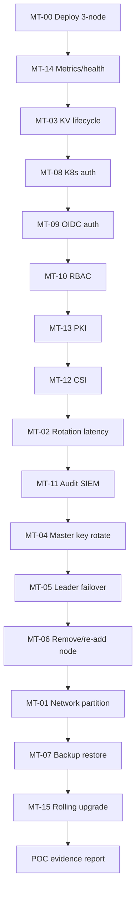

# Manual Testing Strategy

Structured manual test procedures for validating KNXVault behavior beyond automated unit and integration tests. Use these exercises before BFSI POC sign-off, prospect demonstrations, or after infrastructure changes.

| Field | Value |
|-------|-------|
| **Version** | 1.1 |
| **Last updated** | 2026-07-01 |
| **Audience** | QA, SRE, security engineers, prospect evaluators |
| **Complements** | [`testing.md`](testing.md) (automated), [`../operations/runbooks/raft-failover.md`](../operations/runbooks/raft-failover.md) |

---

## 1. Purpose and scope

Automated tests (`make test`, `make test-integration`, `test/chaos/raft-pod-kill.sh`) prove correctness on a developer machine. **Manual tests** validate production-like scenarios:

- 3-node HA deployment and rolling upgrades
- KV versioning, master key rotation, backup/restore
- Raft failover, membership changes, and network partitions
- Kubernetes and OIDC authentication, RBAC enforcement
- CSI secret delivery, PKI lifecycle, audit SIEM forwarding
- Metrics, health endpoints, and operator observability

Each test defines **procedure**, **pass/fail criteria**, and **evidence to capture**.

---

## 2. Test environment matrix

| Profile | When to use | Minimum topology |
|---------|-------------|------------------|
| **A — Local multi-process** | Fast iteration | 3× `knxvault serve` with distinct `KNXVAULT_RAFT_NODE_ID` |
| **B — Kubernetes StatefulSet** | **Recommended for POC demo** | 3-node Raft per [`deploy/kubernetes.md`](../deploy/kubernetes.md) |
| **C — kind + CSI** | CSI and rotation tests | Profile B + [CSI install](../deploy/csi-install.md) |

### Prerequisites

- [ ] `KNXVAULT_MASTER_KEY` and bootstrap token configured; root token rotated after initial policies
- [ ] `KNXVAULT_RAFT_ENABLED=true`, 3 voting members, PVCs bound
- [ ] `knxvault-cli`, `kubectl`, `curl`, `jq` available
- [ ] Prometheus (optional) scraping `/metrics`
- [ ] Pre-test backup: `knxvault-cli backup create -o pre-poc-backup.json`

### Evidence template

| Field | Example |
|-------|---------|
| Test ID | MT-05 |
| Date / operator | 2026-07-01 / alice |
| Profile | B |
| KNXVault version | `knxvault-cli version` |
| Pass / Fail | Pass |
| Attachments | logs, metrics scrape, audit export |

---

## 3. Test catalog (POC demonstration pack)

| ID | Name | Priority |
|----|------|----------|
| **MT-00** | [Deploy 3-node cluster](#mt-00-deploy-3-node-cluster) | P0 |
| **MT-01** | [Network disruption & Raft recovery](#mt-01-network-disruption--raft-recovery) | P0 |
| **MT-02** | [Secret rotation latency (no pod restart)](#mt-02-secret-rotation-latency-without-workload-restart) | P0 |
| **MT-03** | [KV store, update, version, retrieve](#mt-03-kv-store-update-version-retrieve) | P0 |
| **MT-04** | [Master key rotation without data loss](#mt-04-master-key-rotation-without-data-loss) | P0 |
| **MT-05** | [Leader node kill & automatic failover](#mt-05-leader-node-kill--automatic-failover) | P0 |
| **MT-06** | [Remove and re-add Raft node](#mt-06-remove-and-re-add-raft-node) | P0 |
| **MT-07** | [Backup and restore](#mt-07-backup-and-restore) | P0 |
| **MT-08** | [Kubernetes ServiceAccount authentication](#mt-08-kubernetes-serviceaccount-authentication) | P0 |
| **MT-09** | [OIDC authentication](#mt-09-oidc-authentication) | P0 |
| **MT-10** | [RBAC policy enforcement](#mt-10-rbac-policy-enforcement) | P0 |
| **MT-11** | [Audit export & SIEM forwarding](#mt-11-audit-export--siem-forwarding) | P0 |
| **MT-12** | [Secrets Store CSI Driver integration](#mt-12-secrets-store-csi-driver-integration) | P0 |
| **MT-13** | [Certificate issuance and revocation](#mt-13-certificate-issuance-and-revocation) | P0 |
| **MT-14** | [Prometheus metrics & health endpoints](#mt-14-prometheus-metrics--health-endpoints) | P0 |
| **MT-15** | [Rolling upgrade without downtime](#mt-15-rolling-upgrade-without-downtime) | P0 |

---

## MT-00: Deploy 3-node cluster

### Objective

Deploy a production-like 3-node KNXVault Raft cluster and confirm quorum health.

### Procedure

```bash
# Build and push image (adjust registry/tag)
make docker-build
# Update deployments/k8s/statefulset.yaml image:

kubectl apply -f deployments/k8s/namespace.yaml
kubectl apply -f deployments/k8s/serviceaccount.yaml
kubectl apply -f deployments/k8s/role.yaml
kubectl apply -f deployments/k8s/rolebinding.yaml
kubectl apply -f deployments/k8s/configmap.yaml
kubectl apply -f deployments/k8s/secret.yaml
kubectl apply -f deployments/k8s/service-raft.yaml
kubectl apply -f deployments/k8s/statefulset.yaml
kubectl apply -f deployments/k8s/service.yaml
kubectl apply -f deployments/k8s/pdb.yaml
kubectl apply -f deployments/k8s/networkpolicy.yaml   # optional

kubectl -n knxvault wait --for=condition=ready pod -l app.kubernetes.io/name=knxvault --timeout=600s
```

```bash
export KNXVAULT_ADDR=http://knxvault.knxvault.svc.cluster.local:8200
export KNXVAULT_TOKEN=<bootstrap-token>

knxvault-cli doctor
knxvault-cli health
curl -s "$KNXVAULT_ADDR/ready" | jq .
```

Verify all three pods: `raft_ready: true`, exactly one reports `leader: true` in `/ready` (or via metrics).

### Pass criteria

| # | Criterion |
|---|-----------|
| 1 | 3 pods Running; PVCs Bound |
| 2 | `/ready` returns 200 on all replicas |
| 3 | Exactly one `knxvault_raft_leader = 1` across cluster |
| 4 | `knxvault-cli doctor` passes |

---

## MT-01: Network disruption & Raft recovery

### Objective

Store secrets, break network connectivity between Raft peers, observe recovery (no auto-seal), and verify data after heal.

### Expected baseline

| Behavior | KNXVault |
|----------|----------|
| Auto-seal on network loss | **No** — seal is operator-initiated only |
| Minority partition writes | Rejected (no quorum) |
| Majority partition writes | Continue |
| Recovery after heal | Automatic Raft catch-up |

### Procedure (summary)

1. **Baseline** — `kv put mt01/secret-a`, capture leader and `knxvault_raft_commit_index` on all nodes.
2. **Partition** — Isolate one replica (NetworkPolicy deny-all on `knxvault-2`, or block Raft port 63001).
3. **Observe** (15–30 min) — Majority accepts writes; minority does not; vault stays **unsealed**.
4. **Heal** — Remove isolation policy.
5. **Verify** — All pods ready; secrets intact; commit index converged.

Detailed steps: see [MT-01 phases](#mt-01-detail-network-partition) in appendix below, or original partition tables in prior revisions — use NetworkPolicy example:

```yaml
# mt01-isolate-knxvault-2.yaml — deny all traffic to/from knxvault-2
apiVersion: networking.k8s.io/v1
kind: NetworkPolicy
metadata:
  name: mt01-isolate-knxvault-2
  namespace: knxvault
spec:
  podSelector:
    matchLabels:
      statefulset.kubernetes.io/pod-name: knxvault-2
  policyTypes: [Ingress, Egress]
```

### Pass criteria

| # | Criterion |
|---|-----------|
| 1 | No auto-seal during partition |
| 2 | Majority writes succeed; minority writes fail |
| 3 | Full recovery within 5 min of heal; data intact |

---

## MT-02: Secret rotation latency (without workload restart)

### Objective

Measure time from KV rotation to updated secret visible in a running pod **without** restart.

### Procedure

1. Install CSI with `enableSecretRotation=true` ([`csi-install.md`](../deploy/csi-install.md)).
2. Deploy `SecretProviderClass` with `rotationPollInterval: 30s` and a log-loop pod (see [MT-02 setup](#mt-02-detail-csi-rotation-pod) in appendix).
3. `kv put mt02/app-cred value=version-1` → confirm in pod logs.
4. `kv put mt02/app-cred value=version-2` at **T_rotate**.
5. Record **T_visible** when logs show `version-2`. Latency = `T_visible - T_rotate`.

### Pass criteria

| # | Criterion |
|---|-----------|
| 1 | New value visible without pod restart |
| 2 | Median latency ≤ `rotationPollInterval` + 15s |

---

## MT-03: KV store, update, version, retrieve

### Objective

Demonstrate KVv2 lifecycle: create, update (new version), read specific version, metadata, list, soft delete, destroy.

### Procedure

```bash
export KNXVAULT_ADDR=http://knxvault.knxvault.svc.cluster.local:8200
export KNXVAULT_TOKEN=<admin-token>

# Create v1
curl -s -X POST "$KNXVAULT_ADDR/secrets/kv/demo/app/config" \
  -H "Authorization: Bearer $KNXVAULT_TOKEN" \
  -H 'Content-Type: application/json' \
  -d '{"data":{"password":"v1-secret","user":"app"}}' | jq .

# Update → v2
curl -s -X POST "$KNXVAULT_ADDR/secrets/kv/demo/app/config" \
  -H "Authorization: Bearer $KNXVAULT_TOKEN" \
  -H 'Content-Type: application/json' \
  -d '{"data":{"password":"v2-secret","user":"app"}}' | jq .

# Read latest
curl -s "$KNXVAULT_ADDR/secrets/kv/demo/app/config" \
  -H "Authorization: Bearer $KNXVAULT_TOKEN" | jq .

# Read version 1
curl -s "$KNXVAULT_ADDR/secrets/kv/demo/app/config?version=1" \
  -H "Authorization: Bearer $KNXVAULT_TOKEN" | jq .

# List versions
curl -s "$KNXVAULT_ADDR/secrets/kv/demo/app/config/versions" \
  -H "Authorization: Bearer $KNXVAULT_TOKEN" | jq .

# Metadata
curl -s "$KNXVAULT_ADDR/secrets/kv/demo/app/config/metadata" \
  -H "Authorization: Bearer $KNXVAULT_TOKEN" | jq .

# CAS write (optional)
curl -s -X POST "$KNXVAULT_ADDR/secrets/kv/demo/app/config" \
  -H "Authorization: Bearer $KNXVAULT_TOKEN" \
  -H 'Content-Type: application/json' \
  -d '{"data":{"password":"v3-cas"},"options":{"cas_version":2}}' | jq .

# List paths under prefix
curl -s "$KNXVAULT_ADDR/secrets/kv/demo?list=true&prefix=demo" \
  -H "Authorization: Bearer $KNXVAULT_TOKEN" | jq .

# Soft delete (latest)
curl -s -X DELETE "$KNXVAULT_ADDR/secrets/kv/demo/app/config" \
  -H "Authorization: Bearer $KNXVAULT_TOKEN" -w "\n%{http_code}\n"

# Destroy version 1 permanently
curl -s -X DELETE "$KNXVAULT_ADDR/secrets/kv/demo/app/config?version=1" \
  -H "Authorization: Bearer $KNXVAULT_TOKEN" -w "\n%{http_code}\n"
```

CLI equivalents: `knxvault-cli kv put`, `knxvault-cli kv get --show-secrets`.

### Pass criteria

| # | Criterion |
|---|-----------|
| 1 | Version increments on each PUT; v1 readable after v2 created |
| 2 | `?version=1` returns v1 payload; latest returns v2 |
| 3 | `/versions` lists all versions with `destroyed` flags |
| 4 | CAS with wrong version rejected |
| 5 | Destroy removes version; audit entries for read/write/delete |

---

## MT-04: Master key rotation without data loss

### Objective

Rotate the envelope master key and verify all existing secrets remain readable.

### Procedure

```bash
# 1. Seed secrets before rotation
knxvault-cli kv put mt04/before-rotate value=keep-me
knxvault-cli kv get mt04/before-rotate --show-secrets

# 2. Record active key version (from metrics or API if exposed)
curl -s "$KNXVAULT_ADDR/metrics" | grep knxvault_master_key_version || true

# 3. Generate new 32-byte key
NEW_KEY=$(openssl rand -base64 32)
knxvault-cli sys rotate-master-key --key "$NEW_KEY"
# Or: curl -X POST $KNXVAULT_ADDR/sys/rotate-master-key -d '{"key":"..."}'

# 4. Wait for leader background re-encrypt job (check leader pod logs)
kubectl -n knxvault logs knxvault-<leader> | grep -i reencrypt || true
sleep 30

# 5. Read pre-rotation secret on ALL replicas (via port-forward each pod)
knxvault-cli kv get mt04/before-rotate --show-secrets

# 6. Write and read new secret after rotation
knxvault-cli kv put mt04/after-rotate value=post-rotation
knxvault-cli kv get mt04/after-rotate --show-secrets

# 7. Backup after rotation
knxvault-cli backup create -o post-rotate-backup.json
```

Store `NEW_KEY` securely; old key may still decrypt legacy DEKs until re-encrypt completes.

### Pass criteria

| # | Criterion |
|---|-----------|
| 1 | `rotate-master-key` succeeds |
| 2 | Secrets written **before** rotation readable after rotation |
| 3 | New writes succeed on all cluster members |
| 4 | Backup/restore of rotated state succeeds (cross-check with MT-07) |
| 5 | No plaintext secrets in logs |

---

## MT-05: Leader node kill & automatic failover

### Objective

Kill the current Raft leader and verify automatic election, continued availability, and data integrity.

### Procedure

```bash
# Identify leader
LEADER=$(kubectl -n knxvault get pods -l app.kubernetes.io/name=knxvault -o json \
  | jq -r '.items[] | select(.metadata.annotations.leader // "")' )  # or use metrics
# Simpler: check /ready on each pod
for i in 0 1 2; do
  echo -n "knxvault-$i: "
  kubectl -n knxvault exec knxvault-$i -- wget -qO- http://localhost:8200/ready 2>/dev/null | jq -c '{leader,raft_ready}'
done

# Background write loop (separate terminal)
while true; do
  knxvault-cli kv put mt05/failover-test value=$(date +%s) 2>&1 | tail -1
  sleep 2
done

# Kill leader pod
kubectl -n knxvault delete pod <leader-pod-name> --wait=false

# Observe failover window (typically 10–30s)
watch -n2 'curl -s $KNXVAULT_ADDR/ready | jq .'

# After replacement pod Ready:
for i in 0 1 2; do
  kubectl -n knxvault exec knxvault-$i -- wget -qO- http://localhost:8200/metrics 2>/dev/null \
    | grep knxvault_raft_leader
done

knxvault-cli kv get mt05/failover-test --show-secrets
```

Alternative: `./test/chaos/raft-pod-kill.sh`

### Pass criteria

| # | Criterion |
|---|-----------|
| 1 | New leader elected within 60s |
| 2 | Writes resume after brief gap (document max gap) |
| 3 | No data corruption; latest KV value readable |
| 4 | Exactly one leader after recovery |

---

## MT-06: Remove and re-add Raft node

### Objective

Remove a voting member and add it back without cluster corruption.

### Procedure

> Use a **replacement** scenario on a 3-node cluster: remove node ID **3**, replace `knxvault-2` pod with fresh Raft data, rejoin.

```bash
# 1. Confirm quorum
curl -s "$KNXVAULT_ADDR/ready" | jq .

# 2. Remove node 3 (adjust ID to match your pod knxvault-2 → node 3)
curl -s -X POST "$KNXVAULT_ADDR/sys/raft/remove-node" \
  -H "Authorization: Bearer $KNXVAULT_TOKEN" \
  -H 'Content-Type: application/json' \
  -d '{"node_id":3}'

# 3. Scale down or delete knxvault-2; wipe its PVC OR use fresh empty data dir
kubectl -n knxvault delete pod knxvault-2 --wait=true
# Optional: delete PVC for knxvault-2 if testing full replacement (destructive)

# 4. Re-create pod with KNXVAULT_RAFT_JOIN=true and updated member list in ConfigMap
#    See docs/operations/runbooks/scaling.md

# 5. Add node back
curl -s -X POST "$KNXVAULT_ADDR/sys/raft/add-node" \
  -H "Authorization: Bearer $KNXVAULT_TOKEN" \
  -H 'Content-Type: application/json' \
  -d '{"node_id":3,"address":"knxvault-2.knxvault-headless.knxvault.svc.cluster.local:63001"}'

# 6. Verify write/read on all members
knxvault-cli kv put mt06/membership value=rejoined
knxvault-cli kv get mt06/membership --show-secrets
```

CLI: `knxvault-cli sys raft-remove-node`, `knxvault-cli sys raft-add-node`.

### Pass criteria

| # | Criterion |
|---|-----------|
| 1 | `remove-node` succeeds with quorum intact |
| 2 | Cluster remains writable with 2/3 during removal |
| 3 | `add-node` succeeds; new member catches up |
| 4 | 3-node quorum restored; KV round-trip on all pods |

---

## MT-07: Backup and restore

### Objective

Create an encrypted backup and restore vault state without data loss.

### Procedure

```bash
# Seed data
knxvault-cli kv put mt07/restore-test value=backup-me
knxvault-cli sys policies put mt07-reader -f - <<'EOF'
{"effect":"allow","resources":["secrets/kv/mt07/*"],"actions":["read"]}
EOF

# Backup
knxvault-cli backup create -o mt07-backup.json

# Optional: destructive test on non-prod — deploy fresh single-node or staging namespace
# Restore (requires same KNXVAULT_MASTER_KEY)
knxvault-cli backup restore -f mt07-backup.json

# Verify
knxvault-cli kv get mt07/restore-test --show-secrets
curl -s -X POST "$KNXVAULT_ADDR/audit/verify" \
  -H "Authorization: Bearer $KNXVAULT_TOKEN" \
  -H 'Content-Type: application/json' \
  -d @<(curl -s "$KNXVAULT_ADDR/audit/export" -H "Authorization: Bearer $KNXVAULT_TOKEN")
```

### Pass criteria

| # | Criterion |
|---|-----------|
| 1 | Backup file created; non-empty; encrypted payload |
| 2 | Restore completes without error |
| 3 | KV, policies, and audit chain verify post-restore |
| 4 | `ValidateSnapshot` path rejects tampered backup (optional negative test) |

---

## MT-08: Kubernetes ServiceAccount authentication

### Objective

Authenticate using a pod ServiceAccount JWT (TokenReview) and obtain a scoped client token.

### Procedure

```bash
# 1. Create SA and role binding in KNXVault
curl -s -X PUT "$KNXVAULT_ADDR/sys/roles/demo-app" \
  -H "Authorization: Bearer $KNXVAULT_TOKEN" \
  -H 'Content-Type: application/json' \
  -d '{
    "policies": ["secrets-reader"],
    "bound_service_account_names": ["demo-app"],
    "bound_service_account_namespaces": ["default"]
  }'

# 2. Deploy test pod with SA demo-app
kubectl apply -f - <<'EOF'
apiVersion: v1
kind: ServiceAccount
metadata:
  name: demo-app
  namespace: default
---
apiVersion: v1
kind: Pod
metadata:
  name: mt08-auth-test
  namespace: default
spec:
  serviceAccountName: demo-app
  containers:
    - name: shell
      image: curlimages/curl:8.5.0
      command: ["sleep", "3600"]
EOF

# 3. Login from pod
kubectl exec mt08-auth-test -- sh -c '
  JWT=$(cat /var/run/secrets/kubernetes.io/serviceaccount/token)
  curl -s -X POST "$KNXVAULT_ADDR/auth/kubernetes" \
    -H "Content-Type: application/json" \
    -d "{\"role\":\"demo-app\",\"jwt\":\"$JWT\"}"
'

# 4. Use returned client_token to read allowed path; verify 403 on admin path
```

Requires KNXVault in-cluster with TokenReview RBAC (`KNXVAULT_K8S_AUTH_INSECURE=false`).

### Pass criteria

| # | Criterion |
|---|-----------|
| 1 | Matching SA → `200` + client token |
| 2 | Wrong SA or namespace → `403` |
| 3 | Token can read secrets per policy; denied on `sys/*` |
| 4 | Audit records login (when W43-01 shipped) or appears in export |

---

## MT-09: OIDC authentication

### Objective

Authenticate via `POST /auth/oidc/:role` using a corporate/IdP JWT.

### Procedure

```bash
# 1. Configure role with OIDC (API: backlog W43-06 — use domain/Raft or API when available)
curl -s -X PUT "$KNXVAULT_ADDR/sys/roles/oidc-demo" \
  -H "Authorization: Bearer $KNXVAULT_TOKEN" \
  -H 'Content-Type: application/json' \
  -d '{
    "policies": ["secrets-reader"],
    "auth_method": "oidc",
    "oidc": {
      "issuer": "https://idp.example.com/realms/demo",
      "audience": "knxvault",
      "jwks_url": "https://idp.example.com/realms/demo/protocol/openid-connect/certs",
      "max_ttl_seconds": 3600
    }
  }'
# If oidc block not accepted by API yet, configure via documented workaround / backlog W43-06.

# 2. Obtain IdP JWT (browser flow, client credentials, or test IdP)
export OIDC_JWT=<idp-access-token>

# 3. Login
curl -s -X POST "$KNXVAULT_ADDR/auth/oidc/oidc-demo" \
  -H 'Content-Type: application/json' \
  -d "{\"jwt\":\"$OIDC_JWT\"}" | jq .

# 4. Use client_token for KV read
export KNXVAULT_TOKEN=<client_token_from_response>
knxvault-cli kv get demo/oidc-test --show-secrets
```

Negative tests: expired JWT, wrong `aud`, wrong `iss` → `401`/`403`.

### Pass criteria

| # | Criterion |
|---|-----------|
| 1 | Valid OIDC JWT mints client token |
| 2 | Invalid/expired/wrong-audience JWT rejected |
| 3 | Token TTL ≤ role `max_ttl_seconds` |
| 4 | NHI record created (`GET /sys/machine-identities`) |

---

## MT-10: RBAC policy enforcement

### Objective

Demonstrate allow and deny policies; verify least-privilege enforcement.

### Procedure

```bash
# Reader policy
curl -s -X PUT "$KNXVAULT_ADDR/sys/policies/mt10-reader" \
  -H "Authorization: Bearer $KNXVAULT_TOKEN" \
  -H 'Content-Type: application/json' \
  -d '{"effect":"allow","resources":["secrets/kv/mt10/*"],"actions":["read"]}'

# Deny policy (explicit deny — backlog W41-03 for cross-policy precedence tests)
curl -s -X PUT "$KNXVAULT_ADDR/sys/policies/mt10-deny-admin" \
  -H "Authorization: Bearer $KNXVAULT_TOKEN" \
  -H 'Content-Type: application/json' \
  -d '{"effect":"deny","resources":["sys/*"],"actions":["*"]}'

# Role + token
curl -s -X PUT "$KNXVAULT_ADDR/sys/roles/mt10-tester" \
  -H "Authorization: Bearer $KNXVAULT_TOKEN" \
  -H 'Content-Type: application/json' \
  -d '{"policies":["mt10-reader","mt10-deny-admin"]}'

curl -s -X POST "$KNXVAULT_ADDR/auth/token/create" \
  -H "Authorization: Bearer $KNXVAULT_TOKEN" \
  -H 'Content-Type: application/json' \
  -d '{"role":"mt10-tester","ttl":"1h"}' | jq .

export SCOPED_TOKEN=<client_token>

# Allowed
curl -s -o /dev/null -w "%{http_code}" "$KNXVAULT_ADDR/secrets/kv/mt10/app" \
  -H "Authorization: Bearer $SCOPED_TOKEN"
# Expect 200 or 404 (not 403)

# Denied
curl -s -o /dev/null -w "%{http_code}" -X POST "$KNXVAULT_ADDR/sys/policies" \
  -H "Authorization: Bearer $SCOPED_TOKEN"
# Expect 403

# Denied write
curl -s -o /dev/null -w "%{http_code}" -X POST "$KNXVAULT_ADDR/secrets/kv/mt10/app" \
  -H "Authorization: Bearer $SCOPED_TOKEN" -H 'Content-Type: application/json' \
  -d '{"data":{"x":"1"}}'
# Expect 403
```

> **Note:** Path-level ACLs (e.g. `secrets/kv/team-a/*` only) require **W41-01**. Current enforcement is route-coarse (`secrets/kv` + action).

### Pass criteria

| # | Criterion |
|---|-----------|
| 1 | Reader token can GET KV |
| 2 | Reader token cannot POST KV or sys admin APIs |
| 3 | Deny policy blocks `sys/*` even with other allows |
| 4 | `403` responses include request ID |

---

## MT-11: Audit export & SIEM forwarding

### Objective

Export tamper-evident audit logs and forward to a SIEM-compatible HTTP sink.

### Procedure

```bash
# 1. Configure signing key and forward URL on KNXVault deployment
# KNXVAULT_AUDIT_SIGNING_KEY=<random>
# KNXVAULT_AUDIT_FORWARD_URL=http://siem-collector:8080/audit

# 2. Generate auditable events (KV read/write, auth, PKI)
knxvault-cli kv put mt11/audited value=test
knxvault-cli kv get mt11/audited --show-secrets

# 3. Export bundle
curl -s "$KNXVAULT_ADDR/audit/export" \
  -H "Authorization: Bearer $KNXVAULT_TOKEN" | jq . > mt11-audit-export.json

# 4. Verify hash chain + signatures
curl -s -X POST "$KNXVAULT_ADDR/audit/verify" \
  -H "Authorization: Bearer $KNXVAULT_TOKEN" \
  -H 'Content-Type: application/json' \
  -d @mt11-audit-export.json | jq .

# 5. Confirm SIEM sink received JSON lines (Splunk HEC, Loki, or mock server)
# Each POST body matches audit.Entry schema per docs/observability/audit-forwarding.md
```

SIEM compatibility: JSON over HTTP (Splunk HEC, Elastic ingest, Loki via Alloy/Promtail).

### Pass criteria

| # | Criterion |
|---|-----------|
| 1 | Export returns entries with `hash` and `signature` |
| 2 | `audit/verify` returns success on unmodified export |
| 3 | Tampered entry fails verify |
| 4 | Forwarder receives events within 5s of API calls |
| 5 | Entries include `actor`, `action`, `resource`, `status`, `timestamp` |

---

## MT-12: Secrets Store CSI Driver integration

### Objective

Mount KV secrets into a pod via the KNXVault CSI provider without static vault tokens in the workload.

### Procedure

```bash
# Install driver + provider (Profile C)
helm install csi secrets-store-csi-driver/secrets-store-csi-driver \
  --namespace kube-system --set syncSecret.enabled=true --set enableSecretRotation=true
kubectl apply -f deployments/csi/rbac.yaml
kubectl apply -f deployments/csi/k8s-provider.yaml
kubectl apply -f deployments/csi/secretproviderclass-example.yaml
kubectl apply -f deployments/csi/pod-example.yaml

# Verify mount
kubectl wait --for=condition=ready pod/knxvault-csi-demo --timeout=120s
kubectl exec knxvault-csi-demo -- cat /mnt/secrets/db.env

# Provider logs — TokenReview per mount
kubectl logs -n knxvault -l app.kubernetes.io/name=knxvault-csi-provider --tail=50

# Optional: scripts/test-csi-kind.sh for automated smoke
```

### Pass criteria

| # | Criterion |
|---|-----------|
| 1 | Pod reaches Ready; file exists at mount path |
| 2 | Content matches KV secret in vault |
| 3 | Wrong SA → mount fails (auth test) |
| 4 | `csi.mount` audit recorded when mount-audit enabled |

---

## MT-13: Certificate issuance and revocation

### Objective

Issue a leaf certificate from KNXVault PKI and revoke it; verify CRL reflects revocation.

### Procedure

```bash
# 1. Create root CA (if not exists)
curl -s -X POST "$KNXVAULT_ADDR/pki/root" \
  -H "Authorization: Bearer $KNXVAULT_TOKEN" \
  -H 'Content-Type: application/json' \
  -d '{"name":"mt13-root","common_name":"MT13 Root CA","ttl":"8760h"}' | jq .

export CA_ID=<ca_id>

# 2. Issue leaf cert
curl -s -X POST "$KNXVAULT_ADDR/pki/issue" \
  -H "Authorization: Bearer $KNXVAULT_TOKEN" \
  -H 'Content-Type: application/json' \
  -d "{
    \"ca_id\": \"$CA_ID\",
    \"common_name\": \"mt13.example.com\",
    \"dns_sans\": [\"mt13.example.com\"],
    \"ttl\": \"24h\"
  }" | jq . > mt13-cert.json

SERIAL=$(jq -r .serial mt13-cert.json)

# 3. Fetch CRL — cert present as good (not revoked)
curl -s "$KNXVAULT_ADDR/pki/crl/$CA_ID" -H "Authorization: Bearer $KNXVAULT_TOKEN" | openssl crl -inform PEM -noout -text | grep -F "$SERIAL" || echo "not yet revoked"

# 4. Revoke
curl -s -X POST "$KNXVAULT_ADDR/pki/revoke" \
  -H "Authorization: Bearer $KNXVAULT_TOKEN" \
  -H 'Content-Type: application/json' \
  -d "{\"ca_id\":\"$CA_ID\",\"serial\":\"$SERIAL\",\"reason\":\"test\"}"

# 5. CRL shows revoked serial; OCSP optional
curl -s "$KNXVAULT_ADDR/pki/crl/$CA_ID" -H "Authorization: Bearer $KNXVAULT_TOKEN" | openssl crl -inform PEM -noout -text | grep -F "$SERIAL"
```

CLI: `knxvault-cli pki` subcommands where available.

### Pass criteria

| # | Criterion |
|---|-----------|
| 1 | Issue returns `cert_pem`, `key_pem`, `serial` |
| 2 | Revoke succeeds |
| 3 | CRL includes revoked serial |
| 4 | Audit entries for issue and revoke |

---

## MT-14: Prometheus metrics & health endpoints

### Objective

Demonstrate observability endpoints for monitoring integration.

### Procedure

```bash
# Liveness
curl -s "$KNXVAULT_ADDR/health" | jq .

# Readiness (per pod)
for i in 0 1 2; do
  echo "=== knxvault-$i ==="
  kubectl -n knxvault exec knxvault-$i -- wget -qO- http://localhost:8200/ready
done

# Metrics
curl -s "$KNXVAULT_ADDR/metrics" | grep -E '^knxvault_' | head -40

# Key series
curl -s "$KNXVAULT_ADDR/metrics" | grep -E \
  'knxvault_raft_leader|knxvault_raft_commit_index|knxvault_http_request|knxvault_active_leases'

# Optional: apply alert rules
kubectl apply -f deployments/prometheus/knxvault-alerts.yaml
```

See [`docs/metrics.md`](../metrics.md) and Grafana dashboard `deployments/grafana/knxvault-overview.json`.

### Pass criteria

| # | Criterion |
|---|-----------|
| 1 | `/health` → 200 `ok` |
| 2 | `/ready` → 200 with `raft_ready` and `leader` on quorum members |
| 3 | `/metrics` exposes Raft, HTTP, lease, and build info metrics |
| 4 | Metrics update after failover (leader gauge moves) |

---

## MT-15: Rolling upgrade without downtime

### Objective

Upgrade KNXVault image across a 3-node StatefulSet one replica at a time with no prolonged write outage.

### Procedure

```bash
# 0. Pre-upgrade backup
knxvault-cli backup create -o pre-upgrade-backup.json

# 1. Record baseline
curl -s "$KNXVAULT_ADDR/ready" | jq .
BASE_INDEX=$(curl -s "$KNXVAULT_ADDR/metrics" | grep knxvault_raft_commit_index | tail -1)

# 2. Background write loop
while true; do knxvault-cli kv put mt15/upgrade value=$(date +%s); sleep 1; done &
LOOP_PID=$!

# 3. Rolling upgrade — one pod at a time (newest ordinal first is common)
NEW_IMAGE=registry.example.com/knxvault:<new-tag>
kubectl -n knxvault set image statefulset/knxvault knxvault="$NEW_IMAGE"

for i in 2 1 0; do
  echo "Upgrading knxvault-$i"
  kubectl -n knxvault delete pod knxvault-$i --wait=true
  kubectl -n knxvault wait --for=condition=ready pod/knxvault-$i --timeout=300s
  curl -s "$KNXVAULT_ADDR/ready" | jq .
  sleep 10
done

kill $LOOP_PID

# 4. Post-upgrade smoke
knxvault-cli doctor
knxvault-cli kv put mt15/post-upgrade value=ok
knxvault-cli kv get mt15/post-upgrade --show-secrets
curl -s -X POST "$KNXVAULT_ADDR/pki/issue" ...  # optional PKI smoke
```

Document any write failures during pod restarts (expect brief blip if leader restarted; quorum must hold).

### Pass criteria

| # | Criterion |
|---|-----------|
| 1 | ≥2 nodes healthy throughout; quorum never lost |
| 2 | Write loop recovers automatically (document max error window) |
| 3 | All pods on new image version (`knxvault_build_info`) |
| 4 | KV and PKI smoke tests pass post-upgrade |
| 5 | Pre-upgrade backup restorable (optional MT-07 cross-check) |

---

## 4. Recommended execution order



Run disruptive tests (**MT-01**, **MT-05**, **MT-06**, **MT-15**) after functional baselines. Take backup before **MT-04**, **MT-07**, **MT-15**.

---

## 5. POC demonstration checklist

Use this single-page checklist for prospect demos:

| # | Demonstration | Test ID | Pass |
|---|---------------|---------|------|
| 1 | Deploy 3-node cluster | MT-00 | ☐ |
| 2 | Store, update, version, retrieve secrets | MT-03 | ☐ |
| 3 | Rotate master key without data loss | MT-04 | ☐ |
| 4 | Kill leader → automatic failover | MT-05 | ☐ |
| 5 | Remove and re-add node | MT-06 | ☐ |
| 6 | Backup and restore | MT-07 | ☐ |
| 7 | Kubernetes SA authentication | MT-08 | ☐ |
| 8 | OIDC authentication | MT-09 | ☐ |
| 9 | Enforce RBAC policies | MT-10 | ☐ |
| 10 | Export audit / SIEM forwarding | MT-11 | ☐ |
| 11 | Secrets Store CSI Driver | MT-12 | ☐ |
| 12 | Certificate issue & revoke | MT-13 | ☐ |
| 13 | Prometheus metrics & health | MT-14 | ☐ |
| 14 | Rolling upgrade without downtime | MT-15 | ☐ |
| 15 | Network disruption recovery | MT-01 | ☐ |
| 16 | Secret rotation latency (no restart) | MT-02 | ☐ |

---

## 6. Reporting for BFSI / prospect evaluation

Include in the test report:

1. Completed checklist (Section 5) with pass/fail and timestamps
2. Environment diagram — nodes, CNI, CSI, IdP, SIEM
3. Failover and upgrade error windows (seconds of write unavailability)
4. Rotation latency table (MT-02)
5. Known limitations — path-level RBAC (W41-01), OIDC role API (W43-06)
6. Link to [`../audit/formal-code-audit-2026.md`](../audit/formal-code-audit-2026.md)

---

## 7. Related documents

- [Automated testing guide](testing.md)
- [Kubernetes deployment](../deploy/kubernetes.md)
- [Raft failover runbook](../operations/runbooks/raft-failover.md)
- [Scaling runbook](../operations/runbooks/scaling.md)
- [Backup & restore](../deploy/backup-restore.md)
- [CSI install](../deploy/csi-install.md)
- [Audit forwarding](../observability/audit-forwarding.md)
- [Day-2 operations](../operations/day2.md)
- [BFSI POC traceability](../product/bfsi-poc-traceability.md)

---

**Document control**

| Version | Date | Changes |
|---------|------|---------|
| 1.0 | 2026-07-01 | Initial: MT-01 network disruption, MT-02 rotation latency |
| 1.1 | 2026-07-01 | Full POC pack MT-00–MT-15; demonstration checklist |