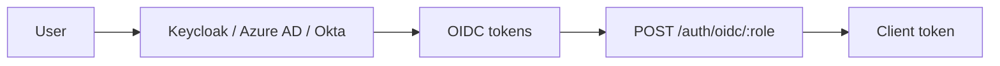

<!--
Copyright The KNXVault Authors.
SPDX-License-Identifier: CC-BY-4.0
-->

# Enterprise identity federation (W44-04)

KNXVault does not implement native SAML/LDAP. Use an **OIDC broker**:



## Keycloak

1. Create OIDC client with `aud` = `knxvault`.
2. Map groups → KNXVault role policies.
3. For admin roles, enable `require_mfa` and map `acr=mfa` (W44-03).

## Azure AD

Use App Registration + federated SAML apps redirected through Azure OIDC.

## Role configuration

```bash
curl -X PUT -H "Authorization: Bearer $ADMIN" \
  -d '{"policies":["admin"],"auth_method":"oidc","require_mfa":true,"oidc":{"issuer":"https://idp.example/","audience":"knxvault","jwks_url":"https://idp.example/.well-known/jwks.json"}}' \
  "$KNXVAULT_ADDR/sys/roles/oidc-admin"
```