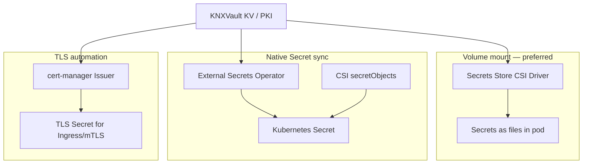

<!--
Copyright The KNXVault Authors.
SPDX-License-Identifier: CC-BY-4.0
-->

# Kubernetes-native integrations

KNXVault is designed as a **Kubernetes-native** secrets and PKI platform. These integrations are first-class product surfaces — not optional add-ons.

## Integration matrix

| Integration | Purpose | Status | Backlog / docs |
|-------------|---------|--------|----------------|
| **Secrets Store CSI provider** | Mount KV secrets as pod volumes (secret zero in env) | **Shipped** — `knxvault-csi` | [CSI install](../deploy/csi-install.md), Tier G (W39) |
| **External Secrets Operator** | Sync KNXVault secrets into native `Secret` objects when apps need `envFrom` / controllers | **Shipped** — `knxvault-eso` webhook adapter | [ESO deploy](../deploy/external-secrets/) (W40-01) |
| **knxvault-operator CRDs** | Automate TLS Secrets from KNXVault PKI **without cert-manager** | **Shipped** — `KNXVaultCertificate`, CA, Issuer | [Replace cert-manager](../operations/pki-replace-cert-manager.md) (W30) |
| **cert-manager Issuer** | Optional TLS automation via full Vault issuer profile | **Shipped** — `/v1/sys/health`, auth (k8s/AppRole/token), `/v1/<mount>/sign/<role>` | [cert-manager recipe](../recipes/cert-manager-integration.md), `deployments/cert-manager/` (W40-02); prefer operator |
| **Kubernetes auth method** | `POST /auth/kubernetes` + TokenReview + SA role bindings | **Shipped** | [Integration overview](overview.md#kubernetes-serviceaccount-authentication) |
| **Mutating admission webhook** | Optional: inject CSI volumes from pod annotations | **Shipped** — `knxvault-webhook` | `deployments/k8s/webhook/` |
| **Multi-language SDKs** | Go, Python, Java, Rust, Node.js clients from OpenAPI | Go **shipped** (`pkg/client`); others planned | Tier H (W40-03–07) |

## When to use which path



| Need | Use |
|------|-----|
| File-based secret delivery, minimal etcd exposure | **CSI provider** |
| `envFrom.secretRef`, legacy controllers, GitOps Secret refs | **External Secrets Operator** or CSI `secretObjects` |
| Ingress / workload TLS from vault PKI | **knxvault-operator** `KNXVaultCertificate` (preferred); cert-manager optional |
| In-cluster API access | **Kubernetes auth** (SA JWT → scoped token) |
| Faster pod YAML (no hand-written SPC) | **Mutating webhook** (optional) |
| Application code outside cluster | **SDKs** or REST |

## Secrets Store CSI provider

Primary consumption path. Provider binary: `cmd/knxvault-csi`. Mount-time auth uses the pod ServiceAccount (TokenReview) — no static vault token in the provider DaemonSet.

```bash
make build-csi
kubectl apply -f deployments/csi/rbac.yaml -f deployments/csi/k8s-provider.yaml
```

See [CSI install runbook](../deploy/csi-install.md).

## External Secrets Operator

Use when workloads or platforms require a native Kubernetes `Secret` (e.g. Helm charts with `existingSecret`, operators that only read `Secret`).

Deploy the **`knxvault-eso`** webhook adapter (`cmd/knxvault-eso`, `deployments/external-secrets/knxvault-eso-deployment.yaml`). It authenticates with the pod ServiceAccount (or `X-KNXVault-Token`), maps ESO `remoteRef.key` → KV path, and returns secret data for the ESO webhook provider.

```bash
make build-eso
kubectl apply -f deployments/external-secrets/knxvault-eso-deployment.yaml
kubectl apply -f deployments/external-secrets/clustersecretstore-webhook.yaml
```

## knxvault-operator (preferred — no cert-manager)

```bash
make build-operator
kubectl apply -f deployments/operator/crds/
kubectl apply -f deployments/operator/rbac.yaml
kubectl apply -f deployments/operator/samples/certificate-example.yaml
```

Full guide: [Replacing cert-manager with KNXVault](../operations/pki-replace-cert-manager.md).

## cert-manager Issuer (optional)

Use only if you already run cert-manager. Prefer the operator for new clusters.

Full **Vault issuer profile** (see [cert-manager recipe](../recipes/cert-manager-integration.md)):

- `GET /v1/sys/health` — issuer Ready probe
- `POST /v1/auth/kubernetes/login` (or AppRole / `X-Vault-Token`)
- `POST /v1/<mount>/sign/<role>` — CSR sign with Vault request/response shape

Example: `deployments/cert-manager/clusterissuer-knxvault.yaml`

## Kubernetes authentication method

Production path:

1. Server runs in-cluster (or with kubeconfig) → **TokenReview** validates SA JWTs.
2. Roles bind `bound_service_account_names` and `bound_service_account_namespaces`.
3. CSI / ESO / cert-manager controllers use their own SA to authenticate.

Dev-only: `KNXVAULT_JWT_SECRET` (HS256) or `KNXVAULT_K8S_AUTH_INSECURE=true` when Raft is off.

## Mutating admission webhook (optional)

Annotate pods to inject a CSI volume without writing `SecretProviderClass` references by hand:

```yaml
metadata:
  annotations:
    knxvault.io/inject: "true"
    knxvault.io/secret-provider-class: knxvault-app-db
    knxvault.io/inject-mount-path: /mnt/secrets
```

Deploy: `deployments/k8s/webhook/`. Namespace must be labeled `knxvault.io/webhook=enabled`.

## SDKs

| Language | Package / path | Status |
|----------|----------------|--------|
| Go | `pkg/client` | Shipped |
| Python | `clients/python/` | W40-04 — `make generate-clients` |
| Node.js (TypeScript) | `clients/typescript/` | W40-05 |
| Java | `clients/java/` | W40-06 |
| Rust | `clients/rust/` | W40-07 |

Generate from `api/openapi.yaml`:

```bash
make generate-clients   # requires Docker + openapi-generator
```

See [clients/README.md](../../clients/README.md).

## Related

- [Integration overview](overview.md)
- [Secrets injection](../deploy/secrets-injection.md)
- [Backlog Tier H](../backlog.md#tier-h--kubernetes-ecosystem-eso-cert-manager-sdks)