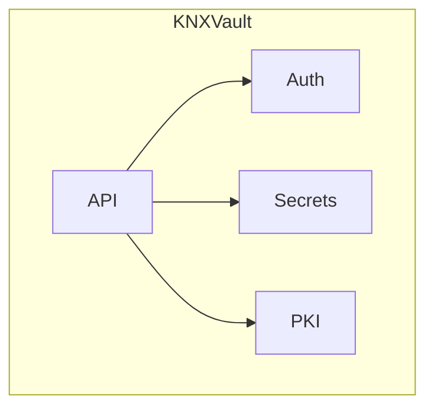

<!--
Copyright The KNXVault Authors.
SPDX-License-Identifier: CC-BY-4.0
-->

# KNXVault — Low-Level Design (LLD)

**Section 1: Introduction & Design Goals**

### 1.1 Purpose

KNXVault is a lightweight, production-grade, self-hosted secrets management and Public Key Infrastructure (PKI) system built entirely in Go. It aims to deliver core capabilities comparable to HashiCorp Vault, OpenBao, and Infisical while maintaining a minimal footprint, high performance, and strong Kubernetes-native integration.

The primary purpose is to provide:

- Secure storage and retrieval of secrets (KVv2, dynamic credentials).
- Full PKI lifecycle management (Root CA, Intermediate CAs, leaf certificates) using **OpenSSL** as the cryptographic backend.
- A clean REST API-first interface suitable for both human operators and automated clients (CI/CD, service meshes, applications).
- Native support for Kubernetes environments, including Service Account authentication and secrets injection patterns.

KNXVault emphasizes **simplicity without sacrificing security**, making it ideal for organizations seeking an auditable, transparent, and maintainable alternative to heavier enterprise solutions.

### 1.2 Scope

**In Scope (MVP + Near-term):**

- Secrets engines: KVv2 with versioning, basic dynamic secrets (DB credentials, etc.), and PKI-backed secrets.
- PKI: Self-signed Root CA, Intermediate CA chaining, leaf certificate issuance (server/client/code-signing), revocation (CRL), renewal, and import/export.
- Authentication: JWT, Kubernetes Service Account, and Universal Auth (token-based).
- Authorization: Fine-grained RBAC with policies.
- Storage: Dragonboat Raft cluster with AES-256-GCM envelope encryption (secrets encrypted before replication).
- Deployment: Kubernetes-first (Helm chart, single-replica and HA modes).
- Cryptographic operations: Strictly via secure OpenSSL CLI wrappers (ephemeral filesystem usage only).
- Audit logging, health checks, and basic observability.
- Encryption at rest and in transit (mTLS support).
- **Permissive licensing only**: all runtime dependencies (Go modules, container base images, Helm subcharts, and bundled tooling) must use **Apache-2.0** or an equivalently permissive license (see §1.5).

**Phase 1 Focus**: KV Secrets + Root/Intermediate CA management + Basic Auth + Kubernetes deployment.

### 1.3 Non-Goals

- Full feature parity with HashiCorp Vault (e.g., complex plugins, Terraform Enterprise features).
- Dynamic Raft cluster membership changes beyond fixed 3-node topologies (manual ops in v0.1.x).
- Native support for non-Kubernetes environments (though possible via standard Go binaries).
- Heavy client SDKs initially (REST + OpenAPI first; client libraries later).
- Advanced HSM integration in MVP (prepared via OpenSSL engine abstraction).
- GUI (focus on API and CLI; external UIs like Vault UI can be adapted later).
- Multi-tenancy at the cluster level (namespace/project-level isolation via policies in future phases).

### 1.4 Key Design Principles

| Principle                     | Description                                                  | Implementation Implications                                  |
| ----------------------------- | ------------------------------------------------------------ | ------------------------------------------------------------ |
| **Security-First**            | Zero-trust architecture, least privilege, secret zero where possible. | Envelope encryption, short-lived tokens, immutable audit logs, mTLS everywhere, careful OpenSSL sandboxing. |
| **Simplicity**                | Minimize moving parts, prefer explicit over implicit, readable code. | Thin service layers, clear domain models, OpenSSL CLI wrappers with strict validation. |
| **Observability**             | Built-in from day one.                                       | OpenTelemetry tracing, structured logging (Zap), Prometheus metrics, health endpoints. |
| **Extensibility**             | Easy to add new secret engines or auth methods.              | Interface-driven design (CryptoProvider, SecretEngine, AuthMethod). |
| **Kubernetes-Native**         | Leverage K8s primitives deeply.                              | ServiceAccount tokens, Dragonboat Raft leader election, Helm charts, CSI/secrets injection readiness. |
| **Performance & Lightweight** | Low resource usage, fast startup.                            | Gin router, Pebble WAL, minimal dependencies, ephemeral OpenSSL workspaces. |
| **Auditability & Compliance** | All sensitive operations logged immutably.                   | Append-only audit table with cryptographic signing of entries (future). |
| **Permissive Licensing**      | No copyleft or proprietary deps in production artifacts.       | Apache-2.0 preferred; allow-list enforced in CI (`deny.toml` / license scan). |

These principles guide every decision in the LLD to ensure KNXVault is secure, maintainable, and suitable for production workloads in regulated environments.

### 1.5 Licensing & Third-Party Dependencies (Strict Requirement)

KNXVault is released under **Apache-2.0**. Every component that ships in production binaries, container images, or Helm charts **must** use a permissive license only.

**Allowed (non-exhaustive):**

| License | Notes |
| ------- | ----- |
| **Apache-2.0** | Preferred for new Go crates and libraries |
| **MIT** | Acceptable alternative |
| **BSD-2-Clause**, **BSD-3-Clause** | Acceptable |
| **ISC**, **Unicode-3.0**, **0BSD**, **CC0-1.0** | Acceptable when required by a dependency |

**Forbidden in any production dependency path:**

- Copyleft: GPL-2.0, GPL-3.0, AGPL-3.0, LGPL-*
- Weak copyleft: MPL-2.0 (unless explicitly approved via exception record — default **deny**)
- Non-standard / restrictive: CDLA-*, OFL-* (except narrowly scoped font exceptions), proprietary, UNLICENSED

**Enforcement:**

1. **Before merge**: new dependencies require SPDX identifier review against the allow-list.
2. **CI gate**: `go-licenses check` (or `license-eye`) plus Trivy license scanning fails the build on disallowed licenses.
3. **Container images**: base images and apt packages in Dockerfiles must be documented and scanned (Trivy license scanner).
4. **OpenSSL**: system/OpenSSL 3.x via distro packages with Apache-compatible linkage policy; no GPL-only OpenSSL builds in production images.
5. **Exceptions**: documented in `docs/licensing.md` with rationale and ADR reference; must not weaken the default deny posture.

**Dependency selection guidance:**

- Prefer Go modules that are **Apache-2.0** or **MIT** when multiple options exist.
- Avoid transitive deps under **MPL-2.0**, **GPL**, or **AGPL** (e.g. replace path-based helpers with stdlib or Apache-licensed alternatives).
- Reject dependencies that bundle precompiled binaries without a clear permissive license.

**Versioning & Compatibility**: Go 1.26+, Dragonboat v3 (Raft), OpenSSL 3.x. Backward compatibility for issued certificates and stored secrets will be maintained across minor versions.

---

**End of Section 1: Introduction & Design Goals**

---

**Section 2: System Architecture (Detailed)**

### 2.1 Component Diagram

The following Mermaid diagram expands the HLD conceptual view into a more detailed architectural representation:

```mermaid
graph TD
    subgraph External["External Clients & Kubernetes"]
        Users[Users / CI/CD / Apps]
        K8s[Kubernetes API Server]
        Ingress[Ingress + TLS Termination]
    end

    subgraph KNXVault["KNXVault Application"]
        direction TB
        
        API[REST API Layer - Gin Framework]
        Middleware[Middleware: AuthN/Z, RateLimit, Logging, Validation]
        
        Auth[Auth Service - JWT + K8s SA + mTLS]
        Secrets[Secrets Engine - KVv2 + Dynamic]
        PKI[PKI Engine - OpenSSL Wrapper]
        Audit[Audit Logging Service]
        
        Crypto[Crypto Service - AES-256-GCM + Master Key]
        Repo[Repository Adapters]
        Raft[Dragonboat Raft\nState Machine]
        
        OpenSSL[OpenSSL CLI Wrapper\n(ephemeral secure workspace)]
    end

    subgraph Data["Persistent Storage"]
        PVC[(Pebble WAL + Snapshots\nper Raft replica)]
        K8sSecrets[Kubernetes Secrets\n(Master Key / Config)]
    end

    subgraph Observability["Observability"]
        OTEL[OpenTelemetry Collector]
        Prometheus[Prometheus Metrics]
        Loki[Loki Logs]
    end

    Users --> Ingress
    Ingress --> API
    K8s --> Auth
    
    API --> Middleware
    Middleware --> Auth
    API --> Secrets
    API --> PKI
    API --> Audit
    
    Secrets --> Crypto
    PKI --> Crypto
    Secrets --> Crypto
    PKI --> Crypto
    Secrets --> Repo
    PKI --> Repo
    Audit --> Repo
    Repo --> Raft
    
    Secrets --> OpenSSL
    PKI --> OpenSSL
    
    Raft --> PVC
    Crypto --> K8sSecrets
    
    API -.-> OTEL
    Secrets -.-> OTEL
    PKI -.-> OTEL
```

### 2.2 Layered Architecture

KNXVault follows a clean, hexagonal-inspired layered architecture to maximize testability and extensibility:

1. **API Layer** (`internal/api/`)
   - Gin HTTP handlers, routing, request/response DTOs.
   - Middleware for authentication, authorization, rate limiting, request ID, and panic recovery.

2. **Service Layer** (`internal/service/`)
   - Orchestrates business logic.
   - PKI Service, Secrets Service, Auth Service, Audit Service.
   - Coordinates between engines, crypto, and repositories.

3. **Engine Layer** (`internal/engine/`)
   - Domain-specific engines: `pki.Engine`, `secrets.KVV2Engine`, future dynamic engines.
   - Implements core use cases (issue cert, read/write secret).

4. **Crypto Layer** (`internal/crypto/`)
   - Master key management (from K8s Secret or external KMS).
   - Envelope encryption (DEK per secret/CA key).
   - OpenSSL command wrapper with sandboxing.

5. **Repository Layer** (`internal/repository/`)
   - Dragonboat adapters (`internal/repository/dragonboat/`) propose commands to the Raft state machine.
   - In-memory repositories back the state machine and power dev/tests (`internal/repository/memory/`).

6. **Domain Models** (`internal/domain/`)
   - Pure business entities (CA, Certificate, Secret, Policy, etc.) with validation.

7. **Infrastructure/Adapters** (`internal/infra/`)
   - OpenSSL executor, Kubernetes client, observability setup.

**Cross-cutting Concerns**:

- Configuration (server: YAML `/etc/knxvault.conf` or `-c/--config`, environment overrides; CLI: Viper `~/.knxvault/config.yaml`).
- Logging (Zap).
- Tracing (OpenTelemetry).
- Error handling (custom `errors.KNXVaultError` with codes).

### 2.3 Data Flow for Major Operations

#### 2.3.1 Create Root CA

1. Client → `POST /pki/root` (with JSON payload: name, commonName, ttl, etc.).
2. API Layer validates request + authenticates/authorizes caller.
3. PKI Service receives request.
4. Crypto Service generates or loads application master key.
5. PKI Engine calls OpenSSL Wrapper:
   - Creates secure temporary directory.
   - Executes `openssl req -x509 -newkey rsa:4096 ...` to generate Root CA.
6. Private key is encrypted with per-CA DEK (AES-256-GCM) using master key.
7. Repository proposes `ca.save` to Raft with CA metadata, public cert PEM, and envelope-encrypted private key.
8. Audit Service logs immutable entry.
9. Response returns CA details (ID, cert PEM, serial).

#### 2.3.2 Issue Leaf Certificate

1. Client → `POST /pki/issue` (role, commonName, sans, ttl).
2. Authorization check against role-based policies.
3. PKI Service loads parent CA (Root or Intermediate).
4. PKI Engine:
   - Generates CSR via OpenSSL.
   - Signs with parent CA private key (decrypted in-memory only, securely wiped).
5. Resulting certificate + private key encrypted and stored via Repository.
6. Audit log created.
7. Return signed certificate bundle.

#### 2.3.3 Store / Retrieve Secret (KVv2)

1. `POST /secrets/kv/{path}` → Secrets Service.
2. Generate unique DEK → encrypt secret value (AES-256-GCM).
3. Store versioned record: path, version, encrypted data, metadata.
4. On read: load encrypted record → decrypt with DEK (derived from master key) → return.
5. Versioning: new writes create incremented version; old versions retained based on policy.
6. TTL/Lease: Raft leader background job handles expiration.

**Security Notes on Flows**:

- Private keys never persisted unencrypted.
- OpenSSL operations run in isolated temporary directories with strict permissions.
- Memory wiping (`runtime.KeepAlive`, manual zeroing) for sensitive buffers.
- All state mutations go through linearizable Raft propose (writes) or SyncRead (reads).

---

**End of Section 2: System Architecture (Detailed)**

---

**Section 3: Project Structure (Golang)**

### 3.1 Recommended Project Layout

KNXVault follows a **standard, scalable Go project structure** inspired by Domain-Driven Design (DDD) principles, clean architecture, and common practices from large-scale Kubernetes-native Go projects (e.g., similar to Crossplane, Argo, and Operator SDK patterns).

```bash
knxvault/
├── cmd/
│   └── knxvault/                  # Application entrypoints
│       └── main.go
├── internal/                     # Private application code (never imported by external packages)
│   ├── api/                      # HTTP layer
│   │   ├── handlers/
│   │   ├── middleware/
│   │   ├── dto/                  # Request/Response models
│   │   └── router.go
│   ├── domain/                   # Core business entities & value objects
│   │   ├── pki/
│   │   ├── secrets/
│   │   ├── auth/
│   │   └── common/
│   ├── engine/                   # Business engines (use cases)
│   │   ├── pki/
│   │   ├── secrets/
│   │   └── interfaces.go
│   ├── service/                  # Orchestration services
│   ├── raft/                     # Dragonboat NodeHost + state machine
│   ├── repository/               # Data access layer
│   │   ├── dragonboat/
│   │   ├── memory/
│   │   └── interfaces.go
│   ├── crypto/                   # Cryptography & OpenSSL wrappers
│   │   ├── envelope.go
│   │   ├── openssl/
│   │   └── masterkey/
│   ├── auth/                     # Authentication & RBAC
│   ├── audit/
│   ├── config/                   # Configuration structs & loading
│   ├── infra/                    # Infrastructure adapters (K8s, observability, etc.)
│   └── utils/                    # Shared utilities (validation, retry, etc.)
├── pkg/                          # Public packages (if needed for clients/libraries)
│   └── client/                   # Future Go client SDK
├── api/                          # OpenAPI specification (openapi.yaml)
├── deployments/
│   └── helm/                     # Helm chart (detailed in later section)
├── scripts/                      # Build and dev scripts
├── test/                         # Integration/e2e tests
│   ├── integration/
│   └── e2e/
├── docs/                         # Architecture decision records (ADRs), LLD
├── go.mod
├── go.sum
├── Dockerfile
├── Makefile
└── README.md
```

### 3.2 Explanation of Major Directories

- **`cmd/knxvault/`**: Contains the `main()` function and command setup (Cobra for CLI if extended). Initializes config, DI (wire or manual), and starts the HTTP server.

- **`internal/api/`**: All HTTP concerns. Handlers are thin (delegate to services). Includes native routes and Vault product profile handlers (`vaultcompat`). DTOs are separate from domain models for API evolution flexibility.

- **`internal/compat/vault/`**: Pure request/response mapping for the cert-manager Vault issuer profile (health codes, auth envelopes, sign body). No business logic — services remain authoritative.

- **`internal/operator/`**: knxvault-operator controllers, CRD APIs (`v1alpha1`), vaultiface client, certlogic helpers. Reconciles CAs and Certificates to native PKI APIs.

- **`internal/domain/`**: Pure business logic entities. No dependencies on frameworks or infrastructure. Examples:
  - `CA`, `Certificate`, `SecretVersion`, `Policy`.

- **`internal/engine/`**: Implements core domain use cases. Follows the "Engine" concept from Vault for extensibility (e.g., new secret engines can be registered via interface).

- **`internal/service/`**: Higher-level orchestration. Handles transactions, audit calls, validation across engines — the **façade** for all HTTP adapters and the operator.

- **`internal/auth/`**: Tokens, Kubernetes/OIDC/AppRole login, RBAC, lockout.

- **`internal/crypto/openssl/`**: Critical security component. Contains safe wrappers for `os/exec.Command` with context timeout, input validation, and secure temp dir management. Native x509 backend also available.

- **`internal/raft/`**: Dragonboat `NodeHost`, `VaultStateMachine`, command catalog, leader election for background jobs.
- **`internal/repository/`**: Repository interfaces with Dragonboat adapters for production, in-memory for tests.

- **`internal/config/`**: Strongly-typed config with validation (using `validator.v10`). Supports env vars, ConfigMaps, and secrets.

- **`internal/infra/`**: Kubernetes client (`client-go`), OpenTelemetry setup, Valkey cache client (optional).

- **`deployments/`**: Raw Kubernetes manifests (`k8s/`, `operator/`, `csi/`, `cert-manager/`, `external-secrets/`). Helm chart deferred.

### 3.3 Domain-Driven Design Considerations

- **Bounded Contexts**: Clear separation between `pki`, `secrets`, and `auth`.
- **Aggregates**: `CA` is an aggregate root containing its chain and issued certificates. `Secret` is versioned.
- **Repositories**: One per aggregate root.
- **Value Objects**: `PEMBlock`, `DN`, `TTL`, `SerialNumber`.
- **Immutability**: Certificate and older secret versions are immutable after creation.
- **Anti-Corruption Layer**: Between API DTOs and Domain models.

This structure supports:

- High testability (easy mocking of interfaces).
- Independent evolution of layers.
- Future addition of gRPC, new engines, or CLI without major refactoring.

### 3.4 Key Go Practices Applied

- **Dependency Injection**: Manual or `google/wire` for production wiring.
- **Error Handling**: Custom typed errors with context and codes.
- **Concurrency Safety**: Context propagation everywhere; mutexes only where necessary.
- **Module Boundaries**: Strict `internal/` to prevent leakage.
- **Testing**: Unit (table-driven), integration (3-node Raft cluster + HTTP API + OpenSSL), e2e.

---

**End of Section 3: Project Structure (Golang)**

---

**Section 4: Core Modules - Low Level Design**

### 4.A PKI / Certificate Management Module

#### 4.A.1 OpenSSL Wrapper Design

All cryptographic operations are performed via a secure, audited wrapper around the OpenSSL CLI to avoid heavy dependencies and maintain transparency.

**Key File**: `internal/crypto/openssl/wrapper.go`

```go
type OpenSSLWrapper struct {
    execTimeout time.Duration
    workDirBase string // /tmp/knxvault-openssl-*
}

type ExecResult struct {
    Stdout, Stderr string
    ExitCode       int
}

// SafeExec runs openssl with strict controls
func (w *OpenSSLWrapper) SafeExec(ctx context.Context, args []string, stdin io.Reader) (*ExecResult, error) {
    // 1. Create isolated temp dir with 0700 perms
    tmpDir, err := w.createSecureTempDir()
    if err != nil { return nil, err }
    defer os.RemoveAll(tmpDir)

    cmd := exec.CommandContext(ctx, "openssl", args...)
    cmd.Dir = tmpDir
    // ... (env sanitization, no shell, uid/gid drop if possible)

    // 2. Execute with timeout
    // 3. Parse output, validate PEM, sanitize errors
    return w.runAndCapture(cmd, stdin)
}
```

**Security Controls**:

- Random per-operation temporary directories.
- Strict argument allow-listing per operation (e.g., no arbitrary `-config` pointing outside).
- Context cancellation support.
- Output validation (PEM parsing via `crypto/x509` stdlib as sanity check).
- Logging of all commands (sanitized).

#### 4.A.2 CA Hierarchy State Management

```go
type CA struct {
    ID            uuid.UUID
    ParentID      *uuid.UUID
    Name          string
    Type          CAType // Root | Intermediate
    Subject       DistinguishedName
    Serial        string
    CertPEM       string
    PrivateKeyEnc []byte // AES-encrypted
    DEK           []byte // Encrypted Data Encryption Key
    Status        CAStatus
    CreatedAt     time.Time
    ExpiresAt     time.Time
    CRLNextUpdate time.Time
}

type DistinguishedName struct {
    CommonName         string
    Organization       string
    OrganizationalUnit string
    Country            string
    // ... other fields
}
```

**Hierarchy Rules**:

- Root CAs have `ParentID = nil`.
- Intermediate CAs reference a parent.
- Chain validation performed on load.

#### 4.A.3 Certificate Lifecycle

- **Issue**: Generate CSR → Sign with parent → Store.
- **Renew**: Re-issue with same subject (new serial).
- **Revoke**: Add to CRL, update revocation list in DB.
- **CRL Generation**: Periodic job via OpenSSL (`openssl ca -gencrl`).

#### 4.A.4 Key Storage & Encryption Strategy

- Private keys stored **only** in encrypted form.
- Envelope encryption: Master Key (K8s Secret) → DEK (random per CA/key) → AES-256-GCM.
- In-memory decryption only during signing/issuance, followed by `memset` zeroing.

### 4.B Secrets Management Module

#### 4.B.1 KVv2 Engine Design

```go
type SecretVersion struct {
    ID          uuid.UUID
    Path        string `gorm:"index:idx_path_version"`
    Version     int
    Data        []byte // Encrypted JSON
    DEK         []byte // Encrypted
    LeaseID     *string
    TTL         *time.Duration
    CreatedAt   time.Time
    ExpiresAt   *time.Time
    Destroyed   bool
}

type KVV2Engine struct {
    repo   repository.SecretRepository
    crypto *crypto.Service
}
```

**Operations**:

- `Put(path, data)`: Creates new version.
- `Get(path, version)`: Returns latest or specific version.
- Version retention policy (configurable, default 10 versions).

#### 4.B.2 Versioning, Leasing, TTL

- Leasing: Background worker cleans expired leases.
- TTL: Soft expiration via `ExpiresAt`; hard enforcement on read.

#### 4.B.3 Encryption

Same envelope strategy as PKI. Data is JSON-marshaled before encryption.

#### 4.B.4 Secret Engines Extensibility

```go
type SecretEngine interface {
    Name() string
    Put(ctx context.Context, path string, data map[string]any) error
    Get(ctx context.Context, path string) (map[string]any, error)
    // ...
}

type EngineRegistry struct {
    engines map[string]SecretEngine
}
```

### 4.C Authentication & Authorization

#### 4.C.1 Supported Auth Methods

- **JWT**: Standard OIDC-compatible.
- **Kubernetes**: Validate ServiceAccount token via `TokenReview` API.
- **Universal/Auth Token**: Long-lived tokens with policies.

#### 4.C.2 RBAC Model

```go
type Policy struct {
    ID          uuid.UUID
    Name        string
    Effect      Effect // Allow | Deny
    Resources   []string // e.g. "pki/*", "secrets/data/*"
    Actions     []string // read, write, issue, revoke
    Conditions  map[string]any
}

type Role struct {
    Name     string
    Policies []Policy
}
```

Authorization uses a simple but powerful policy engine evaluated per request.

### 4.D Storage Layer

KNXVault persists all vault state in a **single Dragonboat Raft cluster** (cluster ID `1`). Detailed operational reference: [`docs/storage/dragonboat.md`](storage/dragonboat.md).

#### 4.D.1 Dragonboat Topology

| Mode | Nodes | Use case |
|------|-------|----------|
| In-memory | 0 (Raft off) | Unit tests, local dev without persistence |
| Single-node Raft | `KNXVAULT_RAFT_NODE_ID=1` | Dev / CI with durable local state |
| 3-node StatefulSet | Pod indices `0,1,2` + headless Service | Production HA |

- **Raft port**: `:63001` (configurable via `KNXVAULT_RAFT_ADDRESS`)
- **HTTP API**: `:8200`
- **Log store**: Pebble WAL under `KNXVAULT_RAFT_DATA_DIR` (default `/var/lib/knxvault/raft`)
- **Leader**: Derived from Raft role; gates background jobs (lease cleanup, CRL refresh, cert renewal)
- **Readiness**: `GET /ready` requires a known Raft leader when `KNXVAULT_RAFT_ENABLED=true`

#### 4.D.2 State Machine & Command Catalog

The `VaultStateMachine` (`internal/raft/statemachine.go`) implements `statemachine.IStateMachine`. Commands are JSON envelopes `{ "op": "<name>", "payload": { ... } }` applied to an in-memory store (`internal/raft/store.go`) backed by memory repository implementations.

**Write commands** (via `SyncPropose`): `ca.save`, `secret.save_version`, `audit.append`, `revoke.save`, `lease.save`, `policy.save`, `role.save`, `db_role.save`, `issued.save`, `snapshot.import`, and corresponding deletes.

**Read commands** (via `SyncRead`): `ca.get_by_id`, `secret.get_latest`, `audit.list`, `policy.list`, and other `*.get` / `*.list` ops. Write ops are rejected on the read path.

**Entities replicated**: CAs, secret versions, audit log, revocations, leases, policies, roles, database roles, issued certificate metadata.

#### 4.D.3 Encryption Before Replication

Secret values and private keys are **encrypted by engines before Raft propose** (AES-256-GCM envelope). Raft logs, Pebble WAL entries, and snapshots contain ciphertext for sensitive fields — not plaintext secrets. See [`docs/adr/0004-encrypt-before-replication.md`](adr/0004-encrypt-before-replication.md).

Cleartext metadata (paths, RBAC policies, audit resource paths, CA cert PEM) is intentional — see [`docs/adr/0005-cleartext-metadata-in-raft.md`](adr/0005-cleartext-metadata-in-raft.md).

#### 4.D.4 Snapshots & Backup

- **Dragonboat snapshots**: `SaveSnapshot` / `RecoverFromSnapshot` serialize `internal/backup.Snapshot` JSON.
- **Portable backup**: `POST /sys/backup` exports encrypted archive; restore proposes `snapshot.import` through Raft.

#### 4.D.5 Repository Pattern

```go
type SecretRepository interface {
    SaveVersion(ctx context.Context, sv *domain.SecretVersion) error
    GetLatest(ctx context.Context, path string) (*domain.SecretVersion, error)
    ListByPath(ctx context.Context, pathPrefix string) ([]*domain.SecretVersion, error)
}
```

**Production implementation**: `internal/repository/dragonboat/` — each method maps to a Raft command via `internal/raft/client.go`.

**Dev / test**: `internal/repository/memory/` when `KNXVAULT_RAFT_ENABLED` is unset.

---

**End of Section 4: Core Modules - Low Level Design**

---

**Section 5: API Layer**

### 5.1 OpenAPI/Swagger Structure Overview

KNXVault uses an **OpenAPI 3.1** specification as the single source of truth for the API contract.

- **Location**: `api/openapi.yaml` (or split into multiple files).
- **Code Generation**: Optional use of `oapi-codegen` or `openapi-generator` to generate server stubs and client models (Go).
- **Documentation**: Served at `/swagger/index.html` via `gin-swagger` or `echo-swagger`.

**Key Tags**:

- `auth`
- `pki`
- `secrets`
- `sys` (health, capabilities, config)

### 5.2 Request/Response Models for Critical Endpoints

#### 5.2.1 Authentication

```go
// POST /auth/kubernetes
type K8sLoginRequest struct {
    Role        string `json:"role" binding:"required"`
    JWT         string `json:"jwt" binding:"required"` // ServiceAccount token
}

type LoginResponse struct {
    ClientToken string    `json:"client_token"`
    TTL         int       `json:"ttl"`
    Policies    []string  `json:"policies"`
    Renewable   bool      `json:"renewable"`
}
```

#### 5.2.2 PKI Endpoints

**POST /pki/root**

```go
type CreateRootCARequest struct {
    Name       string `json:"name" binding:"required"`
    CommonName string `json:"common_name" binding:"required"`
    TTL        string `json:"ttl" binding:"required"` // e.g. "8760h"
    KeyType    string `json:"key_type" binding:"oneof=rsa ecdsa"`
    KeyBits    int    `json:"key_bits"`
}

type CAResponse struct {
    ID         string `json:"id"`
    CertPEM    string `json:"cert_pem"`
    Serial     string `json:"serial"`
    ExpiresAt  string `json:"expires_at"`
}
```

**POST /pki/issue**

```go
type IssueCertRequest struct {
    Role        string   `json:"role" binding:"required"`
    CommonName  string   `json:"common_name" binding:"required"`
    DNSNames    []string `json:"dns_names"`
    IPAddresses []string `json:"ip_addresses"`
    TTL         string   `json:"ttl"`
}

type IssueCertResponse struct {
    CertPEM       string `json:"cert_pem"`
    PrivateKeyPEM string `json:"private_key_pem"` // Only if requested
    Serial        string `json:"serial"`
    ExpiresAt     string `json:"expires_at"`
}
```

#### 5.2.3 Secrets Endpoints (KVv2)

```go
// POST /secrets/kv/{path}
type KVWriteRequest struct {
    Data map[string]any `json:"data" binding:"required"`
    Options struct {
        CasVersion *int `json:"cas_version,omitempty"`
    } `json:"options,omitempty"`
}

// GET /secrets/kv/{path}
type KVReadResponse struct {
    Data     map[string]any `json:"data"`
    Metadata struct {
        Version   int       `json:"version"`
        CreatedAt time.Time `json:"created_at"`
        TTL       string    `json:"ttl,omitempty"`
    } `json:"metadata"`
}
```

#### 5.2.4 System Endpoints

- `GET /health` → `{ "status": "healthy", "version": "1.0.0" }`
- `GET /sys/capabilities` → Returns allowed actions for current token.

### 5.3 Error Handling & Validation Strategy

```go
type ErrorResponse struct {
    ErrorCode    string `json:"error_code"`
    Message      string `json:"message"`
    Details      any    `json:"details,omitempty"`
    RequestID    string `json:"request_id"`
    Timestamp    time.Time `json:"timestamp"`
}

// Custom Gin middleware
func ErrorHandler() gin.HandlerFunc {
    return func(c *gin.Context) {
        c.Next()
        if len(c.Errors) > 0 {
            // Map to standardized error
            c.JSON(http.StatusBadRequest, buildErrorResponse(c.Errors))
        }
    }
}
```

- **Validation**: `github.com/go-playground/validator/v10` with custom tags.
- **Error Codes**: `ERR_INVALID_INPUT`, `ERR_UNAUTHORIZED`, `ERR_PKI_ISSUANCE_FAILED`, etc.
- **Request ID**: Propagated via context and headers (`X-Request-ID`).

### 5.4 Rate Limiting & Security Middleware

- **Rate Limiter**: Token bucket per IP/token using `golang.org/x/time/rate` (Valkey-backed HA limiter: future).
- **Security Middlewares** (in order):
  1. CORS (strict).
  2. Request ID + Logging.
  3. Rate Limiting.
  4. Authentication.
  5. Authorization (policy evaluation).
  6. Validation.
  7. Panic Recovery.

**mTLS Support**:

- Optional client certificate validation middleware.
- Configurable via `tls.Config` in Gin server setup.

**Additional Protections**:

- Helmet-like headers (via middleware).
- Body size limits.
- Command validation in Raft state machine (unknown ops rejected; read path blocks writes).

---

**End of Section 5: API Layer**

---

**Section 6: Kubernetes Deployment Design**

### 6.1 Helm Chart Structure

KNXVault ships with a comprehensive Helm chart for easy installation and management.

**Directory Layout** (`deployments/helm/knxvault/`):

```bash
Chart.yaml
values.yaml
values-ha.yaml
templates/
├── statefulset.yaml             # 3-node Raft HA (production)
├── service.yaml
├── service-raft.yaml            # Headless Service for Raft peers
├── ingress.yaml
├── configmap.yaml
├── secret.yaml                  # Master key, TLS certs
├── serviceaccount.yaml
├── role.yaml                    # RBAC for K8s auth
├── rolebinding.yaml
├── pvc.yaml                     # For ephemeral OpenSSL workspaces if needed
├── hpa.yaml
├── tests/                       # Helm test hooks
└── _helpers.tpl
```

### 6.2 Core Kubernetes Manifests

#### Deployment / StatefulSet

```yaml
apiVersion: apps/v1
kind: StatefulSet
metadata:
  name: knxvault
spec:
  serviceName: knxvault-raft
  replicas: 3
  selector:
    matchLabels:
      app: knxvault
  template:
    spec:
      serviceAccountName: knxvault
      containers:
      - name: knxvault
        image: "knxvault:latest"
        imagePullPolicy: IfNotPresent
        ports:
        - containerPort: 8200
        - containerPort: 63001   # Raft peer transport
        env:
        - name: KNXVAULT_RAFT_ENABLED
          value: "true"
        - name: KNXVAULT_RAFT_DATA_DIR
          value: /var/lib/knxvault/raft
        - name: KNXVAULT_RAFT_ADDRESS
          value: "$(KNXVAULT_POD_NAME).knxvault-raft.knxvault.svc.cluster.local:63001"
        resources:
          requests:
            cpu: "500m"
            memory: "512Mi"
          limits:
            cpu: "2"
            memory: "2Gi"
        readinessProbe:
          httpGet:
            path: /ready
            port: 8200
          initialDelaySeconds: 10
        livenessProbe:
          httpGet:
            path: /health
            port: 8200
          initialDelaySeconds: 30
```

#### High Availability Strategy

- **3-replica StatefulSet** with Dragonboat Raft (`deployments/k8s/statefulset.yaml`).
- Headless Service (`service-raft.yaml`) provides stable DNS for `KNXVAULT_RAFT_INITIAL_MEMBERS`.
- **Raft leader** handles background jobs (CRL generation, lease cleanup, cert renewal).
- One PVC per replica for Pebble WAL and Dragonboat snapshots (`KNXVAULT_RAFT_DATA_DIR`).
- When Raft is disabled, the server uses in-memory repositories (development only); no external database.

### 6.3 ConfigMap & Secret Resources

- **ConfigMap**: Non-sensitive configuration (ports, log level, feature flags).
- **Secret**: Master encryption key (sealed or generated at install), TLS certificates for mTLS.

### 6.4 Secrets Injection Patterns

1. **Secrets Store CSI Driver** (**primary, first-class**): KNXVault ships a [CSI provider](https://secrets-store-csi-driver.sigs.k8s.io/) (`knxvault-csi`) so workloads mount KV secrets as volumes via `SecretProviderClass`. Pod `ServiceAccount` identity is exchanged at mount time (TokenReview) — no cluster-wide static vault tokens in the provider. Supports optional sync to native Kubernetes `Secret` and [auto-rotation](https://secrets-store-csi-driver.sigs.k8s.io/topics/secret-auto-rotation.html) when KV versions change. Manifests: `deployments/csi/`.
2. **knxvault-operator** (**primary for vault-issued TLS**): CRDs reconcile CA/Issuer/Certificate → optional `kubernetes.io/tls` Secrets without cert-manager. Manifests: `deployments/operator/`. See [Replace cert-manager](operations/pki-replace-cert-manager.md).
3. **External Secrets Operator** webhook adapter: sync KV to native Secrets when charts require `envFrom`. Manifests: `deployments/external-secrets/`.
4. **Sidecar / init** (fallback): `POST /inject/render` into a shared `emptyDir`.
5. **Mutating Webhook** (optional): Auto-inject CSI volume + `SecretProviderClass` from pod annotations.
6. **cert-manager** (optional legacy): Vault issuer against KNXVault `/v1/*` product profile — not required when using the operator.

### 6.5 Resource Limits, Probes & Best Practices

- **Resource Requests/Limits**: Conservative for lightweight nature; tunable via Helm values.
- **Probes**: Liveness (`/health`), Readiness (`/ready` — includes Raft leader when enabled).
- **Pod Security**: Run as non-root, read-only filesystem where possible, seccomp/AppArmor profiles.
- **NetworkPolicy**: Egress/ingress restrictions.
- **Pod Disruption Budgets**: For HA deployments.
- **Horizontal Pod Autoscaler**: Based on CPU + custom metrics (requests/sec).

### 6.6 Installation & Upgrade

```bash
helm install knxvault ./deployments/helm/knxvault \
  --set persistence.enabled=true \
  --set replicaCount=3
```

**Upgrade Strategy**: RollingUpdate with maxUnavailable=0 for zero-downtime when possible.

---

**End of Section 6: Kubernetes Deployment Design**

---

**Section 7: Security & Compliance**

### 7.1 Threat Model Highlights

**Key Assets**:

- Master encryption key
- CA private keys
- Application secrets
- Authentication tokens

**Threats Considered** (STRIDE-based):

- **Spoofing**: Strong auth (mTLS + JWT + K8s TokenReview).
- **Tampering**: Immutable audit logs, envelope encryption, integrity checks.
- **Repudiation**: Comprehensive audit logging with actor, timestamp, and cryptographic hash.
- **Information Disclosure**: Encryption at rest + transit, memory wiping, minimal logging of secrets.
- **Denial of Service**: Rate limiting, resource quotas, circuit breakers.
- **Elevation of Privilege**: Strict RBAC, least-privilege ServiceAccount, input validation.

**Attack Surfaces**:

- OpenSSL CLI execution (mitigated by sandboxing).
- Raft peer communication (restrict port 63001 to cluster nodes via NetworkPolicy).
- API endpoints (auth middleware chain).

> **§7 implementation status (2026-07):** Items below are tagged **Implemented**, **Dev-only**, or **Planned** where they differ from production behavior. See [`docs/product/lld-alignment.md`](product/lld-alignment.md) for code paths.

### 7.2 Key Rotation & Management _(Implemented)_

- **Master Key Rotation**: Supported via `POST /sys/rotate-master-key`. Old keys kept for decryption during transition (`internal/crypto/keyring.go`).
- **CA Key Rotation**: New Root/Intermediate creation + re-issuance workflow.
- **Certificate Renewal**: Automated via TTL-based jobs with grace periods.
- **DEK Rotation**: Per-secret rotation on update (optional policy).

### 7.3 Audit Logging _(Implemented)_

```go
type AuditEvent struct {
    ID        uuid.UUID
    Timestamp time.Time
    Actor     string
    Action    string
    Resource  string
    Status    string
    RemoteIP  string
    RequestID string
    Details   map[string]any
    Signature string // HMAC or future digital signature
}
```

- **Immutability**: Append-only via Raft `audit.append` command; no in-place updates or deletes.
- **Export**: Support for streaming to SIEM (future Loki integration).
- **Sensitive Data Redaction**: Automatic masking of secrets in logs.

### 7.4 mTLS & Encryption in Transit _(Implemented — server TLS + Raft peer mTLS; route-level mTLS Planned W34-01)_

- All internal and external communication supports (and can enforce) mTLS.
- Configurable CA for client cert validation.
- Automatic TLS certificate issuance via KNXVault's own PKI (bootstrapping).

### 7.5 Secret Zero Approach _(Implemented)_

- Master key bootstrapped from Kubernetes Secret (sealed with age/sealed-secrets recommended) or external KMS.
- No hardcoded credentials.
- Runtime key unwrapping only in memory.
- Pod identity-based authentication wherever possible.

### 7.6 Compliance Features _(Implemented — FIPS mode Planned)_

- **Data Residency**: Self-hosted, full control.
- **Audit Readiness**: SOC2, ISO 27001-friendly logging and RBAC.
- **License Compliance**: Permissive-only dependency policy (§1.5); automated license scans in CI and release pipelines.
- **Revocation**: CRL + basic OCSP responder support.
- **Backup Encryption**: All backups encrypted with master key.

**OpenSSL Security**:

- Always use latest stable OpenSSL 3.x.
- FIPS mode support via OpenSSL configuration (future).
- Regular vulnerability scanning of container image.

### 7.7 Additional Hardening

- Dependency vulnerability scanning (Dependabot + Trivy).
- Static code analysis (gosec, semgrep).
- Runtime security (Falco rules for anomalous OpenSSL behavior).
- Least-privilege container: **required** runtime base is `gcr.io/distroless/static-debian13:nonroot` (native PKI only).

---

**End of Section 7: Security & Compliance**

---

**Section 8: Observability & Operations**

### 8.1 Logging, Metrics, and Tracing

**Structured Logging** (`internal/infra/logger.go`):

- Library: `go.uber.org/zap` (production JSON output).
- Levels: Debug (dev), Info/Warn/Error (prod).
- Fields: `request_id`, `trace_id`, `user_id`, `operation`, `component` (pki|secrets|api).
- Sensitive data redaction middleware.

**Metrics** (Prometheus):

- Counter: `knxvault_secrets_read_total`, `knxvault_cert_issued_total`, `knxvault_errors_total`.
- Histogram: Request latency, OpenSSL operation duration.
- Gauge: Active leases, CA count, `knxvault_raft_leader`, `knxvault_raft_commit_index`.
- Exposed at `/metrics`.

**Distributed Tracing** (OpenTelemetry):

- Automatic instrumentation for HTTP, Raft propose latency, and OpenSSL wrapper.
- Trace context propagation.
- Key spans: `pki.issue_certificate`, `secrets.kv.read`, `openssl.exec`.

**Integration**:

- Logs → Loki / ELK.
- Metrics → Prometheus + Grafana dashboards (included in Helm chart).
- Traces → Jaeger/Tempo.

### 8.2 Health Checks, Readiness, and Liveness

```go
// GET /health
type HealthResponse struct {
    Status      string `json:"status"`
    Version     string `json:"version"`
    RaftEnabled bool   `json:"raft_enabled"`
    RaftReady   bool   `json:"raft_ready"`
    Leader      bool   `json:"leader"`
}

// GET /ready
// Checks: Raft leader elected (when enabled), or noop for in-memory dev mode
```

- **Liveness**: Basic process health (`/health`).
- **Readiness**: Raft quorum with leader (`/ready` returns 503 until leader elected).
- **Startup Probe**: Allow time for Raft election on cold start.

### 8.3 Backup & Restore

**Backup Strategy**:

1. **Encrypted snapshot**: `POST /sys/backup` or `knxvault-cli backup create` — master-key-sealed JSON archive of all vault state.
2. **Dragonboat on-disk snapshot**: Triggered after export via `RequestSnapshot` on the Raft leader.
3. **Configuration**: K8s ConfigMap/Secret manifests + `KNXVAULT_RAFT_INITIAL_MEMBERS`.

**Restore Process**:

- `POST /sys/restore` proposes `snapshot.import` through Raft (replaces full state machine).
- Requires matching `KNXVAULT_MASTER_KEY`.

**Pre-upgrade**: Run backup before rolling StatefulSet upgrades (see [`docs/operations/runbooks/raft-failover.md`](operations/runbooks/raft-failover.md)).

### 8.4 Operational Runbooks (Key Scenarios)

- **Master Key Loss**: Recovery via sealed backup (recommended external KMS integration).
- **CA Compromise**: Revoke and re-issue hierarchy.
- **High Load**: Vertical scaling per replica; fixed 3-node Raft quorum in v0.1.x.
- **OpenSSL Failures**: Circuit breaker + fallback logging.

**Monitoring Alerts** (Prometheus rules):

- High error rate on PKI operations.
- Certificate expiry < 30 days.
- Lease accumulation.
- Raft leader loss / prolonged election.

**Log Retention & Rotation**: Configurable via Helm values.

---

**End of Section 8: Observability & Operations**

---

**Section 9: Implementation Roadmap & Phasing**

### 9.1 Overall Phasing Strategy

KNXVault follows a phased approach aligned with the HLD, prioritizing core value (secrets + PKI) while maintaining security and stability at each stage.

### 9.2 Phase 1: MVP (Core Foundations)

**Duration**: 6–8 weeks  
**Goal**: Functional, secure, deployable system for basic use cases.

**Features**:

- Full PKI module: Root CA, Intermediate CA, leaf certificate issuance & revocation (CRL).
- KVv2 Secrets engine with versioning and basic TTL.
- Authentication: JWT + Kubernetes Service Account.
- Authorization: Basic RBAC with policies.
- Storage: Dragonboat Raft cluster with envelope encryption (AES-256-GCM, encrypt-before-replicate).
- API Layer with OpenAPI spec and core endpoints.
- OpenSSL secure wrapper.
- Container image + raw Kubernetes manifests (3-node Raft StatefulSet). **Helm chart deferred** to long-term / Phase 2+ (see §9.4).
- Basic observability (logs, health checks, metrics).
- Audit logging (append-only).

**Success Criteria**:

- Can issue and manage a full CA hierarchy.
- Secrets can be written/read with encryption.
- Secure deployment in Kubernetes.
- Passes basic security scan (Trivy, gosec).

**Deliverables**:

- Working binary + Docker image.
- Raw Kubernetes manifests (`deployments/k8s/`).
- Complete Section 1–8 of this LLD.
- Automated tests (unit + integration).

### 9.3 Phase 2: Enterprise Readiness

**Duration**: 6–8 weeks  
**Goal**: Production hardening and expanded capabilities.

**Features**:

- Dynamic Secrets (e.g., database credentials engine).
- Advanced RBAC with conditions and policy evaluation engine.
- Full audit log export and integrity protection.
- 3-node Dragonboat Raft HA with unified leader election.
- Certificate renewal automation and OCSP basic support.
- Secrets injection sidecar / CSI readiness.
- Rate limiting, request signing.
- Improved observability (tracing, Grafana dashboards).
- Backup & restore procedures + Helm hooks.
- CLI tool (`knxvault` binary).

**Success Criteria**:

- Zero-downtime upgrades in HA.
- Passes external security review.
- Dynamic secret rotation demonstrated.

### 9.4 Phase 3–5: Advanced & Ecosystem

**Goal**: Full maturity and ecosystem integration. Status as of 2026-07:

**Shipped (product surface):**

- **knxvault-operator** CRDs (`KNXVaultCA`, Issuer/ClusterIssuer, Certificate, CertificateRequest) — **primary cert-manager replacement** for vault-issued TLS (W30 + hardening).
- **Vault product profile** for optional cert-manager: `GET /v1/sys/health`, Kubernetes/AppRole/token auth, `POST /v1/<mount>/sign/<role>` via `internal/compat/vault` façade (not a full Vault clone).
- CSI provider, ESO webhook adapter, mutating webhook (optional).
- Dynamic database + SSH engines, advanced RBAC, Valkey optional read cache.
- Server TLS + Raft peer mTLS; seal/unseal; encrypted backup/restore; lab full E2E.

**Still open / deferred:**

- Terraform provider.
- PKCS#11 HSM-backed CA keys (engine stub only).
- Full client mTLS requirement on all secured routes.
- Cross-cluster DR automation and compliance audit packs.
- **Helm chart** — deferred; raw manifests under `deployments/`.
- Full Vault plugin system / complete `/v1` secrets engines.

**Design rule for compatibility:** foreign product wire formats map through thin adapters onto **native services**; see [Phase 4–5 design](design/phase4-ecosystem.md) and [HLD](architecture/hld.md).

**Success Criteria**:

- Production adoption readiness for secrets + PKI + K8s TLS automation without cert-manager.
- Community/contributor-friendly codebase.
- Comprehensive documentation and examples.

### 9.5 Cross-Cutting Activities (All Phases)

- Security reviews and threat modeling at phase boundaries.
- **License compliance**: SPDX allow-list checks on every PR; SBOM includes license metadata.
- Comprehensive automated testing (including chaos testing in later phases).
- Documentation updates (API, deployment guides, runbooks).
- Performance benchmarking.
- Container image hardening and SBOM generation.

### 9.6 Milestones & Release Criteria

- **Alpha**: End of Phase 1 internal use.
- **Beta**: End of Phase 2 with external early adopters.
- **GA**: End of Phase 3 with full documentation and support processes.

---

**End of Section 9: Implementation Roadmap & Phasing**

---

**Section 10: Risks, Trade-offs & Future Considerations**

### 10.1 Key Risks & Mitigations

| Risk                                        | Likelihood | Impact   | Mitigation                                                   |
| ------------------------------------------- | ---------- | -------- | ------------------------------------------------------------ |
| **OpenSSL CLI dependency & sandbox escape** | Medium     | High     | Strict argument validation, isolated temp dirs (0700), non-root execution, regular fuzz testing of wrapper. |
| **Master Key compromise**                   | Low        | Critical | Envelope encryption, short master key exposure window, rotation procedure, K8s Secret + sealing recommended. |
| **Performance overhead of OpenSSL exec**    | Medium     | Medium   | In-memory caching of public CA material, Raft propose batching, future native `crypto` fallback for high-volume paths. |
| **Raft quorum loss**                        | Medium     | High     | 3-node StatefulSet with PDB, encrypted snapshots, runbook-driven recovery ([`raft-failover.md`](operations/runbooks/raft-failover.md)). |
| **Certificate chain validation complexity** | Medium     | Medium   | Rigorous domain model + automated test suite for hierarchy operations. |
| **Compliance gaps vs. enterprise Vault**    | Low        | Medium   | Clear documentation of supported features; focus on transparency and auditability. |

### 10.2 Design Trade-offs

- **OpenSSL CLI vs. Native Libraries**:  
  **Trade-off**: Higher operational simplicity and auditability vs. slight performance overhead.  
  **Rationale**: Meets the HLD constraint and reduces cryptographic implementation risk.

- **Dragonboat Raft vs. External Database**:  
  **Trade-off**: Embedded consensus adds per-replica disk and fixed topology vs. operational simplicity of a single external DB.  
  **Decision**: Dragonboat Raft with Pebble WAL for production (see [ADR-0001](adr/0001-dragonboat-storage-backend.md)); in-memory repositories for development when Raft is disabled.

- **Gin Framework**: Lightweight and fast, but less "batteries-included" than heavier frameworks.  
  **Mitigation**: Comprehensive custom middleware layer.

- **Built-in Raft Consensus**: Dragonboat provides linearizable writes and unified leader election; background jobs run only on the Raft leader.

### 10.3 Future Considerations & Extensibility

- **Plugin System**: Interface-based engines allow community-contributed secret engines (similar to Vault).
- **HSM / OpenSSL Engine**: Abstract `CryptoProvider` interface to support PKCS#11.
- **gRPC Support**: Side-by-side with REST for internal service mesh use.
- **Web UI**: Optional React/Vue admin interface (separate repo).
- **Policy as Code**: Integration with OPA/Gatekeeper for advanced authorization.
- **Multi-Region / Federation**: Future CA hierarchy spanning clusters.
- **Observability Enhancements**: OpenTelemetry auto-instrumentation + SLO monitoring.
- **WASM / Edge**: Lightweight variant for edge computing.

### 10.4 Architectural Decision Records (ADRs)

Accepted ADRs live in `docs/adr/`:

| ADR | Title |
| --- | ----- |
| [0001](adr/0001-dragonboat-storage-backend.md) | Dragonboat Raft storage backend |
| [0002](adr/0002-openssl-cli-crypto-backend.md) | OpenSSL CLI as cryptographic backend |
| [0003](adr/0003-envelope-encryption.md) | Envelope encryption with master key |
| [0004](adr/0004-encrypt-before-replication.md) | Encrypt before Raft replication |
| [0005](adr/0005-cleartext-metadata-in-raft.md) | Cleartext metadata in Raft (paths, RBAC, audit, CA PEM) |

New ADRs are required for storage/auth architecture changes, license exceptions, breaking snapshot formats, and major deprecations.

---

**End of Section 10: Risks, Trade-offs & Future Considerations**

---

**Section 11: Administration CLI for Day-2 Operations**

### 11.1 Purpose and Scope

KNXVault includes a native **Command-Line Interface (CLI)** tool named `knxvault` to support Day-2 operations, administrative tasks, and automation. The CLI serves as a first-class citizen alongside the REST API, enabling operators to perform secure, scriptable interactions without relying solely on HTTP calls.

**Key Goals**:

- Simplify common administrative workflows.
- Provide secure local and remote operations.
- Support CI/CD pipelines and GitOps-style management.
- Maintain the same security model (authentication, encryption, audit logging) as the API.

### 11.2 CLI Architecture & Technology

- **Framework**: `github.com/spf13/cobra` (widely used, powerful, supports subcommands, flags, and completion).
- **Configuration**: Viper for CLI config file (`~/.knxvault/config.yaml`), `KNXVAULT_ADDR` / `KNXVAULT_TOKEN` environment variables, and `--addr` / `--token` flags. The **server** (`knxvault serve`) uses `/etc/knxvault.conf` (override with `-c/--config`) plus environment variables — see [`docs/installation/configuration.md`](installation/configuration.md).
- **Authentication**: Supports token-based (JWT), Kubernetes Service Account (via mounted token), and mTLS client certificates.
- **Output Formats**: Human-readable (table/JSON/YAML), machine-friendly (JSON by default for scripting).
- **Security**: All sensitive operations go through the same backend services; no local crypto bypass.

**Project Location**: `cmd/knxvault-cli/` (separate binary from the server).

### 11.3 CLI Command Structure

> **Implementation status (v0.5.1):** The shipped binary is `knxvault-cli`. Implemented commands are documented in [`docs/cli/reference.md`](cli/reference.md). The structure below includes planned commands beyond the current MVP.

```bash
knxvault-cli [global flags] <command> <subcommand> [flags]
```

#### Global Flags (implemented)

- `--addr`: Server address (default: `http://localhost:8200`)
- `--token`: Authentication token

#### Major Command Groups

**1. PKI Commands**

```bash
knxvault pki root create --name prod-root --common-name "KNXVault Root" --ttl 10y
knxvault pki intermediate create --parent prod-root --name intermediate-1
knxvault pki issue --role web-server --common-name app.example.com --dns app.example.com
knxvault pki list
knxvault pki revoke <serial>
knxvault pki crl generate
```

**2. Secrets Management**

```bash
knxvault kv put secret/data/prod/db password=SuperSecret123
# Default CLI output redacts values ([REDACTED]); use --show-secrets for plaintext
knxvault kv get secret/data/prod/db
knxvault kv get secret/data/prod/db --show-secrets
knxvault kv list secret/
knxvault kv versions secret/data/prod/db
knxvault kv delete secret/data/prod/db --version 2
```

**3. Authentication & Access**

```bash
knxvault auth login kubernetes --role admin
knxvault auth token create --policy admin --ttl 1h
knxvault auth policy create --name pki-admin --file policy.hcl
```

**4. System & Operations**

```bash
knxvault status
knxvault health
knxvault sys rotate-master-key
knxvault backup create --output knxvault-backup.tar.gz.enc
knxvault restore --file knxvault-backup.tar.gz.enc
knxvault audit list
```

**5. Administrative**

```bash
knxvault admin init                     # Bootstrap master key + initial root CA
knxvault admin rekey
knxvault-cli sys seal / unseal           # Implemented (v0.5.1)
```

### 11.4 Implementation Highlights

**Core CLI Structure** (`cmd/knxvault-cli/root.go`):

```go
var rootCmd = &cobra.Command{
    Use:   "knxvault",
    Short: "KNXVault CLI - Secure secrets and PKI management",
    PersistentPreRunE: func(cmd *cobra.Command, args []string) error {
        return initializeClient(cmd) // sets up authenticated HTTP client
    },
}

func init() {
    rootCmd.AddCommand(pkiCmd)
    rootCmd.AddCommand(kvCmd)
    rootCmd.AddCommand(authCmd)
    rootCmd.AddCommand(sysCmd)
    // ... more
}
```

**Client SDK**: A lightweight internal client package (`pkg/client`) used by both CLI and future Go SDK. Reuses the same domain models and DTOs where possible.

### 11.5 Security Considerations for CLI

- Token storage: Secure keyring (OS-native) or file with 0600 permissions.
- No plain-text secret output by default (use `--show-secrets` flag).
- Audit trail: All CLI operations are logged server-side with client metadata.
- Rate limiting and token scoping respected.

### 11.6 Shell Completion & Documentation

- Built-in completion: `knxvault completion bash > /etc/bash_completion.d/knxvault`
- Man pages and detailed help via Cobra.
- Example scripts included in repository (`examples/cli/`).

### 11.7 Future CLI Enhancements

- Interactive mode (`knxvault shell`).
- Local-only mode (for sealed operations).
- Bulk operations and YAML manifests support.
- Integration with tools like `jq`, `yq`, and Terraform.

---

**End of Additional Section 11: Administration CLI for Day-2 Operations**

---

**Section 12: Documentation**

### 12.1 Documentation Strategy

KNXVault maintains **comprehensive, version-controlled documentation** in Markdown format as the single source of truth. All documentation lives in the `/docs/` directory of the repository and is published via MkDocs or GitHub Pages.

**Documentation Principles**:

- **Single Source of Truth**: Design decisions, API specs, and examples are kept up-to-date.
- **Audience Segmentation**: Separate sections for architects, operators, developers, and end-users.
- **Versioning**: Documentation is tagged per release.
- **Automation**: API reference generated from OpenAPI spec; CLI reference from Cobra.

---

### 12.2 Documentation Structure (`/docs/`)

#### 12.2.1 Architecture & Design Documents

**1. High-Level Design (HLD)** – `docs/architecture/hld.md`  
(See original HLD provided in the project brief – maintained as reference.)

**2. Low-Level Design (LLD)** – `docs/architecture/lld.md`  
(This complete document, including all sections 1–11.)

**3. System Architecture** – `docs/architecture/diagrams.md`



**4. Data Models** – `docs/architecture/data-models.md`  
Detailed entity relationships, Raft-replicated entities, and domain structs.

**5. Security Model** – `docs/architecture/security-model.md`

#### 12.2.2 Installation & Configuration Documentation

**Installation Guide** – `docs/installation/install.md`

**Prerequisites**:

- Kubernetes 1.25+
- PersistentVolume support (one PVC per Raft replica)
- OpenSSL 3.x

**Quick Start (Helm)**:

```bash
helm repo add knxvault https://charts.knxvault.dev
helm install knxvault knxvault/knxvault --namespace knxvault --create-namespace
```

**Configuration Reference** – `docs/installation/configuration.md`

Key Helm values:

```yaml
replicaCount: 3
image:
  repository: knxvault/knxvault
  tag: "v1.0.0"
raft:
  enabled: true
  dataDir: /var/lib/knxvault/raft
  initialMembers: "1=knxvault-0.knxvault-raft.knxvault.svc.cluster.local:63001,..."
persistence:
  enabled: true
  size: 10Gi
crypto:
  masterKeySecret: knxvault-master-key
pki:
  defaultTTL: 8760h
```

#### 12.2.3 User Documentation

**Getting Started** – `docs/user/getting-started.md`

**Core Concepts**:

- Secrets Engines
- PKI Hierarchy
- Authentication Methods
- Policies & RBAC

**Examples**:

```bash
# Issue a certificate
knxvault pki issue --role server --common-name api.example.com
```

#### 12.2.4 Integration Documentation

**Integration Guide** – `docs/integration/overview.md`

**Supported Integrations**:

- **Kubernetes**: ServiceAccount auth + CSI driver / sidecar injector.
- **CI/CD**: GitHub Actions, GitLab CI examples.
- **Terraform**: Provider reference (Phase 3).
- **Application Libraries**: Go client SDK, generic REST examples.

**Secrets Injection Examples**:

```yaml
# Sidecar example
spec:
  containers:
  - name: app
  - name: knxvault-injector
    image: knxvault/sidecar:latest
```

#### 12.2.5 Day-2 Operations Guide

**Day-2 Operations** – `docs/operations/day2.md`

**Common Tasks**:

1. **Certificate Renewal**

   ```bash
   knxvault pki renew <serial> --ttl 90d
   ```

2. **Key Rotation**

   ```bash
   knxvault sys rotate-master-key
   ```

3. **Backup & Restore**

   ```bash
   knxvault backup create --output backup-$(date +%F).enc
   knxvault restore --file backup-*.enc
   ```

4. **Monitoring & Troubleshooting**

   - Log locations
   - Common error codes
   - Performance tuning

**Runbooks**:

- CA Compromise Recovery
- Raft Failover ([`raft-failover.md`](operations/runbooks/raft-failover.md))
- Scaling KNXVault

#### 12.2.6 Full Detailed CLI Reference

**CLI Reference** – `docs/cli/reference.md`

**Global Options**:

- `--address`, `--token`, `--output`, etc.

**Command Tree** (excerpt):

- `knxvault pki`
  - `root create`
  - `intermediate create`
  - `issue`
  - `list`
  - `revoke`
  - `crl generate`
- `knxvault kv`
  - `put <path> <key=value>`
  - `get <path>`
  - `list <prefix>`
  - `delete <path>`
- `knxvault auth`
  - `login kubernetes`
  - `policy create`
- `knxvault sys`
  - `status`
  - `health`
  - `rotate-master-key`

**Full help output** available via `knxvault --help` and subcommand help.

#### 12.2.7 Detailed API Reference

**API Reference** – `docs/api/reference.md`

**Base URL**: `https://<host>:8200`

**Auth Endpoints**:

- `POST /auth/kubernetes` – Kubernetes auth
- `POST /auth/login` – Token login

**PKI Endpoints**:

- `POST /pki/root`
- `POST /pki/intermediate`
- `POST /pki/issue`
- `GET /pki/ca/:id`
- `POST /pki/revoke/:serial`

**Secrets Endpoints**:

- `POST /secrets/kv/:path`
- `GET /secrets/kv/:path`
- `DELETE /secrets/kv/:path`

**Full OpenAPI Specification**: `docs/api/openapi.yaml` (auto-generated and served at `/swagger`).

**Error Codes Reference** – Comprehensive table with codes, messages, and resolution steps.

---

**End of Section 12: Documentation**

---


