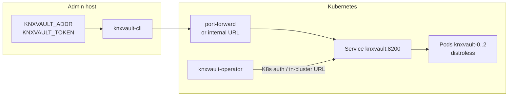

<!--
Copyright Kubenexis Systems Private Limited.
SPDX-License-Identifier: CC-BY-4.0
-->

# Kubernetes knxvault: host CLI Day-0 and Day-2

One coherent guide for **administering knxvault in Kubernetes with `knxvault-cli`**. The server runs as **distroless pods**; the CLI runs on an **admin workstation or jump host** and talks only to the HTTP API (via port-forward or an internal Service/Ingress URL).

| Field | Value |
|-------|-------|
| **Audience** | Operators installing or running knxvault on Kubernetes who will use the CLI for unseal, health, secrets, PKI, and backup |
| **Day-0** | Keys → image → apply manifests → reach API → unseal → CLI smoke → policies/roles → (optional) operator TLS → acceptance |
| **Day-2** | Doctor/ready, unseal after restart, backup, upgrades, seal, app onboarding via CLI + CRDs |
| **Companion** | Full platform narrative (why, custody, multi-share): [operator runbook](operator-runbook.md) |
| **Not this guide** | Standalone containerd without K8s — [standalone Day-0/Day-2](standalone-distroless-day0-day2.md) |
| **Images / registry** | [Build and deploy images](build-and-deploy-images.md) |

```text
Day-0  =  empty cluster  →  knxvault HA + admin path via knxvault-cli
Day-2  =  restarts, backups, upgrades, incidents (CLI + kubectl; never shell into pods)
```

---

## 1. Mental model (read this first)

### Three planes

| Plane | Component | Where |
|-------|-----------|--------|
| **Data / control** | `knxvault` StatefulSet (distroless) | Cluster |
| **Platform** | kubectl, manifests, operator CRDs, CSI | Cluster + GitOps |
| **Admin client** | `knxvault-cli` | **Laptop / jump host** (outside the pod) |



### What the CLI does **not** do

- Does **not** use the Kubernetes API to find knxvault  
- Does **not** `kubectl exec` into distroless pods  
- Does **not** discover Docker/containerd  

It only calls an **API base URL**. You create that URL with one of:

| Method | When | Example `KNXVAULT_ADDR` |
|--------|------|-------------------------|
| **Port-forward** | Lab / first install | `http://127.0.0.1:8200` |
| **Internal Service** | Jump host in-cluster network | `https://knxvault.knxvault.svc:8200` |
| **Ingress / LB** | Prod admin path (prefer TLS) | `https://knxvault.admin.example` |

| Source | How to set |
|--------|------------|
| Env | `export KNXVAULT_ADDR=…` / `export KNXVAULT_TOKEN=…` |
| Flag | `knxvault-cli --addr … --token …` |
| Config | `~/.knxvault/config.yaml` → `addr` / `token` |
| Default | `http://localhost:8200` (works **only** with a local port-forward or published port) |

Full command surface: [CLI reference](../cli/reference.md).

### Distroless pods

Production image is always multi-stage → **`gcr.io/distroless/static-debian13:nonroot`**, **native Go PKI** (no OpenSSL in the image). Plan admin via **CLI/API**, not interactive shells in pods.

### kubectl vs knxvault-cli

| Use **kubectl** for | Use **knxvault-cli** for |
|---------------------|---------------------------|
| Apply STS/Service/RBAC/CRDs | Unseal / seal |
| Port-forward | `doctor`, `health`, `status` |
| Watch pods / operator status | KV, PKI issue/renew/revoke |
| Operator Certificate CRDs | Policies/roles (API), backup create/restore |
| CSI / Secret inspection | Token create (API or CLI where available) |

---

## 2. Prerequisites

| Requirement | Notes |
|-------------|--------|
| Kubernetes | 1.28+ (or supported version); capacity for **3** knxvault replicas in production HA |
| StorageClass | Raft PVCs |
| Registry | Distroless knxvault (and operator) images |
| `kubectl` | Create namespace, RBAC, STS, CRDs |
| Host tools | `make build-cli` → `build/bin/knxvault-cli`; optional `curl`/`jq`; `openssl` **only** for key generation |
| Offline custody | Place for master / unseal / root **outside** Git |

---

# Part A — Day-0 (CLI-centered)

Day-0 ends when every box in **§A9 Acceptance** is checked.

## A1. Generate credentials

On a trusted admin host:

```bash
openssl rand -base64 32    # MASTER  → KNXVAULT_MASTER_KEY
openssl rand -base64 32    # UNSEAL  → KNXVAULT_UNSEAL_KEY  (must differ from master)
openssl rand -base64 24    # ROOT    → KNXVAULT_ROOT_TOKEN
# optional audit HMAC
openssl rand -base64 32    # → KNXVAULT_AUDIT_SIGNING_KEY
```

Store offline; put values into the Kubernetes Secret via your sealed-secrets / external pipeline — never commit real values. Custody: [operator security](operator-security.md).

## A2. Build CLI and image

```bash
cd /path/to/knxvault
make container-build    # distroless ghcr.io/kubenexis/knxvault:<version>
make build-cli       # build/bin/knxvault-cli on admin host
# push image to registry; set image: in StatefulSet
```

## A3. Install platform (kubectl)

Minimal apply set (detail and ordering: [operator runbook §B4](operator-runbook.md), [kubernetes deploy](../deploy/kubernetes.md)):

```bash
kubectl apply -f deployments/k8s/namespace.yaml
kubectl apply -f deployments/k8s/serviceaccount.yaml
kubectl apply -f deployments/k8s/role.yaml
kubectl apply -f deployments/k8s/rolebinding.yaml
kubectl apply -f deployments/k8s/clusterrole-tokenreview.yaml
kubectl apply -f deployments/k8s/configmap.yaml
# secret.yaml: REPLACE_ME → real master / unseal / root (prefer sealed pipeline)
kubectl apply -f deployments/k8s/secret.yaml
kubectl apply -f deployments/k8s/service-raft.yaml
kubectl apply -f deployments/k8s/statefulset.yaml
kubectl apply -f deployments/k8s/service.yaml

kubectl -n knxvault get pods -w
# expect knxvault-0..2 Running (prod) — still sealed until §A5
```

## A4. Reach the API for the CLI

### Lab / first install (port-forward)

```bash
kubectl -n knxvault port-forward svc/knxvault 8200:8200
# leave this running in another terminal
```

```bash
export KNXVAULT_ADDR=http://127.0.0.1:8200
export KNXVAULT_TOKEN='<root-token-from-secret>'

# optional
mkdir -p ~/.knxvault && chmod 700 ~/.knxvault
cat > ~/.knxvault/config.yaml <<EOF
addr: http://127.0.0.1:8200
token: <root-token>
EOF
chmod 600 ~/.knxvault/config.yaml
```

### Production-style admin path

Prefer HTTPS to an internal Service or admin Ingress; set `KNXVAULT_ADDR` to that URL and use a **scoped** admin token (not long-lived root). TLS client/server options: [configuration](../installation/configuration.md).

## A5. Unseal (required for writes)

Pods start **sealed** when Raft + unseal key are configured. CLI:

```bash
export KNXVAULT_ADDR=http://127.0.0.1:8200   # or your URL
export KNXVAULT_TOKEN='<root-or-admin-token>'

# Prefer offline custody of the unseal value (not only the live Secret):
./build/bin/knxvault-cli sys unseal "$KNXVAULT_UNSEAL_KEY"

./build/bin/knxvault-cli status
# want sealed:false; Raft ready when HA is up

./build/bin/knxvault-cli doctor --json
# want healthy:true, fail:0  (HTTP may warn in lab)
```

Equivalent HTTP: [seal recipe](../recipes/seal-and-unseal.md). Multi-share: same recipe + lab E2E notes.

**Document now:** who unseals after STS restarts, and whether an auto-unseal Job is allowed.

## A6. CLI smoke (secrets + native PKI)

```bash
./build/bin/knxvault-cli health
./build/bin/knxvault-cli kv put day0/smoke value=ok
./build/bin/knxvault-cli kv get day0/smoke --show-secrets

./build/bin/knxvault-cli pki root --name platform-root --common-name "Platform Root" --ttl 8760h
./build/bin/knxvault-cli pki issue --role platform-root \
  --common-name app.example.svc \
  --dns app.example.svc \
  --ttl 720h
```

PKI deep dive: [pki-administration.md](pki-administration.md).

## A7. Bootstrap policies and K8s roles (API via curl or automation)

Still with root (or platform-admin) token. Example policies/roles match [operator runbook §B6](operator-runbook.md) (operator SA + app SA). Minimum intent:

1. Policy for operator PKI paths  
2. Policy for app KV prefix  
3. Roles with `auth_method: kubernetes` bound to ServiceAccount names/namespaces  
4. TokenReview RBAC already applied (`clusterrole-tokenreview.yaml`)  

Issue a scoped platform-admin token and **stop daily root use**:

```bash
curl -s -X POST "$KNXVAULT_ADDR/auth/token/create" \
  -H "Authorization: Bearer $KNXVAULT_TOKEN" \
  -H 'Content-Type: application/json' \
  -d '{
    "subject": "platform-admin",
    "policies": ["platform-admin"],
    "ttl": "720h",
    "renewable": true
  }'
# save client_token offline; export KNXVAULT_TOKEN=<that> for Day-2
```

## A8. Optional same day: operator + first TLS Secret

Platform cert factory (not required for CLI-only smoke):

```bash
make build-operator
kubectl apply -f deployments/operator/crds/
kubectl apply -f deployments/operator/rbac.yaml
# deploy operator with in-cluster:
#   KNXVAULT_ADDR=http://knxvault.knxvault.svc:8200
#   KNXVAULT_K8S_ROLE=knxvault-operator

kubectl apply -f deployments/operator/samples/certificate-example.yaml
kubectl get knxvaultca,knxvaultclusterissuer -A
kubectl -n default get knxvaultcertificate,secret
```

Guide: [Replace cert-manager](pki-replace-cert-manager.md). If CA stays Pending with “vault is sealed”, return to **§A5**.

## A9. Day-0 acceptance checklist

- [ ] Master / unseal / root offline + K8s Secret (not in Git)  
- [ ] Distroless image in registry; pods Running (no crash on missing unseal key)  
- [ ] Admin path: port-forward **or** documented HTTPS URL; `KNXVAULT_ADDR` set for CLI  
- [ ] Unsealed; `knxvault-cli status` / `/ready` → `sealed:false`, Raft ready (prod)  
- [ ] `knxvault-cli doctor --json` → `healthy:true`, `fail:0`  
- [ ] KV smoke + PKI root/leaf via CLI  
- [ ] Operator policy/role baseline (if using operator)  
- [ ] Optional: first `KNXVaultCertificate` → TLS Secret  
- [ ] Documented unseal-after-restart procedure  
- [ ] Root is break-glass only  

**Day-0 complete → Part B.**

---

# Part B — Day-2 (CLI-centered)

## B1. Daily / continuous health

```bash
export KNXVAULT_ADDR=…   # port-forward or prod URL
export KNXVAULT_TOKEN=…  # scoped admin

./build/bin/knxvault-cli doctor --json
./build/bin/knxvault-cli health
./build/bin/knxvault-cli status
```

| Signal | Action if bad |
|--------|----------------|
| `sealed:true` | Unseal (§B2) |
| doctor `fail>0` | Read check messages; TLS warn is lab-only |
| No Raft leader | [Raft failover](runbooks/raft-failover.md); check pods/PVCs/network |
| Operator not Ready | Operator logs; sealed vault; TokenReview |

Broader metrics/alerts tables: [day2.md](day2.md), [operator runbook Part C](operator-runbook.md).

## B2. After every pod restart (unseal)

STS rollout, drain, OOM → pods return **sealed**.

```bash
# ensure API reachability (port-forward if needed)
./build/bin/knxvault-cli sys unseal "$KNXVAULT_UNSEAL_KEY"
./build/bin/knxvault-cli doctor --json
```

Operator and apps fail closed until unsealed.

## B3. Backup

```bash
./build/bin/knxvault-cli backup create -o "knxvault-$(date +%F).json"
```

Also keep platform PVC snapshots and Secret custody. Restore needs the **same master key**: [backup-restore](../deploy/backup-restore.md).

## B4. Upgrades (CLI gates)

1. `knxvault-cli backup create`  
2. Roll knxvault image (StatefulSet) via kubectl/GitOps  
3. Restore API access; **unseal**  
4. `knxvault-cli doctor --json`  
5. Smoke: `kv get` known path (values `[REDACTED]` by default; use `--show-secrets` only when needed); optional `pki issue` or Certificate renew  
6. Roll operator if needed  

## B5. Incident seal

```bash
./build/bin/knxvault-cli sys seal
# … contain …
./build/bin/knxvault-cli sys unseal "$KNXVAULT_UNSEAL_KEY"
```

CA compromise: [ca-compromise](runbooks/ca-compromise.md).

## B6. Onboard an application (repeatable)

| Step | Tool |
|------|------|
| Policy for `secrets/kv/<app>/*` | API / automation (see runbook §B6 patterns) |
| Role → app ServiceAccount | API |
| Write secrets | `knxvault-cli kv put app/<name> …` |
| Deliver secrets | CSI / ESO — [secrets injection](../deploy/secrets-injection.md) |
| **Private** TLS Secret | Operator Vault issuer / CLI `pki issue` |
| **Public** Let's Encrypt TLS | Operator **ACME** issuer (`KNXVaultClusterIssuer` `spec.acme`) — sample `deployments/operator/samples/acme-clusterissuer-example.yaml` |

### B6.1 ACME / Let's Encrypt (Kubernetes)

In-cluster automation uses **knxvault-operator** ACME mode (not `knxvault-cli pki`):

1. Deploy operator + CRDs.  
2. Apply ACME `KNXVaultClusterIssuer` (staging first).  
3. Apply `KNXVaultCertificate` → `kubernetes.io/tls` Secret.  
4. Point Ingress TLS at that Secret.

**Host CLI ACME** (`knxvault-cli acme`) is for **standalone / edge host files**, not a replacement for operator-managed Secrets. Use CLI ACME when you terminate TLS on a host next to containerd, or for lab without CRDs.

```bash
# Operator path (preferred in-cluster)
kubectl apply -f deployments/operator/samples/acme-clusterissuer-example.yaml
# + KNXVaultCertificate referencing that issuer

# Host edge path (files on admin/jump host)
knxvault-cli acme issue --config /etc/knxvault/acme.d/edge.yaml
```

Design: [acme-letsencrypt-unified.md](../design/acme-letsencrypt-unified.md).

## B7. Troubleshooting (CLI + K8s)

| Symptom | Likely cause | Action |
|---------|--------------|--------|
| CLI connection refused | No port-forward / wrong `KNXVAULT_ADDR` | `kubectl port-forward` or fix Service URL |
| doctor fails TLS | Lab HTTP | Expected warn; enable HTTPS for prod |
| sealed forever | Never unsealed after restart | §B2 |
| Unseal / master crash | Secret wrong or equal keys | Fix Secret; regenerate unseal if equal |
| Operator “vault is sealed” | Same | Unseal via CLI |
| TokenReview 401 | Missing clusterrole | Apply tokenreview RBAC |
| KV 403 | Policy/role | Fix paths; re-bind SA |
| Wanted `kubectl exec` into vault | Distroless | Use CLI/API only |
| `KNXVAULT_PKI_BACKEND=openssl` | Removed | Do not set; native only |

---

## 3. Related documents

| Topic | Document |
|-------|----------|
| Full K8s Day-0/Day-2 narrative | [Operator runbook](operator-runbook.md) |
| Standalone (no K8s) | [Standalone distroless Day-0/Day-2](standalone-distroless-day0-day2.md) |
| Day-2 tables (leases, audit, rolling upgrade) | [day2.md](day2.md) |
| CLI flags and commands | [CLI reference](../cli/reference.md) |
| Manifests | [Kubernetes deploy](../deploy/kubernetes.md) · `deployments/k8s/` |
| Configuration env | [configuration.md](../installation/configuration.md) |
| Replace cert-manager | [pki-replace-cert-manager.md](pki-replace-cert-manager.md) |
| Seal / Shamir | [seal-and-unseal](../recipes/seal-and-unseal.md) |

---

## 4. Quick copy-paste (lab happy path)

```bash
# --- keys offline; fill Secret; push image ---
make container-build && make build-cli
# kubectl apply … (manifests + secret) …

kubectl -n knxvault port-forward svc/knxvault 8200:8200 &
export KNXVAULT_ADDR=http://127.0.0.1:8200
export KNXVAULT_TOKEN='<root>'
export KNXVAULT_UNSEAL_KEY='<unseal>'

./build/bin/knxvault-cli sys unseal "$KNXVAULT_UNSEAL_KEY"
./build/bin/knxvault-cli doctor --json
./build/bin/knxvault-cli kv put day0/ok v=1
./build/bin/knxvault-cli pki root --name root --common-name "Lab Root" --ttl 8760h
```

**Story in one line:** Kubernetes runs distroless knxvault; **you** open a network path to `:8200` and run **host `knxvault-cli`** with `KNXVAULT_ADDR` / token — same client model as standalone, different way to publish the API.
