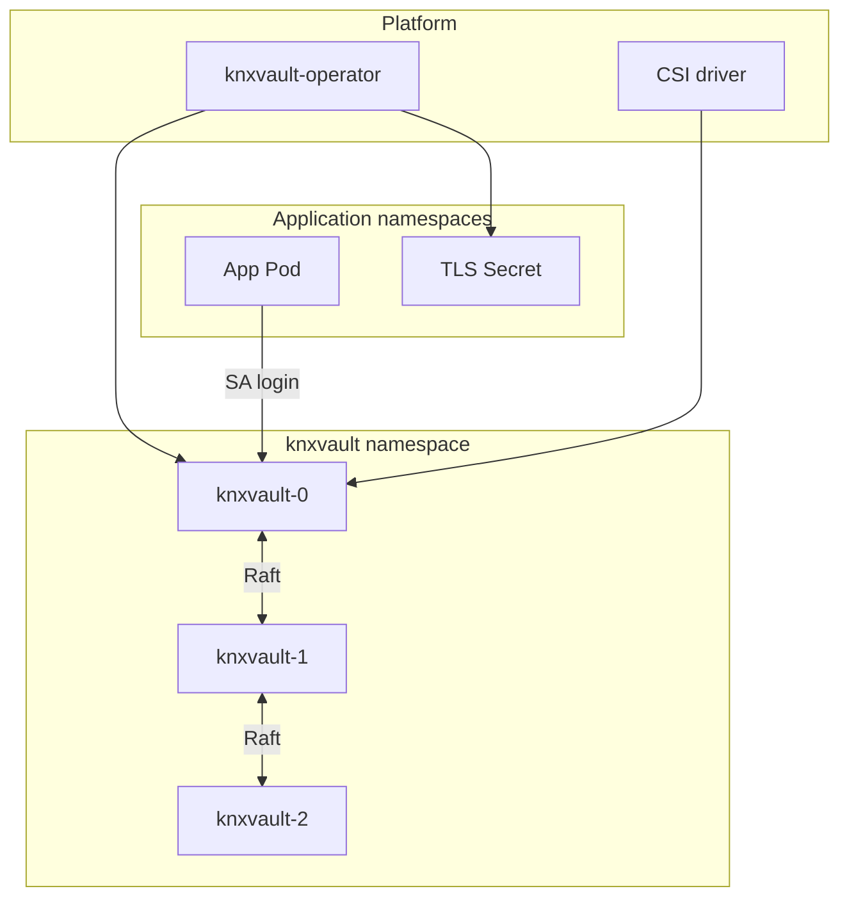
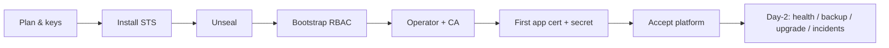
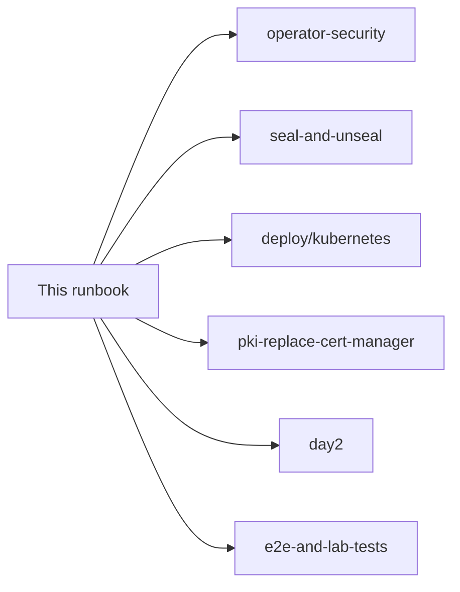

# KNXVault operator runbook (Day-0 + Day-2)

A single end-to-end guide for **Kubernetes platform** installs: **what KNXVault is**, how to **bring it up the first time (Day-0)**, and how to **keep it healthy (Day-2)**.

| Field | Value |
|-------|-------|
| **Audience** | Smart administrators with limited Linux/crypto depth who will dig into linked docs when needed |
| **Day-0** | Plan → generate keys → install → unseal → bootstrap policies → operator + first CA/cert → first secret → accept the platform |
| **Day-2** | Health, unseal after restart, backup, upgrades, seal incidents, scale |
| **Not required** | Deep cryptography, HashiCorp Vault expertise, or Let’s Encrypt |
| **Not this guide** | Single-host / containerd-only (no K8s) — use [Standalone distroless + host CLI](standalone-distroless-day0-day2.md) |
| **CLI-first K8s path** | Same cluster story with emphasis on `knxvault-cli` — [Kubernetes CLI Day-0 / Day-2](kubernetes-cli-day0-day2.md) |

```text
Day-0  =  empty cluster  →  knxvault serving secrets & certs for apps
Day-2  =  everything after acceptance (restarts, backups, upgrades, incidents)
```

**Deep dives** (when this runbook points you there):

| Topic | Document |
|-------|----------|
| Why secrets platforms exist | [Dummies guide](../user/dummies-guide.md) |
| Key custody checklist | [Operator security](operator-security.md) |
| Seal / multi-share | [Seal and unseal](../recipes/seal-and-unseal.md) |
| K8s manifests detail | [Kubernetes deployment](../deploy/kubernetes.md) |
| TLS without cert-manager | [Replace cert-manager](pki-replace-cert-manager.md) |
| Day-2 tables | [Day-2 operations](day2.md) |
| **Standalone (no K8s)** distroless + host CLI | [Standalone Day-0 / Day-2](standalone-distroless-day0-day2.md) |
| **Kubernetes + host CLI** (CLI-first Day-0/Day-2) | [Kubernetes CLI Day-0 / Day-2](kubernetes-cli-day0-day2.md) |
| **Build images / what to ship** | [Build and deploy images](build-and-deploy-images.md) |
| Lab proof | [E2E and lab tests](../engineering/e2e-and-lab-tests.md) |
| Post-quantum (future) | [docs/pq/](../pq/README.md) — dual planes, g1/g2; Harbor stays classical (**g1**) |

---

# Part A — What you are installing

## A1. What is KNXVault?

**KNXVault is a self-hosted secrets manager and private certificate authority (PKI)** for platforms—especially Kubernetes.

It:

1. **Stores secrets** (API keys, passwords, config) **encrypted**.
2. **Issues TLS certificates** for your apps (private CA)—no Let’s Encrypt or cert-manager required for in-cluster TLS.
3. **Authenticates and authorizes** callers (ServiceAccounts, tokens, optional OIDC/AppRole).
4. **Audits** access.
5. **Runs as a small HA cluster** (typically 3 pods) using **Raft** so members agree on data.

It is **Vault-like**, not a full HashiCorp Vault clone. Focus: KV, private PKI, Kubernetes auth, CSI, and a **native operator** that writes `kubernetes.io/tls` Secrets.

| Application need | How they get it |
|------------------|-----------------|
| TLS for Ingress / Services | Operator → `KNXVaultCertificate` → TLS Secret |
| Config / API keys | CSI mount or External Secrets from KV |
| Login without passwords in YAML | Kubernetes ServiceAccount JWT → knxvault |

| Not this | Why |
|----------|-----|
| Free Let’s Encrypt | This runbook is **private CA only** |
| Full Vault API | Only a thin **Vault product profile** (`/v1/*`) for optional cert-manager dual-run |
| “No keys to manage” | You **must** create and protect **master** + **unseal** keys |

## A2. Mental model (read once)

### Master key vs unseal key

| Name | Env var | Job | Analogy |
|------|---------|-----|---------|
| **Master key** | `KNXVAULT_MASTER_KEY` | Encrypts secret material on disk / Raft | Combination for the *contents of the safe* |
| **Unseal key** | `KNXVAULT_UNSEAL_KEY` | Allows the API to serve secrets after start or seal | Key for the *office door* |

With production Raft they **must differ**. Startup fails if unseal is missing or equals master.

### Start sealed is a security feature

```text
Process start → SEALED → (unseal with key or shares) → UNSEALED → apps work
```

- Sealed ≠ data deleted.  
- Sealed = API will not serve secrets until authorized.  
- Disk/`seal.state` alone **cannot** reopen the vault.  

### Architecture



### Lifecycle: Day-0 vs Day-2



---

# Part B — Day-0 (bring the platform to life)

Day-0 ends only when you can check every box in **§B9 Acceptance**.

## B1. Day-0 goals and success criteria

| Goal | Done when |
|------|-----------|
| knxvault cluster running | 3 pods Running (or 1 for lab), Raft ready |
| Data plane open | `/ready` shows `"sealed":false` |
| Admin access | You have a token; root plan is to retire it |
| Policies exist | At least app + operator policies |
| Private CA exists | `KNXVaultCA` Ready (or equivalent API CA) |
| First TLS Secret | Sample `KNXVaultCertificate` issued |
| First KV secret | Written and readable by an authorized path |
| Docs for the team | Where keys live, how to unseal after restart |

## B2. Plan (before you type kubectl)

Answer these on paper or in your change ticket:

| Question | Typical answer |
|----------|----------------|
| Production or lab? | Prod = 3 Raft pods; lab can be 1 |
| Who holds master + unseal offline? | Named people / password manager / HSM |
| Who may unseal after restart? | Human vs automated Job (document trust) |
| How are Secrets kept out of Git? | Sealed Secrets / SOPS / ESO / cloud SM |
| Who backs up PVCs + Secret? | Platform team |
| First app to onboard? | Name + DNS name for TLS |
| Do you need cert-manager dual-run? | Prefer **no** for greenfield |

### Prerequisites checklist

- [ ] Kubernetes 1.28+ (or documented supported version)  
- [ ] StorageClass for Raft PVCs  
- [ ] Capacity for 3 knxvault pods (prod)  
- [ ] Registry for the knxvault (and operator) image  
- [ ] `kubectl` with rights to create namespace, RBAC, STS, CRDs  
- [ ] `openssl` on an admin machine  
- [ ] Out-of-band place to store master/unseal/root (not only the cluster)  

## B3. Generate credentials (Day-0 key ceremony)

Do this on a **trusted admin host**, not a random shared pod.

```bash
# Run each command separately; save outputs offline immediately
openssl rand -base64 32    # MASTER  → KNXVAULT_MASTER_KEY
openssl rand -base64 32    # UNSEAL  → KNXVAULT_UNSEAL_KEY  (must differ from master)
openssl rand -base64 32    # optional audit HMAC → KNXVAULT_AUDIT_SIGNING_KEY
# Root bootstrap token: long random string (example)
openssl rand -base64 24    # → KNXVAULT_ROOT_TOKEN
```

| Secret | If lost | If leaked |
|--------|---------|-----------|
| Master | Cannot decrypt data/backups | Offline decrypt of stolen disks/backups |
| Unseal | Cannot open sealed API | Attacker may open API if they can reach unseal |
| Root token | Lose bootstrap admin | Full control until rotated |

**Protect (minimum):**

1. Never commit real values to Git.  
2. Store in Sealed Secrets / external secret manager / offline vault.  
3. Restrict `get secrets` RBAC on the knxvault Secret.  
4. Back up master + unseal offline with dual control if required by policy.  
5. Plan to **stop using root** after bootstrap (§B6).  

Details: [Operator security §5](operator-security.md#5-master-key-and-unseal-key-custody).

**Optional multi-share:** for multi-person unseal, set threshold later and split with `go run ./scripts/shamir-split` — see [seal recipe](../recipes/seal-and-unseal.md). For most Day-0 platforms, use **single unseal key** first.

## B4. Install knxvault (Kubernetes Day-0)

### B4.1 Build and publish image

```bash
cd /path/to/knxvault
make container-build
# docker tag / push to your registry
# set image: in deployments/k8s/statefulset.yaml
```

### B4.2 Create the Secret

Use [`deployments/k8s/secret.yaml`](../../deployments/k8s/secret.yaml) as a template. Replace every `REPLACE_ME`:

| Key | Required |
|-----|----------|
| `KNXVAULT_MASTER_KEY` | Yes |
| `KNXVAULT_UNSEAL_KEY` | Yes (Raft STS) |
| `KNXVAULT_ROOT_TOKEN` | Yes (bootstrap) |
| `KNXVAULT_AUDIT_SIGNING_KEY` | Recommended |

Prefer creating the Secret via your sealed-secrets pipeline rather than a plain file in Git.

### B4.3 Apply platform manifests

```bash
kubectl apply -f deployments/k8s/namespace.yaml
kubectl apply -f deployments/k8s/serviceaccount.yaml
kubectl apply -f deployments/k8s/role.yaml
kubectl apply -f deployments/k8s/rolebinding.yaml
kubectl apply -f deployments/k8s/clusterrole-tokenreview.yaml
kubectl apply -f deployments/k8s/configmap.yaml
kubectl apply -f deployments/k8s/secret.yaml
kubectl apply -f deployments/k8s/service-raft.yaml
kubectl apply -f deployments/k8s/statefulset.yaml
kubectl apply -f deployments/k8s/service.yaml
```

```bash
kubectl -n knxvault get pods -w
# wait until knxvault-0..2 are Running (or your replica count)
```

**Expected:** pods Running, but the **service is still sealed**. Logs may show healthy HTTP while `/ready` reports `"sealed":true`.

### B4.4 Network access for admin

```bash
# Lab / first install: port-forward
kubectl -n knxvault port-forward svc/knxvault 8200:8200
export KNXVAULT_ADDR=http://127.0.0.1:8200
export KNXVAULT_TOKEN='<your-root-token>'
```

In production, prefer an internal admin network path and **HTTPS**.

## B5. Day-0 unseal (open the data plane)

Without this step, **Day-0 is incomplete**. Operator CA create, KV write, and PKI issue will fail with “vault is sealed”.

### Single-key unseal

```bash
export KNXVAULT_UNSEAL_KEY='<same base64 value as in the Secret>'

curl -s -X POST "$KNXVAULT_ADDR/sys/unseal" \
  -H 'Content-Type: application/json' \
  -d "{\"key\":\"$KNXVAULT_UNSEAL_KEY\"}"

curl -s "$KNXVAULT_ADDR/ready" | jq .
# want: "status":"ready", "sealed":false
# with Raft: "raft_ready":true (and a leader exists in the cluster)
```

### Verify with doctor

```bash
# build CLI if needed: make build-cli
./bin/knxvault-cli doctor --json
# want: "healthy": true, "fail": 0
# HTTP (not HTTPS) may warn in lab — fix TLS for production
```

### Smoke the API as root (temporary)

```bash
./bin/knxvault-cli health
./bin/knxvault-cli kv put day0/smoke value=ok
./bin/knxvault-cli kv get day0/smoke --show-secrets
```

**Plan for restarts now:** document whether humans unseal after STS restarts or an **auto-unseal Job** will call the same API using the Secret. Start-sealed remains the security model either way.

## B6. Day-0 bootstrap (RBAC and retire root)

Still using the root token only for this section.

### B6.1 Create baseline policies

```bash
export KNXVAULT_ADDR=http://127.0.0.1:8200   # or your URL
export KNXVAULT_TOKEN='<root-token>'

# App can read its KV prefix
curl -s -X PUT "$KNXVAULT_ADDR/sys/policies/app-reader" \
  -H "Authorization: Bearer $KNXVAULT_TOKEN" \
  -H 'Content-Type: application/json' \
  -d '{
    "paths": {
      "secrets/kv/app/*": {"capabilities": ["read", "list"]}
    }
  }'

# Operator needs PKI issue/renew/sign (adjust to your path model)
curl -s -X PUT "$KNXVAULT_ADDR/sys/policies/knxvault-operator" \
  -H "Authorization: Bearer $KNXVAULT_TOKEN" \
  -H 'Content-Type: application/json' \
  -d '{
    "paths": {
      "pki/*": {"capabilities": ["create", "read", "update", "list"]},
      "sys/policies/*": {"capabilities": ["read"]},
      "sys/roles/*": {"capabilities": ["read"]}
    }
  }'

# Human platform admin (narrow later)
curl -s -X PUT "$KNXVAULT_ADDR/sys/policies/platform-admin" \
  -H "Authorization: Bearer $KNXVAULT_TOKEN" \
  -H 'Content-Type: application/json' \
  -d '{
    "paths": {
      "secrets/kv/*": {"capabilities": ["create", "read", "update", "list", "delete"]},
      "pki/*": {"capabilities": ["create", "read", "update", "list"]},
      "sys/*": {"capabilities": ["create", "read", "update", "list", "sudo"]}
    }
  }'
```

More patterns: [RBAC recipe](../recipes/rbac-policies.md).

### B6.2 Bind Kubernetes ServiceAccounts to roles

```bash
# Operator SA (namespace knxvault — match your operator SA name)
curl -s -X PUT "$KNXVAULT_ADDR/sys/roles/knxvault-operator" \
  -H "Authorization: Bearer $KNXVAULT_TOKEN" \
  -H 'Content-Type: application/json' \
  -d '{
    "policies": ["knxvault-operator"],
    "auth_method": "kubernetes",
    "bound_service_account_names": ["knxvault-operator"],
    "bound_service_account_namespaces": ["knxvault"]
  }'

# Example app SA
curl -s -X PUT "$KNXVAULT_ADDR/sys/roles/demo-app" \
  -H "Authorization: Bearer $KNXVAULT_TOKEN" \
  -H 'Content-Type: application/json' \
  -d '{
    "policies": ["app-reader"],
    "auth_method": "kubernetes",
    "bound_service_account_names": ["demo-app"],
    "bound_service_account_namespaces": ["default"]
  }'
```

Confirm TokenReview works: knxvault’s ServiceAccount must be allowed to create `tokenreviews` (`clusterrole-tokenreview.yaml` from §B4.3).

### B6.3 Issue a scoped admin token (then stop daily root use)

```bash
curl -s -X POST "$KNXVAULT_ADDR/auth/token/create" \
  -H "Authorization: Bearer $KNXVAULT_TOKEN" \
  -H 'Content-Type: application/json' \
  -d '{
    "subject": "platform-admin",
    "policies": ["platform-admin"],
    "ttl": "720h",
    "renewable": true
  }'
# Save client_token offline as the human admin token
```

**Day-0 hygiene:** after acceptance, treat root as break-glass only (or revoke after a second admin path exists).

## B7. Day-0 certificate platform (no cert-manager)

### B7.1 Install operator

```bash
make build-operator   # or use your image
kubectl apply -f deployments/operator/crds/
kubectl apply -f deployments/operator/rbac.yaml
# Deploy operator (see deployments/operator/) with:
#   KNXVAULT_ADDR=http://knxvault.knxvault.svc:8200
#   KNXVAULT_K8S_ROLE=knxvault-operator   # preferred: SA login
#   or KNXVAULT_TOKEN=... for lab only
```

Guide: [Replace cert-manager](pki-replace-cert-manager.md).

### B7.2 First CA + issuer + certificate

Apply the sample (or your GitOps copy):

```bash
kubectl apply -f deployments/operator/samples/certificate-example.yaml
```

That creates roughly:

- `KNXVaultCA/platform-root`  
- `KNXVaultClusterIssuer/platform`  
- `KNXVaultCertificate/app-tls` → Secret `app-tls`  

Wait and verify:

```bash
kubectl get knxvaultca -A
kubectl get knxvaultclusterissuer
kubectl -n default get knxvaultcertificate app-tls -o yaml
kubectl -n default get secret app-tls
# want: Ready conditions true; Secret has tls.crt / tls.key
```

If CA stays Pending with “vault is sealed”, return to **§B5**.

## B8. Day-0 application secret (KV)

As admin:

```bash
export KNXVAULT_TOKEN='<platform-admin-or-root>'
./bin/knxvault-cli kv put app/demo api_key=day0-example
./bin/knxvault-cli kv get app/demo --show-secrets
```

**Optional same day:** install CSI ([CSI install](../deploy/csi-install.md)) and mount `app/demo` into a test pod with SA `demo-app`. Can be Day-0.5 if TLS is the only Day-0 must-have.

## B9. Day-0 acceptance checklist

Check every box before calling Day-0 complete:

- [ ] Secrets for master/unseal/root stored **out of Git** and offline backup known  
- [ ] knxvault pods Running; no crash loop on missing unseal  
- [ ] `/ready` → `sealed:false`, Raft ready (prod)  
- [ ] `knxvault-cli doctor --json` → `healthy:true`, `fail:0`  
- [ ] Policies + roles for operator (and at least one app)  
- [ ] Operator running; ClusterIssuer Ready  
- [ ] At least one TLS Secret issued  
- [ ] At least one KV path written  
- [ ] Documented: **how to unseal after pod restart**  
- [ ] Documented: who holds keys; who is on-call  
- [ ] Root token usage minimized / break-glass plan  
- [ ] Alerts requested: sealed, no leader, operator not Ready  

**Day-0 complete → hand off to Day-2.**

---

# Part C — Day-2 (operate after acceptance)

Day-2 assumes Day-0 acceptance is done. Short tables live in [day2.md](day2.md); this section is the operational narrative.

## C1. Health and monitoring

| Check | Command / path | Good |
|-------|----------------|------|
| Liveness | `GET /health` | `status: healthy` |
| Ready | `GET /ready` | `sealed:false`, `raft_ready:true` |
| Doctor | `knxvault-cli doctor --json` | `healthy:true`, `fail:0` |
| Metrics | `GET /metrics` | scraped by Prometheus |

**Alert on:**

- `sealed=true` longer than a few minutes  
- No Raft leader  
- Operator ClusterIssuer / Certificate stuck not Ready  
- PVC almost full (platform)  

## C2. After every restart (unseal)

Restarts (node drain, STS rollout, OOM) return pods to **sealed**.

```bash
# Same as Day-0 §B5 — automate if your trust model allows
curl -s -X POST "$KNXVAULT_ADDR/sys/unseal" \
  -H 'Content-Type: application/json' \
  -d "{\"key\":\"$KNXVAULT_UNSEAL_KEY\"}"
```

Until unsealed: apps and operator vault-mode operations fail closed.

## C3. Backup and restore awareness

| Layer | Owner | Notes |
|-------|-------|-------|
| PVC / volume snapshots | Platform | Raft data (ciphertext) |
| K8s Secret (master/unseal) | Platform / security | Without this, ciphertext is useless |
| Encrypted `backup create` | Optional knxvault | Portable app-level backup |

```bash
knxvault-cli backup create -o "knxvault-$(date +%F).json"
```

Restore needs the **same master key**. See [Backup & restore](../deploy/backup-restore.md).

## C4. Onboarding a new application (repeatable Day-2)

1. Create policy for `secrets/kv/<app>/*` (and PKI if needed).  
2. Create role bound to app ServiceAccount.  
3. Store secrets: `kv put app/<name> ...`  
4. Deliver: CSI or ESO.  
5. TLS: `KNXVaultCertificate` with DNS names → Secret → Ingress.  

No new knxvault install—only RBAC + data + CRDs.

## C5. Upgrades

1. Backup (platform + optional CLI backup).  
2. Roll knxvault image (StatefulSet).  
3. Unseal (or auto-unseal).  
4. Roll operator if needed.  
5. `doctor --json` + one Certificate renew/issue smoke test.  

## C6. Incident seal

```bash
curl -s -X POST "$KNXVAULT_ADDR/sys/seal" \
  -H "Authorization: Bearer $KNXVAULT_TOKEN"
```

Opens only after deliberate unseal (or multi-share). Practice once a year.

## C7. Scaling and failover

- Prefer **3** Raft voters.  
- See [Raft failover](runbooks/raft-failover.md), [Scaling](runbooks/scaling.md).  

## C8. Optional multi-share (Day-2 hardening)

If policy requires multi-person unseal, introduce threshold and offline shares after Day-0 is stable—not on the critical first-install path unless mandated. [Seal recipe](../recipes/seal-and-unseal.md), lab multi-share E2E.

---

# Part D — Troubleshooting

| Symptom | Phase | Likely cause | Action |
|---------|-------|--------------|--------|
| Crash: unseal required when raft enabled | Day-0 | Missing unseal in Secret | Fix Secret; restart |
| Unseal equals master | Day-0 | Same random value twice | New unseal key |
| `sealed:true` forever | Day-0/2 | Never unsealed | §B5 / §C2 |
| Operator “vault is sealed” | Day-0/2 | Same | Unseal |
| TokenReview / K8s login 401 | Day-0 | Missing TokenReview RBAC | Apply clusterrole-tokenreview |
| CA Pending “not found” | Day-0 | CA create failed / sealed | Unseal; check operator logs |
| KV 403 | Day-2 | Policy/role mismatch | Fix policy paths and SA binding |
| doctor TLS warn | Lab | HTTP | Enable TLS for prod |

---

# Part E — Reference

## E1. Day-0 vs Day-2 quick map

| Activity | Day-0 | Day-2 |
|----------|:-----:|:-----:|
| Generate master/unseal | ✓ | rare (rotation) |
| Install STS + operator | ✓ | upgrades only |
| First unseal | ✓ | after every restart |
| Policies / roles | ✓ baseline | per app |
| First CA / Certificate | ✓ | per app |
| Health alerts | set up | watch |
| Backup schedule | define | execute |
| Seal for incident | practice | as needed |

## E2. One-page command sheet

```bash
# --- Day-0 keys ---
openssl rand -base64 32   # master
openssl rand -base64 32   # unseal (different)

# --- Day-0 / Day-2 unseal ---
curl -s -X POST "$KNXVAULT_ADDR/sys/unseal" \
  -H 'Content-Type: application/json' \
  -d "{\"key\":\"$KNXVAULT_UNSEAL_KEY\"}"

# --- Health ---
curl -s "$KNXVAULT_ADDR/ready" | jq .
knxvault-cli doctor --json

# --- Smoke ---
knxvault-cli kv put day0/smoke value=ok
knxvault-cli kv get day0/smoke --show-secrets

# --- Incident ---
curl -s -X POST "$KNXVAULT_ADDR/sys/seal" -H "Authorization: Bearer $TOKEN"
```

## E3. Document map



| Need | Document |
|------|----------|
| Full env var list | [Configuration](../installation/configuration.md) |
| Local non-K8s install | [Installation](../installation/install.md) |
| CLI | [CLI reference](../cli/reference.md) |
| Recipes | [Recipes index](../recipes/README.md) |
| CA compromise | [ca-compromise](runbooks/ca-compromise.md) |
| Raft disaster | [raft-failover](runbooks/raft-failover.md) |

---

**Remember:** Day-0 is not “pods Running.” Day-0 is **unsealed, bootstrapped, first cert, first secret, and a written unseal plan.** Day-2 is keeping that true after restarts and change.
