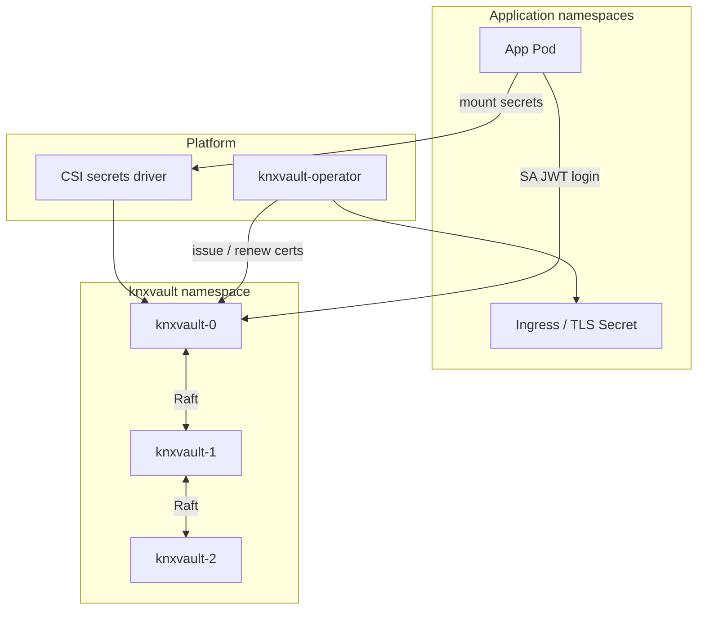
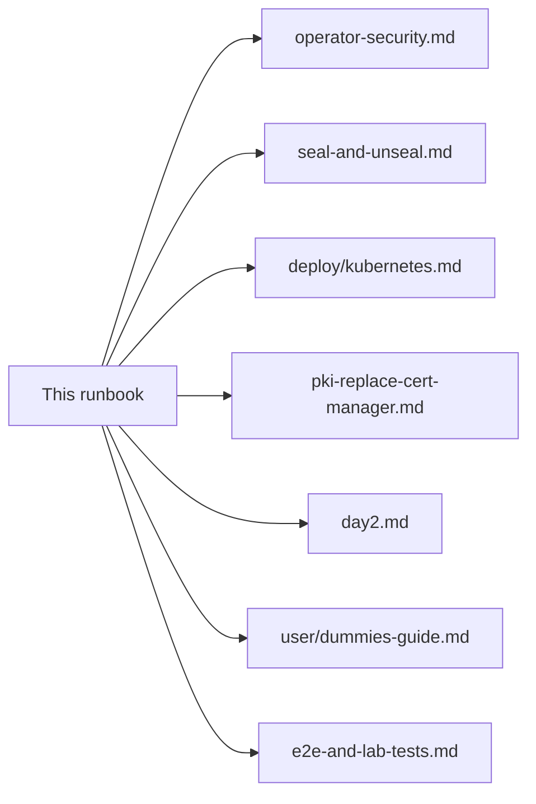

# KNXVault operator runbook (end-to-end)

A single guide for **what KNXVault is**, **how the pieces fit**, and **how to install and run it day to day**.

| Field | Value |
|-------|-------|
| **Audience** | Smart administrators with limited Linux/crypto depth who will dig into linked docs when needed |
| **Scope** | Concepts → keys → install → unseal → apps (certs + secrets) → day-2 → incidents |
| **Not required** | Deep cryptography, HashiCorp Vault expertise, or Let’s Encrypt |

**Related deep dives** (read when this runbook points you there):

| Topic | Document |
|-------|----------|
| Plain-language “why secrets platforms” | [Dummies guide](../user/dummies-guide.md) |
| Key custody checklist | [Operator security](operator-security.md) |
| Seal / unseal / multi-share | [Seal and unseal recipe](../recipes/seal-and-unseal.md) |
| K8s manifests | [Kubernetes deployment](../deploy/kubernetes.md) |
| Replace cert-manager | [PKI replace cert-manager](pki-replace-cert-manager.md) |
| Day-2 tables | [Day-2 operations](day2.md) |
| Test / lab proof | [E2E and lab tests](../engineering/e2e-and-lab-tests.md) |

---

## 1. What is KNXVault?

**KNXVault is a self-hosted secrets manager and private certificate authority (PKI)** for platforms—especially Kubernetes.

In plain terms, it is a service that:

1. **Stores secrets** (API keys, passwords, config) **encrypted**.
2. **Issues TLS certificates** for your apps (private CA)—so you do **not** need Let’s Encrypt or cert-manager for in-cluster TLS.
3. **Decides who may do what** (authentication + policies).
4. **Writes an audit trail** of access.
5. **Runs as a small highly available cluster** (typically 3 pods) that agree on data using **Raft**.

It is **inspired by HashiCorp Vault patterns**, but it is **not** a full Vault clone. It focuses on:

- KV secrets  
- Private PKI  
- Kubernetes auth (ServiceAccounts)  
- Delivering secrets into pods (CSI)  
- A **Kubernetes operator** that writes `kubernetes.io/tls` Secrets for apps  

### What you give applications

| Need | How apps get it |
|------|-----------------|
| TLS for Ingress / Services | Operator creates a TLS Secret from a `KNXVaultCertificate` |
| Config secrets / API keys | CSI mount or External Secrets Operator from KV paths |
| Short-lived DB users (optional) | Dynamic database credentials API |
| Login without passwords in YAML | Kubernetes ServiceAccount JWT → knxvault token |

### What KNXVault is *not*

| Not this | Why |
|----------|-----|
| A free Let’s Encrypt service | Public ACME is optional/advanced; this runbook assumes **private CA only** |
| A full HashiCorp Vault | Only a **Vault product profile** (`/v1/*`) for tools like cert-manager’s Vault issuer |
| Magic “encrypt Git and forget keys” | You must **generate and protect two special keys** (master + unseal) |

---

## 2. Mental model (read this once)

### Two different “keys” (do not mix them up)

Think of a **safe** (encrypted data) and a **door lock** (may the API serve secrets right now?).

| Name | Environment variable | Job | Analogy |
|------|----------------------|-----|---------|
| **Master key** | `KNXVAULT_MASTER_KEY` | Encrypts secret material on disk / in Raft | Combination that protects the *contents of the safe* |
| **Unseal key** | `KNXVAULT_UNSEAL_KEY` | Opens the *service* after start or after `sys/seal` | Key that unlocks the *office door* so staff can open the safe |

- **Master key** is for **cryptography** (envelope encryption). Without it, backups and disk data are useless ciphertext.  
- **Unseal key** is for **operations**. After every process restart, knxvault **starts sealed** on purpose: the process is up, but **writes and secret-bearing APIs stay blocked** until you unseal.

**They must be different values** when Raft (production HA) is on. Reusing one value for both is rejected at startup.

### “Sealed” is a security feature

```text
Pod restarts → knxvault process starts → SEALED
                    │
                    │  POST /sys/unseal  (correct key or enough Shamir shares)
                    ▼
                 UNSEALED → apps, operator, KV, PKI work
```

- **Sealed** does **not** mean “data deleted.”  
- **Sealed** means “this instance refuses to act as an open secrets API until authorized.”  
- A file on disk (`seal.state`) **cannot** reopen the vault by itself.  

If your platform restarts pods often, plan either:

- a **human unseal** after restarts, or  
- an **automated unseal** Job that uses the unseal key from a tightly controlled Secret (same trust as storing the key in the cluster at all).

### High-level architecture



---

## 3. Generate and protect the credentials

You need three secrets for a real install. Generate them on a trusted machine (your admin laptop or a secure bastion)—**not** inside a random debug pod that everyone can `kubectl exec` into.

### 3.1 Generate

```bash
# High-entropy 32-byte values, printed as base64 text (safe to put in env vars)
openssl rand -base64 32    # → MASTER  (save as KNXVAULT_MASTER_KEY)
openssl rand -base64 32    # → UNSEAL  (save as KNXVAULT_UNSEAL_KEY; must differ)
openssl rand -base64 24    # → ROOT token bootstrap (or use a long random password)
```

`openssl` is a standard crypto toolkit. `rand -base64 32` means: “give me 32 random bytes, shown as base64 text.” You do not need to understand AES to use this correctly.

**Record them offline** (password manager, HSM, sealed envelope procedure)—**before** you depend on the cluster alone.

### 3.2 What each is for

| Secret | If lost | If leaked |
|--------|---------|-----------|
| **Master key** | Cannot decrypt backups or existing ciphertext | Attacker with disk/backup can decrypt secrets offline |
| **Unseal key** | Cannot open a sealed cluster (service stays closed) | Attacker who can reach `/sys/unseal` may open the API |
| **Root token** | Lose bootstrap admin until recovery path | Full API control until revoked/rotated |

### 3.3 Protect them (minimum standard)

| Do | Don’t |
|----|--------|
| Store in a **Kubernetes Secret** that is **not** plain in Git (Sealed Secrets, SOPS, External Secrets, cloud secret manager) | Commit real keys to Git, chat, or tickets |
| Restrict who can `get secret/knxvault` with RBAC | Leave `cluster-admin` for everyone “for convenience” |
| Back up master + unseal with **same care** as the cluster backup | Assume PVC backup alone saves you if keys are only on one laptop |
| NetworkPolicy so only admin / unseal Job can hit the API broadly | Expose knxvault Service on the public Internet without TLS and policy |
| Rotate the **root token** after bootstrap | Leave the bootstrap root token as the permanent admin credential |

Full checklist: [Operator security — key custody](operator-security.md#5-master-key-and-unseal-key-custody).

### 3.4 Optional: multi-share (Shamir) unseal

For high security, you can require **several people** each hold a **share** of the unseal secret (`KNXVAULT_UNSEAL_THRESHOLD=2` or more). The process still loads the full unseal secret at start; shares control **who must cooperate to open** the API.

- Offline split: `go run ./scripts/shamir-split -key "$UNSEAL" -n 3 -t 2`  
- Open: `POST /sys/unseal` with `{"share":"..."}` until threshold is met  
- Details: [Seal and unseal](../recipes/seal-and-unseal.md)

For most “platform owns HA/backup” installs, **single unseal key + tightly controlled Secret (+ optional auto-unseal Job)** is the practical path.

---

## 4. Install on Kubernetes (production shape)

### 4.1 Prerequisites

- Kubernetes cluster with enough nodes for **3** knxvault pods (preferred)  
- A **StorageClass** that can provide a PVC per pod (Raft data)  
- Ability to build/push a container image, or load one into your registry  
- `kubectl` and cluster-admin (or equivalent) for first install  

### 4.2 Build image

```bash
cd /path/to/knxvault
make docker-build
# Tag and push to YOUR registry, then set that image in statefulset.yaml
```

### 4.3 Fill the Secret

Edit [`deployments/k8s/secret.yaml`](../../deployments/k8s/secret.yaml) **or** create the Secret out-of-band:

| Key | Required | Notes |
|-----|----------|--------|
| `KNXVAULT_MASTER_KEY` | Yes | From §3.1 |
| `KNXVAULT_UNSEAL_KEY` | Yes (Raft) | Different from master |
| `KNXVAULT_ROOT_TOKEN` | Yes (bootstrap) | Strong random; plan to replace |
| `KNXVAULT_AUDIT_SIGNING_KEY` | Recommended | Another `openssl rand -base64 32` |

Never apply a Secret that still says `REPLACE_ME` into production.

### 4.4 Apply manifests

```bash
kubectl apply -f deployments/k8s/namespace.yaml
kubectl apply -f deployments/k8s/serviceaccount.yaml
kubectl apply -f deployments/k8s/role.yaml
kubectl apply -f deployments/k8s/rolebinding.yaml
kubectl apply -f deployments/k8s/clusterrole-tokenreview.yaml   # K8s auth
kubectl apply -f deployments/k8s/configmap.yaml
kubectl apply -f deployments/k8s/secret.yaml
kubectl apply -f deployments/k8s/service-raft.yaml
kubectl apply -f deployments/k8s/statefulset.yaml
kubectl apply -f deployments/k8s/service.yaml
```

Wait until pods are Running. **They will be sealed.** That is expected.

### 4.5 Unseal (required after install and after restarts)

Port-forward or use an in-cluster Job with network access to the Service:

```bash
export KNXVAULT_ADDR=https://knxvault.knxvault.svc:8200   # or port-forward http://127.0.0.1:8200
# Single-key unseal (key is the same base64 string as KNXVAULT_UNSEAL_KEY)
curl -s -X POST "$KNXVAULT_ADDR/sys/unseal" \
  -H 'Content-Type: application/json' \
  -d "{\"key\":\"$KNXVAULT_UNSEAL_KEY\"}"
```

Check:

```bash
curl -s "$KNXVAULT_ADDR/ready"
# want: "status":"ready", "sealed":false, and with Raft: "raft_ready":true

export KNXVAULT_TOKEN='<root-token>'
knxvault-cli doctor --json
# want: "healthy": true, "fail": 0
```

If `sealed` stays `true`, nothing that needs the data plane (operator CA create, KV write, PKI issue) will work correctly.

### 4.6 Bootstrap once (then stop using root)

1. Create **policies** (what paths can be read/written).  
2. Create **roles** bound to ServiceAccounts (who may log in).  
3. Create a **scoped admin token** for humans/automation.  
4. **Retire or tightly lock** the bootstrap root token.

Recipes: [RBAC](../recipes/rbac-policies.md), [Kubernetes SA auth](../recipes/kubernetes-serviceaccount-auth.md), [Token lifecycle](../recipes/token-lifecycle.md).

---

## 5. Certificates for applications (no Let’s Encrypt)

Preferred path: **knxvault-operator** (you do **not** need cert-manager).

### 5.1 Install the operator

```bash
make build build-operator   # or use your built image
kubectl apply -f deployments/operator/crds/
kubectl apply -f deployments/operator/rbac.yaml
# Deploy the operator with KNXVAULT_ADDR + SA login or token
# See: docs/operations/pki-replace-cert-manager.md
```

### 5.2 Create a private CA and issuer

High-level:

1. **`KNXVaultCA`** — private root (or intermediate) inside knxvault.  
2. **`KNXVaultClusterIssuer`** — vault mode pointing at that CA.  
3. **`KNXVaultCertificate`** per app — common name, DNS names, `secretName` for the TLS Secret.

Samples: `deployments/operator/samples/`.

### 5.3 App consumption

- Point Ingress / Gateway TLS at the generated Secret, **or**  
- Use the ingress annotation shim if enabled (`knxvault.kubenexis.dev/issuer`).

Renewal is handled by the operator (`renewBefore`) while knxvault is unsealed and reachable.

Deep dive: [Replace cert-manager](pki-replace-cert-manager.md), [Certificate support matrix](certificate-support-matrix.md).

---

## 6. Secrets for applications

### Preferred: CSI driver

1. Install Secrets Store CSI Driver + knxvault provider ([CSI install](../deploy/csi-install.md)).  
2. App Pod uses a ServiceAccount that can log into knxvault.  
3. Volume mounts materialize KV paths as files in the pod.

### Alternative: External Secrets Operator

Sync selected KV paths into native Kubernetes Secrets (weaker isolation than CSI files, but familiar). See [ESO recipe](../recipes/external-secrets-operator.md).

### Never do this for production secrets

- Bake passwords into container images  
- Commit secrets to Git  
- Share one long-lived “god” token across all apps  

---

## 7. Day-2 operations (what “running it” looks like)

### 7.1 Health (check often; automate alerts)

| Check | How | Good |
|-------|-----|------|
| Liveness | `GET /health` | `status: healthy` |
| Ready + unsealed | `GET /ready` | `sealed: false`, `raft_ready: true` |
| Operator gate | `knxvault-cli doctor --json` | `healthy: true`, `fail: 0` |
| Metrics | `GET /metrics` | scrape with Prometheus |

**Alert if** `sealed=true` for more than a few minutes, or no Raft leader, or operator ClusterIssuer not Ready.

### 7.2 Backup

If the **platform** snapshots knxvault PVCs **and** backs up the Kubernetes Secret that holds master/unseal keys, you have a recovery path.

Additionally (recommended), take **encrypted application-level backups**:

```bash
knxvault-cli backup create -o "knxvault-$(date +%F).json"
```

Restore needs the **same master key**. Details: [Backup & restore](../deploy/backup-restore.md).

### 7.3 Seal for incidents

If you suspect compromise:

```bash
curl -s -X POST "$KNXVAULT_ADDR/sys/seal" \
  -H "Authorization: Bearer $KNXVAULT_TOKEN"
```

Mutating / sealed routes fail closed until unseal. This is break-glass, not routine.

### 7.4 Upgrades

1. Backup (platform + optional `backup create`).  
2. Roll StatefulSet image.  
3. **Unseal** each node or use auto-unseal after restart.  
4. `doctor --json` and a test Certificate / KV read.

### 7.5 Master key rotation

Separate procedure from unseal: [Master key rotation](../recipes/master-key-rotation.md). Plan carefully; all replicas must end up with the new key material.

---

## 8. Optional: closer to “install and forget”

If the platform already owns HA and volume backup:

| Piece | Approach |
|-------|----------|
| HA | 3-replica StatefulSet + Raft (product) + platform node HA |
| Backup | Platform PVC + Secret backup; optional encrypted `backup create` |
| Unseal after restart | **Job/controller** that calls `/sys/unseal` when `sealed:true` using the Secret (document this trust choice) |
| Apps | Only Certificate CRs + CSI — no human knxvault for normal deploys |
| Alerts | Sealed, Raft leader loss, operator errors |

You still do **not** get zero-touch by default: **start-sealed is intentional**. Auto-unseal is an **operational choice** that trusts the cluster with the unseal key—not a cryptographic bypass of the seal model.

---

## 9. Troubleshooting (common failures)

| Symptom | Likely cause | What to do |
|---------|--------------|------------|
| Pod crash: “unseal key is required when raft is enabled” | Missing `KNXVAULT_UNSEAL_KEY` | Set distinct unseal in Secret |
| Startup fails: unseal equals master | Same value for both keys | Generate a second random unseal key |
| `/ready` shows `"sealed":true` | Never unsealed after start | `POST /sys/unseal` |
| Operator: “vault is sealed” | Same | Unseal first |
| KV / PKI 503 | Sealed or not ready | Check seal + Raft leader |
| K8s login fails in prod | TokenReview RBAC missing | Apply `clusterrole-tokenreview.yaml` |
| doctor fail on TLS | HTTP not HTTPS | Lab-only warn; use TLS in production |
| Cert not appearing | Issuer/CA not Ready, wrong SA policy | `kubectl describe` CRDs; check operator logs |

Lab multi-share and full product smoke: `make lab-full-e2e` (when you have the lab host). Map: [E2E and lab tests](../engineering/e2e-and-lab-tests.md).

---

## 10. Security habits (short list)

1. **Two keys, both random, both backed up offline.**  
2. **Never commit real secrets.**  
3. **Unseal is part of every restart story.**  
4. **Least privilege:** apps get roles, not root.  
5. **Network boundaries** around the API and especially unseal.  
6. **Audit** on; prefer signed export if compliance matters.  
7. **Incident seal** is available; practice unseal recovery once a year.

---

## 11. Suggested learning path

1. This runbook (§1–§4) on a non-prod cluster.  
2. Issue one Certificate with the operator.  
3. Mount one KV secret with CSI.  
4. Intentionally seal and unseal; watch apps fail and recover.  
5. Read [operator security](operator-security.md) and [seal recipe](../recipes/seal-and-unseal.md).  
6. Read [Raft failover](runbooks/raft-failover.md) before production cutover.

---

## 12. Document map (where to dig deeper)



| If you need… | Open… |
|--------------|--------|
| Why secrets platforms exist | [Dummies guide](../user/dummies-guide.md) |
| Every env var | [Configuration](../installation/configuration.md) |
| Local binary install | [Installation](../installation/install.md) |
| CLI commands | [CLI reference](../cli/reference.md) |
| API list | [API reference](../api/reference.md) |
| Copy-paste recipes | [Recipes index](../recipes/README.md) |
| CA compromise | [runbooks/ca-compromise.md](runbooks/ca-compromise.md) |
| Raft disaster | [runbooks/raft-failover.md](runbooks/raft-failover.md) |

---

## 13. One-page cheat sheet

```bash
# Generate keys (offline)
openssl rand -base64 32   # master
openssl rand -base64 32   # unseal (different)

# After pods up — unseal
curl -s -X POST "$KNXVAULT_ADDR/sys/unseal" \
  -H 'Content-Type: application/json' \
  -d "{\"key\":\"$KNXVAULT_UNSEAL_KEY\"}"

# Health
curl -s "$KNXVAULT_ADDR/ready" | jq .
knxvault-cli doctor --json

# Incident seal
curl -s -X POST "$KNXVAULT_ADDR/sys/seal" -H "Authorization: Bearer $TOKEN"

# Backup (app-level)
knxvault-cli backup create -o knxvault-backup.json
```

**Remember:** process up ≠ secrets available. **Unsealed + raft ready** is the green light for production traffic.
