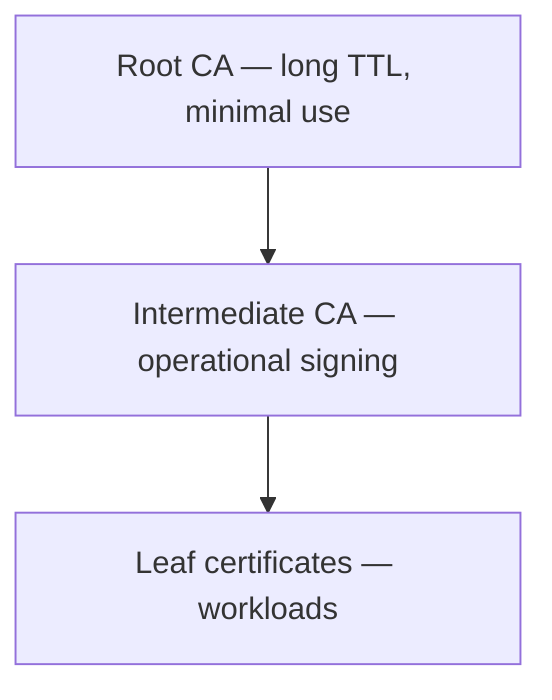

# PKI Administration Guide

Day-2 operations guide for KNXVault PKI: building a CA hierarchy, issuing certificates, renewal, revocation, and trust distribution.

KNXVault PKI uses **OpenSSL 3.x** under the hood. CA private keys and leaf private keys are **encrypted before Raft replication**; CA certificate PEMs are stored in cleartext (public material).

## Prerequisites

| Requirement | Notes |
|-------------|-------|
| Running KNXVault | `knxvault serve` with Raft enabled in production |
| Admin token | Bootstrap `KNXVAULT_ROOT_TOKEN` or scoped token with `pki:write` / `pki:read` |
| OpenSSL | `KNXVAULT_OPENSSL_BINARY` on server `PATH` (default `openssl`) |

Set environment for examples:

```bash
export KNXVAULT_ADDR=https://knxvault.internal:8200
export TOKEN=<pki-admin-token>
```

## Concepts

| Term | Meaning |
|------|---------|
| **Root CA** | Self-signed trust anchor (`POST /pki/root`) |
| **Intermediate CA** | Subordinate CA signed by a parent (`POST /pki/intermediate`) |
| **Issuing role** | The `role` field on `POST /pki/issue` — resolves to a **CA name** or an optional persisted **PKI role** that maps to a CA |
| **Leaf certificate** | End-entity cert + private key returned by `POST /pki/issue` |
| **Auto-renew** | Background leader job renews tracked certs before expiry |

### CA hierarchy (recommended production)



| Tier | Typical TTL | Signing use |
|------|-------------|-------------|
| Root | 10–20 years | Sign intermediates only |
| Intermediate | 3–5 years | Sign leaf certificates |
| Leaf | 30–90 days | Ingress, mTLS, services |

## RBAC and policies

PKI endpoints require authentication. Default built-in policy `pki-admin` grants `pki/*:*`.

### Scoped PKI operator policy

```bash
curl -s -X PUT $KNXVAULT_ADDR/sys/policies/pki-operator \
  -H "Authorization: Bearer $TOKEN" \
  -H 'Content-Type: application/json' \
  -d '{
    "paths": {
      "pki/*": {"capabilities": ["create", "read", "update", "delete"]}
    }
  }'

curl -s -X PUT $KNXVAULT_ADDR/sys/roles/pki-operator \
  -H "Authorization: Bearer $TOKEN" \
  -H 'Content-Type: application/json' \
  -d '{"policies": ["pki-operator"]}'
```

Issue a token for automation:

```bash
curl -s -X POST $KNXVAULT_ADDR/auth/token/create \
  -H "Authorization: Bearer $TOKEN" \
  -H 'Content-Type: application/json' \
  -d '{"policies": ["pki-operator"], "ttl": "24h"}'
```

Verify capabilities:

```bash
curl -s $KNXVAULT_ADDR/sys/capabilities -H "Authorization: Bearer $TOKEN"
```

## Recipe 1: Self-signed root CA (development)

A root CA is **self-signed** by definition — KNXVault generates the key pair and signs the certificate in one step.

```bash
curl -s -X POST $KNXVAULT_ADDR/pki/root \
  -H "Authorization: Bearer $TOKEN" \
  -H 'Content-Type: application/json' \
  -d '{
    "name": "dev-root",
    "common_name": "KNXVault Dev Root CA",
    "ttl": "8760h",
    "key_bits": 4096
  }' | jq
```

Save the response fields:

| Field | Use |
|-------|-----|
| `id` | UUID for renew/revoke/CRL/OCSP paths |
| `name` | Use as `role` when issuing directly from this CA |
| `cert_pem` | Trust anchor for clients |
| `serial` | Revocation reference |

**TTL formats:** Go durations (`8760h`, `720h`, `30m`) or suffixed values (`365d`, `24h`). Minimum effective cert lifetime is **1 day** (OpenSSL `-days` rounding).

## Recipe 2: Issue a leaf certificate (signed by CA)

The `role` field is **required**. When no persisted PKI role exists with that name, KNXVault treats `role` as the **CA name** (e.g. `dev-root` or `prod-intermediate`).

```bash
curl -s -X POST $KNXVAULT_ADDR/pki/issue \
  -H "Authorization: Bearer $TOKEN" \
  -H 'Content-Type: application/json' \
  -d '{
    "role": "dev-root",
    "common_name": "api.dev.example.com",
    "dns_names": ["api.dev.example.com", "localhost"],
    "ip_addresses": ["127.0.0.1"],
    "ttl": "720h",
    "key_bits": 2048,
    "auto_renew": true
  }' | jq
```

Response:

| Field | Handling |
|-------|----------|
| `cert_pem` | Install on server or write to K8s Secret |
| `private_key_pem` | **Protect immediately** — only transit over TLS; prefer short-lived delivery |
| `serial` | Track for revocation |
| `expires_at` | Monitor; auto-renew uses Raft leader job when `auto_renew: true` |

**CLI equivalent:**

```bash
knxvault-cli pki issue \
  --role dev-root \
  --common-name api.dev.example.com \
  --dns api.dev.example.com \
  --ttl 720h \
  --auto-renew
```

### Self-signed leaf without a CA hierarchy

For local dev you can issue directly from a root CA (Recipe 1 + this recipe). That produces a chain where the same cert acts as trust anchor and signer — acceptable for dev, **not** for production trust distribution.

## Recipe 3: Production hierarchy (root → intermediate → leaf)

### Step 1 — Create root (long-lived, rarely used)

```bash
curl -s -X POST $KNXVAULT_ADDR/pki/root \
  -H "Authorization: Bearer $TOKEN" \
  -H 'Content-Type: application/json' \
  -d '{
    "name": "org-root",
    "common_name": "Example Org Root CA",
    "ttl": "175320h",
    "key_bits": 4096
  }' | jq -r '.data.id // .id'
```

### Step 2 — Create intermediate signed by root

```bash
curl -s -X POST $KNXVAULT_ADDR/pki/intermediate \
  -H "Authorization: Bearer $TOKEN" \
  -H 'Content-Type: application/json' \
  -d '{
    "parent_name": "org-root",
    "name": "org-intermediate",
    "common_name": "Example Org Issuing CA",
    "ttl": "43800h",
    "key_bits": 4096
  }' | jq
```

### Step 3 — Issue workload certificates from intermediate

```bash
curl -s -X POST $KNXVAULT_ADDR/pki/issue \
  -H "Authorization: Bearer $TOKEN" \
  -H 'Content-Type: application/json' \
  -d '{
    "role": "org-intermediate",
    "common_name": "app.prod.example.com",
    "dns_names": ["app.prod.example.com", "*.app.prod.example.com"],
    "ttl": "2160h",
    "auto_renew": true
  }' | jq
```

### Step 4 — Export trust bundle for clients

```bash
INTERMEDIATE_ID=<uuid-from-step-2>
curl -s "$KNXVAULT_ADDR/pki/ca/$INTERMEDIATE_ID/export" \
  -H "Authorization: Bearer $TOKEN" | jq -r '.data.chain_pem // .chain_pem' > trust-bundle.pem
```

Distribute `trust-bundle.pem` (intermediate + root chain) to browsers, service meshes, and API clients.

## Recipe 4: Import an existing CA

Use when migrating from another PKI or restoring offline-generated material.

```bash
curl -s -X POST $KNXVAULT_ADDR/pki/ca/import \
  -H "Authorization: Bearer $TOKEN" \
  -H 'Content-Type: application/json' \
  -d '{
    "name": "imported-intermediate",
    "common_name": "Imported Issuing CA",
    "cert_pem": "'"$(cat intermediate.crt)"'",
    "key_pem": "'"$(cat intermediate.key)"'",
    "parent_name": "org-root"
  }' | jq
```

Imported keys are re-encrypted with the vault master key before storage.

## Recipe 5: Configure KNXVault listener TLS

Issue a server certificate, then point KNXVault at the PEM files (restart required).

```bash
# Issue (or renew) listener cert
curl -s -X POST $KNXVAULT_ADDR/pki/issue \
  -H "Authorization: Bearer $TOKEN" \
  -H 'Content-Type: application/json' \
  -d '{
    "role": "org-intermediate",
    "common_name": "knxvault.prod.example.com",
    "dns_names": ["knxvault.prod.example.com"],
    "ttl": "2160h",
    "auto_renew": true
  }' > listener-cert.json

jq -r '.data.cert_pem // .cert_pem' listener-cert.json > /etc/knxvault/tls/server.pem
jq -r '.data.private_key_pem // .private_key_pem' listener-cert.json > /etc/knxvault/tls/server.key
chmod 600 /etc/knxvault/tls/server.key
```

`/etc/knxvault.conf`:

```yaml
security:
  tls_cert: /etc/knxvault/tls/server.pem
  tls_key: /etc/knxvault/tls/server.key
```

Or environment variables: `KNXVAULT_TLS_CERT`, `KNXVAULT_TLS_KEY`.

> `POST /sys/tls/issue-listener` is reserved for future automatic listener issuance and currently returns `501 not_implemented`.

## Renewal

### Automatic (recommended)

Set `"auto_renew": true` at issuance. The Raft leader runs `RenewExpiring` on `KNXVAULT_JOB_CERT_RENEW_INTERVAL` (default `1h`) for certificates expiring within `KNXVAULT_RENEW_GRACE` (default `72h`).

### Manual renew

```bash
curl -s -X POST $KNXVAULT_ADDR/pki/renew \
  -H "Authorization: Bearer $TOKEN" \
  -H 'Content-Type: application/json' \
  -d '{
    "ca_id": "<issuing-ca-uuid>",
    "serial": "<certificate-serial>",
    "ttl": "2160h"
  }' | jq
```

Returns a new cert/key pair; update downstream trust stores and Secrets.

## Revocation and distribution

### Revoke a certificate

```bash
curl -s -X POST $KNXVAULT_ADDR/pki/revoke \
  -H "Authorization: Bearer $TOKEN" \
  -H 'Content-Type: application/json' \
  -d '{
    "ca_id": "<ca-uuid>",
    "serial": "<serial>",
    "reason": "keyCompromise"
  }'
```

### Publish CRL

```bash
curl -s "$KNXVAULT_ADDR/pki/crl/<ca-uuid>" \
  -H "Authorization: Bearer $TOKEN" | jq -r '.data.crl_pem // .crl_pem' > ca.crl.pem
```

The leader pre-generates CRLs every `KNXVAULT_JOB_CRL_REFRESH_INTERVAL` (default `15m`).

### OCSP responder

```bash
# POST application/ocsp-request body to:
curl -s -X POST "$KNXVAULT_ADDR/pki/ocsp/<ca-uuid>" \
  -H 'Content-Type: application/ocsp-request' \
  --data-binary @request.der \
  -o response.der
```

OCSP is **unauthenticated** by design (standard OCSP behavior).

## CA rotation

Rotate an intermediate without touching the root:

```bash
curl -s -X POST "$KNXVAULT_ADDR/pki/ca/<intermediate-uuid>/rotate" \
  -H "Authorization: Bearer $TOKEN" | jq
```

Creates a successor intermediate chained to the same parent. Re-issue leaf certificates and update trust bundles. See [CA compromise runbook](runbooks/ca-compromise.md) for emergency procedures.

## Background job tuning

| Variable | Default | Purpose |
|----------|---------|---------|
| `KNXVAULT_JOB_CERT_RENEW_INTERVAL` | `1h` | Auto-renewal scan |
| `KNXVAULT_RENEW_GRACE` | `72h` | Renew certs expiring within window |
| `KNXVAULT_JOB_CRL_REFRESH_INTERVAL` | `15m` | CRL pre-generation |

YAML (`jobs:` block in `/etc/knxvault.conf`):

```yaml
jobs:
  cert_renew_interval: 1h
  renew_grace: 72h
  crl_refresh_interval: 15m
```

## Backup and restore

PKI state (CAs, issued cert tracking, optional PKI roles) is included in encrypted backups:

```bash
knxvault-cli backup create -o pki-backup-$(date +%F).json
```

Restore requires the same `KNXVAULT_MASTER_KEY`. See [Backup & restore](../deploy/backup-restore.md).

## Troubleshooting

| Symptom | Likely cause | Action |
|---------|--------------|--------|
| `403 forbidden` on PKI | Token lacks `pki:write` | Check `/sys/capabilities`; assign `pki-admin` or custom policy |
| `validation_error` on issue | Unknown CA name in `role` | Verify CA `name` via `GET /pki/ca/:id` |
| `internal_error` on PKI | OpenSSL failure | Check server logs, disk space, `KNXVAULT_OPENSSL_BINARY` |
| Auto-renew not running | Not Raft leader / jobs disabled | Confirm `GET /ready` shows leader; check job intervals |
| Clients reject TLS chain | Missing intermediate | Distribute full chain from `GET /pki/ca/:id/export` |

## Related documents

- [PKI Kubernetes integration](pki-kubernetes.md) — cert-manager, Ingress, workload TLS
- [PKI security best practices](pki-security-practices.md)
- [CA compromise runbook](runbooks/ca-compromise.md)
- [Day-2 operations](day2.md)
- [API reference](../api/reference.md)