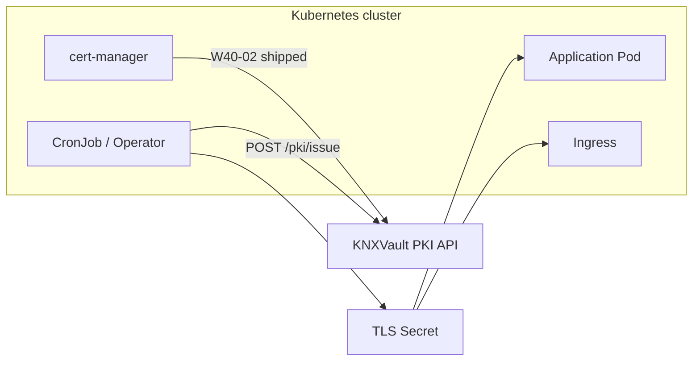

# PKI Kubernetes Integration Guide

How to use KNXVault PKI with Kubernetes workloads: authentication, certificate delivery patterns, cert-manager, Ingress TLS, and mTLS.

## Integration status

| Integration | Status | Document |
|-------------|--------|----------|
| Kubernetes auth (`POST /auth/kubernetes`) | **Shipped** | [Integration overview](../integration/overview.md) |
| CSI secrets provider (`knxvault-csi`) | **Shipped** — KV secrets, not PKI | [Secrets injection](../deploy/secrets-injection.md) |
| cert-manager `ClusterIssuer` | **Planned (W40-02)** | Workarounds below |
| Native `spec.knxvault` issuer CRD | **Planned (W40-02)** | — |
| Vault API shim (`/v1/pki/sign/:role`) | **Planned (W40-02)** | Example stubs in `deployments/cert-manager/` |

Until **W40-02** ships, automate PKI through the **KNXVault REST API** or **CronJob/Job** patterns that write Kubernetes `Secret` objects.

## Architecture overview



| Workload need | Recommended pattern today |
|---------------|---------------------------|
| Ingress / Gateway TLS | CronJob or CI issues cert → `kubernetes.io/tls` Secret |
| Pod mTLS cert | Init container or Job issues cert → mounted Secret |
| In-cluster API access to KNXVault | Kubernetes auth + scoped role |
| Secret files (not PKI) | CSI provider |

## Step 1 — Kubernetes authentication for controllers

Controllers (CronJobs, operators, cert-manager post-W40-02) should use **ServiceAccount JWT exchange**, not long-lived root tokens.

### Policy and role for a cert issuer controller

```bash
curl -s -X PUT $KNXVAULT_ADDR/sys/policies/cert-issuer \
  -H "Authorization: Bearer $ROOT_TOKEN" \
  -H 'Content-Type: application/json' \
  -d '{
    "paths": {
      "pki/*": {"capabilities": ["create", "read"]}
    }
  }'

curl -s -X PUT $KNXVAULT_ADDR/sys/roles/cert-issuer \
  -H "Authorization: Bearer $ROOT_TOKEN" \
  -H 'Content-Type: application/json' \
  -d '{
    "policies": ["cert-issuer"],
    "bound_service_account_names": ["knxvault-cert-issuer"],
    "bound_service_account_namespaces": ["knxvault"]
  }'
```

### In-cluster token exchange

From a pod with `serviceAccountName: knxvault-cert-issuer`:

```bash
SA_TOKEN=$(cat /var/run/secrets/kubernetes.io/serviceaccount/token)
CLIENT=$(curl -s -X POST http://knxvault.knxvault.svc:8200/auth/kubernetes \
  -H 'Content-Type: application/json' \
  -d "{\"jwt\":\"$SA_TOKEN\",\"role\":\"cert-issuer\"}" | jq -r '.data.token // .token')
```

Use `$CLIENT` as `Authorization: Bearer` for `POST /pki/issue`.

Production clusters use in-cluster **TokenReview** automatically. Do not set `KNXVAULT_JWT_SECRET` in production.

## Step 2 — Recipe: CronJob certificate renewal (pre-cert-manager)

Issue a cert from KNXVault and upsert a TLS `Secret` on a schedule.

### ServiceAccount and RBAC

```yaml
apiVersion: v1
kind: ServiceAccount
metadata:
  name: knxvault-cert-issuer
  namespace: knxvault
---
apiVersion: rbac.authorization.k8s.io/v1
kind: Role
metadata:
  name: knxvault-cert-issuer
  namespace: default
rules:
  - apiGroups: [""]
    resources: ["secrets"]
    verbs: ["create", "update", "patch", "get"]
---
apiVersion: rbac.authorization.k8s.io/v1
kind: RoleBinding
metadata:
  name: knxvault-cert-issuer
  namespace: default
roleRef:
  apiGroup: rbac.authorization.k8s.io
  kind: Role
  name: knxvault-cert-issuer
subjects:
  - kind: ServiceAccount
    name: knxvault-cert-issuer
    namespace: knxvault
```

### CronJob (simplified)

```yaml
apiVersion: batch/v1
kind: CronJob
metadata:
  name: knxvault-issue-app-tls
  namespace: default
spec:
  schedule: "0 3 * * 0"   # weekly; tune vs cert TTL
  jobTemplate:
    spec:
      template:
        spec:
          serviceAccountName: knxvault-cert-issuer
          restartPolicy: OnFailure
          containers:
            - name: issue
              image: curlimages/curl:8.5.0
              env:
                - name: KNXVAULT_ADDR
                  value: "http://knxvault.knxvault.svc:8200"
                - name: PKI_ROLE
                  value: "org-intermediate"
                - name: COMMON_NAME
                  value: "app.example.com"
                - name: SECRET_NAME
                  value: "app-tls"
              command: ["/bin/sh", "-ec"]
              args:
                - |
                  SA_TOKEN=$(cat /var/run/secrets/kubernetes.io/serviceaccount/token)
                  CLIENT=$(curl -sf -X POST "$KNXVAULT_ADDR/auth/kubernetes" \
                    -H 'Content-Type: application/json' \
                    -d "{\"jwt\":\"$SA_TOKEN\",\"role\":\"cert-issuer\"}" | sed -n 's/.*"token":"\([^"]*\)".*/\1/p')
                  ISSUE=$(curl -sf -X POST "$KNXVAULT_ADDR/pki/issue" \
                    -H "Authorization: Bearer $CLIENT" \
                    -H 'Content-Type: application/json' \
                    -d "{\"role\":\"$PKI_ROLE\",\"common_name\":\"$COMMON_NAME\",\"dns_names\":[\"$COMMON_NAME\"],\"ttl\":\"2160h\",\"auto_renew\":false}")
                  CERT=$(echo "$ISSUE" | sed -n 's/.*"cert_pem":"\([^"]*\)".*/\1/p' | sed 's/\\n/\n/g')
                  KEY=$(echo "$ISSUE" | sed -n 's/.*"private_key_pem":"\([^"]*\)".*/\1/p' | sed 's/\\n/\n/g')
                  kubectl create secret tls "$SECRET_NAME" \
                    --cert=<(echo "$CERT") --key=<(echo "$KEY") \
                    --dry-run=client -o yaml | kubectl apply -f -
```

> For production, use a small Go/Python operator with `pkg/client`, proper JSON parsing, and chain bundling. This recipe illustrates the control flow.

### Prefer KNXVault auto-renew when possible

If the workload can reload certs from KNXVault (sidecar or API), set `"auto_renew": true` at issuance and let the **Raft leader job** renew before expiry — reducing CronJob frequency. See [PKI administration](pki-administration.md#renewal).

## Step 3 — Ingress TLS

Once a `kubernetes.io/tls` Secret exists:

```yaml
apiVersion: networking.k8s.io/v1
kind: Ingress
metadata:
  name: app
spec:
  tls:
    - hosts: ["app.example.com"]
      secretName: app-tls
  rules:
    - host: app.example.com
      http:
        paths:
          - path: /
            pathType: Prefix
            backend:
              service:
                name: app
                port:
                  number: 80
```

**Trust chain:** Ingress controllers typically need only leaf + key in the Secret. Clients need the issuing CA (or full chain). Export chain PEM:

```bash
curl -s "$KNXVAULT_ADDR/pki/ca/<intermediate-id>/export" \
  -H "Authorization: Bearer $TOKEN" | jq -r '.data.chain_pem // .chain_pem'
```

For public ingress, use a publicly trusted CA or distribute your private root to clients.

## Step 4 — Workload mTLS

### Issue client certificate

```bash
curl -s -X POST $KNXVAULT_ADDR/pki/issue \
  -H "Authorization: Bearer $TOKEN" \
  -H 'Content-Type: application/json' \
  -d '{
    "role": "org-intermediate",
    "common_name": "my-app.production.svc",
    "ttl": "720h",
    "auto_renew": true
  }'
```

Store as Secret and mount:

```yaml
volumeMounts:
  - name: mtls
    mountPath: /etc/mtls
    readOnly: true
volumes:
  - name: mtls
    secret:
      secretName: my-app-mtls
```

### KNXVault API mTLS

Enable server-side client certificate verification for KV writes:

```yaml
# /etc/knxvault.conf
security:
  tls_cert: /etc/knxvault/tls/server.pem
  tls_key: /etc/knxvault/tls/server.key
  mtls_required: true
  mtls_ca: /etc/knxvault/tls/client-ca.pem
```

Issue `client-ca.pem` from the same intermediate or a dedicated client-issuing CA.

## cert-manager (shipped — W40-02)

KNXVault exposes **Vault-compatible** paths for cert-manager's built-in Vault issuer (`internal/api/handlers/vaultcompat.go`):

| Vault path (expected) | KNXVault shim |
|-----------------------|---------------|
| `POST /v1/pki/sign/:role` | CSR signing via PKI engine |
| `POST /v1/auth/kubernetes/login` | ServiceAccount JWT login |

Apply the example `ClusterIssuer`:

```yaml
# deployments/cert-manager/clusterissuer-knxvault.yaml
apiVersion: cert-manager.io/v1
kind: ClusterIssuer
metadata:
  name: knxvault-pki
spec:
  vault:
    server: https://knxvault.knxvault.svc.cluster.local:8200
    path: pki/sign/web-server
    auth:
      kubernetes:
        role: cert-manager
        mountPath: /v1/auth/kubernetes
        serviceAccountRef:
          name: cert-manager
          namespace: cert-manager
```

Pair with `deployments/cert-manager/certificate-example.yaml` for a `Certificate` resource.

### cert-manager preparation checklist (do now)

1. Create PKI hierarchy — [PKI administration](pki-administration.md)
2. Name intermediate CA `web-server` (or align `path` / `role` naming)
3. Create `cert-manager` KNXVault role binding the cert-manager ServiceAccount
4. Enable KNXVault TLS for the issuer endpoint
5. Track W40-02 release for native issuer support

## Service mesh and internal CA

| Platform | Pattern |
|----------|---------|
| **Istio / Linkerd** | Use mesh CA or import KNXVault-issued intermediate as trust anchor via mesh config |
| **Internal gRPC** | Mount leaf cert Secret; pin server trust to exported `chain_pem` |
| **SPIFFE/SPIRE** | Complementary — KNXVault PKI for ingress/legacy; SPIRE for workload SVIDs |

KNXVault does not ship a SPIFFE issuer today; use exported intermediates where mesh integration requires PEM trust bundles.

## GitOps considerations

| Practice | Recommendation |
|----------|----------------|
| Store leaf private keys | Kubernetes `Secret` (encrypted at rest) or CSI — never in Git |
| Store CA private keys | Only inside KNXVault (encrypted) |
| Trust bundles | ConfigMap acceptable (public certs only) |
| Issuance automation | CronJob manifest in Git; credentials via SA auth only |

## Monitoring

| Signal | Source |
|--------|--------|
| Cert expiry | Track `expires_at` from issue responses; alert < 14 days |
| Auto-renew job | Raft leader metrics + audit `pki.renew` events |
| Issuance rate | `knxvault_http_request_duration_seconds{path="/pki/issue"}` |
| CRL freshness | `KNXVAULT_JOB_CRL_REFRESH_INTERVAL` + manual `GET /pki/crl/:id` |

## Related documents

- [PKI administration](pki-administration.md)
- [PKI security best practices](pki-security-practices.md)
- [Kubernetes-native integrations](../integration/kubernetes-native.md)
- [Kubernetes deployment](../deploy/kubernetes.md)
- [Day-2 operations](day2.md)