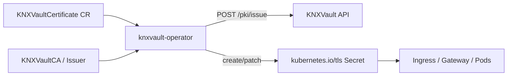

# Replacing cert-manager with KNXVault

**Status:** Shipped via operator **W30-01–W30-10**.  
**Claim:** For **any TLS issued by KNXVault PKI**, you do **not** need cert-manager.

## Why

| Component | Role |
|-----------|------|
| **KNXVault** | CA hierarchy, issue/renew/revoke, RBAC, Raft HA |
| **knxvault-operator** | Kubernetes CRD automation → writes `kubernetes.io/tls` Secrets |
| **cert-manager** | Optional legacy consumer only (Vault issuer shim W40-02) |

ACME / Let’s Encrypt / public CAs remain out of scope (use external tooling if required).

## Architecture



## Install (cluster)

```bash
# 1. KNXVault server running (StatefulSet or lab host process) with root token
# 2. CRDs + RBAC
kubectl apply -f deployments/operator/crds/knxvault.kubenexis.dev_all.yaml
kubectl apply -f deployments/operator/rbac.yaml

# 3. Operator (image or lab host binary — see lab script)
export KNXVAULT_ADDR=https://knxvault.knxvault.svc:8200
export KNXVAULT_TOKEN=<bootstrap-or-scoped-token>
export KNXVAULT_OPERATOR_INGRESS_SHIM=true
./bin/knxvault-operator
```

## Workload recipe

```bash
kubectl apply -f deployments/operator/samples/certificate-example.yaml
kubectl -n knxvault wait --for=condition=Ready knxvaultca/platform-root --timeout=120s || true
kubectl -n default get knxvaultcertificate app-tls -o yaml
kubectl -n default get secret app-tls -o yaml
```

### CRDs

| CRD | Purpose |
|-----|---------|
| `KNXVaultCA` | Root / intermediate CA in vault |
| `KNXVaultIssuer` | Namespaced issuer (`vaultCAName`) |
| `KNXVaultClusterIssuer` | Cluster-scoped issuer |
| `KNXVaultCertificate` | Leaf cert + `secretName` (cert-manager Certificate analogue) |
| `KNXVaultCertificateRequest` | CSR-style / issue fallback |

### Ingress annotation shim (optional)

```yaml
metadata:
  annotations:
    knxvault.kubenexis.dev/issuer: "KNXVaultClusterIssuer/platform"
# or bare name → ClusterIssuer
spec:
  tls:
    - hosts: [app.example.com]
      secretName: app-tls
```

Requires `KNXVAULT_OPERATOR_INGRESS_SHIM=true`.

## Mapping from cert-manager

| cert-manager | KNXVault |
|--------------|----------|
| `Certificate` | `KNXVaultCertificate` |
| `Issuer` / `ClusterIssuer` | `KNXVaultIssuer` / `KNXVaultClusterIssuer` |
| `CertificateRequest` | `KNXVaultCertificateRequest` |
| Vault path `pki/sign/:role` | Operator uses native `/pki/issue` (role = CA name) |
| ACME | Not provided — keep external issuer if needed |

Migration files: `deployments/operator/migration/`.

## Operator configuration

| Env | Description |
|-----|-------------|
| `KNXVAULT_ADDR` | API base URL |
| `KNXVAULT_TOKEN` | Bearer token (bootstrap or scoped `cert-operator` role) |
| `KNXVAULT_TOKEN_FILE` | Alternative token path |
| `KNXVAULT_OPERATOR_INGRESS_SHIM` | `true` enables Ingress annotation controller |
| `KNXVAULT_OPERATOR_METRICS_ADDR` | Prometheus `:8080` |
| `KNXVAULT_OPERATOR_PROBE_ADDR` | healthz/readyz `:8081` |

## Metrics

- `knxvault_operator_certificate_issues_total`
- `knxvault_operator_certificate_renews_total`
- `knxvault_operator_reconcile_errors_total{controller=…}`
- `knxvault_operator_ca_ready`

## Security notes

- Prefer a vault policy limited to `pki/*` issue/renew, not root create, for app namespaces.
- Operator must not run as vault root long-term; rotate bootstrap token after CA setup.
- Secrets are etcd-visible (same trade-off as cert-manager).

## Lab e2e

```bash
make build build-cli build-operator
# On a kube node with vault reachable:
bash scripts/lab-operator-e2e.sh 192.168.137.131
# or kind:
bash scripts/test-operator-kind.sh
```

## See also

- [PKI Kubernetes integration](pki-kubernetes.md)
- [Kubernetes-native integrations](../integration/kubernetes-native.md)
- [Backlog P0 W30-01–10](../backlog.md)
- [Installation](../installation/install.md)
