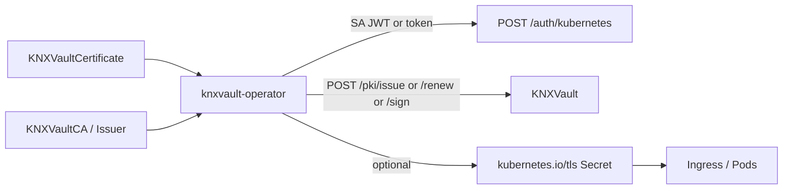

# Replacing cert-manager with KNXVault

**Status:** Complete (W30 + multi-issuer ACME/SelfSigned).  
**Claim:** KNXVault **replaces cert-manager** for private CA, self-signed, and ACME (public) certificate automation in Kubernetes — you do **not** need the cert-manager controller.

## Architecture



| Piece | Role |
|-------|------|
| **KNXVault** | CA, issue, renew, **CSR sign** (`POST /pki/sign`), RBAC |
| **knxvault-operator** | CRD automation, leader-elected, Secret or status-only delivery |
| **cert-manager** | Optional legacy only (Vault shim) |

ACME uses `golang.org/x/crypto/acme` (HTTP-01 + DNS-01 Cloudflare/webhook). See [support matrix](certificate-support-matrix.md).

## Install

Use **only** `deployments/operator/crds/` (single full CRD bundle). No legacy stub CRDs.

```bash
make build build-operator
kubectl apply -f deployments/operator/crds/
kubectl apply -f deployments/operator/rbac.yaml   # includes lease + Gateway get/list/watch
# Prefer least-privilege Secrets in app namespaces (multi-tenant):
# kubectl apply -f deployments/operator/rbac-namespaced-example.yaml

export KNXVAULT_ADDR=http://knxvault.knxvault.svc:8200
# Prefer SA login (in-cluster):
export KNXVAULT_K8S_ROLE=knxvault-operator
# Bootstrap fallback (lab / host process):
export KNXVAULT_TOKEN=<token>
export KNXVAULT_OPERATOR_LEADER_ELECT=true   # false for single host-process lab
export KNXVAULT_OPERATOR_INGRESS_SHIM=true
./bin/knxvault-operator
```

Lab smoke: `bash scripts/lab-operator-e2e.sh 192.168.137.131`

Bind the operator ServiceAccount to a vault role that can `pki` read/write (issue, renew, sign, get CA).

## CRDs

| CRD | Purpose |
|-----|---------|
| `KNXVaultCA` | Root/intermediate CA (idempotent by vault name) |
| `KNXVaultIssuer` / `KNXVaultClusterIssuer` | Multi-issuer: **Vault** / **ACME** / **SelfSigned** |
| `KNXVaultCertificate` | Leaf + delivery `Secret` (default) or `None` |
| `KNXVaultCertificateRequest` | **True CSR sign** via `POST /pki/sign`, else issue fallback |

### Certificate delivery modes

| `spec.delivery` | Behavior |
|-----------------|----------|
| `Secret` (default) | Write `kubernetes.io/tls` with annotations: serial, not-after, ca-id, revision |
| `None` | Status only — no private key in etcd (app uses API/CSI) |

### Ingress annotation

```yaml
metadata:
  annotations:
    knxvault.kubenexis.dev/issuer: "KNXVaultClusterIssuer/platform"
```

Requires `KNXVAULT_OPERATOR_INGRESS_SHIM=true`.

## Operator env

| Env | Default | Meaning |
|-----|---------|---------|
| `KNXVAULT_ADDR` | cluster DNS | API base |
| `KNXVAULT_TOKEN` / `KNXVAULT_TOKEN_FILE` | — | Bootstrap / lab token |
| `KNXVAULT_K8S_ROLE` | `knxvault-operator` | SA → vault login role |
| `KNXVAULT_SA_TOKEN_FILE` | in-cluster path | SA JWT file |
| `KNXVAULT_OPERATOR_LEADER_ELECT` | `true` | HA single-writer |
| `KNXVAULT_OPERATOR_LEADER_ELECT_NAMESPACE` | `knxvault` | Lease namespace |
| `KNXVAULT_OPERATOR_INGRESS_SHIM` | `false` | Ingress controller |
| Metrics / probes | `:8080` / `:8081` | Prometheus + healthz |

## Lifecycle semantics

1. **Issuer Ready** = vault reports CA by name (not config-only).  
2. **Certificate** conditions: `Issuing`, `Ready`; reasons: `PendingIssuer`, `VaultError`, `Issued`, …  
3. **Renew** when within `renewBefore`; prefers `POST /pki/renew` when `status.caId` + serial set; else re-issue.  
4. **Secrets** annotated with serial / notAfter / ca-id for idempotent updates.  
5. **Backoff** on errors (5s × 2^n, cap 5m).

## Migration from cert-manager

See `deployments/operator/migration/`. Map `Certificate` → `KNXVaultCertificate` (same `secretName` / dnsNames), dual-run, then remove cert-manager.

## Lab e2e

```bash
# Full suite (core + Vault profile + operator) — recommended
bash scripts/lab-full-e2e.sh 192.168.137.131
# or: make lab-full-e2e

# Operator-only smoke
bash scripts/lab-operator-e2e.sh 192.168.137.131
```

Last full run: [lab-full-e2e.md](../engineering/lab-full-e2e.md) (38/38 PASS).

## Optional: keep cert-manager

If GitOps still depends on cert-manager `Certificate` resources, point a Vault-type Issuer at KNXVault’s product profile (`GET /v1/sys/health`, auth, sign). That path is **compatibility**, not the preferred architecture.

Recipe: [cert-manager integration](../recipes/cert-manager-integration.md).

## Metrics

- `knxvault_operator_certificate_issues_total`
- `knxvault_operator_certificate_renews_total`
- `knxvault_operator_reconcile_errors_total{controller=…}`
- `knxvault_operator_ca_ready`

## See also

- [PKI Kubernetes](pki-kubernetes.md)
- [PKI administration](pki-administration.md) — intermediate CA, CSR sign
- [System diagrams](../architecture/diagrams.md) — operator + Vault profile sequences
- [Kubernetes-native integrations](../integration/kubernetes-native.md)
- [Phase 4–5 design](../design/phase4-ecosystem.md)
- [Installation](../installation/install.md)
- [Backlog](../backlog.md)
