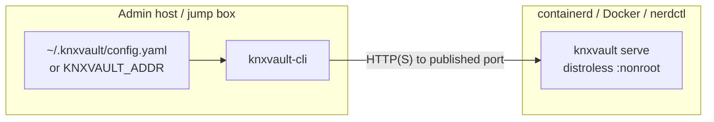

# Standalone knxvault: distroless server + host CLI (Day-0 and Day-2)

One coherent guide for running **knxvault without Kubernetes**: a **distroless container** (or the same binary on the host) plus a **native admin CLI** on the workstation or jump host.

| Field | Value |
|-------|-------|
| **Audience** | Operators who want a single-node or simple multi-process vault on containerd/Docker/lab hosts |
| **Day-0** | Keys → build/load image → run (publish API) → point CLI → unseal (if Raft) → smoke → first CA/secret → accept |
| **Day-2** | Health, restarts/unseal, backup, upgrades, seal incidents, token hygiene |
| **Not this guide** | 3-pod Kubernetes HA StatefulSet, knxvault-operator CRDs, CSI — see [operator runbook](operator-runbook.md) |
| **Images / nerdctl build** | [Build and deploy images](build-and-deploy-images.md) |

```text
Day-0  =  no vault  →  container serving secrets & certs, adminable from the host
Day-2  =  restarts, backups, upgrades, incidents (still host CLI, still no shell in the image)
```

---

## 1. Mental model (read this first)

### Two artifacts

| Artifact | Role | Where it runs |
|----------|------|----------------|
| **`knxvault` server** | API, Raft (optional), PKI, secrets | **Distroless container** (production packaging) or static host binary |
| **`knxvault-cli`** | Day-0/Day-2 administration | **Admin machine / host** (never inside the distroless image) |



### What the CLI does **not** do

- Does **not** talk to Docker/containerd sockets  
- Does **not** discover container names or IDs  
- Does **not** `exec` into the container  

It only calls an **API base URL**. You make the URL true by **publishing port 8200** (or putting a reverse proxy/DNS in front) and setting:

| Source | Example |
|--------|---------|
| Default | `http://localhost:8200` |
| Env | `export KNXVAULT_ADDR=http://127.0.0.1:8200` |
| Flag | `knxvault-cli --addr http://192.168.1.10:8200 …` |
| Config | `~/.knxvault/config.yaml` → `addr: …` |
| Token | `KNXVAULT_TOKEN` / `--token` / config `token` |

Full flag surface: [CLI reference](../cli/reference.md).

### Distroless policy

Production packaging is **always**:

- multi-stage build → **`gcr.io/distroless/static-debian13:nonroot`**  
- **native Go PKI only** (no OpenSSL CLI in the image or process)  
- no shell: **do not** plan on `nerdctl exec` / `docker exec` for admin  

Details: [Installation Option 2](../installation/install.md#option-2-docker-distroless-debian-13), [PKI native only](pki-openssl-migration.md).

### When to use this vs Kubernetes

| Use this guide | Use Kubernetes guides |
|----------------|------------------------|
| Lab / single host containerd | Production 3-node Raft in-cluster — [operator runbook](operator-runbook.md) |
| Air-gap smoke of image + CLI | Operator CRDs, CSI, K8s auth — [Kubernetes CLI Day-0/Day-2](kubernetes-cli-day0-day2.md) |
| Edge / appliance-style single vault | Platform TLS factory for many namespaces |

---

## 2. Prerequisites

| Requirement | Notes |
|-------------|--------|
| Build host | Go 1.26+ (via Makefile `GOTOOLCHAIN`), repo checkout |
| Runtime | Docker **or** nerdctl + containerd (`make container-build` accepts either) |
| Admin host tools | Built `knxvault-cli`; optional `curl`/`jq`; optional `openssl` **only** for `openssl rand` key generation (not for server PKI) |
| Storage | Durable path or named volume if using Raft |
| Network | Ability to publish **host port 8200** (or equivalent) to container `:8200` |

---

# Part A — Day-0 (bring standalone vault to life)

Day-0 ends only when every box in **§A8 Acceptance** is checked.

## A1. Generate credentials (key ceremony)

On a **trusted admin host**, not inside a random container:

```bash
# Save outputs offline immediately; never commit real values
openssl rand -base64 32    # MASTER  → KNXVAULT_MASTER_KEY
openssl rand -base64 32    # UNSEAL  → KNXVAULT_UNSEAL_KEY  (must differ from master when Raft is on)
openssl rand -base64 24    # ROOT    → KNXVAULT_ROOT_TOKEN  (bootstrap admin)
# optional:
openssl rand -base64 32    # audit HMAC → KNXVAULT_AUDIT_SIGNING_KEY
```

| Secret | If lost | If leaked |
|--------|---------|-----------|
| Master | Cannot decrypt data/backups | Offline decrypt of stolen volumes/backups |
| Unseal | Cannot open sealed API (Raft) | Attacker may unseal if they can reach the API |
| Root token | Lose bootstrap admin | Full control until rotated |

Custody checklist: [Operator security](operator-security.md).

Example layout (permissions matter):

```bash
mkdir -p ~/knxvault-day0 && chmod 700 ~/knxvault-day0
# write master.key, unseal.key, root.token offline — chmod 600
```

## A2. Build artifacts

```bash
cd /path/to/knxvault
make container-build          # knxvault:<version>  (distroless/static-debian13)
make build-cli             # bin/knxvault-cli on this host
```

Image tag defaults to `knxvault:0.4.5` (see Makefile `VERSION` / `IMAGE`). Load into the target host’s containerd if you built elsewhere (`nerdctl save | nerdctl load`, air-gap tarball, etc.).

## A3. Run the server (publish the API)

Use **docker** or **nerdctl** interchangeably below.

### A3.1 Lab: in-memory (no Raft, data lost on stop)

```bash
export MASTER=$(cat ~/knxvault-day0/master.key)   # or paste base64
export ROOT=$(cat ~/knxvault-day0/root.token)

nerdctl run -d --name knxvault \
  -p 8200:8200 \
  -e KNXVAULT_MASTER_KEY="$MASTER" \
  -e KNXVAULT_ROOT_TOKEN="$ROOT" \
  -e KNXVAULT_LOG_LEVEL=info \
  knxvault:0.4.5 serve
```

Without Raft, the process typically does **not** require unseal for basic lab smoke. Prefer Raft for anything you care about keeping.

### A3.2 Recommended lab/prod-like: single-node Raft (persistent)

Unseal key is **required** at process start and **must differ** from the master key. Process starts **sealed** until you unseal from the CLI/API.

```bash
export MASTER=$(cat ~/knxvault-day0/master.key)
export UNSEAL=$(cat ~/knxvault-day0/unseal.key)
export ROOT=$(cat ~/knxvault-day0/root.token)

# Durable data directory on the host
mkdir -p /var/lib/knxvault/raft && chmod 700 /var/lib/knxvault/raft

nerdctl run -d --name knxvault \
  -p 8200:8200 \
  -v /var/lib/knxvault/raft:/var/lib/knxvault/raft \
  -e KNXVAULT_MASTER_KEY="$MASTER" \
  -e KNXVAULT_UNSEAL_KEY="$UNSEAL" \
  -e KNXVAULT_ROOT_TOKEN="$ROOT" \
  -e KNXVAULT_RAFT_ENABLED=true \
  -e KNXVAULT_RAFT_NODE_ID=1 \
  -e KNXVAULT_RAFT_ADDRESS=127.0.0.1:63001 \
  -e KNXVAULT_RAFT_DATA_DIR=/var/lib/knxvault/raft \
  -e KNXVAULT_RAFT_INITIAL_MEMBERS=1=127.0.0.1:63001 \
  knxvault:0.4.5 serve
```

Notes:

- **`-p 8200:8200`** is what makes default CLI `localhost:8200` work on the same host.  
- For access from another machine, publish on a reachable interface and set `KNXVAULT_ADDR=http://<host>:8200` (prefer HTTPS in real deployments — [configuration](../installation/configuration.md)).  
- Raft advertise address `KNXVAULT_RAFT_ADDRESS` must match how **this** process reaches itself for single-node; multi-node standalone is advanced — see [Dragonboat](../storage/dragonboat.md) and [scaling](runbooks/scaling.md).  
- Full env catalog: [configuration.md](../installation/configuration.md).

### A3.3 Confirm the container is up

```bash
nerdctl ps --filter name=knxvault
nerdctl logs knxvault 2>&1 | tail -50
curl -sS http://127.0.0.1:8200/health
```

`/health` may be OK while `/ready` still reports **sealed** — that is expected until §A5.

## A4. Point the host CLI at the API

On the **same host** as the published port:

```bash
export KNXVAULT_ADDR=http://127.0.0.1:8200
export KNXVAULT_TOKEN="$(cat ~/knxvault-day0/root.token)"

# Optional persistent config
mkdir -p ~/.knxvault
cat > ~/.knxvault/config.yaml <<EOF
addr: http://127.0.0.1:8200
token: $(cat ~/knxvault-day0/root.token)
EOF
chmod 600 ~/.knxvault/config.yaml
```

Optional check:

```bash
./bin/knxvault-cli doctor
# doctor checks CLI config + API reachability; sealed state may still fail readiness checks until unseal
```

## A5. Unseal (Raft path — required for writes)

```bash
./bin/knxvault-cli sys unseal "$(cat ~/knxvault-day0/unseal.key)"
# or:
# curl -s -X POST "$KNXVAULT_ADDR/sys/unseal" \
#   -H 'Content-Type: application/json' \
#   -d "{\"key\":\"$(cat ~/knxvault-day0/unseal.key)\"}"

curl -sS "$KNXVAULT_ADDR/ready" | jq .
# want sealed:false (and raft ready fields when Raft is on)
```

Multi-share unseal: [seal and unseal recipe](../recipes/seal-and-unseal.md).

## A6. Day-0 smoke (secrets + PKI)

```bash
./bin/knxvault-cli doctor --json    # healthy:true, fail:0 after unseal
./bin/knxvault-cli health
./bin/knxvault-cli status

# First secret (values redacted by default on get)
./bin/knxvault-cli kv put day0/smoke value=ok
./bin/knxvault-cli kv get day0/smoke --show-secrets

# First root CA + leaf (native PKI — no openssl in the container)
./bin/knxvault-cli pki root --name platform-root --common-name "Standalone Root" --ttl 8760h
./bin/knxvault-cli pki issue --role platform-root \
  --common-name app.example.local \
  --dns app.example.local \
  --ttl 720h
```

Deeper PKI recipes: [PKI administration](pki-administration.md).

## A7. Bootstrap hygiene (optional same day)

Prefer not living forever on the root token:

1. Create a policy with only the paths you need (`sys/policies`).  
2. Create a scoped token (`auth/token/create` or CLI auth flows).  
3. Store the scoped token for Day-2; keep root offline as break-glass.  

Policy patterns: [policy engine](../architecture/policy-engine.md), K8s-oriented bootstrap ideas in [operator runbook §B6](operator-runbook.md) (same API, no kubectl).

## A8. Day-0 acceptance checklist

- [ ] Image is distroless-based build (`make container-build`); no plan to shell into the container for admin  
- [ ] Port **8200** published (or documented reverse proxy URL)  
- [ ] Host `knxvault-cli` built; `KNXVAULT_ADDR` / token set (or `~/.knxvault/config.yaml`)  
- [ ] Master / unseal / root stored **out of band** (not only inside the container env)  
- [ ] If Raft: durable volume mounted; **unseal** done; `/ready` shows not sealed  
- [ ] `knxvault-cli doctor --json` → `healthy:true`, `fail:0`  
- [ ] KV smoke write/read  
- [ ] PKI root + at least one leaf issued  
- [ ] Root token treated as break-glass (or rotated after scoped admin exists)  

**Day-0 complete → operate with Part B.**

---

# Part B — Day-2 (operate after acceptance)

## B1. Health and monitoring

| Check | Command / endpoint | Expected |
|-------|--------------------|----------|
| Liveness | `GET /health` or `knxvault-cli health` | healthy |
| Readiness | `GET /ready` or `knxvault-cli status` | ready; `sealed: false` |
| Operator gate | `knxvault-cli doctor --json` | `healthy:true`, `fail:0` |
| Metrics | `GET /metrics` | Prometheus text (scrape host:8200 if published) |
| Logs | `nerdctl logs knxvault` | no crash loops; seal/unseal events understood |

Shared Day-2 tables (leases, audit, multi-node): [day2.md](day2.md).

## B2. After restart (Raft)

Container recreate or host reboot with Raft:

1. Container starts with same master/unseal env and **same data volume**.  
2. Process is **sealed** until:  
   ```bash
   export KNXVAULT_ADDR=http://127.0.0.1:8200
   export KNXVAULT_TOKEN=…   # admin token
   knxvault-cli sys unseal "$(cat ~/knxvault-day0/unseal.key)"
   knxvault-cli doctor --json
   ```  
3. Automate unseal only if your threat model allows (often **manual** or HSM/external process).

## B3. Backup and restore

```bash
export KNXVAULT_ADDR=http://127.0.0.1:8200   # or https://…
export KNXVAULT_TOKEN=<admin-token>

knxvault-cli backup create -o "knxvault-$(date +%F).json"
# restore requires the same master key at restore time
# knxvault-cli backup restore -f knxvault-YYYY-MM-DD.json
```

- Store backups offline/encrypted.  
- Details: [backup and restore](../deploy/backup-restore.md).

## B4. Upgrades (single container)

1. `knxvault-cli backup create`  
2. Pull/load new image tag; stop old container; start new with **same** env + volume mounts  
3. Unseal if Raft  
4. Smoke: `doctor`, KV read, optional PKI issue  

For 3-node Raft rolling upgrades in Kubernetes, use [day2.md upgrades](day2.md#upgrades) / [operator runbook](operator-runbook.md).

## B5. Seal for incident response

```bash
knxvault-cli sys seal
# ... contain incident ...
knxvault-cli sys unseal "$(cat unseal.key)"
```

CA compromise: [ca-compromise runbook](runbooks/ca-compromise.md).

## B6. Ongoing PKI, public TLS (ACME), and secrets

| Task | Tooling |
|------|---------|
| **Private** platform CA certs | `knxvault-cli pki …` or API — [pki-administration.md](pki-administration.md) |
| **Public** Let's Encrypt / ACME | `knxvault-cli acme …` with a profile YAML (host, not distroless) — [unified ACME design](../design/acme-letsencrypt-unified.md) |
| App secrets | `knxvault-cli kv …` |
| Listener TLS material | `knxvault-cli sys issue-listener-tls` |
| Token/policy hygiene | scoped tokens; retire root — [day2.md](day2.md#token-hygiene) |

### B6.1 Public TLS (Let's Encrypt) on standalone

ACME does **not** run inside the distroless container. On the **host**:

```bash
# Edit domains / webroot / paths first
sudo cp examples/acme/edge-staging.yaml /etc/knxvault/acme.d/edge.yaml
# Prefer staging until challenge path works, then switch directory_url to production LE

knxvault-cli acme doctor --config /etc/knxvault/acme.d/edge.yaml
knxvault-cli acme register --config /etc/knxvault/acme.d/edge.yaml
knxvault-cli acme issue --config /etc/knxvault/acme.d/edge.yaml
knxvault-cli acme status --config /etc/knxvault/acme.d/edge.yaml

# Day-2 renew (or systemd timer: examples/systemd/knxvault-acme-renew.*)
knxvault-cli acme renew --config /etc/knxvault/acme.d/edge.yaml
# optional long-running:
# knxvault-cli acme agent --config /etc/knxvault/acme.d/edge.yaml --interval 1h
```

Point your reverse proxy at the delivered `cert_path` / `key_path`. Private CA workflows remain under `pki`.

## B7. Troubleshooting (standalone)

| Symptom | Likely cause | Action |
|---------|--------------|--------|
| CLI: connection refused | Port not published / wrong host | Check `-p 8200:8200`, `KNXVAULT_ADDR`, firewall |
| CLI works on host, not remote | Bound to localhost only | Publish on correct interface; set remote `KNXVAULT_ADDR` |
| `/ready` sealed forever | Never unsealed after Raft start | §A5 / §B2 |
| Crash: unseal required when raft enabled | Missing `KNXVAULT_UNSEAL_KEY` in container env | Fix env; recreate container |
| Unseal equals master | Same random used twice | Generate new unseal; fix env (startup rejects equal keys) |
| PKI errors | Sealed / bad token / CA missing | Unseal; check token policies; create root first |
| Wanted “shell into vault” | Distroless by design | Use host CLI/API only |
| `KNXVAULT_PKI_BACKEND=openssl` fails at start | Backend removed | Unset; native only |

Configuration errors for removed OpenSSL knobs: [configuration.md](../installation/configuration.md), [pki-openssl-migration.md](pki-openssl-migration.md).

---

## 3. Related documents

| Topic | Document |
|-------|----------|
| Docker/nerdctl install options | [Installation](../installation/install.md) |
| Full env reference | [Configuration](../installation/configuration.md) |
| CLI flags and commands | [CLI reference](../cli/reference.md) |
| Kubernetes Day-0/Day-2 | [Operator runbook](operator-runbook.md) |
| Generic Day-2 tables | [Day-2 operations](day2.md) |
| Seal / Shamir | [Seal and unseal](../recipes/seal-and-unseal.md) |
| PKI deep dive | [PKI administration](pki-administration.md) |
| Key custody | [Operator security](operator-security.md) |

---

## 4. Quick copy-paste (happy path summary)

```bash
# --- Admin host ---
make container-build && make build-cli
MASTER=$(openssl rand -base64 32); UNSEAL=$(openssl rand -base64 32); ROOT=$(openssl rand -base64 24)
# save MASTER UNSEAL ROOT offline

nerdctl run -d --name knxvault -p 8200:8200 \
  -v /var/lib/knxvault/raft:/var/lib/knxvault/raft \
  -e KNXVAULT_MASTER_KEY="$MASTER" \
  -e KNXVAULT_UNSEAL_KEY="$UNSEAL" \
  -e KNXVAULT_ROOT_TOKEN="$ROOT" \
  -e KNXVAULT_RAFT_ENABLED=true \
  -e KNXVAULT_RAFT_NODE_ID=1 \
  -e KNXVAULT_RAFT_ADDRESS=127.0.0.1:63001 \
  -e KNXVAULT_RAFT_DATA_DIR=/var/lib/knxvault/raft \
  -e KNXVAULT_RAFT_INITIAL_MEMBERS=1=127.0.0.1:63001 \
  knxvault:0.4.5 serve

export KNXVAULT_ADDR=http://127.0.0.1:8200
export KNXVAULT_TOKEN="$ROOT"
./bin/knxvault-cli sys unseal "$UNSEAL"
./bin/knxvault-cli doctor --json
./bin/knxvault-cli kv put day0/ok v=1
./bin/knxvault-cli pki root --name root --common-name "Lab Root" --ttl 8760h
```

That is the entire standalone story: **distroless server on a published port; host CLI pointed at that URL; unseal then administer.**
