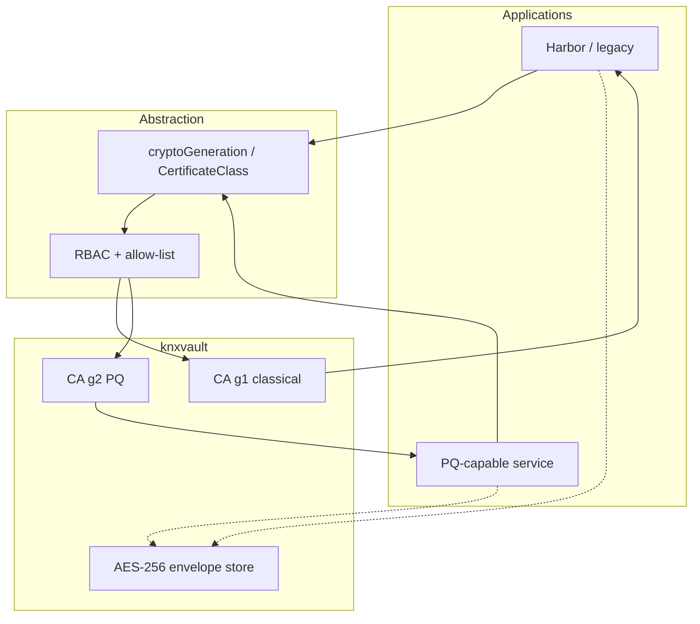

<!--
Copyright The KNXVault Authors.
SPDX-License-Identifier: CC-BY-4.0
-->

# Dual crypto planes — classical and PQ-capable coexistence

How KNXVault can serve **legacy applications** (Harbor, older clients) and **PQ-capable applications** on one platform without a single breaking cutover.

## Core idea

```text
                    knxvault platform (one cluster)
                            │
          ┌─────────────────┴─────────────────┐
          ▼                                   ▼
   Classical plane (g1)                 PQ / hybrid plane (g2+)
   RSA/ECDSA certs                      hybrid TLS / PQ certs when ready
   TLS 1.3 classical groups             opt-in clients only
          │                                   │
   Harbor, default apps                 New services with capable stacks
```

| Shared (one) | Duplicated (by design) |
|--------------|-------------------------|
| Raft cluster, policies, audit, KV | CA trees / intermediates |
| AES-256 envelope at rest | ClusterIssuers (`platform-g1`, `platform-g2`) |
| Auth (SA, tokens) | Workload TLS Secrets; optional API listeners |

**Do not** run two Raft fabrics only for crypto dual-stack. Dual-stack is for **issuance, trust, and client TLS**, not split consensus.

## Abstraction layers

### A. Crypto profiles (platform config)

Named bundles of algorithms and TLS settings (platform-owned). Mapped from **generations** (see [crypto-generations.md](crypto-generations.md)).

### B. Trust domains (issuers)

```text
KNXVaultCA + ClusterIssuer  platform-g1   → classical
KNXVaultCA + ClusterIssuer  platform-g2   → PQ / hybrid (when available)
```

Apps choose **issuerRef** or **CertificateClass**, not raw OIDs.

### C. Policy binding

| Mechanism | Example |
|-----------|---------|
| Default | All namespaces → g1 only |
| Opt-in label | `knxvault.kubenexis.dev/crypto-plane: pq` |
| RBAC | Role may issue only under allowed generations |
| Admission | Reject g2 issuer outside allow-list |

### D. Serving API TLS

| Pattern | Description |
|---------|-------------|
| **Dual listener** | `:8200` classical, `:8201` hybrid |
| **Edge proxy** | PQ client → mesh/gateway hybrid → knxvault classical (fast ops win) |
| **Single port dual handshake** | Hard; defer until stack is boring |

## Application selection

### Operator Certificate (typical)

```yaml
# Legacy / Harbor — platform pins g1
spec:
  secretName: harbor-tls
  cryptoGeneration: g1          # or implied by issuer
  issuerRef:
    kind: KNXVaultClusterIssuer
    name: platform-g1
```

```yaml
# PQ-capable app — opt-in
spec:
  secretName: modern-api-tls
  cryptoGeneration: g2
  issuerRef:
    kind: KNXVaultClusterIssuer
    name: platform-g2
```

### CertificateClass (higher abstraction)

Like StorageClass: `certificateClassName: platform-tls` vs `platform-tls-pq`. Platform maps class → generation → issuer → algorithms.

### CSI / KV

Payload encryption remains **one AES path**. Dual stack only if CSI provider points at a different knxvault TLS endpoint (classical vs hybrid Service).

## Harbor and K8s compatibility

| Consumer | Plane | Notes |
|----------|-------|--------|
| Harbor (`certSource: secret`) | **g1 only** until proven otherwise | Mounts PEM; does not call knxvault generations |
| Ingress / default apps | g1 | Safe default |
| New services | g2+ when runtime supports | Explicit Certificate / class |
| knxvault admin API | classical and/or hybrid edge | Separate from Harbor cert |

**Harbor never negotiates g1/g2.** GitOps/knxctl creates a g1 `KNXVaultCertificate` that fills `harbor-tls`. See [crypto-generations.md](crypto-generations.md).

## Compatibility matrix (summary)

| Change | Breaks existing data? | Breaks Harbor default? |
|--------|----------------------|-------------------------|
| Keep AES-256 envelopes | No | No |
| Add g1/g2 fields, default g1 | No | No |
| RSA-4096 / ECDSA leaves (classical) | No (re-issue) | Usually no |
| Force PQ leaf into harbor-tls | N/A | **Likely yes** |
| Hybrid only on knxvault API Service | No | No |
| Global “PQ default” | Risk | **Yes** |

## Sequence (target)



## Operational rules

1. **Default = g1** (legacy-safe).  
2. **PQ/g2+ is opt-in.**  
3. **Never force PQ issuer on Harbor** until lab matrix green.  
4. **Two trust bundles** when g2 issues different roots (or combined only on PQ nodes).  
5. **Renew planes independently.**  
6. **Audit** issue events with generation/issuer.  
7. **Raft mTLS:** one profile cluster-wide.  

## Building-block map

| Building block | Classical (g1) | PQ (g2+) |
|----------------|----------------|----------|
| CA | `KNXVaultCA` profile classical | Second CA when stack supports |
| Issuer | `platform-g1` | `platform-g2` |
| Leaf | `KNXVaultCertificate` | Same CRD, different generation/issuer |
| API TLS | `KNXVAULT_TLS_*` | Second cert/listener or edge proxy |
| Envelope | Shared AES-256 | Shared AES-256 |

## Related

- [Crypto generations](crypto-generations.md)  
- [Roadmap](roadmap.md)  
- [PQ backlog](backlog.md)  
