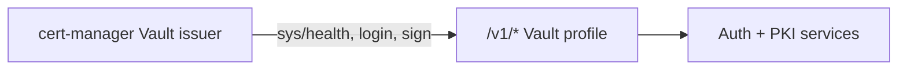

<!--
Copyright Kubenexis Systems Private Limited.
SPDX-License-Identifier: CC-BY-4.0
-->

# Recipe: cert-manager TLS integration

Automate TLS certificate issuance from KNXVault PKI using **cert-manager's built-in Vault issuer**.

KNXVault implements a **Vault product profile** (not a full Vault clone): thin HTTP adapters under `/v1/*` map cert-manager's expected Vault wire format onto native KNXVault services. Mapping logic lives in `internal/compat/vault`; handlers stay thin.

> Prefer the native [knxvault-operator](../operations/pki-replace-cert-manager.md) when you do not need cert-manager. Use this recipe when existing GitOps / Ingress already depends on cert-manager `Issuer` / `Certificate` resources.

## Prerequisites

- cert-manager installed
- KNXVault PKI CA (name often matches the sign role, e.g. `web-server`)
- One of: Kubernetes SA role binding, AppRole credentials, or static token

## Architecture



| cert-manager call | KNXVault path | Notes |
|-------------------|---------------|--------|
| Health probe | `GET /v1/sys/health` | 200 active / 429 standby / 503 sealed |
| Kubernetes auth | `POST /v1/auth/kubernetes/login` | Custom mounts: `POST /v1/auth/:mount/login` |
| AppRole auth | `POST /v1/auth/approle/login` | Register first via `POST /sys/auth/approle` |
| Token auth | `X-Vault-Token` on sign | No login call; also accepts `Authorization: Bearer` |
| Sign CSR | `POST /v1/<mount>/sign/<role>` | Default `path: pki/sign/web-server` |

## Step 1 — PKI and policies

```bash
curl -s -X POST "$KNXVAULT_ADDR/pki/root" \
  -H "Authorization: Bearer $KNXVAULT_TOKEN" \
  -H 'Content-Type: application/json' \
  -d '{"name":"web-server","common_name":"Web Server CA","ttl":"8760h"}'

curl -s -X PUT "$KNXVAULT_ADDR/sys/policies/cert-manager" \
  -H "Authorization: Bearer $KNXVAULT_TOKEN" \
  -H 'Content-Type: application/json' \
  -d '{"paths":{"pki/*":{"capabilities":["create","read"]}}}'
```

### Option A — Kubernetes auth (recommended in-cluster)

```bash
curl -s -X PUT "$KNXVAULT_ADDR/sys/roles/cert-manager" \
  -H "Authorization: Bearer $KNXVAULT_TOKEN" \
  -H 'Content-Type: application/json' \
  -d '{
    "policies": ["cert-manager"],
    "bound_service_account_names": ["cert-manager"],
    "bound_service_account_namespaces": ["cert-manager"]
  }'
```

### Option B — AppRole auth

```bash
# Register role_id / secret_id (admin)
curl -s -X POST "$KNXVAULT_ADDR/sys/auth/approle" \
  -H "Authorization: Bearer $KNXVAULT_TOKEN" \
  -H 'Content-Type: application/json' \
  -d '{
    "role_id": "cert-manager",
    "secret_id": "'"$APPROLE_SECRET_ID"'",
    "subject": "cert-manager",
    "policies": ["cert-manager"]
  }'
```

Store `role_id` and `secret_id` in a Kubernetes Secret for the issuer.

### Option C — Static token

Issue a scoped token and put it in a Secret referenced by `auth.tokenSecretRef`.

## Step 2 — ClusterIssuer

### Kubernetes auth

```bash
kubectl apply -f deployments/cert-manager/clusterissuer-knxvault.yaml
```

Example:

```yaml
apiVersion: cert-manager.io/v1
kind: ClusterIssuer
metadata:
  name: knxvault-pki
spec:
  vault:
    server: https://knxvault.knxvault.svc.cluster.local:8200
    path: pki/sign/web-server
    auth:
      kubernetes:
        role: cert-manager
        mountPath: /v1/auth/kubernetes
        serviceAccountRef:
          name: cert-manager
          namespace: cert-manager
```

### AppRole auth

```yaml
apiVersion: cert-manager.io/v1
kind: ClusterIssuer
metadata:
  name: knxvault-pki-approle
spec:
  vault:
    server: https://knxvault.knxvault.svc.cluster.local:8200
    path: pki/sign/web-server
    auth:
      appRole:
        path: approle
        roleId: cert-manager
        secretRef:
          name: knxvault-approle
          key: secret_id
```

### Token auth

```yaml
spec:
  vault:
    server: https://knxvault.knxvault.svc.cluster.local:8200
    path: pki/sign/web-server
    auth:
      tokenSecretRef:
        name: knxvault-token
        key: token
```

Custom PKI mount names work: set `path: pki_int/sign/web-server` → `POST /v1/pki_int/sign/web-server`.

## Step 3 — Request certificate

```bash
kubectl apply -f - <<'EOF'
apiVersion: cert-manager.io/v1
kind: Certificate
metadata:
  name: demo-tls
  namespace: default
spec:
  secretName: demo-tls
  issuerRef:
    name: knxvault-pki
    kind: ClusterIssuer
  dnsNames:
    - demo.example.com
EOF

kubectl wait --for=condition=ready certificate/demo-tls --timeout=300s
kubectl get secret demo-tls -o jsonpath='{.data.tls\.crt}' | base64 -d | openssl x509 -noout -subject
```

## Sign request shape (what cert-manager sends)

cert-manager POSTs a CSR plus SANs extracted from the CSR:

```json
{
  "common_name": "demo.example.com",
  "alt_names": "demo.example.com,www.example.com",
  "ip_sans": "10.0.0.1",
  "uri_sans": "spiffe://cluster/ns/default/sa/demo",
  "ttl": "2160h0m0s",
  "csr": "-----BEGIN CERTIFICATE REQUEST-----...",
  "exclude_cn_from_sans": "true"
}
```

KNXVault returns a Vault Logical secret:

```json
{
  "data": {
    "certificate": "-----BEGIN CERTIFICATE-----...",
    "issuing_ca": "-----BEGIN CERTIFICATE-----...",
    "ca_chain": ["-----BEGIN CERTIFICATE-----..."],
    "serial_number": "...",
    "expiration": 1735689600
  }
}
```

## Unsupported / out of scope for this profile

| Vault / cert-manager feature | Status |
|------------------------------|--------|
| AWS IAM auth | Not implemented (use k8s / AppRole / token) |
| Client-certificate (cert) auth method | Not implemented (mTLS to KNXVault is separate) |
| Full Vault secrets engines / KV under `/v1` | Native `/secrets/kv` only |
| Vault Enterprise namespaces | N/A |

## Troubleshooting

| Symptom | Check |
|---------|--------|
| Issuer not Ready / health fail | `curl -sS -o /dev/null -w '%{http_code}\n' "$KNXVAULT_ADDR/v1/sys/health"` → expect `200` (or `429` standby) |
| 503 on health | Vault operationally sealed (`POST /sys/unseal`) |
| 401 on sign | Token expired or missing `X-Vault-Token` / Bearer |
| 403 on sign | Policy lacks `pki` write |
| CSR sign role not found | Create CA named as the role, or a PKI role binding role → CA |

## Related recipes

- [PKI issue and revoke](pki-issue-and-revoke.md)
- [Kubernetes ServiceAccount auth](kubernetes-serviceaccount-auth.md)
- [Replace cert-manager with knxvault-operator](../operations/pki-replace-cert-manager.md)

## See also

- [PKI Kubernetes integration](../operations/pki-kubernetes.md)
- API reference — [Vault compatibility](../api/reference.md#vault-compatibility-cert-manager)
- `deployments/cert-manager/`
- Code: `internal/compat/vault`, `internal/api/handlers/vaultcompat.go`
