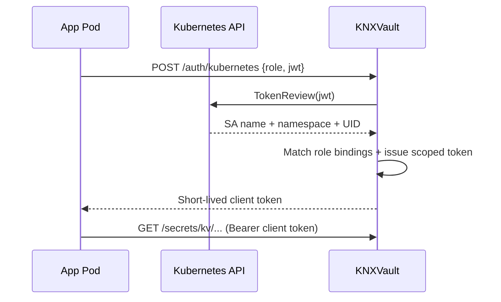

# Recipe: Kubernetes auth security model

Understand how ServiceAccount authentication protects KNXVault and workloads.

## What you will learn

- Why TokenReview beats static tokens
- How role bindings enforce identity and namespace boundaries
- Defense-in-depth patterns for in-cluster secret access

## The problem with static tokens

| Approach | Risk |
|----------|------|
| Root token in pod env | Full admin access; long-lived; leaks via logs, etcd, crash dumps |
| Shared CI token in image | Same token across all environments |
| Token in Kubernetes Secret | Duplicates secret material in etcd |

KNXVault's Kubernetes auth method eliminates static vault tokens from application pods.

## How authentication works



### Step-by-step

1. **Pod identity** — Kubernetes mounts a projected SA JWT at `/var/run/secrets/kubernetes.io/serviceaccount/token`. This JWT is bound to a specific ServiceAccount and namespace.

2. **TokenReview** — KNXVault (running in-cluster) calls the Kubernetes API `TokenReview` endpoint. The API server cryptographically validates the JWT. KNXVault never trusts the JWT without this check.

3. **Role binding** — KNXVault checks `bound_service_account_names` and `bound_service_account_namespaces` on the requested role. A token from `default/my-app` cannot authenticate as role `prod-db` bound to `production/db-worker`.

4. **Scoped client token** — On success, KNXVault issues a **short-lived** opaque token carrying only the policies attached to the role (e.g. read `secrets/kv/app/*`).

5. **Authorization** — Every API call evaluates RBAC policies before handler execution.

## Security properties

| Property | Mechanism |
|----------|-----------|
| **Identity binding** | TokenReview confirms SA + namespace |
| **Least privilege** | Policies limit paths and actions |
| **Short TTL** | Client tokens expire; renew via `POST /auth/token/renew` |
| **No vault token in CSI DaemonSet** | Provider uses **pod** SA at mount time |
| **Audit trail** | Login and secret access recorded in hash-chained audit log |
| **Encrypted at rest** | Secret values encrypted before Raft — see [ADR-0004](../adr/0004-encrypt-before-replication.md) |

## Recommended production configuration

| Setting | Production value |
|---------|------------------|
| `KNXVAULT_K8S_AUTH_INSECURE` | `false` (default) |
| `KNXVAULT_JWT_SECRET` | **Unset** — dev only |
| Root token | Operators only; never in workloads |
| Roles | One role per workload class; narrow `bound_*` fields |
| Policies | Read-only unless write required; explicit deny on `sys/*` |

### Example deny-admin policy

Attach alongside reader policies:

```json
{
  "paths": {
    "sys/*": {"capabilities": ["deny"]}
  }
}
```

## Threat mitigations

| Threat | Mitigation |
|--------|------------|
| Stolen pod SA JWT | Short K8s token lifetime; KNXVault client token TTL; narrow policies |
| Compromised namespace | Namespace binding prevents cross-namespace role use |
| Insider with kubectl | RBAC on K8s + separate KNXVault admin tokens |
| Raft snapshot theft | Ciphertext only for secret payloads |
| Audit tampering | Hash chain + optional signed export head |

## Anti-patterns to avoid

- Mounting root token via Kubernetes Secret for apps
- Using `bound_service_account_names: ["*"]`
- Sharing one role across unrelated teams
- Running `KNXVAULT_K8S_AUTH_INSECURE=true` outside local dev

## Verify your deployment

```bash
# 1. Confirm insecure auth is off
kubectl -n knxvault get configmap knxvault -o yaml | grep -i insecure

# 2. Negative test — wrong namespace SA
kubectl -n default run test --image=curlimages/curl --restart=Never \
  --overrides='{"spec":{"serviceAccountName":"my-app"}}' -- sleep 300
# Login with role bound to production only → expect 403

# 3. Confirm audit records auth
curl -s "$KNXVAULT_ADDR/audit/export?limit=20" \
  -H "Authorization: Bearer $ADMIN_TOKEN" \
  | jq '.entries | map(select(.action|test("auth")))'
```

## Related recipes

- [Kubernetes ServiceAccount auth](kubernetes-serviceaccount-auth.md)
- [RBAC policies](rbac-policies.md)
- [Audit export](audit-export.md)
- [CSI driver integration](csi-driver-integration.md)

## See also

- [Security model](../architecture/security-model.md)
- [Operator security](../operations/operator-security.md)